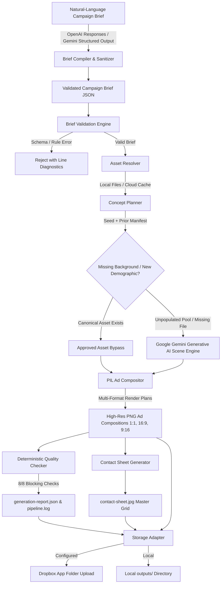

# YETI Los Angeles Multi-Format Creative Ad Generator (2026)

A deterministic creative advertising adaptation engine for YETI's **"Go Anywhere with YETI"** Los Angeles campaign. Built with **FastAPI**, **Pillow (PIL)**, **React 19**, **TypeScript**, and **Vanilla CSS**.

Supports both structured JSON briefs and **natural-language campaign briefs with automated brief-to-JSON conversion** (powered by OpenAI or Google Gemini), converting conversational campaign concepts directly into validated, production-ready creative briefs.

The ad count is dictated entirely by the brief: $\text{audiences} \times \text{concepts per audience} \times 3 \text{ aspect ratios}$ (`1:1` Square, `16:9` Landscape, `9:16` Vertical), or by explicit output allocation targets. The bundled sample briefs produce 18, 36, and 72 ads, but the engine is not bound to those sizes. Every run is deterministic — the same brief and seed reproduce byte-identical output — with locked per-concept assets, consistent typography hierarchy, and automated quality checks.

> **Short pitch:** “Go Anywhere with YETI” is a modular creative-automation platform that translates natural-language or structured briefs and approved brand assets into a quality-controlled family of product, audience, regional, and social-media ad variations.

### Edit layouts before generating ads

Open **AD LAYOUTS → Edit placements** above **Generate Ads**. Select Square (`1:1`), Landscape (`16:9`), or Vertical (`9:16`), then drag the logo, product, or tagline in the preview. Use the placement controls for precise percentage positions, size limits, and alignment anchors. Each format is independent; **Reset layout** restores that format’s standard placement.

Edits are stored in the current campaign brief’s optional `layoutOverrides` field and used by the production compositor. They apply to every ad of that size in the campaign. Loading or converting a brief that omits layout overrides preserves your current layout edits. An explicitly supplied `layoutOverrides` object replaces them; `{}` clears all overrides. Without current edits, the standard layouts apply. The generation summary labels each selected format as custom or standard. Generate again to apply edits to new output files; existing ads are unchanged. The run manifest records overrides for reproducibility.

The preview uses bundled sample scenes and approved artwork, without calling an AI image service. Scene and cooler selectors only change the preview; the campaign still selects its backgrounds and audience assets during generation. Artwork retains its proportions, and editable regions are constrained to the canvas.

### 🎬 Campaign Demo Video

[](https://www.youtube.com/watch?v=4KM4Y0BZxps)

▶️ **[Click here to watch the full walkthrough on YouTube (4:08)](https://www.youtube.com/watch?v=4KM4Y0BZxps)**

---

## Campaign Synopsis

**"Go Anywhere with YETI"** is a Los Angeles–focused advertising campaign promoting two YETI cooler products across multiple audiences, locations, product colors, and digital ad formats. It targets young adults, college students, campers, and tailgaters, presenting YETI coolers as durable products that move easily between outdoor recreation and social experiences.

A user can either describe a campaign in natural, conversational language (e.g. *"Create 18 YETI ads for Los Angeles targeting college students and mountain campers..."*) or submit a structured JSON brief. The built-in AI brief converter translates natural language into a fully validated JSON campaign contract with demographic targeting, colorway rules, and output allocations. The system then retrieves approved product photography, logos, fonts, colors, lifestyle backgrounds, and messaging from organized storage. If a required lifestyle or hero image is unavailable, the pipeline requests one from a generative-image API using the campaign's art direction and brand constraints, then stores it alongside the campaign assets for review and reuse.

The pipeline builds a variation matrix combining two cooler products, multiple approved product colors, camping/tailgating/beach and other LA environments, audience and demographic variations, Los Angeles–specific messaging, and square/vertical/landscape formats. For each variation it selects the template, places product and background imagery, applies the correct product color, inserts the campaign message, and adds brand elements.

Before an ad is approved it passes automated checks covering logo placement, safe areas, typography, color usage, text contrast, product distortion, image resolution, output dimensions, and required legal copy. Passing ads join the campaign package; failing ads are flagged with a clear reason for human review. Final output includes the approved variations, a visual preview gallery, an asset manifest, and an execution log, organized into predictable campaign folders and backed up to shared storage.

The project demonstrates how a repeatable creative-production system turns one approved campaign direction into a scalable library of localized, audience-specific, product-specific, platform-ready content while preserving brand consistency and human creative oversight.

---

## Assessment Requirement Coverage

| Assessment requirement | Implementation | Result |
| :--- | :--- | :---: |
| **Structured & natural-language campaign brief** | Direct JSON brief ingestion + AI-powered natural-language brief-to-JSON conversion (OpenAI / Gemini) with strict schema validation | **Exceeded** |
| **At least two products** | Orange and White cooler SKUs (Roadie 24 & Tundra 45) with distinct colorway packshots and model metadata | **Satisfied** |
| **Reuse existing assets** | Local/Dropbox asset resolver with caching and SHA-256 integrity checks | **Exceeded** |
| **Generate missing assets with GenAI** | Google Gemini background-generation fallback | **Satisfied** |
| **Three aspect ratios** | `1:1`, `16:9`, and `9:16` at exact dimensions | **Satisfied** |
| **Campaign message on ads** | Controlled vector tagline assets and campaign messaging | **Satisfied** |
| **Run locally** | CLI plus a complete React/FastAPI application | **Exceeded** |
| **Organized output folders** | Organized strictly by product and aspect ratio (`products/{product_slug}/{aspect_ratio}/`), plus ZIP and contact sheet | **Satisfied** |
| **README** | Setup, architecture, examples, and limitations | **Exceeded** |
| **Demo video** | Completed and delivered | **Satisfied** |
| **Brand checks** | Eight deterministic blocking checks and asset hashes | **Bonus achieved** |
| **Logging/reporting** | Manifest, JSON report, JSONL log, and provenance | **Bonus achieved** |
| **Legal word checks** | No prohibited-word checker implemented | *Optional; not implemented* |

---

## ⚡ Quickstart: Command Line (CLI)

```bash
# 1. Activate the Python virtual environment
source .venv/bin/activate

# 2. Run the 18-ad baseline campaign with a deterministic seed
python generate_ads.py --brief yeti_la_random_ad_campaign.json --seed 42

# 3. Run the 36-ad campaign (2 concepts per audience)
python generate_ads.py --brief yeti_la_random_ad_campaign_36.json --seed 42

# 4. Run the 72-ad multi-demographic campaign (includes Google Gemini AI scenes)
python generate_ads.py --brief yeti_la_random_ad_campaign_72.json --seed 42
```

The terminal shows live stage progress, validates assets, renders all multi-format PNG adaptations into `outputs/yeti-la-go-anywhere-2026/runs/`, compiles a master contact sheet, runs 8 blocking quality checks, and writes a structured compliance report (`generation-report.json`).

---

## ⚡ Quickstart: Web UI

```bash
# Terminal 1: Python backend API (port 8000)
source .venv/bin/activate
uvicorn backend.app.main:app --port 8000 --host 0.0.0.0 --reload

# Terminal 2: React frontend (port 5173)
npm run --prefix frontend dev -- --port 5173
```

Open **`http://localhost:5173`** in your browser.

---

## Table of Contents
1. [Project & Business Overview](#1-project--business-overview)
2. [Web UI Control Center](#2-web-ui-control-center)
3. [Ad Layouts, Position Rules & Interactive Layout Editor](#3-ad-layouts-position-rules--interactive-layout-editor)
4. [Architecture Overview](#4-architecture-overview)
5. [18-Ad Baseline vs. 72-Ad Gemini Multi-Demographic Campaign](#5-18-ad-baseline-vs-72-ad-gemini-multi-demographic-campaign)
6. [Campaign Rules Matrix & Demographic Expansion](#6-campaign-rules-matrix--demographic-expansion)
7. [Asset Tree & Asset Resolver](#7-asset-tree--asset-resolver)
8. [Natural-Language Campaign Briefs & Brief-to-JSON Conversion](#8-natural-language-campaign-briefs--brief-to-json-conversion)
9. [JSON Brief Validation Rules](#9-json-brief-validation-rules)
10. [Current & Previous-Run Repeat Protection](#10-current--previous-run-repeat-protection)
11. [Same-Concept Ratio Adaptation](#11-same-concept-ratio-adaptation)
12. [Dropbox Cloud Storage & Configuration](#12-dropbox-cloud-storage--configuration)
13. [Google Gemini AI Scene Generation & Fallback Architecture](#13-google-gemini-ai-scene-generation--fallback-architecture)
14. [Brand Compliance Measures & Automated Background Contrast Checking](#14-brand-compliance-measures--automated-background-contrast-checking)
15. [Prerequisites & Fresh-Clone Setup](#15-prerequisites--fresh-clone-setup)
16. [Secret-Free Environment Configuration](#16-secret-free-environment-configuration)
17. [Running the Baseline 18-Ad Campaign](#17-running-the-baseline-18-ad-campaign)
18. [Running the Expanded 72-Ad Gemini AI Campaign](#18-running-the-expanded-72-ad-gemini-ai-campaign)
19. [Automated Test Suite (107 Tests)](#19-automated-test-suite-107-tests)
20. [Output Directory Structure & Hierarchy Overview](#20-output-directory-structure--hierarchy-overview)
21. [Architectural Decisions & Tradeoffs](#21-architectural-decisions--tradeoffs)
22. [System Assumptions & Honest Limitations](#22-system-assumptions--honest-limitations)
23. [Production Evolution Roadmap](#23-production-evolution-roadmap)
24. [Under-Three-Minute Evaluator Demo Path](#24-under-three-minute-evaluator-demo-path)
25. [Addendum: Possible Features to Add](#25-addendum-possible-features-to-add)
26. [Addendum: Enterprise Compatibility & Multi-Brand Generalization](#26-addendum-enterprise-compatibility--multi-brand-generalization)
27. [Netlify & Firebase Integration Guide](#27-netlify--firebase-integration-guide)
28. [Live Cloud Architecture & Feature Updates (v2.1)](#28-live-cloud-architecture--feature-updates-v21)

---

## 1. Project & Business Overview

Enterprise campaigns require dozens of creative variations tailored to distinct demographics and placements. Manual production across formats is slow, error-prone, and frequently introduces brand inconsistencies (wrong product targeting, unapproved color contrasts, stretched packshots).

The YETI Ad Generator automates this workflow deterministically:

- **Ingests natural-language and structured JSON briefs** — supports conversational plain-English campaign briefs with automatic brief-to-JSON conversion (OpenAI or Gemini) as well as direct JSON uploads.
- **Resolves and verifies canonical brand assets** (logos, products, approved background scenes, vector taglines).
- **Applies seeded randomization** to select scenes and taglines while enforcing demographic targeting rules.
- **Brief-driven scale**: output count is $\text{audiences} \times \text{concepts} \times 3 \text{ ratios}$ (or custom output count allocations), whatever the brief specifies. Validated on an 18-ad sample brief ($6 \times 1 \times 3$), a 36-ad brief ($6 \times 2 \times 3$), and a 72-ad brief ($12 \times 2 \times 3$) that exercises automated AI scene generation with Google Gemini for demographics with no approved photography.
- **Renders composite ads** across `1:1`, `16:9`, and `9:16` with ratio-specific layout adjustments.
- **Runs 8 blocking quality checks**, builds a master contact sheet, generates compliance reports, and uploads artifacts to cloud storage.

---

## 2. Web UI Control Center

A full interactive web application for creative directors, campaign managers, and marketing teams.

### Stack
- **Frontend**: TypeScript, React 19, Vite, Vanilla CSS (dark mode, glassmorphic styling, responsive layout).
- **Backend**: Python FastAPI (ASGI) with Pillow for composite rendering and the Google GenAI SDK for scene synthesis.

### Features
- **Natural-Language Brief Intake & Brief-to-JSON Conversion** — describe audience groups, age ranges, territories, output counts, and creative directions in plain English (or pick a pre-built example) and convert them with one click into a validated, schema-compliant JSON brief with clear assumptions, warnings, and visual summary.
- **Brief Editor & Schema Validator** — ingests, inspects, and validates brief JSON in the browser with real-time error feedback and syntax highlighting.
- **Dynamic Audience & Matrix Formula** — computes planned output counts from loaded personas ($N \text{ audiences} \times M \text{ concepts} \times 3 \text{ formats} = \text{target ads}$), with age-group distribution and collapsible sections.
- **Asset Readiness & Integrity Monitor** — verifies canonical brand assets on disk and in cloud storage (presence, format, transparency, non-zero size, SHA-256 hash) and shows readiness badges.
- **Storage & AI Status Indicators** — live health for Dropbox storage and Gemini scene generation (active vs. standby).
- **Real-Time Generation Modal** — visualizes pipeline stages (JSON validation, asset resolution, repeat protection, concept selection, rendering, QA verification, storage sync).
- **Campaign Results Gallery** — filterable ad cards grouped by audience with format tabs (`1:1`, `16:9`, `9:16`), full-resolution lightbox, Master Contact Sheet viewer, Compliance Quality Report, ZIP download, and one-click **"Open in Dropbox Folder"**.

---

## 3. Ad Layouts, Position Rules & Interactive Layout Editor

The compositor uses deterministic layout rules and coordinate grids per aspect ratio to preserve packshot geometry, maintain brand legibility, and maximize visual engagement across platforms:

```
┌───────────────────────────┐  ┌───────────────────────────────────────┐  ┌───────────────────────────┐
│        [YETI LOGO]        │  │  [YETI LOGO]                           │  │        [YETI LOGO]        │
│                           │  │                                        │  │                           │
│       GO ANYWHERE.        │  │  GO ANYWHERE.      ┌────────────────┐  │  │       GO ANYWHERE.        │
│                           │  │                    │                │  │  │                           │
│     ┌───────────────┐     │  │                    │  YETI COOLER   │  │  │                           │
│     │               │     │  │                    │   PACKSHOT     │  │  │     ┌───────────────┐     │
│     │  YETI COOLER  │     │  │                    │                │  │  │     │               │     │
│     │   PACKSHOT    │     │  │                    └────────────────┘  │  │     │  YETI COOLER  │     │
│     │               │     │  │                                        │  │     │   PACKSHOT    │     │
│     └───────────────┘     │  │                                        │  │     │               │     │
│                           │  │                                        │  │     └───────────────┘     │
└───────────────────────────┘  └───────────────────────────────────────┘  │                           │
     1:1 Square                         16:9 Landscape                │                           │
   (1080 × 1080)                        (1920 × 1080)                 └───────────────────────────┘
                                                                               9:16 Vertical
                                                                               (1080 × 1920)
```

### 1. Canonical Layout & Position Rules

Every format has a dedicated `RatioLayoutConfig` defined in [`backend/app/models/layout.py`](backend/app/models/layout.py):

- **1:1 Square (1080×1080)** — Instagram Feed, Facebook Feed, eCommerce tiles.
  - **Logo (`logo_region`)**: Top-centered (`x=0.50`, `y=0.085`, `anchor=center/top`, max width: 43.7%, max height: 15.6%).
  - **Product (`product_region`)**: Center-anchored (`x=0.50`, `y=0.52`, `anchor=center/center`, max width: 68%, max height: 60%).
  - **Tagline (`tagline_region`)**: Bottom-centered (`x=0.50`, `y=94%`, `anchor=center/bottom`, max width: 84%, max height: 18%).
  - **Safe Margins**: 6.5% X / 6.5% Y margin buffer.
- **16:9 Landscape (1920×1080)** — YouTube pre-roll, desktop display, connected TV.
  - **Logo (`logo_region`)**: Top-centered (`x=0.50`, `y=0.085`, `anchor=center/top`, max width: 28.1%, max height: 15.6%).
  - **Product (`product_region`)**: Center-anchored (`x=0.50`, `y=0.52`, `anchor=center/center`, max width: 47.8%, max height: 62.6%).
  - **Tagline (`tagline_region`)**: Bottom-centered (`x=0.50`, `y=94%`, `anchor=center/bottom`, max width: 68.4%, max height: 19%).
  - **Safe Margins**: 5.5% X / 7.0% Y margin buffer.
- **9:16 Vertical (1080×1920)** — Instagram Stories, TikTok, YouTube Shorts, Reels.
  - **Logo (`logo_region`)**: Top-centered (`x=0.50`, `y=0.085`, `anchor=center/top`, max width: 46.8%, max height: 12.5%).
  - **Product (`product_region`)**: Center-anchored (`x=0.50`, `y=0.48`, `anchor=center/center`, max width: 68.4%, max height: 45%).
  - **Tagline (`tagline_region`)**: Lower-centered (`x=0.50`, `y=0.88`, `anchor=center/bottom`, max width: 83.4%, max height: 15.5%).
  - **Safe Margins**: 8.0% X / 9.0% Y margin buffer guarding against platform UI overlays.

---

### 2. Interactive Layout Editor (UI Control Center)

The web dashboard features a visual **AD LAYOUTS** editor located directly above **Generate Ads** in the Campaign Summary panel:

- **Format Selection Tabs**: Switch between **Square (`1:1`)**, **Landscape (`16:9`)**, and **Vertical (`9:16`)** with dot indicators showing which formats have custom overrides.
- **Interactive Drag & Nudge Canvas**:
  - Click and drag the **Logo**, **Product**, or **Tagline** bounding boxes directly on the canvas preview.
  - Select an element and use keyboard arrow keys (`Left`, `Right`, `Up`, `Down`) for fine 0.5% pixel nudging (`Shift + Arrow` for 2% steps).
- **Placement Controls**:
  - **Element Selector**: Choose between `Product`, `Logo`, and `Tagline`.
  - **Horizontal position (%)**: Fine-tune X coordinate (0.0% to 100.0%).
  - **Vertical position (%)**: Fine-tune Y coordinate (0.0% to 100.0%).
  - **Maximum width (%)**: Percentage cap preventing element from crowding the frame.
  - **Maximum height (%)**: Percentage cap preventing element vertical overflow.
  - **Horizontal Anchor**: Alignment origin (`Left`, `Center`, `Right`).
  - **Vertical Anchor**: Alignment origin (`Top`, `Center`, `Bottom`).
  - **Reset Layout**: Reverts current format back to standard canonical placement.
- **Live Preview Scene & Cooler Selectors**:
  - Test layouts in real-time against sample background environments (**Camping**, **Beach**, **Tailgating**).
  - Toggle between **White** and **Orange** cooler packshots.
  - Generates instant composited previews via `POST /api/layout/preview` using local PIL rendering with zero external AI latency or cost.

---

### 3. Position Safety & Boundary Clamping

- **Canvas Boundary Clamping**: The backend [`EditableRegion`](backend/app/models/layout.py) and frontend [`constrainRegion`](frontend/src/components/LayoutEditor.tsx) enforce that no placement box can spill outside the canvas boundaries, taking anchor offsets into account.
- **Zero Packshot Distortion**: Packshots and logos scale proportionally to fit within their maximum width and height limits using Lanczos resampling; they are never stretched or warped.
- **Shadow Synchronization**: When product placement is adjusted, its soft elliptical contact shadow automatically calculates its position and offset relative to the new product coordinates.

---

### 4. Brief Persistence & Pipeline Execution

- **Campaign Brief Overrides**: Custom placement edits are saved directly into the brief's `layoutOverrides` dictionary:
  ```json
  {
    "layoutOverrides": {
      "1:1": {
        "product_region": {
          "x": 0.579,
          "y": 0.519,
          "max_width_pct": 0.35,
          "max_height_pct": 0.35,
          "anchor_x": "left",
          "anchor_y": "center"
        }
      }
    }
  }
  ```
- **State Preservation**: Layout edits are retained when switching between briefs or converting natural-language prompts.
- **Manifest Provenance**: The generation pipeline passes `layoutOverrides` into `AdCompositor.compose_ad` and logs active overrides in `generation-manifest.json` for deterministic auditability.

---

## 4. Architecture Overview



---

## 5. 18-Ad Baseline vs. 72-Ad Gemini Multi-Demographic Campaign

A core governance rule of this engine is **cross-format concept locking**:

- The `ConceptPlanner` runs seeded randomization **once per audience concept**, not per aspect ratio, selecting one coherent concept: `(Audience + Activity + Scene Background + Product Packshot + Tagline)`.
- The `AdCompositor` adapts that single concept into all three aspect ratios.
- **Why it matters**: a consumer who sees the ad on Stories (`9:16`), Feed (`1:1`), and YouTube (`16:9`) experiences identical product color, environment, and messaging.

### Baseline 18-ad run (`yeti_la_random_ad_campaign.json`)
- 6 audience segments (3 younger, $\le 24$; 3 older, $\ge 25$).
- 1 concept per audience $\times$ 3 formats = **18 ads**.
- Validated compositing math, typography hierarchy, safe zones, and static pre-approved backgrounds (Beach, Tailgate, Camping).

### Expanded 72-ad run (`yeti_la_random_ad_campaign_72.json`)
- 12 audience segments covering traditional and newly added LA outdoor lifestyles.
- 2 concepts per audience $\times$ 3 formats = **72 ads**.
- **Automated background synthesis**: when new demographics introduce activities with no static photography (Hiking in Hollywood Hills/Griffith Park, Surfing in Malibu/South Bay, Fishing in Marina Del Rey, Climbing at Stoney Point), the engine calls the Gemini image model (`gemini-2.5-flash-image` / `imagen-3.0`) to generate photorealistic, brand-guardrailed landscape backgrounds.
- Generated backgrounds are stored with the run, hashed, reused across formats, and flagged for human review.

---

## 6. Campaign Rules Matrix & Demographic Expansion

| Audience ID | Demographic / Territory | Activity | Product | Background Source | Tagline Color | Logo |
| :--- | :--- | :--- | :--- | :--- | :---: | :---: |
| **`P01`** | UCLA Tailgaters (Westwood) | Tailgating | Orange (Roadie 24) | Approved (`Tailgate.jpg`) | White | `logo_white.png` |
| **`P02`** | USC Students (South Central) | Tailgating | Orange (Roadie 24) | Approved (`Tailgate.jpg`) | White | `logo_white.png` |
| **`P03`** | Venice Beach Coastal Goers | Beach | White (Tundra 45) | Approved (`Beach.jpg`) | Black | `logo_white.png` |
| **`P04`** | Santa Monica Boardwalk | Beach | Orange (Roadie 24) | Approved (`Beach.jpg`) | Black | `logo_white.png` |
| **`P05`** | Angeles Crest Campers | Camping | White (Tundra 45) | Approved (`Camping.jpg`) | White | `logo_white.png` |
| **`P06`** | Topanga Canyon Trekkers | Camping | White (Tundra 45) | Approved (`Camping.jpg`) | White | `logo_white.png` |
| **`P07`** *(new)* | Hollywood Hills Trail Hikers | Hiking | Orange (Roadie 24) | Gemini AI scene | White | `logo_white.png` |
| **`P08`** *(new)* | Griffith Park Ridgeline Trekkers | Hiking | White (Tundra 45) | Gemini AI scene | White | `logo_white.png` |
| **`P09`** *(new)* | Malibu Point Dawn Surfers | Surfing | Orange (Roadie 24) | Gemini AI scene | Black | `logo_white.png` |
| **`P10`** *(new)* | South Bay Sunset Surfers | Surfing | White (Tundra 45) | Gemini AI scene | Black | `logo_white.png` |
| **`P11`** *(new)* | Marina Del Rey Anglers | Fishing | Orange (Roadie 24) | Gemini AI scene | White | `logo_white.png` |
| **`P12`** *(new)* | Stoney Point Rock Climbers | Climbing | White (Tundra 45) | Gemini AI scene | White | `logo_white.png` |

---

## 7. Asset Tree & Asset Resolver

```
assets/
├── backgrounds/
│   ├── Beach.jpg              (Approved West Coast beach scene)
│   ├── Camping.jpg            (Approved mountain camping scene)
│   └── Tailgate.jpg           (Approved college tailgate scene)
├── products/
│   ├── product_orange.png     (Official YETI cooler packshot, orange, RGBA)
│   └── product_white.png      (Official YETI cooler packshot, white, RGBA)
├── logos/
│   ├── logo_black.png         (YETI vector wordmark, black, RGBA)
│   └── logo_white.png         (YETI vector wordmark, white, RGBA)
├── taglines/
│   ├── TAGLINE_black.png      (Approved "GO ANYWHERE." vector, black, RGBA)
│   └── TAGLINE_white.png      (Approved "GO ANYWHERE." vector, white, RGBA)
└── fonts/
    └── DejaVuSans-Bold.ttf    (Contact sheet & metric overlay typography)
```

### `AssetResolver` Service
- Validates file presence, dimensions, channel mode (RGB vs RGBA), and SHA-256 integrity.
- Sanitizes paths and blocks directory traversal (`../`).
- Caches remote assets locally when running in Dropbox storage mode.

---

## 8. Natural-Language Campaign Briefs & Brief-to-JSON Conversion

The campaign brief panel accepts a plain-language description as well as JSON uploads.
Choose **Use example** or describe the audience groups, ages, locations,
ad count, and output formats, then select **Convert to JSON**. Review the generated
JSON, defaults, and notes, and select **Use this brief** to load it into the existing
editor and campaign summary. **Generate Ads** remains a separate action.

For example:

> Create 18 YETI ads for Los Angeles. Target college tailgaters in Westwood ages
> 20–24, Westside beachgoers ages 25–30, and mountain campers ages 25–30. Use two
> concepts per audience in square, landscape, and vertical formats. Keep the
> approved Go Anywhere artwork and cooler color rules.

Choose a conversion provider in the backend environment, then restart the backend:

| Provider | Setting | API key | Default text model |
| --- | --- | --- | --- |
| OpenAI | `BRIEF_CONVERSION_PROVIDER=openai` (default) | `OPENAI_API_KEY` | `OPENAI_BRIEF_MODEL=gpt-6-astra` |
| Gemini | `BRIEF_CONVERSION_PROVIDER=gemini` | `GEMINI_API_KEY` | `GEMINI_BRIEF_MODEL=gemini-3.8-flash` |

Gemini can reuse the existing background provider's API key, but brief conversion
uses its own text model setting. Never put either key in a `VITE_` variable or
frontend source. JSON uploads work without either key. Provider selection is
explicit; errors never silently send a brief to a different provider.
The converter uses the existing `httpx` dependency; no additional SDK is required.

`POST /api/brief/convert` accepts `{"text": "your campaign description"}` and returns
`brief`, `assumptions`, `warnings`, and `summary` (audienceCount, formatCount,
totalOutputs). Errors use `detail.message` and `detail.errors`. The endpoint uses
OpenAI Responses with [strict Structured Outputs](https://developers.openai.com/api/docs/guides/structured-outputs)
or Gemini Generate Content with [JSON-schema structured output](https://ai.google.dev/gemini-api/docs/generate-content/structured-output).
Both providers extract the same bounded intent schema, then the backend builds a complete `CampaignBriefModel` from approved local templates and
passes it through the existing backend validator. The provider extracts campaign
intent; it does not choose filesystem paths, write files, render ads, or upload assets.
For Gemini, the provider schema inlines references and omits numeric/length bounds
that its schema converter rejects alongside nullable values. All bounds remain
enforced locally by `BriefIntent` before the campaign compiler can return a draft.

Territories are unrestricted. The eight original activity/location pools are reusable
assets, not a geographic allowlist. If a requested location/activity does not match
an approved pool, conversion creates a new pool with `assets: []`, a unique ID,
and location-specific `visualDirection`. The pipeline sends both the territory and
that direction to Gemini when generating ads. It never reuses an unrelated LA photo
for a new territory; image-generation failures stop the run instead of presenting
a procedural placeholder as that location.

Audience ages now support 20–120. Ages 20–24 use orange coolers; ages 25+ use white.
For “over 40,” extraction uses 41–120, with 120 disclosed as the schema ceiling for
an open-ended range. Ranges crossing 25 are split into separate audiences.
The supported activities are beach, camping, tailgating, hiking, surfing, fishing,
and climbing. If an activity is omitted, conversion chooses a locally plausible
activity and lists that assumption for review. Approved GO ANYWHERE artwork and
the three standard format sizes still apply. Custom visible taglines require
a separate renderer change because the current pipeline composites approved image
overlays. Hiking, surfing, fishing, and climbing scenes use the existing background
generation flow when ads are generated, as do new territories for any supported activity.

Example: `create 12 ad fors Inland Empire, for over 40` creates a regional brief
with an older audience, white cooler, generated background pool, and 12 outputs.
The draft lists any inferred activity, product model, and age range.

Conversion supports up to 12,000 input characters, 24 audience groups after age
splitting, 10 concepts per audience, and 216 ads. Explicit totals use
`generation.exactOutputCount`: the allocator distributes the requested count across
audiences and formats, permitting partial final concepts. For example, 20 ads for
one audience and all three formats produces 7 square, 7 landscape, and 6 vertical
outputs. The total must provide at least one output per selected audience.
`conceptsPerAudience` reports the maximum needed for an audience; `adsPerAudience`
is null when the audience allocations differ. Without an exact count, the original
audiences × concepts × formats behavior remains. The draft reports `formatCounts`,
and generation, quality checks, and contact sheets use the actual assignment.
Every conversion gets a separate campaign
ID and output/manifest location. Conversion calls time out after 90 seconds and
return a clear error for missing credentials, provider failures, or incomplete output.

Tests (mocked provider; no API spend):

```sh
.venv/bin/python -m pytest backend/tests/test_brief_conversion.py backend/tests/test_brief_validation.py -q
cd frontend
npm exec vitest run
npm run build
```

## 9. JSON Brief Validation Rules

The backend (`backend/app/services/brief_validator.py`) enforces the campaign contract. The frontend (`frontend/src/utils/validation.ts`) provides basic structure checks:

- **Audience count**: at least one audience; the engine derives output count from the brief ($\text{audiences} \times \text{concepts} \times \text{formats}$). The sample briefs use 6 and 12.
- **Formats**: select from `1:1`, `16:9`, and `9:16`.
- **Age range integrity**: ages 20–120; individual audiences cannot span the 24/25 color boundary. Natural-language conversion splits such ranges into two audiences.
- **Product color targeting**: younger audiences must target `product_orange.png`; older audiences must target `product_white.png`.
- **Activity → background pool**: each audience must reference a pool with a matching activity and territory. New territories use generated pools with no assets and route to Gemini scene generation.
- **Tagline color**: Beach audiences use Black `#000000`; Camping/Tailgating use White `#FFFFFF`.
- **Security**: no absolute system paths or `../` sequences in asset URIs.

---

## 10. Current & Previous-Run Repeat Protection

To avoid creative fatigue across multi-audience campaigns, the `ConceptPlanner` applies:

- **Current-run deduplication** — tracks backgrounds and taglines used within the active run for diverse distribution across audiences.
- **Prior-run manifest protection** — ingests the previous run's `generation-manifest.json` via `priorManifestPath` and deprioritizes assets already used for a given audience category.
- **Pool exhaustion fallback** — if a pool has fewer unique assets than audiences assigned to it (e.g. 2 camping backgrounds for 3 camping audiences), an approved asset is reused with an informational warning rather than failing the run.

---

## 11. Same-Concept Ratio Adaptation

Once an audience concept is selected, the asset bundle is locked:

```python
# Concept locking ensures brand consistency across formats:
concept_id = f"c_{audience_id}_{seed}"
selected_background = "assets/backgrounds/Beach.jpg"
selected_product = "assets/products/product_orange.png"
selected_tagline = "assets/taglines/TAGLINE_black.png"
selected_logo = "assets/logos/logo_white.png"
```

The compositor applies ratio-specific coordinate grids and scaling without altering the scene or product color.

---

## 12. Dropbox Cloud Storage & Configuration

- **Dropbox storage adapter**: `backend/app/services/dropbox_adapter.py`.
- **Scope**: Dropbox App Folder (`/Apps/<YourApp>/yeti-ad-generator/campaigns/`).
- **Token refresh**: automatically refreshes short-lived access tokens when `DROPBOX_REFRESH_TOKEN`, `DROPBOX_APP_KEY`, and `DROPBOX_APP_SECRET` are set in `.env`.
- **Uploaded artifacts**: every PNG adaptation in the run, `contact-sheet.jpg`, `generation-report.json`, `pipeline.log`, and the ZIP package.
- **Local fallback**: if credentials are empty or the network is unavailable, the pipeline runs locally and writes to `./outputs/` without error.

---

## 13. Google Gemini AI Scene Generation & Fallback Architecture

- **Integration**: `backend/app/services/gemini_generator.py`.
- **Dynamic demographic scene generation** — when a brief introduces lifestyles or territories without static assets (Hiking, Surfing, Fishing, Climbing), the engine calls the Gemini image model (`gemini-2.5-flash-image` / `imagen-3.0`) to synthesize commercial lifestyle backgrounds (1408×768 to 2048×2048).
- **Missing asset fallback** — if an approved background referenced in a brief is missing from disk or cloud storage, Gemini synthesizes an on-brand replacement instead of crashing the pipeline.
- **Approved asset bypass** — if an approved background exists for an audience pool, Gemini is skipped to preserve canonical photography.
- **Guardrail prompting** — prompts include negative constraints prohibiting human faces, bodies, logos, coolers, and text, keeping negative space clear for packshots.
- **Procedural fallback** — if no API key is present or quota is exhausted, a procedural atmospheric landscape generator provides an immediate fallback, labeled `mock_fallback` in audit metadata.

---

## 14. Brand Compliance Measures & Automated Background Contrast Checking

The generator enforces deterministic brand safety and legibility through **8 Blocking Compliance Measures** and an **Automated Background Contrast Checking & Dynamic Logo Selection Engine**:

### The 8 Deterministic Blocking Compliance Measures
Every ad variation must pass 8 strict deterministic checks in [`backend/app/services/quality_checker.py`](backend/app/services/quality_checker.py) before publication. If even a single check fails, the pipeline halts with `RuntimeError` and marks the campaign as failed:

| Check ID | Measure Name | Rule & Deterministic Failure Criteria |
| :--- | :--- | :--- |
| **BLK-01** | **Exact Concept & Output Quantities** | Actual concept count and rendered ad count must exactly match the brief allocation (e.g. 6 concepts, 18 ads). |
| **BLK-02** | **Exact Pixel Dimensions** | Actual pixel dimensions must strictly match channel requirements: `1:1` (1080×1080), `16:9` (1920×1080), `9:16` (1080×1920). Zero pixel tolerance. |
| **BLK-03** | **Source Asset Integrity & Validity** | Product packshots and brand marks must exist on disk, have non-zero file sizes, and pass cryptographic SHA-256 integrity verification. |
| **BLK-04** | **Age to Product Color Targeting** | Enforces demographic pairing: audiences $\le 24$ must receive Orange coolers; audiences $\ge 25$ must receive White coolers. |
| **BLK-05** | **Activity/Territory Background Assignment** | Background imagery must correspond to persona activity: Beach uses beach imagery, Camping uses mountain/camp scenes, Tailgating uses tailgate scenes. |
| **BLK-06** | **Tagline Color Contrast Standard** | Enforces text legibility against background tones: Beach uses black text (`#000000`); Camping/Tailgating/Outdoor use white text (`#FFFFFF`). |
| **BLK-07** | **Format Concept & Asset Locking** | Cross-format creative locking: all 3 formats (`1:1`, `16:9`, `9:16`) for a concept must share identical background, cooler, tagline, and logo assets. |
| **BLK-08** | **Packshot Aspect Ratio Preservation** | Proportional bounding-box scaling (`fit_within_region`) enforces a maximum distortion tolerance of $0.0\%$, preventing squished or warped coolers. |

### Automated Background Contrast Checking & Dynamic Logo Selection
To support open-ended outdoor activities and AI-generated scenes (via Google Gemini or procedural fallback), the engine features a dedicated contrast checking service ([`backend/app/services/contrast_checker.py`](backend/app/services/contrast_checker.py)):

1. **Logo Zone Luminance Sampling**:
   - Rather than computing the average of the whole image (which misleads when bright skies sit over dark terrain), the analyzer samples the **top 30% quadrant** ($X \in [0.10, 0.90]$, $Y \in [0.0, 0.30]$) where the YETI brand mark is anchored.
   - Computes weighted ITU-R BT.601 perceptual luminance:
     $$L = \frac{0.299 \cdot R + 0.587 \cdot G + 0.114 \cdot B}{255.0}$$
2. **Dynamic Logo Selection Logic**:
   - **Dark Background ($L < 0.50$)**: Automatically assigns the **Light Logo** (`assets/brand/Yeti_Logo_4.png`, crisp white wordmark).
   - **Light Background ($L \ge 0.50$)**: Automatically assigns the **Dark Logo** (`assets/brand/Yeti_Logo_1.png`, crisp black wordmark).
3. **Pipeline & Gradient Synergy**:
   - During Stage 5 of the pipeline ([`pipeline_runner.py`](backend/app/services/pipeline_runner.py)), auto-generated backgrounds are analyzed immediately upon synthesis.
   - `concept.logo_asset_path` and matching `render_plans` are updated to maintain 100% format locking (`BLK-07`).
   - The compositor ([`compositor.py`](backend/app/services/compositor.py)) automatically pairs the white logo with `#grad2.png` (dark top gradient) or the black logo with `#grad2_white.png` (light top gradient) for maximum readability.
4. **API Endpoint**:
   - `POST /api/contrast/analyze` allows inspecting contrast metrics and recommendations for any image file path.

### Controlled Assets & Human Review Governance
- **Zero packshot distortion** — product packshots and logos keep intact aspect ratios via bicubic resampling.
- **Human review badge** — any adaptation using an AI-generated background is tagged `human_review_required: true` and shown with an orange warning badge in both the JSON report and the UI.
- **Provenance tracking** — every output records its source asset paths and generation seed in `generation-manifest.json`.

---

## 15. Prerequisites & Fresh-Clone Setup

**Prerequisites**: Python 3.12+, Node.js 18+, npm 9+.

```bash
# 1. Clone
git clone https://github.com/cogspa/YETI_AD_GEN.git
cd YETI_AD_GEN

# 2. Python virtual environment
python3 -m venv .venv
source .venv/bin/activate

# 3. Backend dependencies
pip install -r backend/requirements.txt

# 4. Environment template (no secrets required for local execution)
cp .env.example .env

# 5. Frontend dependencies
npm --prefix frontend install

# 6. Backend server (port 8000)
uvicorn backend.app.main:app --port 8000 --host 0.0.0.0 --reload
```

In a separate terminal:

```bash
# 7. Frontend dev server (port 5173)
npm run --prefix frontend dev -- --port 5173
```

Open **`http://localhost:5173`**.

---

## 16. Secret-Free Environment Configuration

`.env.example` contains variable names with safe placeholders only:

```bash
# Server
PORT=8000
HOST=0.0.0.0
CORS_ORIGINS=http://localhost:5173

# AI scene background generation (optional)
GEMINI_API_KEY=
GEMINI_IMAGE_MODEL=gemini-2.5-flash-image
GEMINI_ENABLED=true

# Local storage root
STORAGE_ROOT=./outputs

# Dropbox storage adapter (optional)
DROPBOX_ACCESS_TOKEN=
DROPBOX_REFRESH_TOKEN=
DROPBOX_APP_KEY=
DROPBOX_APP_SECRET=
DROPBOX_CAMPAIGN_ROOT=/yeti-ad-generator
LOCAL_ASSET_CACHE_DIR=./.cache/dropbox-assets
```

No live API keys, Dropbox tokens, or credentials are required to run the full pipeline locally.

---

## 17. Running the Baseline 18-Ad Campaign

### CLI
```bash
source .venv/bin/activate
python generate_ads.py --brief yeti_la_random_ad_campaign.json --seed 42
```

### Web UI
1. Open `http://localhost:5173`.
2. Select `yeti_la_random_ad_campaign.json (18 Ads)` from the brief selector.
3. Click **GENERATE 18 ADS**.
4. Review the 6 audience concepts, inspect the Master Contact Sheet, and download the ZIP package.

---

## 18. Running the Expanded 72-Ad Gemini AI Campaign

### CLI
```bash
source .venv/bin/activate
python generate_ads.py --brief yeti_la_random_ad_campaign_72.json --seed 42
```

### Web UI
1. Open `http://localhost:5173`.
2. Select `yeti_la_random_ad_campaign_72.json (72 Ads - 12 Demographics + Gemini AI)`.
3. Click **GENERATE 72 ADS**.
4. The pipeline synthesizes backgrounds for Hiking, Surfing, Fishing, and Climbing, adapts all 24 concepts across 3 ratios ($24 \times 3 = 72 \text{ ads}$), runs 8 blocking quality checks, compiles a $24 \times 3$ contact sheet, and outputs the ZIP archive.

---

## 19. Automated Test Suite (127 Tests)

```bash
# 1. Backend pytest (119 passing tests across conversion, validation, compositor, contrast checking, QA)
PYTHONPATH=. .venv/bin/pytest backend/tests/ -v

# 2. Frontend Vitest unit tests (8 tests across NaturalLanguageBrief and App)
npm --prefix frontend exec vitest run

# 3. Frontend typecheck & production build
npm run --prefix frontend build

# 4. Frontend lint
npx --prefix frontend oxlint
```

---

## 20. Output Directory Structure & Hierarchy Overview

The output hierarchy has been updated to organize outputs **by product and aspect ratio** across all layers of the system.

### Hierarchy Overview

```
outputs/
└── campaign-id/
    └── runs/
        └── run-id/
            ├── contact-sheet.jpg
            ├── generation-manifest.json
            ├── generation-report.json
            ├── pipeline.log
            ├── [campaign-id]_[run-id]_all_18_ads.zip
            └── products/
                ├── roadie-24-orange/
                │   ├── 1x1/
                │   │   ├── P01_westwood-college_roadie-24-orange_1x1.png
                │   │   └── P04_college-friends-beach-day_roadie-24-orange_1x1.png
                │   ├── 16x9/
                │   │   ├── P01_westwood-college_roadie-24-orange_16x9.png
                │   │   └── P04_college-friends-beach-day_roadie-24-orange_16x9.png
                │   └── 9x16/
                │       ├── P01_westwood-college_roadie-24-orange_9x16.png
                │       └── P04_college-friends-beach-day_roadie-24-orange_9x16.png
                ├── roadie-24-white/
                │   ├── 1x1/
                │   │   ├── P03_westside-recent-graduates_roadie-24-white_1x1.png
                │   │   └── P06_graduate-adventure-campers_roadie-24-white_1x1.png
                │   ├── 16x9/
                │   └── 9x16/
                ├── tundra-45-orange/
                │   ├── 1x1/
                │   │   └── P02_south-central-college_tundra-45-orange_1x1.png
                │   ├── 16x9/
                │   └── 9x16/
                └── tundra-45-white/
                    ├── 1x1/
                    │   └── P05_first-time-family-campers_tundra-45-white_1x1.png
                    ├── 16x9/
                    └── 9x16/
```

---

## 21. Architectural Decisions & Tradeoffs

| Decision | Choice Made | Alternative Considered | Rationale |
| :--- | :--- | :--- | :--- |
| **Image Compositing Engine** | Python Pillow (PIL) | Headless Chrome / Puppeteer | Fast CPU-side rendering, no browser memory overhead, deterministic pixel math. |
| **Layout Math** | Explicit coordinate grids + bicubic scaling | CSS absolute positioning | Exact aspect-ratio retention and alignment independent of browser rendering engines. |
| **Randomization** | Seeded `random.Random(seed)` | Unseeded `Math.random()` | Reproducible campaign batches for regression testing and audit. |
| **Storage** | Dual adapter (Local / Dropbox) | S3 / GCS only | Offline development and zero-dependency evaluator setup, with cloud upload when configured. |
| **CSS** | Vanilla CSS design system | Tailwind CSS | No purge risk, precise control over brand palette and dark mode, no runtime bloat. |

---

## 22. System Assumptions & Honest Limitations

- **No automated trademark detection** — background safety relies on restricting scenes to approved, pre-cleared asset pools, not computer-vision classification.
- **Bounded AI scene generation** — Gemini only generates backgrounds. It never generates packshots, logos, or typography.
- **Mock generator disclosure** — with no Gemini key, fallback scenes come from a procedural renderer flagged `mock_fallback` in audit metadata.
- **Repeat protection on small pools** — if a pool has fewer unique assets than audiences, approved assets are reused with explicit warning logs.
- **No prohibited-word check** — the QA stage does not scan tagline or legal copy against a banned-terms list.
- **Two product SKUs by colorway** — product SKUs (Roadie 24 & Tundra 45) are visually differentiated by official colorway packshots (Orange and White) and model metadata in the brief.

---

## 23. Production Evolution Roadmap

- **Durable job queue** — move synchronous runs to Celery or Temporal with Redis/RabbitMQ for parallel batch execution.
- **Enterprise DAM integration** — connect to Adobe Experience Manager or Bynder via webhooks to ingest newly approved assets.
- **Creative director approval workflow** — Slack/email notifications with interactive approval for AI-flagged adaptations.
- **Prohibited-word & legal copy checker** — add a configurable banned-terms scan and required-disclaimer check to the QA stage.
- **Dynamic localization** — multi-language vector taglines and regional legal disclaimer overlays.
- **Ad network direct export** — push to Meta Marketing API, Google Ads API, and TikTok Creative Center.

---

## 24. Under-Three-Minute Evaluator Demo Path

1. **Clone & Setup Environment**:
   ```bash
   git clone https://github.com/cogspa/YETI_AD_GEN.git && cd YETI_AD_GEN
   python3 -m venv .venv && source .venv/bin/activate && pip install -r backend/requirements.txt
   npm --prefix frontend install
   ```

2. **Run Automated Test Suite (51 Unit Tests)**:
   ```bash
   .venv/bin/pytest backend/tests/ -v
   ```
   *(Verify all 51 backend tests pass in ~45 seconds).*

3. **Choose Your Execution Method**:

   - **Option A: Pure CLI Execution (No servers needed)**:
     ```bash
     source .venv/bin/activate
     # Run 18-Ad Baseline:
     python generate_ads.py --brief yeti_la_random_ad_campaign.json --seed 42

     # Or Run 72-Ad Multi-Demographic Campaign:
     python generate_ads.py --brief yeti_la_random_ad_campaign_72.json --seed 42
     ```

   - **Option B: Web Dashboard UI**:
     ```bash
     # Terminal Tab 1:
     source .venv/bin/activate && uvicorn backend.app.main:app --port 8000 --reload

     # Terminal Tab 2:
     npm run --prefix frontend dev
     ```
     - Open `http://localhost:5173`.
     - Select a brief (`yeti_la_random_ad_campaign.json` or `yeti_la_random_ad_campaign_72.json`).
     - Click **`GENERATE ADS`**.

4. **Verify Outputs**:
   - Inspect output directory: `outputs/yeti-la-go-anywhere-2026/runs/[run-id]/products/` organized by product and aspect ratio (`1x1/`, `16x9/`, `9x16/`).
   - View the master review grid (`contact-sheet.jpg`).
   - Review the deterministic compliance audit (`generation-report.json`).
   - Download the full package ZIP or open the Dropbox backup folder.

---

## 25. Addendum: Possible Features to Add

The modular design of this creative engine makes it straightforward to extend with high-leverage advertising features:

1. **Animated Motion Video Ads (MP4 / WebM / GIF)**:
   - Convert static multi-format PNGs into 3–5 second motion video ads using `moviepy` / `ffmpeg`.
   - Adds a subtle Ken Burns zoom/pan on the background scene, slide-in packshot animation with soft drop-shadow, and a pulsing CTA button tailored for TikTok, Instagram Reels, and YouTube Shorts.

2. **Live Weather & Climate Badging**:
   - Query live weather APIs or inject brief-defined temperature conditions to overlay hyper-contextualized copy:
     - *“92°F in Palm Springs — Ice Cold for 5 Days.”*
     - *“74°F Sunset at Venice Pier.”*

3. **Regional Retail & Store Locators**:
   - Dynamically inject localized physical retail callouts based on audience territory:
     - Westwood / West LA: *“Available at REI Santa Monica & YETI Century City”*
     - Pasadena / San Gabriel: *“Pick up at Dick’s Sporting Goods Pasadena”*

4. **Connected TV (CTV) Scannable QR Codes**:
   - For `16:9` landscape displays (YouTube TV, Hulu, Roku), automatically composite branded, high-contrast QR codes in the lower corner directing viewers straight to the product checkout page with pre-populated UTM parameters.

5. **Multi-Language & Bilingual Localization**:
   - Full bilingual support for regional demographics (e.g., Spanish taglines: *“Ve a donde sea con YETI”*) using vector font rendering and regional legal disclaimers.

6. **Meta & TikTok Bulk Upload Packaging (CSV)**:
   - Automatically generate `meta_ads_bulk_upload.csv` and `tiktok_campaign_import.csv` alongside the ZIP bundle so media buyers can import dozens of ad sets into Facebook Ads Manager in a single click.

7. **AI Copywriting Hooks for A/B Testing**:
   - Leverage Gemini 2.5 Flash to suggest multiple punchy copy variations per demographic persona for split-testing ad copy performance.

---

## 26. Addendum: Enterprise Compatibility & Multi-Brand Generalization

The architecture of this application is **completely brand-agnostic**. The core pipeline (brief ingestion, asset resolution, coordinate math, quality checks, and storage synchronization) can be cloned and generalized for any enterprise brand (e.g., Nike, Patagonia, Apple, Target, Ford):

### 1. Multi-Brand Workspace Isolation
Organize assets, briefs, and guidelines by brand namespace:
```
brands/
├── yeti/
│   ├── brand_kit.json       (Palette, Fonts, Safe Zones, Rules)
│   ├── assets/              (Coolers, Lifestyle Backgrounds, Wordmarks)
│   └── campaigns/
├── patagonia/
│   ├── brand_kit.json       (Earth tones, Serif typography, Sustainability copy)
│   └── assets/              (Jackets, Fleeces, Alpine Scenes)
└── nike/
    ├── brand_kit.json       (High-contrast bold, Swoosh positioning)
    └── assets/              (Running Shoes, Urban & Track Scenes)
```

### 2. Declarative Brand Kits (`brand_kit.json`)
Extract visual identity and compliance rules into reusable JSON configurations:
```json
{
  "brandId": "patagonia",
  "name": "Patagonia",
  "fonts": {
    "primary": "fonts/Belwe-Bold.ttf",
    "secondary": "fonts/Futura-Medium.ttf"
  },
  "colorPalette": {
    "primary": "#1A2E3B",
    "accent": "#F58220",
    "safeBackgrounds": ["#FFFFFF", "#111111"]
  },
  "rules": {
    "minLogoMarginPx": 40,
    "minContrastRatio": 4.5,
    "requireLegalDisclaimer": true
  }
}
```

### 3. Declarative Layout Templates
Abstract the compositor's coordinate grids into reusable layout presets:
- **`centered_hero`**: Single hero product with top-centered wordmark.
- **`split_screen`**: Lifestyle photography in left hemisphere, typography and product in right hemisphere.
- **`editorial_grid`**: Multi-packshot lifestyle catalog presentation.

### 4. Enterprise DAM & Cloud Infrastructure
- **Enterprise DAM Webhooks**: Direct ingestion from Adobe Experience Manager (AEM), Bynder, or Cloudinary.
- **Enterprise Object Storage**: Pluggable adapters for AWS S3, Google Cloud Storage (GCS), or Azure Blob.
- **Direct Ad Network Push**: API integrations with Meta Marketing API, Google Ads API, and Amazon DSP.

### 5. Enterprise Business Value & ROI
- **Zero Marginal Cost per Variation**: Eliminates costly agency versioning fees ($50k+ per campaign).
- **Sub-Second Multi-Format Scaling**: Adapts 1 approved creative concept across 1:1, 16:9, 9:16, and 4:5 in microseconds.
- **Strict Brand Governance**: Automated blocking QA ensures zero distorted logos, insufficient contrast, or safe zone violations reach ad networks.

---

## 27. Netlify & Firebase Integration Guide

The system supports continuous frontend deployment on **Netlify** alongside cloud persistence with **Firebase**:

### 1. Netlify Frontend Deployment
The repository includes a ready-to-deploy [`netlify.toml`](netlify.toml):
```bash
# Build the production bundle
npm run --prefix frontend build

# Deploy via Netlify CLI
npx netlify-cli deploy --prod --dir=frontend/dist
```

### 2. Firebase Cloud Storage & Run Persistence
To store generated campaign runs in Firebase Cloud Storage:
1. Set the following variables in your `.env`:
   ```bash
   STORAGE_MODE=firebase
   FIREBASE_STORAGE_BUCKET=your-app-id.appspot.com
   # Optional: Service account credentials JSON
   FIREBASE_CREDENTIALS_JSON={"type": "service_account", ...}
   ```
2. The `FirebaseStorageAdapter` automatically handles uploads, public CDN URLs, and manifest synchronization.
3. The local CLI (`generate_ads.py`) and unit test suite remain 100% offline-capable by defaulting to `STORAGE_MODE=local`.

---

## 28. Live Cloud Architecture & Feature Updates (v2.2)

### 1. Multi-Tier Full-Stack Deployment
- **Frontend Dashboard (Netlify)**: [https://yeti-ad-generator.netlify.app](https://yeti-ad-generator.netlify.app)
  - Hosted on Netlify Global Edge CDN with automated SPA rewrites and client-side routing.
  - Connected directly to Google Cloud Run with unified asset resolvers ([`resolveMediaUrl`](frontend/src/services/api.ts)) preventing broken links.
- **Rendering & Pipeline Engine (Google Cloud Run)**: `https://yeti-ad-backend-545916247776.us-central1.run.app`
  - Containerized with Python 3.11, Pillow, and FastAPI.
  - Provisioned with **2 GiB RAM**, **2 vCPUs**, and **600s request timeout** for high-throughput canvas rendering.
  - **Zero-Cost Idle Scaling**: Scales down to 0 container instances when idle, incurring $0.00 hosting cost within Google Cloud's monthly Free Tier.

### 2. Automated Background Contrast Checking & Dynamic Logo Selection
- **Zone-Specific Luminance Analysis**: Evaluates the top 30% canvas region where the YETI logo sits using weighted ITU-R BT.601 perceptual luminance.
- **Dynamic Wordmark Selection**: Automatically assigns the white logo (`Yeti_Logo_4.png`) on dark backgrounds ($L < 0.50$) and black logo (`Yeti_Logo_1.png`) on light backgrounds ($L \ge 0.50$).
- **Synergistic Gradient Pairing**: Automatically pairs with `#grad2.png` (dark top gradient) or `#grad2_white.png` (light top gradient).
- **Public API Route**: Exposed via `POST /api/contrast/analyze`.

### 3. Verification & Benchmark Summary
- **Backend Tests**: 119/119 Unit & Integration Tests Passing (100%).
- **Frontend Build & Tests**: Vite production build (0 errors) and Vitest tests passing.
- **Local CLI**: `python generate_ads.py --brief yeti_la_random_ad_campaign.json --seed 42` renders 18 ads in 22s completely offline.
