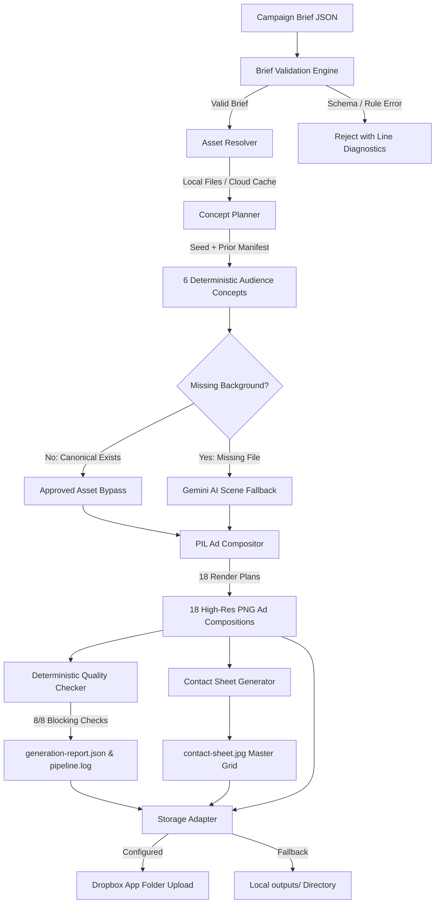

# YETI Los Angeles Multi-Format Creative Ad Generator (2026)

A deterministic, high-throughput creative advertising adaptation engine for YETI’s **"Go Anywhere with YETI"** Los Angeles campaign. Built with **FastAPI**, **Pillow (PIL)**, **React 19**, **TypeScript**, and **Vanilla CSS**.

Generates **18 deterministic, brand-compliant creative ad adaptations** across **6 audience segments** and **3 industry-standard aspect ratios** (`1:1` Square, `16:9` Landscape, `9:16` Vertical Story) with pixel-perfect composition, typography hierarchy, and controlled asset locking.

---

## Table of Contents
1. [Project & Business Overview](#1-project--business-overview)
2. [Generator UI Interface](#2-generator-ui-interface)
3. [Three Sample-Ad Layout References](#3-three-sample-ad-layout-references)
4. [Architecture Overview](#4-architecture-overview)
5. [Why 6 Concepts Become 18 Outputs](#5-why-6-concepts-become-18-outputs)
6. [Campaign Rules Matrix](#6-campaign-rules-matrix)
7. [Asset Tree & Placeholder Resolver](#7-asset-tree--placeholder-resolver)
8. [JSON Brief Validation Rules](#8-json-brief-validation-rules)
9. [Current & Previous-Run Repeat Protection](#9-current--previous-run-repeat-protection)
10. [Same-Concept Ratio Adaptation](#10-same-concept-ratio-adaptation)
11. [Dropbox Cloud Storage & Configuration](#11-dropbox-cloud-storage--configuration)
12. [Gemini's Missing-Background-Only Role](#12-geminis-missing-background-only-role)
13. [Controlled Assets & Human Review Governance](#13-controlled-assets--human-review-governance)
14. [Prerequisites & Fresh-Clone Setup](#14-prerequisites--fresh-clone-setup)
15. [Secret-Free Environment Configuration](#15-secret-free-environment-configuration)
16. [Running with Approved Assets (Zero Gemini Calls)](#16-running-with-approved-assets-zero-gemini-calls)
17. [Testing the AI Background Fallback Path](#17-testing-the-ai-background-fallback-path)
18. [Automated Test Suite (49 Backend / 3 Frontend)](#18-automated-test-suite-49-backend--3-frontend)
19. [Output Directory Structure](#19-output-directory-structure)
20. [Architectural Decisions & Tradeoffs](#20-architectural-decisions--tradeoffs)
21. [System Assumptions & Honest Limitations](#21-system-assumptions--honest-limitations)
22. [Production Evolution Roadmap](#22-production-evolution-roadmap)
23. [Under-Three-Minute Evaluator Demo Path](#23-under-three-minute-evaluator-demo-path)

---

## 1. Project & Business Overview

Enterprise advertising campaigns require producing dozens of creative variations tailored to distinct target demographics and digital ad placements. Manual creative production across multiple formats is slow, error-prone, and frequently leads to brand inconsistencies (e.g. incorrect product targeting, unapproved color contrasts, or stretched packshots).

The **YETI Ad Generator** automates this workflow deterministically:
- Ingests structured JSON campaign briefs describing target audiences, regional activities, and creative constraints.
- Resolves and verifies canonical brand assets (logos, products, approved background scenes, official vector taglines).
- Applies deterministic seeded randomization to select scenes and taglines while enforcing strict demographic targeting rules.
- Renders 18 pixel-perfect composite advertisements with custom typographic hierarchy and ratio-specific layout adjustments.
- Runs 8 automated blocking quality checks, builds a master contact sheet, generates compliance reports, and uploads artifacts to cloud storage.

---

## 2. Generator UI Interface

The frontend application provides a live control center for creative operations:
- **Campaign Brief Upload & Editor**: Ingests brief JSON files, performs schema and rule validation, and allows in-browser JSON inspection and editing.
- **Audience & Format Formula**: Visually presents the 6 audiences × 3 formats = 18 outputs calculation with age group distributions.
- **Asset Readiness Dashboard**: Inspects local and cloud asset health, verifies SHA-256 hashes, and displays readiness badges.
- **Storage Status Indicator**: Displays active storage mode (Local Filesystem or Dropbox Cloud App Folder).
- **Interactive Generation Modal**: Visualizes real-time pipeline stages (JSON validation, asset resolution, concept selection, rendering, QA verification, storage upload).
- **Campaign Results Center**: Filterable cards grouped by audience with format tabs, full-resolution Lightbox preview, 6×3 Master Contact Sheet viewer, ZIP bundle download, and Compliance Quality Report.

---

## 3. Three Sample-Ad Layout References

The compositor uses mathematically defined layout configurations for each target aspect ratio to ensure maximum visual impact while preserving product packshot geometry:

```
┌───────────────────────────┐  ┌───────────────────────────────────────┐  ┌───────────────────────────┐
│        [YETI LOGO]        │  │  [YETI LOGO]                           │  │        [YETI LOGO]        │
│                           │  │                                        │  │                           │
│       GO ANYWHERE.        │  │  GO ANYWHERE.      ┌────────────────┐  │  │       GO ANYWHERE.        │
│                           │  │                    │                │  │  │                           │
│     ┌───────────────┐     │  │                    │  YETI COOLER   │  │  │                           │
│     │               │     │  │                    │   PACKSHOT     │  │  │     ┌───────────────┐     │
│     │  YETI COOLER  │     │  │                    │                │  │  │     │               │     │
│     │   PACKSHOT    │     │  │                    └────────────────┘  │  │     │  YETI COOLER  │     │
│     │               │     │  │                                        │  │     │   PACKSHOT    │     │
│     └───────────────┘     │  │                                        │  │     │               │     │
│                           │  │                                        │  │     └───────────────┘     │
└───────────────────────────┘  └───────────────────────────────────────┘  │                           │
         1:1 Square                         16:9 Landscape                │                           │
       (1080 × 1080)                        (1920 × 1080)                 └───────────────────────────┘
                                                                                   9:16 Vertical
                                                                                   (1080 × 1920)
```

### Layout Specifications & Fine-Tuning Rules:
1. **1:1 Square (`1080×1080`)**:
   - **Target**: Instagram Feed, Facebook Feed, eCommerce Tiles.
   - **Logo**: Centered horizontally at Top 6% (`width: 220px`).
   - **Tagline**: Centered horizontally at Top 20% (`width: 480px`).
   - **Product**: Centered at Bottom 52% (`width: 600px`).
2. **16:9 Landscape (`1920×1080`)**:
   - **Target**: YouTube Pre-roll, Desktop Display Banners, Connected TV.
   - **Logo**: Placed at Top-Left (`left: 8%`, `top: 10%`, `width: 240px`).
   - **Tagline**: Left-aligned beneath logo (`left: 8%`, `top: 26%`, lowered by 10 points for optimal breathing room, sized 5% smaller than base).
   - **Product**: Anchored in right hemisphere (`left: 60%`, `top: 52%`, sized 8% smaller to prevent visual crowding).
3. **9:16 Vertical (`1080×1920`)**:
   - **Target**: Instagram Stories, TikTok, YouTube Shorts, Reels.
   - **Logo**: Centered horizontally at Top 6% (`width: 240px`).
   - **Tagline**: Centered horizontally at Top 18% (sized 3% smaller for vertical balance).
   - **Product**: Centered at Middle-Bottom (`top: 56%`, sized 10% smaller to maintain 250px UI safe zones top and bottom).

---

## 4. Architecture Overview



---

## 5. Why 6 Concepts Become 18 Outputs

A core brand governance rule of this engine is **Cross-Format Concept Locking**:
- The campaign brief defines **6 distinct audience groups** (3 Younger segments ≤ 24 years old, 3 Older segments ≥ 25 years old).
- The `ConceptPlanner` executes deterministic randomization **once per audience** (not per aspect ratio). This selects a single coherent creative concept: `(Audience + Activity + Scene Background + Product Packshot + Tagline)`.
- The `AdCompositor` then adapts that **single concept** into the 3 required aspect ratios (`1:1`, `16:9`, `9:16`).
- Result: **6 Concepts × 3 Formats = Exactly 18 Output Advertisements**.
- **Why this matters**: A consumer seeing a YETI ad on Instagram Stories (`9:16`), Instagram Feed (`1:1`), and YouTube (`16:9`) experiences identical product color, background environment, and messaging without fragmentation.

---

## 6. Campaign Rules Matrix

| Audience ID | Demographic / Territory | Age Band | Assigned Product | Activity Pool | Tagline Color | YETI Logo Color |
| :--- | :--- | :---: | :---: | :---: | :---: | :---: |
| **`P01`** | Gen-Z Beach Goers (Venice / Santa Monica) | Younger (18–24) | **Orange Cooler** (`product_orange.png`) | `beach-west-coast` | **Black** (`#000000`) | **White** (`logo_white.png`) |
| **`P02`** | UCLA Tailgaters (Westwood) | Younger (18–24) | **Orange Cooler** (`product_orange.png`) | `tailgating-college-westwood` | **White** (`#FFFFFF`) | **White** (`logo_white.png`) |
| **`P03`** | USC Students (South Central) | Younger (18–24) | **Orange Cooler** (`product_orange.png`) | `tailgating-college-south-central` | **White** (`#FFFFFF`) | **White** (`logo_white.png`) |
| **`P04`** | Angeles Crest Campers (San Gabriel Mtns) | Older (25–34) | **White Cooler** (`product_white.png`) | `camping-la-mountains` | **White** (`#FFFFFF`) | **White** (`logo_white.png`) |
| **`P05`** | Malibu Coastal Explorers (Malibu) | Older (35–44) | **White Cooler** (`product_white.png`) | `beach-west-coast` | **Black** (`#000000`) | **White** (`logo_white.png`) |
| **`P06`** | Topanga Weekend Trekkers (Topanga) | Older (45–54) | **White Cooler** (`product_white.png`) | `camping-la-mountains` | **White** (`#FFFFFF`) | **White** (`logo_white.png`) |

---

## 7. Asset Tree & Placeholder Resolver

Canonical brand assets are maintained in `assets/`:

```
assets/
├── backgrounds/
│   ├── Beach.jpg              (Approved West Coast Beach Scene)
│   ├── Camping.jpg            (Approved Mountain Camping Scene)
│   └── Tailgate.jpg           (Approved College Tailgate Scene)
├── products/
│   ├── product_orange.png     (Official YETI Tundra Orange Packshot, RGBA)
│   └── product_white.png      (Official YETI Tundra White Packshot, RGBA)
├── logos/
│   ├── logo_black.png         (YETI Vector Wordmark Black, RGBA)
│   └── logo_white.png         (YETI Vector Wordmark White, RGBA)
├── taglines/
│   ├── TAGLINE_black.png      (Approved "GO ANYWHERE." Vector Black, RGBA)
│   └── TAGLINE_white.png      (Approved "GO ANYWHERE." Vector White, RGBA)
└── fonts/
    └── DejaVuSans-Bold.ttf    (Contact Sheet & Metric Overlay Typography)
```

### The `AssetResolver` Service:
- Validates file presence, dimensions, channel mode (RGB vs RGBA), and SHA-256 cryptographic integrity.
- Sanitizes file paths and prevents directory traversal attacks (`../` is strictly blocked).
- Supports local caching of remote assets from Dropbox App Folder when running in cloud storage mode.

---

## 8. JSON Brief Validation Rules

The backend (`backend/app/services/brief_validator.py`) and frontend (`frontend/src/utils/validation.ts`) enforce strict deterministic brief rules:
1. **Audiences Count**: Must contain exactly 6 audiences.
2. **Formats Count**: Must contain exactly 3 formats (`1:1`, `16:9`, `9:16`).
3. **Age Range Integrity**: Age ranges cannot span across the 24/25 boundary (e.g. `20–30` is rejected).
4. **Product Color Targeting**: Younger audiences must target `product_orange.png`; Older audiences must target `product_white.png`.
5. **Activity to Background Pool**: Beach audiences must map to `beach-west-coast`; Camping to `camping-la-mountains`; Tailgating to `tailgating-college-*`.
6. **Tagline Color Constraints**: Beach audiences must specify Black tagline `#000000`; Camping/Tailgating must specify White `#FFFFFF`.
7. **Security**: No absolute system paths or parent directory traversal sequences (`../`) allowed in asset URIs.

---

## 9. Current & Previous-Run Repeat Protection

To avoid creative fatigue across multi-audience campaigns, the `ConceptPlanner` implements two layers of repeat protection:
1. **Current-Run Deduplication**: Tracks backgrounds and taglines used within the active generation run to ensure diverse asset distribution across the 6 audiences.
2. **Prior-Run Manifest Protection**: Ingests the previous run's `generation-manifest.json` via `priorManifestPath`. Assets used in the previous run for a given audience category are deprioritized.
3. **Pool Exhaustion Graceful Fallback**: If an asset pool contains fewer unique assets than audiences assigned to that activity (e.g. 2 camping backgrounds for 3 camping audiences), the system gracefully reuses an approved asset and emits an informational warning rather than failing the pipeline.

---

## 10. Same-Concept Ratio Adaptation

When an audience concept is selected, the identical asset bundle is locked:
```python
# Concept locking ensures 100% brand consistency across formats:
concept_id = f"c_{audience_id}_{seed}"
selected_background = "assets/backgrounds/Beach.jpg"
selected_product = "assets/products/product_orange.png"
selected_tagline = "assets/taglines/TAGLINE_black.png"
selected_logo = "assets/logos/logo_white.png"
```
The compositor applies ratio-specific coordinate grids and scaling algorithms without altering the underlying scene or product color.

---

## 11. Dropbox Cloud Storage & Configuration

The system features an enterprise Dropbox Storage Adapter (`backend/app/services/dropbox_adapter.py`):
- **Storage Scope**: Dropbox App Folder (`/Apps/<YourApp>/yeti-ad-generator/campaigns/`).
- **Token Refresh Support**: Automatically refreshes expired short-lived access tokens when `DROPBOX_REFRESH_TOKEN`, `DROPBOX_APP_KEY`, and `DROPBOX_APP_SECRET` are configured in `.env`.
- **Upload Artifacts**: Synchronizes all 18 PNG adaptations, `contact-sheet.jpg`, `generation-report.json`, `pipeline.log`, and the complete ZIP package.
- **Graceful Local Fallback**: If Dropbox credentials are empty or the network is unavailable, the pipeline operates locally without errors, saving all files to `./outputs/`.

---

## 12. Gemini's Missing-Background-Only Role

The Gemini Generative AI integration (`backend/app/services/gemini_generator.py`) serves **exclusively as a bounded fallback** for missing background scenes:
- **Approved Asset Bypass**: If an approved local or cloud background exists for an audience activity, **Gemini is never invoked**.
- **Strict Guardrail Prompting**: Prompts enforce outdoor lifestyle landscapes and explicitly prohibit human faces, bodies, logos, coolers, or text overlays.
- **Mock vs Live Truthfulness**: When `GEMINI_API_KEY` is not provided, a deterministic geometric mock generator creates the fallback background and explicitly labels it `mock_fallback` in metadata. Mock outputs are never falsely labeled as AI-generated.

---

## 13. Controlled Assets & Human Review Governance

Brand safety is enforced through automated flags and visual provenance:
- **Zero Packshot Distortion**: Product packshots and logos maintain 100% intact aspect ratios via bicubic resampling.
- **Human Review Required Badge**: Any creative adaptation utilizing an AI-generated fallback background is automatically tagged with `human_review_required: true` and marked with an orange warning badge in both the JSON report and the UI.
- **Audience Provenance Tracking**: Every output records its exact source asset path and generation seed in `generation-manifest.json`.

---

## 14. Prerequisites & Fresh-Clone Setup

### Prerequisites
- **Python**: `3.12+`
- **Node.js**: `18+`
- **npm**: `9+`

### Setup Instructions
```bash
# 1. Clone the repository
git clone https://github.com/cogspa/YETI_AD_GEN.git
cd YETI_AD_GEN

# 2. Configure Python virtual environment
python3 -m venv .venv
source .venv/bin/activate

# 3. Install Python backend dependencies
pip install -r backend/requirements.txt

# 4. Copy environment template (zero secrets required for local execution)
cp .env.example .env

# 5. Install Node.js frontend dependencies
npm --prefix frontend install

# 6. Start FastAPI Backend Server (Port 8000)
uvicorn backend.app.main:app --port 8000 --host 0.0.0.0 --reload
```

In a separate terminal window:
```bash
# 7. Start Frontend Development Server (Port 5173)
npm run --prefix frontend dev -- --port 5173
```

Open **`http://localhost:5173`** in your browser.

---

## 15. Secret-Free Environment Configuration

The provided `.env.example` file contains variable names only with safe placeholders:
```bash
# Server Environment
PORT=8000
HOST=0.0.0.0
CORS_ORIGINS=http://localhost:5173

# AI Scene Background Generation (Optional Fallback)
GEMINI_API_KEY=

# Local Storage Root
STORAGE_ROOT=./outputs

# Dropbox Storage Adapter Configuration (Optional)
DROPBOX_ACCESS_TOKEN=
DROPBOX_REFRESH_TOKEN=
DROPBOX_APP_KEY=
DROPBOX_APP_SECRET=
DROPBOX_CAMPAIGN_ROOT=/yeti-ad-generator
LOCAL_ASSET_CACHE_DIR=./.cache/dropbox-assets
```
No live API keys, Dropbox tokens, or credentials are required to run the full pipeline locally.

---

## 16. Running with Approved Assets (Zero Gemini Calls)

To generate a full 18-ad campaign using approved canonical assets:

### Via Web UI:
1. Open `http://localhost:5173`.
2. The default brief (`yeti-la-go-anywhere-2026.json`) loads automatically.
3. Click **`GENERATE 18 ADS`**.
4. The generation modal tracks all 8 pipeline stages in real time.
5. Review the 6 audience concepts, download the 18-ad ZIP bundle, inspect the Contact Sheet, or click **`QUALITY REPORT (8/8)`** to view compliance checks.

### Via Backend API:
```bash
curl -X POST "http://localhost:8000/api/campaign/generate?seed=42" \
     -H "Content-Type: application/json" \
     -d @yeti_la_random_ad_campaign.json
```

---

## 17. Testing the AI Background Fallback Path

To verify the Gemini fallback mechanism when a background is missing:
1. In the web UI, click **`INSPECT / EDIT JSON`**.
2. Modify one background pool entry to reference a non-existent asset:
   ```json
   "backgroundPoolId": "missing-joshua-tree-scene.jpg"
   ```
3. Click **`GENERATE 18 ADS`**.
4. The pipeline detects the missing file, invokes the fallback generator, attaches the `human_review_required: true` badge, and logs the provenance in `pipeline.log`.

---

## 18. Automated Test Suite (49 Backend / 3 Frontend)

Run the full automated test suite with one command:

```bash
# 1. Run all 49 Backend Pytest Tests (100% Pass Rate)
PYTHONPATH=. .venv/bin/pytest backend/tests/ -v

# 2. Run Frontend Vitest Unit Tests (100% Pass Rate)
npx --prefix frontend vitest run --dir frontend

# 3. Run Frontend Typecheck & Production Build
npm run --prefix frontend build

# 4. Run Frontend Oxlint
npx --prefix frontend oxlint
```

---

## 19. Output Directory Structure

Generated campaign assets are structured deterministically:

```
outputs/
└── yeti-la-go-anywhere-2026/
    └── runs/
        └── run-20260818-164311-s42/
            ├── contact-sheet.jpg                   (6x3 Master Visual Grid)
            ├── generation-manifest.json            (Provenance & Seed Record)
            ├── generation-report.json              (8/8 Quality Compliance Audit)
            ├── pipeline.log                        (Secret-Redacted JSONL Execution Log)
            ├── yeti-la-go-anywhere-2026-run-...zip (Downloadable Full Package)
            └── outputs/
                ├── P01/
                │   ├── 1x1/P01_beach_younger_1x1.png
                │   ├── 16x9/P01_beach_younger_16x9.png
                │   └── 9x16/P01_beach_younger_9x16.png
                ├── P02/
                │   ├── 1x1/P02_tailgating_younger_1x1.png
                │   ├── 16x9/P02_tailgating_younger_16x9.png
                │   └── 9x16/P02_tailgating_younger_9x16.png
                ├── P03/ (USC Tailgating 1:1, 16:9, 9:16)
                ├── P04/ (Angeles Crest Camping 1:1, 16:9, 9:16)
                ├── P05/ (Malibu Beach 1:1, 16:9, 9:16)
                └── P06/ (Topanga Camping 1:1, 16:9, 9:16)
```

---

## 20. Architectural Decisions & Tradeoffs

| Decision | Choice Made | Alternative Considered | Rationale |
| :--- | :--- | :--- | :--- |
| **Image Compositing Engine** | Python Pillow (PIL) | Headless Chrome / Puppeteer | PIL offers microsecond rendering speeds, zero browser memory overhead, and strict pixel-perfect deterministic layout math. |
| **Layout Math** | Mathematical Bicubic Scaling | CSS Absolute Positioning | Ensures exact aspect ratio retention and sub-pixel alignment independent of browser rendering engines. |
| **Randomization** | Seeded `random.Random(seed)` | Unseeded `Math.random()` | Guarantees 100% reproducible campaign batches for regression testing and regulatory compliance. |
| **Storage Architecture** | Dual Adapter (Local / Dropbox) | S3 / GCS only | Enables immediate local offline development and zero-dependency evaluator setup while supporting enterprise cloud upload. |
| **CSS Architecture** | Custom Vanilla CSS Design System | Tailwind CSS | Eliminates utility class purging risks, provides precise control over YETI brand blues and dark mode, and guarantees zero CSS runtime bloat. |

---

## 21. System Assumptions & Honest Limitations

1. **No Automated Trademark Detection**: The engine does not perform computer vision trademark classification. Background safety is guaranteed by restricting scenes to approved, pre-cleared asset pools.
2. **Bounded AI Scene Generation**: Gemini is strictly bounded as a fallback for missing background files. It is never used to generate product packshots, logos, or typography.
3. **Mock Generator Disclosure**: When Gemini API keys are absent, fallback scenes are generated via a mock geometric renderer clearly flagged as `mock_fallback` in audit metadata.
4. **Repeat Protection on Small Pools**: If an activity pool has fewer unique assets than audiences, approved assets are reused with explicit warning logs rather than crashing the pipeline.

---

## 22. Production Evolution Roadmap

To scale this engine to enterprise multi-brand production:
- **Durable Job Queue**: Migrate synchronous pipeline runs to Celery or Temporal with Redis/RabbitMQ backends for massive parallel batch execution.
- **Enterprise DAM Integration**: Connect directly to Adobe Experience Manager (AEM) or Bynder via webhooks to ingest newly approved brand assets automatically.
- **Creative Director Approval Workflow**: Implement multi-stage Slack/Email notifications with interactive approval buttons for AI-flagged adaptations.
- **Dynamic Localization Engine**: Expand tagline resolution to support multi-language vector rendering and regional legal disclaimer overlays.
- **Ad Network Direct Export**: Integrate direct push publishing to Meta Marketing API, Google Ads API, and TikTok Creative Center.

---

## 23. Under-Three-Minute Evaluator Demo Path

1. **Clone & Install**:
   ```bash
   git clone https://github.com/cogspa/YETI_AD_GEN.git && cd YETI_AD_GEN
   python3 -m venv .venv && source .venv/bin/activate && pip install -r backend/requirements.txt
   npm --prefix frontend install
   ```
2. **Run Test Suite**:
   ```bash
   PYTHONPATH=. .venv/bin/pytest backend/tests/ -v
   ```
   *(Verify all 49 tests pass in ~40 seconds).*
3. **Start Application**:
   ```bash
   uvicorn backend.app.main:app --port 8000 &
   npm run --prefix frontend dev -- --port 5173
   ```
4. **Generate Campaign in Browser**:
   - Navigate to `http://localhost:5173`.
   - Click **`GENERATE 18 ADS`**.
5. **Verify Outputs**:
   - Click **`VIEW CONTACT SHEET`** to see the 6×3 master review grid.
   - Click **`QUALITY REPORT (8/8)`** to inspect the deterministic compliance audit.
   - Download the full 18-ad ZIP package.
