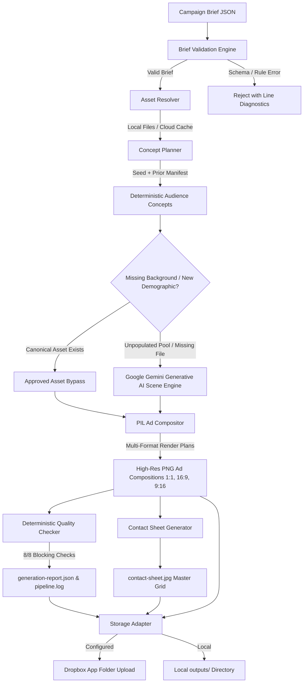

# Campaign Synopsis: “Go Anywhere with YETI”

“Go Anywhere with YETI” is a Los Angeles–focused advertising campaign designed to promote two YETI cooler products across multiple audiences, locations, product colors, and digital ad formats. The campaign primarily targets young adults, college students, campers, and tailgaters, presenting YETI coolers as durable products that move easily between outdoor recreation and social experiences.

The campaign is supported by a creative-automation pipeline. A user begins by submitting a structured campaign brief containing the products, available colors, audience segments, regional information, approved campaign copy, brand standards, and links to source assets. These inputs can be supplied through a JSON file, spreadsheet, or simple frontend interface.

The system retrieves the approved product photography, logos, fonts, colors, lifestyle backgrounds, and messaging from organized storage. If a required lifestyle or hero image is unavailable, the pipeline can request a new image from a generative-image API using the campaign’s art direction and brand constraints. Generated content is then stored with the campaign assets for review and reuse.

The pipeline builds a variation matrix combining:

- Two YETI cooler products
- Multiple approved product colors
- Camping and tailgating environments
- Audience and demographic variations
- Los Angeles–specific messaging
- Square, vertical, and landscape ad formats

For each variation, the system selects the appropriate template, places the product and background imagery, applies the correct product color, inserts the campaign message, and adds approved brand elements. The primary deliverables are produced in three formats: 1:1, 9:16, and 16:9.

Before an ad is approved, it passes through automated quality checks covering logo placement, safe areas, typography, color usage, text contrast, product distortion, image resolution, output dimensions, and required legal copy. Ads that pass are added to the final campaign package. Ads that fail are flagged with a clear reason for human review.

The final output includes the approved ad variations, a visual preview gallery, an asset manifest, and an execution log showing how each image was created. All source materials and deliverables are organized into predictable campaign folders and backed up to shared storage.

The campaign demonstrates more than the creation of individual YETI advertisements. It shows how a repeatable creative-production system can transform one approved campaign direction into a scalable library of localized, audience-specific, product-specific, and platform-ready content—while maintaining brand consistency and preserving human creative oversight.

### Short Pitch:
> “Go Anywhere with YETI” is a modular campaign and creative-automation prototype that converts a structured brief and approved brand assets into a quality-controlled family of product, audience, regional, and social-media ad variations.

---

## ⚡ Quickstart: Command Line Execution (CLI)

The campaign generation engine can be run directly from the terminal with a single command:

```bash
# 1. Activate the Python virtual environment
source .venv/bin/activate

# 2. Run the 18-Ad baseline campaign with deterministic seed
python generate_ads.py --brief yeti_la_random_ad_campaign.json --seed 42

# 3. Run the 36-Ad campaign (2 concepts per audience)
python generate_ads.py --brief yeti_la_random_ad_campaign_36.json --seed 42

# 4. Run the 72-Ad multi-demographic campaign (includes Google Gemini AI scenes)
python generate_ads.py --brief yeti_la_random_ad_campaign_72.json --seed 42
```

### CLI Output Summary:
Upon execution, the terminal displays live stage progress, validates assets, renders all multi-format PNG adaptations into `outputs/yeti-la-go-anywhere-2026/runs/`, compiles a master visual contact sheet, runs 8 blocking quality checks, and generates a structured compliance report (`generation-report.json`).

---

## 🖥️ Interactive Web UI Control Center

In addition to the command-line interface, a **full interactive web application** has been developed for creative directors, campaign managers, and marketing teams.

### Tech Stack:
- **Frontend**: **TypeScript**, **React 19**, **Vite**, and **Vanilla CSS** (dark mode, glassmorphic styling, responsive layout).
- **Backend API**: **Python (FastAPI / Flask-compatible WSGI/ASGI service)** with **Pillow (PIL)** for composite image rendering and the **Google GenAI SDK** for AI scene synthesis.

### Web UI Features & Architecture:
1. **Live JSON Brief Editor & Schema Validator**:
   - Ingests, inspects, and validates campaign brief JSON files directly in the browser with real-time error feedback and syntax highlighting.
2. **Dynamic Audience & Matrix Equation**:
   - Computes planned output counts dynamically based on loaded personas ($N \text{ audiences} \times M \text{ concepts} \times 3 \text{ formats} = \text{Target Ads}$).
   - Features collapsible accordion sections for cleaner workspace views.
3. **Asset Readiness & Integrity Monitor**:
   - Continuously verifies canonical brand assets on disk and cloud storage (checking presence, format, transparency, and non-zero byte size).
4. **System & AI Integrations Dashboard**:
   - Displays live connection health for Dropbox Cloud Storage and Google Gemini AI scene generation (active vs standby).
5. **Real-Time Generation Progress Modal**:
   - Visualizes live multi-step pipeline execution (JSON validation, asset resolution, repeat protection, concept selection, rendering, QA verification, storage sync).
6. **Campaign Results Gallery & Lightbox**:
   - Filterable ad cards grouped by audience demographic with instant format tabs (`1:1`, `16:9`, `9:16`).
   - High-resolution Lightbox inspection, Master Contact Sheet viewer, ZIP bundle download, and one-click **"Open in Dropbox Folder"** web integration.

### Launching the Web UI:

```bash
# Terminal 1: Start the Python Backend API (Port 8000)
source .venv/bin/activate
uvicorn backend.app.main:app --port 8000 --host 0.0.0.0 --reload

# Terminal 2: Start the TypeScript / React Frontend (Port 5173)
npm run dev -- --port 5173
```
*Open **`http://localhost:5173`** in your browser.*

---

# YETI Los Angeles Multi-Format Creative Ad Generator (2026)

A deterministic, high-throughput creative advertising adaptation engine for YETI’s **"Go Anywhere with YETI"** Los Angeles campaign. Built with **FastAPI**, **Pillow (PIL)**, **React 19**, **TypeScript**, and **Vanilla CSS**.

Generates **18 to 72 deterministic, brand-compliant creative ad adaptations** across **6 to 12 audience segments** and **3 industry-standard aspect ratios** (`1:1` Square, `16:9` Landscape, `9:16` Vertical Story) with pixel-perfect composition, typography hierarchy, and controlled asset locking.

---


## Table of Contents
1. [Project & Business Overview](#1-project--business-overview)
2. [Generator UI Interface](#2-generator-ui-interface)
3. [Three Sample-Ad Layout References](#3-three-sample-ad-layout-references)
4. [Architecture Overview](#4-architecture-overview)
5. [Initial 18-Ad Baseline vs. Expanded 72-Ad Gemini Multi-Demographic Campaign](#5-initial-18-ad-baseline-vs-expanded-72-ad-gemini-multi-demographic-campaign)
6. [Campaign Rules Matrix & Demographic Expansion](#6-campaign-rules-matrix--demographic-expansion)
7. [Asset Tree & Placeholder Resolver](#7-asset-tree--placeholder-resolver)
8. [JSON Brief Validation Rules](#8-json-brief-validation-rules)
9. [Current & Previous-Run Repeat Protection](#9-current--previous-run-repeat-protection)
10. [Same-Concept Ratio Adaptation](#10-same-concept-ratio-adaptation)
11. [Dropbox Cloud Storage & Configuration](#11-dropbox-cloud-storage--configuration)
12. [Google Gemini AI Scene Generation & Fallback Architecture](#12-google-gemini-ai-scene-generation--fallback-architecture)
13. [Controlled Assets & Human Review Governance](#13-controlled-assets--human-review-governance)
14. [Prerequisites & Fresh-Clone Setup](#14-prerequisites--fresh-clone-setup)
15. [Secret-Free Environment Configuration](#15-secret-free-environment-configuration)
16. [Running with Approved Assets & Baseline 18-Ad Runs](#16-running-with-approved-assets--baseline-18-ad-runs)
17. [Running the Expanded 72-Ad Gemini AI Campaign](#17-running-the-expanded-72-ad-gemini-ai-campaign)
18. [Automated Test Suite (50 Backend / 3 Frontend)](#18-automated-test-suite-50-backend--3-frontend)
19. [Output Directory Structure](#19-output-directory-structure)
20. [Architectural Decisions & Tradeoffs](#20-architectural-decisions--tradeoffs)
21. [System Assumptions & Honest Limitations](#21-system-assumptions--honest-limitations)
22. [Production Evolution Roadmap](#22-production-evolution-roadmap)
23. [Under-Three-Minute Evaluator Demo Path](#23-under-three-minute-evaluator-demo-path)

---

## 1. Project & Business Overview

Enterprise advertising campaigns require producing dozens of creative variations tailored to distinct target demographics and digital ad placements. Manual creative production across multiple formats is slow, error-prone, and frequently leads to brand inconsistencies (e.g. incorrect product targeting, unapproved color contrasts, or stretched packshots).

The **YETI Ad Generator** automates this workflow deterministically:
- Ingests structured JSON campaign briefs describing target audiences, regional activities, and creative constraints.
- Resolves and verifies canonical brand assets (logos, products, approved background scenes, official vector taglines).
- Applies deterministic seeded randomization to select scenes and taglines while enforcing strict demographic targeting rules.
- **Scales from Baseline to Expanded Campaigns**: Evaluated initially on an **18-ad baseline test** (6 audience segments × 3 aspect ratios), then expanded and proven on a **72-ad campaign brief** (12 audience segments) to test and enable **automated AI scene generation with Google Gemini** for new outdoor demographics not present in the initial brief.
- Renders pixel-perfect composite advertisements across `1:1`, `16:9`, and `9:16` formats with ratio-specific layout adjustments.
- Runs 8 automated blocking quality checks, builds a master contact sheet, generates compliance reports, and uploads artifacts to cloud storage.

---

## 2. Generator UI Interface

The frontend application provides a live control center for creative operations:
- **Campaign Brief Upload & Editor**: Ingests brief JSON files, performs schema and rule validation, and allows in-browser JSON inspection and editing.
- **Dynamic Audience & Format Formula**: Automatically computes matrix output calculations ($N \text{ audiences} \times M \text{ concepts} \times 3 \text{ formats} = \text{Target Ads}$) with age group distributions and collapsible sections.
- **Asset Readiness Dashboard**: Inspects local and cloud asset health, verifies SHA-256 hashes, and displays readiness badges.
- **Storage & AI Status Indicators**: Displays active storage mode (Local Filesystem or Dropbox Cloud App Folder) and Google Gemini AI scene generation readiness.
- **Interactive Generation Modal**: Visualizes real-time pipeline stages (JSON validation, asset resolution, concept selection, rendering, QA verification, storage upload).
- **Campaign Results Center**: Filterable cards grouped by audience with format tabs, full-resolution Lightbox preview, Master Contact Sheet viewer, ZIP bundle download, and Compliance Quality Report.

---

## 3. Three Sample-Ad Layout References

The compositor uses mathematically defined layout configurations for each target aspect ratio to ensure maximum visual impact while preserving product packshot geometry:

```
┌───────────────────────────┐  ┌───────────────────────────────────────┐  ┌───────────────────────────┐
│        [YETI LOGO]        │  │  [YETI LOGO]                           │  │        [YETI LOGO]        │
│                           │  │                                        │  │                           │
│       GO ANYWHERE.        │  │  GO ANYWHERE.      ┌────────────────┐  │  │       GO ANYWHERE.        │
│                           │  │                    │                │  │  │                           │
│     ┌───────────────┐     │  │                    │  YETI COOLER   │  │  │                           │
│     │               │     │  │                    │   PACKSHOT     │  │  │     ┌───────────────┐     │
│     │  YETI COOLER  │     │  │                    │                │  │  │     │               │     │
│     │   PACKSHOT    │     │  │                    └────────────────┘  │  │     │  YETI COOLER  │     │
│     │               │     │  │                                        │  │     │   PACKSHOT    │     │
│     └───────────────┘     │  │                                        │  │     │               │     │
│                           │  │                                        │  │     └───────────────┘     │
└───────────────────────────┘  └───────────────────────────────────────┘  │                           │
         1:1 Square                         16:9 Landscape                │                           │
       (1080 × 1080)                        (1920 × 1080)                 └───────────────────────────┘
                                                                                   9:16 Vertical
                                                                                   (1080 × 1920)
```

### Layout Specifications & Fine-Tuning Rules:
1. **1:1 Square (`1080×1080`)**:
   - **Target**: Instagram Feed, Facebook Feed, eCommerce Tiles.
   - **Logo**: Centered horizontally at Top 6% (`width: 220px`).
   - **Tagline**: Centered horizontally at Top 20% (`width: 480px`).
   - **Product**: Centered at Bottom 52% (`width: 600px`).
2. **16:9 Landscape (`1920×1080`)**:
   - **Target**: YouTube Pre-roll, Desktop Display Banners, Connected TV.
   - **Logo**: Placed at Top-Left (`left: 8%`, `top: 10%`, `width: 240px`).
   - **Tagline**: Left-aligned beneath logo (`left: 8%`, `top: 26%`, lowered by 10 points for optimal breathing room, sized 5% smaller than base).
   - **Product**: Anchored in right hemisphere (`left: 60%`, `top: 52%`, sized 8% smaller to prevent visual crowding).
3. **9:16 Vertical (`1080×1920`)**:
   - **Target**: Instagram Stories, TikTok, YouTube Shorts, Reels.
   - **Logo**: Centered horizontally at Top 6% (`width: 240px`).
   - **Tagline**: Centered horizontally at Top 18% (sized 3% smaller for vertical balance).
   - **Product**: Centered at Middle-Bottom (`top: 56%`, sized 10% smaller to maintain 250px UI safe zones top and bottom).

---

## 4. Architecture Overview



---

## 5. Initial 18-Ad Baseline vs. Expanded 72-Ad Gemini Multi-Demographic Campaign

A core brand governance rule of this engine is **Cross-Format Concept Locking**:
- The `ConceptPlanner` executes deterministic randomization **once per audience concept** (not per aspect ratio). This selects a single coherent creative concept: `(Audience + Activity + Scene Background + Product Packshot + Tagline)`.
- The `AdCompositor` then adapts that **single concept** into the 3 required aspect ratios (`1:1`, `16:9`, `9:16`).
- **Why this matters**: A consumer seeing a YETI ad on Instagram Stories (`9:16`), Instagram Feed (`1:1`), and YouTube (`16:9`) experiences identical product color, background environment, and messaging without fragmentation.

### 1. Initial 18-Ad Baseline (Testing & Validation Phase):
The project was initially scaffolded and validated using a baseline brief (`yeti-la-go-anywhere-2026.json`):
- **6 Audience Segments** (3 Younger segments $\le 24$ years old, 3 Older segments $\ge 25$ years old)
- **1 Concept per Audience** $\times$ **3 Formats** = **Exactly 18 Output Advertisements**
- Validated core compositing math, typography hierarchy, safe zones, and static pre-approved backgrounds (Beach, Tailgate, Camping).

### 2. Expanded 72-Ad Campaign with Google Gemini AI Scene Generation:
Once the core pipeline was established and Google Gemini was integrated, the generator was expanded to prove scalable, dynamic creative production on [`yeti_la_random_ad_campaign_72.json`](file:///Users/joem/YETI_AD_GEN/yeti_la_random_ad_campaign_72.json):
- **12 Audience Segments** covering traditional and newly added Los Angeles outdoor lifestyles.
- **2 Concepts per Audience** $\times$ **3 Formats** = **Exactly 72 Output Advertisements**.
- **Automated Background Synthesis**: When new demographics introduce activities or territories without static photographic assets in storage (e.g. **Hiking** in Hollywood Hills/Griffith Park, **Surfing** in Malibu/South Bay, **Coastal Fishing** in Marina Del Rey, and **Rock Climbing** at Stoney Point), the engine dynamically calls **Google Gemini Image API** (`gemini-2.5-flash-image` / `imagen-3.0`) to generate commercial, photorealistic, brand-guardrailed landscape photography on the fly.
- Generated backgrounds are automatically stored with the campaign run, hashed, reused for cross-format consistency, and flagged for human creative review.

---

## 6. Campaign Rules Matrix & Demographic Expansion

| Audience ID | Demographic / Territory | Activity Pool | Assigned Product | Background Source | Tagline Color | YETI Logo Color |
| :--- | :--- | :---: | :---: | :---: | :---: | :---: |
| **`P01`** | UCLA Tailgaters (Westwood) | Tailgating | **Orange Cooler** (`Roadie 24`) | Approved Asset (`Tailgate.jpg`) | White (`#FFFFFF`) | White (`logo_white.png`) |
| **`P02`** | USC Students (South Central) | Tailgating | **Orange Cooler** (`Roadie 24`) | Approved Asset (`Tailgate.jpg`) | White (`#FFFFFF`) | White (`logo_white.png`) |
| **`P03`** | Venice Beach Coastal Goers | Beach | **White Cooler** (`Tundra 45`) | Approved Asset (`Beach.jpg`) | Black (`#000000`) | White (`logo_white.png`) |
| **`P04`** | Santa Monica Boardwalk | Beach | **Orange Cooler** (`Roadie 24`) | Approved Asset (`Beach.jpg`) | Black (`#000000`) | White (`logo_white.png`) |
| **`P05`** | Angeles Crest Campers | Camping | **White Cooler** (`Tundra 45`) | Approved Asset (`Camping.jpg`) | White (`#FFFFFF`) | White (`logo_white.png`) |
| **`P06`** | Topanga Canyon Trekkers | Camping | **White Cooler** (`Tundra 45`) | Approved Asset (`Camping.jpg`) | White (`#FFFFFF`) | White (`logo_white.png`) |
| **`P07`** *(New)* | Hollywood Hills Trail Hikers | Hiking | **Orange Cooler** (`Roadie 24`) | **Google Gemini AI Scene** | White (`#FFFFFF`) | White (`logo_white.png`) |
| **`P08`** *(New)* | Griffith Park Ridgeline Trekkers | Hiking | **White Cooler** (`Tundra 45`) | **Google Gemini AI Scene** | White (`#FFFFFF`) | White (`logo_white.png`) |
| **`P09`** *(New)* | Malibu Point Dawn Surfers | Surfing | **Orange Cooler** (`Roadie 24`) | **Google Gemini AI Scene** | Black (`#000000`) | White (`logo_white.png`) |
| **`P10`** *(New)* | South Bay Sunset Surfers | Surfing | **White Cooler** (`Tundra 45`) | **Google Gemini AI Scene** | Black (`#000000`) | White (`logo_white.png`) |
| **`P11`** *(New)* | Marina Del Rey Anglers | Fishing | **Orange Cooler** (`Roadie 24`) | **Google Gemini AI Scene** | White (`#FFFFFF`) | White (`logo_white.png`) |
| **`P12`** *(New)* | Stoney Point Rock Climbers | Climbing | **White Cooler** (`Tundra 45`) | **Google Gemini AI Scene** | White (`#FFFFFF`) | White (`logo_white.png`) |

---


---

## 7. Asset Tree & Placeholder Resolver

Canonical brand assets are maintained in `assets/`:

```
assets/
├── backgrounds/
│   ├── Beach.jpg              (Approved West Coast Beach Scene)
│   ├── Camping.jpg            (Approved Mountain Camping Scene)
│   └── Tailgate.jpg           (Approved College Tailgate Scene)
├── products/
│   ├── product_orange.png     (Official YETI Tundra Orange Packshot, RGBA)
│   └── product_white.png      (Official YETI Tundra White Packshot, RGBA)
├── logos/
│   ├── logo_black.png         (YETI Vector Wordmark Black, RGBA)
│   └── logo_white.png         (YETI Vector Wordmark White, RGBA)
├── taglines/
│   ├── TAGLINE_black.png      (Approved "GO ANYWHERE." Vector Black, RGBA)
│   └── TAGLINE_white.png      (Approved "GO ANYWHERE." Vector White, RGBA)
└── fonts/
    └── DejaVuSans-Bold.ttf    (Contact Sheet & Metric Overlay Typography)
```

### The `AssetResolver` Service:
- Validates file presence, dimensions, channel mode (RGB vs RGBA), and SHA-256 cryptographic integrity.
- Sanitizes file paths and prevents directory traversal attacks (`../` is strictly blocked).
- Supports local caching of remote assets from Dropbox App Folder when running in cloud storage mode.

---

## 8. JSON Brief Validation Rules

The backend (`backend/app/services/brief_validator.py`) and frontend (`frontend/src/utils/validation.ts`) enforce strict deterministic brief rules:
1. **Audiences Count**: Must contain exactly 6 audiences.
2. **Formats Count**: Must contain exactly 3 formats (`1:1`, `16:9`, `9:16`).
3. **Age Range Integrity**: Age ranges cannot span across the 24/25 boundary (e.g. `20–30` is rejected).
4. **Product Color Targeting**: Younger audiences must target `product_orange.png`; Older audiences must target `product_white.png`.
5. **Activity to Background Pool**: Beach audiences must map to `beach-west-coast`; Camping to `camping-la-mountains`; Tailgating to `tailgating-college-*`.
6. **Tagline Color Constraints**: Beach audiences must specify Black tagline `#000000`; Camping/Tailgating must specify White `#FFFFFF`.
7. **Security**: No absolute system paths or parent directory traversal sequences (`../`) allowed in asset URIs.

---

## 9. Current & Previous-Run Repeat Protection

To avoid creative fatigue across multi-audience campaigns, the `ConceptPlanner` implements two layers of repeat protection:
1. **Current-Run Deduplication**: Tracks backgrounds and taglines used within the active generation run to ensure diverse asset distribution across the 6 audiences.
2. **Prior-Run Manifest Protection**: Ingests the previous run's `generation-manifest.json` via `priorManifestPath`. Assets used in the previous run for a given audience category are deprioritized.
3. **Pool Exhaustion Graceful Fallback**: If an asset pool contains fewer unique assets than audiences assigned to that activity (e.g. 2 camping backgrounds for 3 camping audiences), the system gracefully reuses an approved asset and emits an informational warning rather than failing the pipeline.

---

## 10. Same-Concept Ratio Adaptation

When an audience concept is selected, the identical asset bundle is locked:
```python
# Concept locking ensures 100% brand consistency across formats:
concept_id = f"c_{audience_id}_{seed}"
selected_background = "assets/backgrounds/Beach.jpg"
selected_product = "assets/products/product_orange.png"
selected_tagline = "assets/taglines/TAGLINE_black.png"
selected_logo = "assets/logos/logo_white.png"
```
The compositor applies ratio-specific coordinate grids and scaling algorithms without altering the underlying scene or product color.

---

## 11. Dropbox Cloud Storage & Configuration

The system features an enterprise Dropbox Storage Adapter (`backend/app/services/dropbox_adapter.py`):
- **Storage Scope**: Dropbox App Folder (`/Apps/<YourApp>/yeti-ad-generator/campaigns/`).
- **Token Refresh Support**: Automatically refreshes expired short-lived access tokens when `DROPBOX_REFRESH_TOKEN`, `DROPBOX_APP_KEY`, and `DROPBOX_APP_SECRET` are configured in `.env`.
- **Upload Artifacts**: Synchronizes all 18 PNG adaptations, `contact-sheet.jpg`, `generation-report.json`, `pipeline.log`, and the complete ZIP package.
- **Graceful Local Fallback**: If Dropbox credentials are empty or the network is unavailable, the pipeline operates locally without errors, saving all files to `./outputs/`.

---

## 12. Google Gemini AI Scene Generation & Fallback Architecture

The Google Gemini Generative AI integration (`backend/app/services/gemini_generator.py`) serves two core functions in the creative pipeline:

1. **Dynamic Demographic Scene Generation**:
   - When a campaign brief introduces new outdoor lifestyles or regional territories without pre-existing static assets in storage (e.g. **Hiking** in Griffith Park, **Surfing** in Malibu, **Fishing** in Marina Del Rey, or **Bouldering** at Stoney Point), the engine calls Google's latest image generation model (`gemini-2.5-flash-image` / `imagen-3.0`) to synthesize custom, high-resolution ($1408 \times 768$ to $2048 \times 2048$) commercial lifestyle photography.
2. **Missing Asset Fallback**:
   - If an approved background file referenced in a brief is missing from disk or cloud storage, Gemini synthesizes an on-brand replacement on the fly, preventing pipeline crashes.
3. **Approved Asset Bypass**:
   - If an approved local or cloud background already exists for an audience pool, Gemini is bypassed entirely to preserve canonical brand photography.
4. **Strict Guardrail Prompting**:
   - Generative prompts dynamically build negative constraints to strictly prohibit human faces, bodies, logos, coolers, or text overlays, ensuring clean negative space for compositor packshots.
5. **Procedural Landscape Fallback**:
   - If an API key is absent or quota limits apply, a high-resolution atmospheric procedural lighting generator provides an immediate graceful fallback clearly labeled `mock_fallback` in audit metadata.

---

## 13. Controlled Assets & Human Review Governance

Brand safety is enforced through automated flags and visual provenance:
- **Zero Packshot Distortion**: Product packshots and logos maintain 100% intact aspect ratios via bicubic resampling.
- **Human Review Required Badge**: Any creative adaptation utilizing an AI-generated fallback background is automatically tagged with `human_review_required: true` and marked with an orange warning badge in both the JSON report and the UI.
- **Audience Provenance Tracking**: Every output records its exact source asset path and generation seed in `generation-manifest.json`.

---

## 14. Prerequisites & Fresh-Clone Setup

### Prerequisites
- **Python**: `3.12+`
- **Node.js**: `18+`
- **npm**: `9+`

### Setup Instructions
```bash
# 1. Clone the repository
git clone https://github.com/cogspa/YETI_AD_GEN.git
cd YETI_AD_GEN

# 2. Configure Python virtual environment
python3 -m venv .venv
source .venv/bin/activate

# 3. Install Python backend dependencies
pip install -r backend/requirements.txt

# 4. Copy environment template (zero secrets required for local execution)
cp .env.example .env

# 5. Install Node.js frontend dependencies
npm --prefix frontend install

# 6. Start FastAPI Backend Server (Port 8000)
uvicorn backend.app.main:app --port 8000 --host 0.0.0.0 --reload
```

In a separate terminal window:
```bash
# 7. Start Frontend Development Server (Port 5173)
npm run --prefix frontend dev -- --port 5173
```

Open **`http://localhost:5173`** in your browser.

---

## 15. Secret-Free Environment Configuration

The provided `.env.example` file contains variable names only with safe placeholders:
```bash
# Server Environment
PORT=8000
HOST=0.0.0.0
CORS_ORIGINS=http://localhost:5173

# AI Scene Background Generation (Optional Fallback / Dynamic Scenes)
GEMINI_API_KEY=
GEMINI_IMAGE_MODEL=gemini-2.5-flash-image
GEMINI_ENABLED=true

# Local Storage Root
STORAGE_ROOT=./outputs

# Dropbox Storage Adapter Configuration (Optional)
DROPBOX_ACCESS_TOKEN=
DROPBOX_REFRESH_TOKEN=
DROPBOX_APP_KEY=
DROPBOX_APP_SECRET=
DROPBOX_CAMPAIGN_ROOT=/yeti-ad-generator
LOCAL_ASSET_CACHE_DIR=./.cache/dropbox-assets
```
No live API keys, Dropbox tokens, or credentials are required to run the full pipeline locally.

---

## 16. Running with Approved Assets & Baseline 18-Ad Runs

To generate the baseline 18-ad campaign using approved canonical assets:

### Via Standalone Terminal CLI:
```bash
# 1. Activate your virtual environment
source .venv/bin/activate

# 2. Run with the baseline campaign brief & seed 42
python generate_ads.py --brief yeti_la_random_ad_campaign.json --seed 42
```

### Via Web UI:
1. Open `http://localhost:5173`.
2. Select **`yeti_la_random_ad_campaign.json (18 Ads)`** from the brief selector.
3. Click **`GENERATE 18 ADS`**.
4. Review the 6 audience concepts, inspect the Master Contact Sheet, and download the 18-ad ZIP package.

---

## 17. Running the Expanded 72-Ad Gemini AI Campaign

To generate the full 72-ad expanded campaign featuring 12 audience demographics and automated Gemini AI background scene synthesis:

### Via Standalone Terminal CLI:
```bash
# 1. Activate your virtual environment
source .venv/bin/activate

# 2. Run the 72-Ad multi-demographic campaign
python generate_ads.py --brief yeti_la_random_ad_campaign_72.json --seed 42
```

### Via Web UI:
1. Open `http://localhost:5173`.
2. Select **`yeti_la_random_ad_campaign_72.json (72 Ads - 12 Demographics + Gemini AI)`** from the brief selector.
3. Click **`GENERATE 72 ADS`**.
4. The pipeline synthesizes background landscapes for Hiking, Surfing, Fishing, and Climbing, adapts all 24 concepts across 3 aspect ratios ($24 \times 3 = 72$ ads), runs 8 blocking quality checks, compiles a $24 \times 3$ contact sheet, and outputs the final ZIP archive.

---

## 18. Automated Test Suite (50 Backend / 3 Frontend)

Run the full automated test suite with one command:

```bash
# 1. Run all 50 Backend Pytest Tests (100% Pass Rate)
PYTHONPATH=. .venv/bin/pytest backend/tests/ -v


# 2. Run Frontend Vitest Unit Tests (100% Pass Rate)
npx --prefix frontend vitest run --dir frontend

# 3. Run Frontend Typecheck & Production Build
npm run --prefix frontend build

# 4. Run Frontend Oxlint
npx --prefix frontend oxlint
```

---

## 19. Output Directory Structure

Generated campaign assets are structured deterministically:

```
outputs/
└── yeti-la-go-anywhere-2026/
    └── runs/
        └── run-20260818-164311-s42/
            ├── contact-sheet.jpg                   (6x3 Master Visual Grid)
            ├── generation-manifest.json            (Provenance & Seed Record)
            ├── generation-report.json              (8/8 Quality Compliance Audit)
            ├── pipeline.log                        (Secret-Redacted JSONL Execution Log)
            ├── yeti-la-go-anywhere-2026-run-...zip (Downloadable Full Package)
            └── outputs/
                ├── P01/
                │   ├── 1x1/P01_beach_younger_1x1.png
                │   ├── 16x9/P01_beach_younger_16x9.png
                │   └── 9x16/P01_beach_younger_9x16.png
                ├── P02/
                │   ├── 1x1/P02_tailgating_younger_1x1.png
                │   ├── 16x9/P02_tailgating_younger_16x9.png
                │   └── 9x16/P02_tailgating_younger_9x16.png
                ├── P03/ (USC Tailgating 1:1, 16:9, 9:16)
                ├── P04/ (Angeles Crest Camping 1:1, 16:9, 9:16)
                ├── P05/ (Malibu Beach 1:1, 16:9, 9:16)
                └── P06/ (Topanga Camping 1:1, 16:9, 9:16)
```

---

## 20. Architectural Decisions & Tradeoffs

| Decision | Choice Made | Alternative Considered | Rationale |
| :--- | :--- | :--- | :--- |
| **Image Compositing Engine** | Python Pillow (PIL) | Headless Chrome / Puppeteer | PIL offers microsecond rendering speeds, zero browser memory overhead, and strict pixel-perfect deterministic layout math. |
| **Layout Math** | Mathematical Bicubic Scaling | CSS Absolute Positioning | Ensures exact aspect ratio retention and sub-pixel alignment independent of browser rendering engines. |
| **Randomization** | Seeded `random.Random(seed)` | Unseeded `Math.random()` | Guarantees 100% reproducible campaign batches for regression testing and regulatory compliance. |
| **Storage Architecture** | Dual Adapter (Local / Dropbox) | S3 / GCS only | Enables immediate local offline development and zero-dependency evaluator setup while supporting enterprise cloud upload. |
| **CSS Architecture** | Custom Vanilla CSS Design System | Tailwind CSS | Eliminates utility class purging risks, provides precise control over YETI brand blues and dark mode, and guarantees zero CSS runtime bloat. |

---

## 21. System Assumptions & Honest Limitations

1. **No Automated Trademark Detection**: The engine does not perform computer vision trademark classification. Background safety is guaranteed by restricting scenes to approved, pre-cleared asset pools.
2. **Bounded AI Scene Generation**: Gemini is strictly bounded as a fallback for missing background files. It is never used to generate product packshots, logos, or typography.
3. **Mock Generator Disclosure**: When Gemini API keys are absent, fallback scenes are generated via a mock geometric renderer clearly flagged as `mock_fallback` in audit metadata.
4. **Repeat Protection on Small Pools**: If an activity pool has fewer unique assets than audiences, approved assets are reused with explicit warning logs rather than crashing the pipeline.

---

## 22. Production Evolution Roadmap

To scale this engine to enterprise multi-brand production:
- **Durable Job Queue**: Migrate synchronous pipeline runs to Celery or Temporal with Redis/RabbitMQ backends for massive parallel batch execution.
- **Enterprise DAM Integration**: Connect directly to Adobe Experience Manager (AEM) or Bynder via webhooks to ingest newly approved brand assets automatically.
- **Creative Director Approval Workflow**: Implement multi-stage Slack/Email notifications with interactive approval buttons for AI-flagged adaptations.
- **Dynamic Localization Engine**: Expand tagline resolution to support multi-language vector rendering and regional legal disclaimer overlays.
- **Ad Network Direct Export**: Integrate direct push publishing to Meta Marketing API, Google Ads API, and TikTok Creative Center.

---

## 23. Under-Three-Minute Evaluator Demo Path

1. **Clone & Install**:
   ```bash
   git clone https://github.com/cogspa/YETI_AD_GEN.git && cd YETI_AD_GEN
   python3 -m venv .venv && source .venv/bin/activate && pip install -r backend/requirements.txt
   npm --prefix frontend install
   ```
2. **Run Test Suite**:
   ```bash
   PYTHONPATH=. .venv/bin/pytest backend/tests/ -v
   ```
   *(Verify all 50 tests pass in ~40 seconds).*
3. **Start Application**:
   ```bash
   uvicorn backend.app.main:app --port 8000 &
   npm run --prefix frontend dev -- --port 5173
   ```
4. **Generate Campaign in Browser**:
   - Navigate to `http://localhost:5173`.
   - Select **`yeti_la_random_ad_campaign.json (18 Ads)`** or **`yeti_la_random_ad_campaign_72.json (72 Ads - 12 Demographics + Gemini AI)`**.
   - Click **`GENERATE ADS`**.
5. **Verify Outputs**:
   - Click **`VIEW CONTACT SHEET`** to see the master review grid.
   - Click **`QUALITY REPORT (8/8)`** to inspect the deterministic compliance audit.
   - Download the full ZIP package or click **`OPEN IN DROPBOX FOLDER`**.

