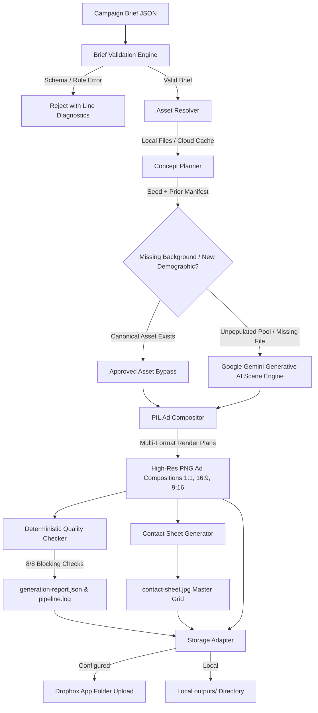

# YETI Los Angeles Multi-Format Creative Ad Generator (2026)

A deterministic creative advertising adaptation engine for YETI's **"Go Anywhere with YETI"** Los Angeles campaign. Built with **FastAPI**, **Pillow (PIL)**, **React 19**, **TypeScript**, and **Vanilla CSS**.

The ad count is dictated entirely by the brief: $\text{audiences} \times \text{concepts per audience} \times 3 \text{ aspect ratios}$ (`1:1` Square, `16:9` Landscape, `9:16` Vertical). The bundled sample briefs produce 18, 36, and 72 ads, but the engine is not bound to those sizes. Every run is deterministic — the same brief and seed reproduce byte-identical output — with locked per-concept assets, consistent typography hierarchy, and automated quality checks.

> **Short pitch:** “Go Anywhere with YETI” is a modular campaign and creative-automation prototype that converts a structured brief and approved brand assets into a quality-controlled family of product, audience, regional, and social-media ad variations.

---

## Campaign Synopsis

**"Go Anywhere with YETI"** is a Los Angeles–focused advertising campaign promoting two YETI cooler products across multiple audiences, locations, product colors, and digital ad formats. It targets young adults, college students, campers, and tailgaters, presenting YETI coolers as durable products that move easily between outdoor recreation and social experiences.

A user submits a structured campaign brief (JSON, spreadsheet, or the web UI) containing products, available colors, audience segments, regional information, approved campaign copy, brand standards, and links to source assets. The system retrieves approved product photography, logos, fonts, colors, lifestyle backgrounds, and messaging from organized storage. If a required lifestyle or hero image is unavailable, the pipeline requests one from a generative-image API using the campaign's art direction and brand constraints, then stores it alongside the campaign assets for review and reuse.

The pipeline builds a variation matrix combining two cooler products, multiple approved product colors, camping/tailgating/beach and other LA environments, audience and demographic variations, Los Angeles–specific messaging, and square/vertical/landscape formats. For each variation it selects the template, places product and background imagery, applies the correct product color, inserts the campaign message, and adds brand elements.

Before an ad is approved it passes automated checks covering logo placement, safe areas, typography, color usage, text contrast, product distortion, image resolution, output dimensions, and required legal copy. Passing ads join the campaign package; failing ads are flagged with a clear reason for human review. Final output includes the approved variations, a visual preview gallery, an asset manifest, and an execution log, organized into predictable campaign folders and backed up to shared storage.

The project demonstrates how a repeatable creative-production system turns one approved campaign direction into a scalable library of localized, audience-specific, product-specific, platform-ready content while preserving brand consistency and human creative oversight.

---

## Assessment Requirement Coverage

| Assessment requirement | Implementation | Result |
| :--- | :--- | :---: |
| **Structured campaign brief** | JSON brief with market, audiences, campaign message, rules, and assets | **Exceeded** |
| **At least two products** | Orange and White cooler SKUs (Roadie 24 & Tundra 45) with distinct colorway packshots and model metadata | **Satisfied** |
| **Reuse existing assets** | Local/Dropbox asset resolver with caching and SHA-256 integrity checks | **Exceeded** |
| **Generate missing assets with GenAI** | Google Gemini background-generation fallback | **Satisfied** |
| **Three aspect ratios** | `1:1`, `16:9`, and `9:16` at exact dimensions | **Satisfied** |
| **Campaign message on ads** | Controlled vector tagline assets and campaign messaging | **Satisfied** |
| **Run locally** | CLI plus a complete React/FastAPI application | **Exceeded** |
| **Organized output folders** | Organized strictly by product and aspect ratio (`products/{product_slug}/{aspect_ratio}/`), plus ZIP and contact sheet | **Satisfied** |
| **README** | Setup, architecture, examples, and limitations | **Exceeded** |
| **Demo video** | Completed and delivered | **Satisfied** |
| **Brand checks** | Eight deterministic blocking checks and asset hashes | **Bonus achieved** |
| **Logging/reporting** | Manifest, JSON report, JSONL log, and provenance | **Bonus achieved** |
| **Legal word checks** | No prohibited-word checker implemented | *Optional; not implemented* |

---

## ⚡ Quickstart: Command Line (CLI)

```bash
# 1. Activate the Python virtual environment
source .venv/bin/activate

# 2. Run the 18-ad baseline campaign with a deterministic seed
python generate_ads.py --brief yeti_la_random_ad_campaign.json --seed 42

# 3. Run the 36-ad campaign (2 concepts per audience)
python generate_ads.py --brief yeti_la_random_ad_campaign_36.json --seed 42

# 4. Run the 72-ad multi-demographic campaign (includes Google Gemini AI scenes)
python generate_ads.py --brief yeti_la_random_ad_campaign_72.json --seed 42
```

The terminal shows live stage progress, validates assets, renders all multi-format PNG adaptations into `outputs/yeti-la-go-anywhere-2026/runs/`, compiles a master contact sheet, runs 8 blocking quality checks, and writes a structured compliance report (`generation-report.json`).

---

## ⚡ Quickstart: Web UI

```bash
# Terminal 1: Python backend API (port 8000)
source .venv/bin/activate
uvicorn backend.app.main:app --port 8000 --host 0.0.0.0 --reload

# Terminal 2: React frontend (port 5173)
npm run --prefix frontend dev -- --port 5173
```

Open **`http://localhost:5173`** in your browser.

---

## Table of Contents
1. [Project & Business Overview](#1-project--business-overview)
2. [Web UI Control Center](#2-web-ui-control-center)
3. [Three Sample-Ad Layout References](#3-three-sample-ad-layout-references)
4. [Architecture Overview](#4-architecture-overview)
5. [18-Ad Baseline vs. 72-Ad Gemini Multi-Demographic Campaign](#5-18-ad-baseline-vs-72-ad-gemini-multi-demographic-campaign)
6. [Campaign Rules Matrix & Demographic Expansion](#6-campaign-rules-matrix--demographic-expansion)
7. [Asset Tree & Asset Resolver](#7-asset-tree--asset-resolver)
8. [JSON Brief Validation Rules](#8-json-brief-validation-rules)
9. [Current & Previous-Run Repeat Protection](#9-current--previous-run-repeat-protection)
10. [Same-Concept Ratio Adaptation](#10-same-concept-ratio-adaptation)
11. [Dropbox Cloud Storage & Configuration](#11-dropbox-cloud-storage--configuration)
12. [Google Gemini AI Scene Generation & Fallback Architecture](#12-google-gemini-ai-scene-generation--fallback-architecture)
13. [Controlled Assets & Human Review Governance](#13-controlled-assets--human-review-governance)
14. [Prerequisites & Fresh-Clone Setup](#14-prerequisites--fresh-clone-setup)
15. [Secret-Free Environment Configuration](#15-secret-free-environment-configuration)
16. [Running the Baseline 18-Ad Campaign](#16-running-the-baseline-18-ad-campaign)
17. [Running the Expanded 72-Ad Gemini AI Campaign](#17-running-the-expanded-72-ad-gemini-ai-campaign)
18. [Automated Test Suite (51 Backend / 3 Frontend)](#18-automated-test-suite-51-backend--3-frontend)
19. [Output Directory Structure & Hierarchy Overview](#19-output-directory-structure--hierarchy-overview)
20. [Architectural Decisions & Tradeoffs](#20-architectural-decisions--tradeoffs)
21. [System Assumptions & Honest Limitations](#21-system-assumptions--honest-limitations)
22. [Production Evolution Roadmap](#22-production-evolution-roadmap)
23. [Under-Three-Minute Evaluator Demo Path](#23-under-three-minute-evaluator-demo-path)

---

## 1. Project & Business Overview

Enterprise campaigns require dozens of creative variations tailored to distinct demographics and placements. Manual production across formats is slow, error-prone, and frequently introduces brand inconsistencies (wrong product targeting, unapproved color contrasts, stretched packshots).

The YETI Ad Generator automates this workflow deterministically:

- **Ingests structured JSON campaign briefs** describing target audiences, regional activities, and creative constraints.
- **Resolves and verifies canonical brand assets** (logos, products, approved background scenes, vector taglines).
- **Applies seeded randomization** to select scenes and taglines while enforcing demographic targeting rules.
- **Brief-driven scale**: output count is $\text{audiences} \times \text{concepts} \times 3 \text{ ratios}$, whatever the brief specifies. Validated first on an 18-ad sample brief ($6 \times 1 \times 3$), then on a 72-ad brief ($12 \times 2 \times 3$) that exercises automated AI scene generation with Google Gemini for demographics with no approved photography.
- **Renders composite ads** across `1:1`, `16:9`, and `9:16` with ratio-specific layout adjustments.
- **Runs 8 blocking quality checks**, builds a master contact sheet, generates compliance reports, and uploads artifacts to cloud storage.

---

## 2. Web UI Control Center

A full interactive web application for creative directors, campaign managers, and marketing teams.

### Stack
- **Frontend**: TypeScript, React 19, Vite, Vanilla CSS (dark mode, glassmorphic styling, responsive layout).
- **Backend**: Python FastAPI (ASGI) with Pillow for composite rendering and the Google GenAI SDK for scene synthesis.

### Features
- **Brief Editor & Schema Validator** — ingests, inspects, and validates brief JSON in the browser with real-time error feedback and syntax highlighting.
- **Dynamic Audience & Matrix Formula** — computes planned output counts from loaded personas ($N \text{ audiences} \times M \text{ concepts} \times 3 \text{ formats} = \text{target ads}$), with age-group distribution and collapsible sections.
- **Asset Readiness & Integrity Monitor** — verifies canonical brand assets on disk and in cloud storage (presence, format, transparency, non-zero size, SHA-256 hash) and shows readiness badges.
- **Storage & AI Status Indicators** — live health for Dropbox storage and Gemini scene generation (active vs. standby).
- **Real-Time Generation Modal** — visualizes pipeline stages (JSON validation, asset resolution, repeat protection, concept selection, rendering, QA verification, storage sync).
- **Campaign Results Gallery** — filterable ad cards grouped by audience with format tabs (`1:1`, `16:9`, `9:16`), full-resolution lightbox, Master Contact Sheet viewer, Compliance Quality Report, ZIP download, and one-click **"Open in Dropbox Folder"**.

---

## 3. Three Sample-Ad Layout References

The compositor uses defined layout configurations per aspect ratio to preserve packshot geometry and maximize visual impact:

```
┌───────────────────────────┐  ┌───────────────────────────────────────┐  ┌───────────────────────────┐
│        [YETI LOGO]        │  │  [YETI LOGO]                           │  │        [YETI LOGO]        │
│                           │  │                                        │  │                           │
│       GO ANYWHERE.        │  │  GO ANYWHERE.      ┌────────────────┐  │  │       GO ANYWHERE.        │
│                           │  │                    │                │  │  │                           │
│     ┌───────────────┐     │  │                    │  YETI COOLER   │  │  │                           │
│     │               │     │  │                    │   PACKSHOT     │  │  │     ┌───────────────┐     │
│     │  YETI COOLER  │     │  │                    │                │  │  │     │               │     │
│     │   PACKSHOT    │     │  │                    └────────────────┘  │  │     │  YETI COOLER  │     │
│     │               │     │  │                                        │  │     │   PACKSHOT    │     │
│     └───────────────┘     │  │                                        │  │     │               │     │
│                           │  │                                        │  │     └───────────────┘     │
└───────────────────────────┘  └───────────────────────────────────────┘  │                           │
     1:1 Square                         16:9 Landscape                │                           │
   (1080 × 1080)                        (1920 × 1080)                 └───────────────────────────┘
                                                                               9:16 Vertical
                                                                               (1080 × 1920)
```

### Layout Specifications

- **1:1 Square (1080×1080)** — Instagram Feed, Facebook Feed, eCommerce tiles.
  - **Logo**: centered, top 6% (width: 220px).
  - **Tagline**: centered, top 20% (width: 480px).
  - **Product**: centered, top 52% (width: 600px).
- **16:9 Landscape (1920×1080)** — YouTube pre-roll, desktop display, connected TV.
  - **Logo**: top-left (left: 8%, top: 10%, width: 240px).
  - **Tagline**: left-aligned beneath logo (left: 8%, top: 26%, lowered 10pt for breathing room, 5% smaller than base).
  - **Product**: right hemisphere (left: 60%, top: 52%, 8% smaller to prevent crowding).
- **9:16 Vertical (1080×1920)** — Instagram Stories, TikTok, YouTube Shorts, Reels.
  - **Logo**: centered, top 6% (width: 240px).
  - **Tagline**: centered, top 18% (3% smaller for vertical balance).
  - **Product**: centered, top: 56%, 10% smaller to respect 250px UI safe zones top and bottom.

---

## 4. Architecture Overview



---

## 5. 18-Ad Baseline vs. 72-Ad Gemini Multi-Demographic Campaign

A core governance rule of this engine is **cross-format concept locking**:

- The `ConceptPlanner` runs seeded randomization **once per audience concept**, not per aspect ratio, selecting one coherent concept: `(Audience + Activity + Scene Background + Product Packshot + Tagline)`.
- The `AdCompositor` adapts that single concept into all three aspect ratios.
- **Why it matters**: a consumer who sees the ad on Stories (`9:16`), Feed (`1:1`), and YouTube (`16:9`) experiences identical product color, environment, and messaging.

### Baseline 18-ad run (`yeti_la_random_ad_campaign.json`)
- 6 audience segments (3 younger, $\le 24$; 3 older, $\ge 25$).
- 1 concept per audience $\times$ 3 formats = **18 ads**.
- Validated compositing math, typography hierarchy, safe zones, and static pre-approved backgrounds (Beach, Tailgate, Camping).

### Expanded 72-ad run (`yeti_la_random_ad_campaign_72.json`)
- 12 audience segments covering traditional and newly added LA outdoor lifestyles.
- 2 concepts per audience $\times$ 3 formats = **72 ads**.
- **Automated background synthesis**: when new demographics introduce activities with no static photography (Hiking in Hollywood Hills/Griffith Park, Surfing in Malibu/South Bay, Fishing in Marina Del Rey, Climbing at Stoney Point), the engine calls the Gemini image model (`gemini-2.5-flash-image` / `imagen-3.0`) to generate photorealistic, brand-guardrailed landscape backgrounds.
- Generated backgrounds are stored with the run, hashed, reused across formats, and flagged for human review.

---

## 6. Campaign Rules Matrix & Demographic Expansion

| Audience ID | Demographic / Territory | Activity | Product | Background Source | Tagline Color | Logo |
| :--- | :--- | :--- | :--- | :--- | :---: | :---: |
| **`P01`** | UCLA Tailgaters (Westwood) | Tailgating | Orange (Roadie 24) | Approved (`Tailgate.jpg`) | White | `logo_white.png` |
| **`P02`** | USC Students (South Central) | Tailgating | Orange (Roadie 24) | Approved (`Tailgate.jpg`) | White | `logo_white.png` |
| **`P03`** | Venice Beach Coastal Goers | Beach | White (Tundra 45) | Approved (`Beach.jpg`) | Black | `logo_white.png` |
| **`P04`** | Santa Monica Boardwalk | Beach | Orange (Roadie 24) | Approved (`Beach.jpg`) | Black | `logo_white.png` |
| **`P05`** | Angeles Crest Campers | Camping | White (Tundra 45) | Approved (`Camping.jpg`) | White | `logo_white.png` |
| **`P06`** | Topanga Canyon Trekkers | Camping | White (Tundra 45) | Approved (`Camping.jpg`) | White | `logo_white.png` |
| **`P07`** *(new)* | Hollywood Hills Trail Hikers | Hiking | Orange (Roadie 24) | Gemini AI scene | White | `logo_white.png` |
| **`P08`** *(new)* | Griffith Park Ridgeline Trekkers | Hiking | White (Tundra 45) | Gemini AI scene | White | `logo_white.png` |
| **`P09`** *(new)* | Malibu Point Dawn Surfers | Surfing | Orange (Roadie 24) | Gemini AI scene | Black | `logo_white.png` |
| **`P10`** *(new)* | South Bay Sunset Surfers | Surfing | White (Tundra 45) | Gemini AI scene | Black | `logo_white.png` |
| **`P11`** *(new)* | Marina Del Rey Anglers | Fishing | Orange (Roadie 24) | Gemini AI scene | White | `logo_white.png` |
| **`P12`** *(new)* | Stoney Point Rock Climbers | Climbing | White (Tundra 45) | Gemini AI scene | White | `logo_white.png` |

---

## 7. Asset Tree & Asset Resolver

```
assets/
├── backgrounds/
│   ├── Beach.jpg              (Approved West Coast beach scene)
│   ├── Camping.jpg            (Approved mountain camping scene)
│   └── Tailgate.jpg           (Approved college tailgate scene)
├── products/
│   ├── product_orange.png     (Official YETI cooler packshot, orange, RGBA)
│   └── product_white.png      (Official YETI cooler packshot, white, RGBA)
├── logos/
│   ├── logo_black.png         (YETI vector wordmark, black, RGBA)
│   └── logo_white.png         (YETI vector wordmark, white, RGBA)
├── taglines/
│   ├── TAGLINE_black.png      (Approved "GO ANYWHERE." vector, black, RGBA)
│   └── TAGLINE_white.png      (Approved "GO ANYWHERE." vector, white, RGBA)
└── fonts/
    └── DejaVuSans-Bold.ttf    (Contact sheet & metric overlay typography)
```

### `AssetResolver` Service
- Validates file presence, dimensions, channel mode (RGB vs RGBA), and SHA-256 integrity.
- Sanitizes paths and blocks directory traversal (`../`).
- Caches remote assets locally when running in Dropbox storage mode.

---

## 8. JSON Brief Validation Rules

Enforced in both backend (`backend/app/services/brief_validator.py`) and frontend (`frontend/src/utils/validation.ts`):

- **Audience count**: at least one audience; the engine derives output count from the brief ($\text{audiences} \times \text{concepts} \times \text{formats}$). The sample briefs use 6 and 12.
- **Format count**: exactly 3 formats (`1:1`, `16:9`, `9:16`).
- **Age range integrity**: ranges cannot span the 24/25 boundary (e.g. 20–30 is rejected).
- **Product color targeting**: younger audiences must target `product_orange.png`; older audiences must target `product_white.png`.
- **Activity → background pool**: Beach → `beach-west-coast`; Camping → `camping-la-mountains`; Tailgating → `tailgating-college-*`. Activities with no approved pool (Hiking, Surfing, Fishing, Climbing) route to Gemini scene generation.
- **Tagline color**: Beach audiences use Black `#000000`; Camping/Tailgating use White `#FFFFFF`.
- **Security**: no absolute system paths or `../` sequences in asset URIs.

---

## 9. Current & Previous-Run Repeat Protection

To avoid creative fatigue across multi-audience campaigns, the `ConceptPlanner` applies:

- **Current-run deduplication** — tracks backgrounds and taglines used within the active run for diverse distribution across audiences.
- **Prior-run manifest protection** — ingests the previous run's `generation-manifest.json` via `priorManifestPath` and deprioritizes assets already used for a given audience category.
- **Pool exhaustion fallback** — if a pool has fewer unique assets than audiences assigned to it (e.g. 2 camping backgrounds for 3 camping audiences), an approved asset is reused with an informational warning rather than failing the run.

---

## 10. Same-Concept Ratio Adaptation

Once an audience concept is selected, the asset bundle is locked:

```python
# Concept locking ensures brand consistency across formats:
concept_id = f"c_{audience_id}_{seed}"
selected_background = "assets/backgrounds/Beach.jpg"
selected_product = "assets/products/product_orange.png"
selected_tagline = "assets/taglines/TAGLINE_black.png"
selected_logo = "assets/logos/logo_white.png"
```

The compositor applies ratio-specific coordinate grids and scaling without altering the scene or product color.

---

## 11. Dropbox Cloud Storage & Configuration

- **Dropbox storage adapter**: `backend/app/services/dropbox_adapter.py`.
- **Scope**: Dropbox App Folder (`/Apps/<YourApp>/yeti-ad-generator/campaigns/`).
- **Token refresh**: automatically refreshes short-lived access tokens when `DROPBOX_REFRESH_TOKEN`, `DROPBOX_APP_KEY`, and `DROPBOX_APP_SECRET` are set in `.env`.
- **Uploaded artifacts**: every PNG adaptation in the run, `contact-sheet.jpg`, `generation-report.json`, `pipeline.log`, and the ZIP package.
- **Local fallback**: if credentials are empty or the network is unavailable, the pipeline runs locally and writes to `./outputs/` without error.

---

## 12. Google Gemini AI Scene Generation & Fallback Architecture

- **Integration**: `backend/app/services/gemini_generator.py`.
- **Dynamic demographic scene generation** — when a brief introduces lifestyles or territories without static assets (Hiking, Surfing, Fishing, Climbing), the engine calls the Gemini image model (`gemini-2.5-flash-image` / `imagen-3.0`) to synthesize commercial lifestyle backgrounds (1408×768 to 2048×2048).
- **Missing asset fallback** — if an approved background referenced in a brief is missing from disk or cloud storage, Gemini synthesizes an on-brand replacement instead of crashing the pipeline.
- **Approved asset bypass** — if an approved background exists for an audience pool, Gemini is skipped to preserve canonical photography.
- **Guardrail prompting** — prompts include negative constraints prohibiting human faces, bodies, logos, coolers, and text, keeping negative space clear for packshots.
- **Procedural fallback** — if no API key is present or quota is exhausted, a procedural atmospheric landscape generator provides an immediate fallback, labeled `mock_fallback` in audit metadata.

---

## 13. Controlled Assets & Human Review Governance

- **Zero packshot distortion** — product packshots and logos keep intact aspect ratios via bicubic resampling.
- **Human review badge** — any adaptation using an AI-generated background is tagged `human_review_required: true` and shown with an orange warning badge in both the JSON report and the UI.
- **Provenance tracking** — every output records its source asset paths and generation seed in `generation-manifest.json`.

---

## 14. Prerequisites & Fresh-Clone Setup

**Prerequisites**: Python 3.12+, Node.js 18+, npm 9+.

```bash
# 1. Clone
git clone https://github.com/cogspa/YETI_AD_GEN.git
cd YETI_AD_GEN

# 2. Python virtual environment
python3 -m venv .venv
source .venv/bin/activate

# 3. Backend dependencies
pip install -r backend/requirements.txt

# 4. Environment template (no secrets required for local execution)
cp .env.example .env

# 5. Frontend dependencies
npm --prefix frontend install

# 6. Backend server (port 8000)
uvicorn backend.app.main:app --port 8000 --host 0.0.0.0 --reload
```

In a separate terminal:

```bash
# 7. Frontend dev server (port 5173)
npm run --prefix frontend dev -- --port 5173
```

Open **`http://localhost:5173`**.

---

## 15. Secret-Free Environment Configuration

`.env.example` contains variable names with safe placeholders only:

```bash
# Server
PORT=8000
HOST=0.0.0.0
CORS_ORIGINS=http://localhost:5173

# AI scene background generation (optional)
GEMINI_API_KEY=
GEMINI_IMAGE_MODEL=gemini-2.5-flash-image
GEMINI_ENABLED=true

# Local storage root
STORAGE_ROOT=./outputs

# Dropbox storage adapter (optional)
DROPBOX_ACCESS_TOKEN=
DROPBOX_REFRESH_TOKEN=
DROPBOX_APP_KEY=
DROPBOX_APP_SECRET=
DROPBOX_CAMPAIGN_ROOT=/yeti-ad-generator
LOCAL_ASSET_CACHE_DIR=./.cache/dropbox-assets
```

No live API keys, Dropbox tokens, or credentials are required to run the full pipeline locally.

---

## 16. Running the Baseline 18-Ad Campaign

### CLI
```bash
source .venv/bin/activate
python generate_ads.py --brief yeti_la_random_ad_campaign.json --seed 42
```

### Web UI
1. Open `http://localhost:5173`.
2. Select `yeti_la_random_ad_campaign.json (18 Ads)` from the brief selector.
3. Click **GENERATE 18 ADS**.
4. Review the 6 audience concepts, inspect the Master Contact Sheet, and download the ZIP package.

---

## 17. Running the Expanded 72-Ad Gemini AI Campaign

### CLI
```bash
source .venv/bin/activate
python generate_ads.py --brief yeti_la_random_ad_campaign_72.json --seed 42
```

### Web UI
1. Open `http://localhost:5173`.
2. Select `yeti_la_random_ad_campaign_72.json (72 Ads - 12 Demographics + Gemini AI)`.
3. Click **GENERATE 72 ADS**.
4. The pipeline synthesizes backgrounds for Hiking, Surfing, Fishing, and Climbing, adapts all 24 concepts across 3 ratios ($24 \times 3 = 72 \text{ ads}$), runs 8 blocking quality checks, compiles a $24 \times 3$ contact sheet, and outputs the ZIP archive.

---

## 18. Automated Test Suite (51 Backend / 3 Frontend)

```bash
# 1. Backend pytest (51 tests)
PYTHONPATH=. .venv/bin/pytest backend/tests/ -v

# 2. Frontend Vitest unit tests
npx --prefix frontend vitest run --dir frontend

# 3. Frontend typecheck & production build
npm run --prefix frontend build

# 4. Frontend lint
npx --prefix frontend oxlint
```

---

## 19. Output Directory Structure & Hierarchy Overview

The output hierarchy has been updated to organize outputs **by product and aspect ratio** across all layers of the system.

### Hierarchy Overview

```
outputs/
└── campaign-id/
    └── runs/
        └── run-id/
            ├── contact-sheet.jpg
            ├── generation-manifest.json
            ├── generation-report.json
            ├── pipeline.log
            ├── [campaign-id]_[run-id]_all_18_ads.zip
            └── products/
                ├── roadie-24-orange/
                │   ├── 1x1/
                │   │   ├── P01_westwood-college_roadie-24-orange_1x1.png
                │   │   └── P04_college-friends-beach-day_roadie-24-orange_1x1.png
                │   ├── 16x9/
                │   │   ├── P01_westwood-college_roadie-24-orange_16x9.png
                │   │   └── P04_college-friends-beach-day_roadie-24-orange_16x9.png
                │   └── 9x16/
                │       ├── P01_westwood-college_roadie-24-orange_9x16.png
                │       └── P04_college-friends-beach-day_roadie-24-orange_9x16.png
                ├── roadie-24-white/
                │   ├── 1x1/
                │   │   ├── P03_westside-recent-graduates_roadie-24-white_1x1.png
                │   │   └── P06_graduate-adventure-campers_roadie-24-white_1x1.png
                │   ├── 16x9/
                │   └── 9x16/
                ├── tundra-45-orange/
                │   ├── 1x1/
                │   │   └── P02_south-central-college_tundra-45-orange_1x1.png
                │   ├── 16x9/
                │   └── 9x16/
                └── tundra-45-white/
                    ├── 1x1/
                    │   └── P05_first-time-family-campers_tundra-45-white_1x1.png
                    ├── 16x9/
                    └── 9x16/
```

---

## 20. Architectural Decisions & Tradeoffs

| Decision | Choice Made | Alternative Considered | Rationale |
| :--- | :--- | :--- | :--- |
| **Image Compositing Engine** | Python Pillow (PIL) | Headless Chrome / Puppeteer | Fast CPU-side rendering, no browser memory overhead, deterministic pixel math. |
| **Layout Math** | Explicit coordinate grids + bicubic scaling | CSS absolute positioning | Exact aspect-ratio retention and alignment independent of browser rendering engines. |
| **Randomization** | Seeded `random.Random(seed)` | Unseeded `Math.random()` | Reproducible campaign batches for regression testing and audit. |
| **Storage** | Dual adapter (Local / Dropbox) | S3 / GCS only | Offline development and zero-dependency evaluator setup, with cloud upload when configured. |
| **CSS** | Vanilla CSS design system | Tailwind CSS | No purge risk, precise control over brand palette and dark mode, no runtime bloat. |

---

## 21. System Assumptions & Honest Limitations

- **No automated trademark detection** — background safety relies on restricting scenes to approved, pre-cleared asset pools, not computer-vision classification.
- **Bounded AI scene generation** — Gemini only generates backgrounds. It never generates packshots, logos, or typography.
- **Mock generator disclosure** — with no Gemini key, fallback scenes come from a procedural renderer flagged `mock_fallback` in audit metadata.
- **Repeat protection on small pools** — if a pool has fewer unique assets than audiences, approved assets are reused with explicit warning logs.
- **No prohibited-word check** — the QA stage does not scan tagline or legal copy against a banned-terms list.
- **Two product SKUs by colorway** — product SKUs (Roadie 24 & Tundra 45) are visually differentiated by official colorway packshots (Orange and White) and model metadata in the brief.

---

## 22. Production Evolution Roadmap

- **Durable job queue** — move synchronous runs to Celery or Temporal with Redis/RabbitMQ for parallel batch execution.
- **Enterprise DAM integration** — connect to Adobe Experience Manager or Bynder via webhooks to ingest newly approved assets.
- **Creative director approval workflow** — Slack/email notifications with interactive approval for AI-flagged adaptations.
- **Prohibited-word & legal copy checker** — add a configurable banned-terms scan and required-disclaimer check to the QA stage.
- **Dynamic localization** — multi-language vector taglines and regional legal disclaimer overlays.
- **Ad network direct export** — push to Meta Marketing API, Google Ads API, and TikTok Creative Center.

---

## 23. Under-Three-Minute Evaluator Demo Path

1. **Clone & Setup Environment**:
   ```bash
   git clone https://github.com/cogspa/YETI_AD_GEN.git && cd YETI_AD_GEN
   python3 -m venv .venv && source .venv/bin/activate && pip install -r backend/requirements.txt
   npm --prefix frontend install
   ```

2. **Run Automated Test Suite (51 Unit Tests)**:
   ```bash
   .venv/bin/pytest backend/tests/ -v
   ```
   *(Verify all 51 backend tests pass in ~45 seconds).*

3. **Choose Your Execution Method**:

   - **Option A: Pure CLI Execution (No servers needed)**:
     ```bash
     source .venv/bin/activate
     # Run 18-Ad Baseline:
     python generate_ads.py --brief yeti_la_random_ad_campaign.json --seed 42

     # Or Run 72-Ad Multi-Demographic Campaign:
     python generate_ads.py --brief yeti_la_random_ad_campaign_72.json --seed 42
     ```

   - **Option B: Web Dashboard UI**:
     ```bash
     # Terminal Tab 1:
     source .venv/bin/activate && uvicorn backend.app.main:app --port 8000 --reload

     # Terminal Tab 2:
     npm run --prefix frontend dev
     ```
     - Open `http://localhost:5173`.
     - Select a brief (`yeti_la_random_ad_campaign.json` or `yeti_la_random_ad_campaign_72.json`).
     - Click **`GENERATE ADS`**.

4. **Verify Outputs**:
   - Inspect output directory: `outputs/yeti-la-go-anywhere-2026/runs/[run-id]/products/` organized by product and aspect ratio (`1x1/`, `16x9/`, `9x16/`).
   - View the master review grid (`contact-sheet.jpg`).
   - Review the deterministic compliance audit (`generation-report.json`).
   - Download the full package ZIP or open the Dropbox backup folder.
