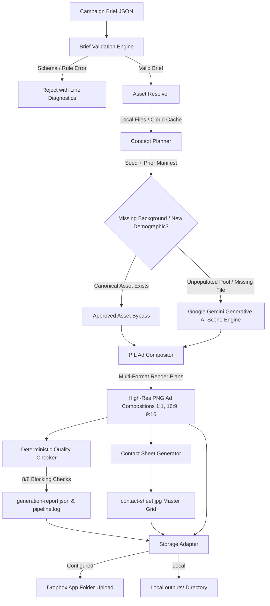

This file is a merged representation of a subset of the codebase, containing files not matching ignore patterns, combined into a single document by Repomix.

# File Summary

## Purpose
This file contains a packed representation of a subset of the repository's contents that is considered the most important context.
It is designed to be easily consumable by AI systems for analysis, code review,
or other automated processes.

## File Format
The content is organized as follows:
1. This summary section
2. Repository information
3. Directory structure
4. Repository files (if enabled)
5. Multiple file entries, each consisting of:
  a. A header with the file path (## File: path/to/file)
  b. The full contents of the file in a code block

## Usage Guidelines
- This file should be treated as read-only. Any changes should be made to the
  original repository files, not this packed version.
- When processing this file, use the file path to distinguish
  between different files in the repository.
- Be aware that this file may contain sensitive information. Handle it with
  the same level of security as you would the original repository.

## Notes
- Some files may have been excluded based on .gitignore rules and Repomix's configuration
- Binary files are not included in this packed representation. Please refer to the Repository Structure section for a complete list of file paths, including binary files
- Files matching these patterns are excluded: repomix-output.*, outputs/**, ad_examples/**, *.psd, *.webp
- Files matching patterns in .gitignore are excluded
- Files matching default ignore patterns are excluded
- Files are sorted by Git change count (files with more changes are at the bottom)

# Directory Structure
```
assets/
  brand/
    Yeti_Logo_0.svg
    Yeti_Logo_3.svg
backend/
  app/
    models/
      assets.py
      brief.py
      generation.py
      layout.py
      pipeline.py
      plan.py
      report.py
    services/
      storage/
        __init__.py
        base.py
        dropbox_adapter.py
        local.py
      asset_resolver.py
      brief_validator.py
      compositor.py
      concept_planner.py
      contact_sheet.py
      gemini_generator.py
      pipeline_runner.py
      quality_checker.py
    __init__.py
    main.py
  tests/
    __init__.py
    test_asset_resolver.py
    test_brief_validation.py
    test_compositor.py
    test_concept_planner.py
    test_gemini_generator.py
    test_pipeline.py
    test_quality_checker.py
    test_storage_adapter.py
  __init__.py
  requirements.txt
frontend/
  public/
    assets/
      brand/
        Yeti_Logo_0.svg
        Yeti_Logo_3.svg
    samples/
      yeti-la-go-anywhere-2026.json
      yeti-la-summer-2026.json
    favicon.svg
    icons.svg
  src/
    assets/
      react.svg
      vite.svg
    components/
      AssetReadiness.tsx
      BriefUploadSection.tsx
      CampaignResultsView.tsx
      CampaignSummary.tsx
      ContactSheetModal.tsx
      GenerateAction.tsx
      GenerationProgressModal.tsx
      Header.tsx
      IntegrationStatus.tsx
      LightboxModal.tsx
      QualityReportModal.tsx
    data/
      sampleBriefs.ts
    services/
      api.ts
    test/
      setup.ts
    types/
      campaign.ts
    utils/
      validation.ts
    App.css
    App.test.tsx
    App.tsx
    index.css
    main.tsx
  .gitignore
  .oxlintrc.json
  index.html
  package.json
  README.md
  tsconfig.app.json
  tsconfig.json
  tsconfig.node.json
  vite.config.ts
  vitest.config.ts
scripts/
  get_dropbox_refresh_token.py
.env.example
.gitignore
generate_ads.py
netlify.toml
QA_RESULTS.md
README.md
yeti_la_random_ad_campaign_36.json
yeti_la_random_ad_campaign_72.json
yeti_la_random_ad_campaign.json
```

# Files

## File: assets/brand/Yeti_Logo_0.svg
````
<svg xmlns="http://www.w3.org/2000/svg" id="Group_275" width="106" height="29" viewBox="0 0 106 29">
    <defs>
        <clipPath id="clip-path">
            <path id="Path_86" d="M0-563.206h10.085l5.926 9.779 5.932-9.779h10.03l-11.423 16.85v12.15h-9.1v-12.15L0-563.206" class="cls-1" transform="translate(0 563.206)"/>
        </clipPath>
        <clipPath id="clip-path-2">
            <path id="Path_85" fill="#fff" d="M0-534.959h106.008V-564H0z" transform="translate(0 564)"/>
        </clipPath>
        <clipPath id="clip-path-3">
            <path id="Path_89" d="M652.07-563.206h24.336v7.146h-15.233v4.133h13.293v6.536h-13.29v4.133h15.671v7.053h-24.774v-29" class="cls-1" transform="translate(-652.07 563.206)"/>
        </clipPath>
        <clipPath id="clip-path-5">
            <path id="Path_92" d="M1184.86-563.206h27.6v7.144h-9.26v21.853h-9.083v-21.85h-9.26v-7.15" class="cls-1" transform="translate(-1184.86 563.206)"/>
        </clipPath>
        <clipPath id="clip-path-7">
            <path id="Path_95" d="M1776.61-563.206h9.1v29h-9.1l-.006-29" class="cls-1" transform="translate(-1776.61 563.206)"/>
        </clipPath>
        <clipPath id="clip-path-9">
            <path id="Path_98" fill="#00263c" d="M1973.424-558.4c.063 0 .122 0 .178-.008a.477.477 0 0 0 .149-.037.249.249 0 0 0 .106-.088.3.3 0 0 0 .04-.161.243.243 0 0 0-.035-.14.2.2 0 0 0-.089-.077.394.394 0 0 0-.127-.037 1.153 1.153 0 0 0-.141-.007l-.369.007v.553zm.129-.776a.737.737 0 0 1 .471.115.438.438 0 0 1 .151.372.435.435 0 0 1-.137.348.63.63 0 0 1-.336.136l.506.759-.3.006-.482-.74-.3.006v.749h-.278l.011-1.741zm-1.273 1.4a1.189 1.189 0 0 0 .264.4 1.188 1.188 0 0 0 .4.262 1.263 1.263 0 0 0 .5.088 1.3 1.3 0 0 0 .5-.106 1.286 1.286 0 0 0 .4-.277 1.291 1.291 0 0 0 .268-.41 1.35 1.35 0 0 0 .1-.511 1.3 1.3 0 0 0-.094-.5 1.2 1.2 0 0 0-.261-.4 1.23 1.23 0 0 0-.4-.26 1.223 1.223 0 0 0-.494-.087 1.264 1.264 0 0 0-.5.108 1.3 1.3 0 0 0-.4.274 1.261 1.261 0 0 0-.269.406 1.323 1.323 0 0 0-.1.5 1.329 1.329 0 0 0 .086.512zm-.245-1.09a1.586 1.586 0 0 1 .338-.477 1.624 1.624 0 0 1 .494-.322 1.6 1.6 0 0 1 .6-.126 1.563 1.563 0 0 1 .593.1 1.512 1.512 0 0 1 .485.3 1.454 1.454 0 0 1 .328.464 1.393 1.393 0 0 1 .118.584 1.472 1.472 0 0 1-.126.6 1.59 1.59 0 0 1-.334.48 1.528 1.528 0 0 1-.491.321 1.6 1.6 0 0 1-.593.124 1.591 1.591 0 0 1-.593-.1 1.449 1.449 0 0 1-.49-.3 1.444 1.444 0 0 1-.331-.467 1.45 1.45 0 0 1-.118-.594 1.442 1.442 0 0 1 .126-.588z" clip-rule="evenodd" transform="translate(-1971.91 559.792)"/>
        </clipPath>
        <clipPath id="clip-path-10">
            <path id="Path_97" d="M0-534.959h106.008V-564H0z" class="cls-4" transform="translate(0 564)"/>
        </clipPath>
        <style>
            .cls-1{fill:#fff;clip-rule:evenodd}.cls-4{fill:#00263c}.cls-6{clip-path:url(#clip-path-2)}
        </style>
    </defs>
    <g id="Group_276" clip-path="url(#clip-path)">
        <g id="Group_275-2" class="cls-6" transform="translate(0 -.041)">
            <path id="Path_84" d="M-5-568.206h32.495v29.515H-5z" class="cls-4" transform="translate(4.739 567.989)"/>
        </g>
    </g>
    <g id="Group_278" clip-path="url(#clip-path-3)" transform="translate(34.035)">
        <g id="Group_277" class="cls-6" transform="translate(-34.035 -.041)">
            <path id="Path_87" d="M647.07-568.206h25.3v29.515h-25.3z" class="cls-4" transform="translate(-613.296 567.989)"/>
        </g>
    </g>
    <g id="Group_280" clip-path="url(#clip-path-5)" transform="translate(61.844)">
        <g id="Group_279" class="cls-6" transform="translate(-61.844 -.041)">
            <path id="Path_90" d="M1179.86-568.206h28.126v29.515h-28.126z" class="cls-4" transform="translate(-1118.277 567.989)"/>
        </g>
    </g>
    <g id="Group_282" clip-path="url(#clip-path-7)" transform="translate(92.73)">
        <g id="Group_281" class="cls-6" transform="translate(-92.73 -.041)">
            <path id="Path_93" d="M1771.61-568.206h9.626v29.515h-9.626z" class="cls-4" transform="translate(-1679.14 567.989)"/>
        </g>
    </g>
    <g id="Group_284" clip-path="url(#clip-path-9)" transform="translate(102.924 .176)">
        <g id="Group_283" clip-path="url(#clip-path-10)" transform="translate(-102.924 -.217)">
            <path id="Path_96" d="M1966.91-564.792h3.6v3.494h-3.6z" class="cls-4" transform="translate(-1864.247 564.751)"/>
        </g>
    </g>
</svg>
````

## File: assets/brand/Yeti_Logo_3.svg
````
<svg xmlns="http://www.w3.org/2000/svg" id="Group_275" width="106" height="29" viewBox="0 0 106 29">
    <defs>
        <clipPath id="clip-path">
            <path id="Path_86" d="M0-563.206h10.085l5.926 9.779 5.932-9.779h10.03l-11.423 16.85v12.15h-9.1v-12.15L0-563.206" class="cls-1" transform="translate(0 563.206)"/>
        </clipPath>
        <clipPath id="clip-path-2">
            <path id="Path_85" fill="#fff" d="M0-534.959h106.008V-564H0z" transform="translate(0 564)"/>
        </clipPath>
        <clipPath id="clip-path-3">
            <path id="Path_89" d="M652.07-563.206h24.336v7.146h-15.233v4.133h13.293v6.536h-13.29v4.133h15.671v7.053h-24.774v-29" class="cls-1" transform="translate(-652.07 563.206)"/>
        </clipPath>
        <clipPath id="clip-path-5">
            <path id="Path_92" d="M1184.86-563.206h27.6v7.144h-9.26v21.853h-9.083v-21.85h-9.26v-7.15" class="cls-1" transform="translate(-1184.86 563.206)"/>
        </clipPath>
        <clipPath id="clip-path-7">
            <path id="Path_95" d="M1776.61-563.206h9.1v29h-9.1l-.006-29" class="cls-1" transform="translate(-1776.61 563.206)"/>
        </clipPath>
        <clipPath id="clip-path-9">
            <path id="Path_98" fill="#00263c" d="M1973.424-558.4c.063 0 .122 0 .178-.008a.477.477 0 0 0 .149-.037.249.249 0 0 0 .106-.088.3.3 0 0 0 .04-.161.243.243 0 0 0-.035-.14.2.2 0 0 0-.089-.077.394.394 0 0 0-.127-.037 1.153 1.153 0 0 0-.141-.007l-.369.007v.553zm.129-.776a.737.737 0 0 1 .471.115.438.438 0 0 1 .151.372.435.435 0 0 1-.137.348.63.63 0 0 1-.336.136l.506.759-.3.006-.482-.74-.3.006v.749h-.278l.011-1.741zm-1.273 1.4a1.189 1.189 0 0 0 .264.4 1.188 1.188 0 0 0 .4.262 1.263 1.263 0 0 0 .5.088 1.3 1.3 0 0 0 .5-.106 1.286 1.286 0 0 0 .4-.277 1.291 1.291 0 0 0 .268-.41 1.35 1.35 0 0 0 .1-.511 1.3 1.3 0 0 0-.094-.5 1.2 1.2 0 0 0-.261-.4 1.23 1.23 0 0 0-.4-.26 1.223 1.223 0 0 0-.494-.087 1.264 1.264 0 0 0-.5.108 1.3 1.3 0 0 0-.4.274 1.261 1.261 0 0 0-.269.406 1.323 1.323 0 0 0-.1.5 1.329 1.329 0 0 0 .086.512zm-.245-1.09a1.586 1.586 0 0 1 .338-.477 1.624 1.624 0 0 1 .494-.322 1.6 1.6 0 0 1 .6-.126 1.563 1.563 0 0 1 .593.1 1.512 1.512 0 0 1 .485.3 1.454 1.454 0 0 1 .328.464 1.393 1.393 0 0 1 .118.584 1.472 1.472 0 0 1-.126.6 1.59 1.59 0 0 1-.334.48 1.528 1.528 0 0 1-.491.321 1.6 1.6 0 0 1-.593.124 1.591 1.591 0 0 1-.593-.1 1.449 1.449 0 0 1-.49-.3 1.444 1.444 0 0 1-.331-.467 1.45 1.45 0 0 1-.118-.594 1.442 1.442 0 0 1 .126-.588z" clip-rule="evenodd" transform="translate(-1971.91 559.792)"/>
        </clipPath>
        <clipPath id="clip-path-10">
            <path id="Path_97" d="M0-534.959h106.008V-564H0z" class="cls-4" transform="translate(0 564)"/>
        </clipPath>
        <style>
            .cls-1{fill:#fff;clip-rule:evenodd}.cls-4{fill:#fff}.cls-6{clip-path:url(#clip-path-2)}
        </style>
    </defs>
    <g id="Group_276" clip-path="url(#clip-path)">
        <g id="Group_275-2" class="cls-6" transform="translate(0 -.041)">
            <path id="Path_84" d="M-5-568.206h32.495v29.515H-5z" class="cls-4" transform="translate(4.739 567.989)"/>
        </g>
    </g>
    <g id="Group_278" clip-path="url(#clip-path-3)" transform="translate(34.035)">
        <g id="Group_277" class="cls-6" transform="translate(-34.035 -.041)">
            <path id="Path_87" d="M647.07-568.206h25.3v29.515h-25.3z" class="cls-4" transform="translate(-613.296 567.989)"/>
        </g>
    </g>
    <g id="Group_280" clip-path="url(#clip-path-5)" transform="translate(61.844)">
        <g id="Group_279" class="cls-6" transform="translate(-61.844 -.041)">
            <path id="Path_90" d="M1179.86-568.206h28.126v29.515h-28.126z" class="cls-4" transform="translate(-1118.277 567.989)"/>
        </g>
    </g>
    <g id="Group_282" clip-path="url(#clip-path-7)" transform="translate(92.73)">
        <g id="Group_281" class="cls-6" transform="translate(-92.73 -.041)">
            <path id="Path_93" d="M1771.61-568.206h9.626v29.515h-9.626z" class="cls-4" transform="translate(-1679.14 567.989)"/>
        </g>
    </g>
    <g id="Group_284" clip-path="url(#clip-path-9)" transform="translate(102.924 .176)">
        <g id="Group_283" clip-path="url(#clip-path-10)" transform="translate(-102.924 -.217)">
            <path id="Path_96" d="M1966.91-564.792h3.6v3.494h-3.6z" class="cls-4" transform="translate(-1864.247 564.751)"/>
        </g>
    </g>
</svg>
````

## File: backend/app/models/assets.py
````python
"""Pydantic models for Asset Catalog and Path Resolution."""

from typing import Optional, Tuple, Literal, List, Dict
from pydantic import BaseModel, Field


AssetRole = Literal[
    "product_orange",
    "product_white",
    "background_beach",
    "background_camping",
    "background_tailgating",
    "tagline_black",
    "tagline_white",
    "brand_logo",
    "font_regular",
    "font_bold",
    "layout_reference_1x1",
    "layout_reference_16x9",
    "layout_reference_9x16",
]

AssetStatus = Literal[
    "local",
    "cached_from_dropbox",
    "dropbox_available",
    "missing_gemini_eligible",
    "missing_blocking",
]


class ResolvedAssetInfo(BaseModel):
    role: str
    logical_id: str
    resolved_path: str
    status: AssetStatus
    format_type: Optional[str] = None  # e.g., "PNG", "JPEG", "TTF", "SVG"
    dimensions: Optional[Tuple[int, int]] = None  # (width, height)
    has_alpha: bool = False
    size_bytes: int = 0
    sha256_hash: Optional[str] = None
    is_blocking: bool = False
    error_message: Optional[str] = None


class AssetReadinessReport(BaseModel):
    is_ready_to_generate: bool
    blocking_missing_count: int
    gemini_eligible_missing_count: int
    assets: Dict[str, ResolvedAssetInfo]
    summary_messages: List[str]
````

## File: backend/app/models/generation.py
````python
"""Pydantic models for AI Scene Generation and Provenance Metadata."""

from typing import Optional, Tuple, Literal
from pydantic import BaseModel, Field
from datetime import datetime, timezone


class GeneratedBackgroundMetadata(BaseModel):
    """Provenance and review metadata for an AI-generated or mock-generated scene background."""
    background_id: str
    activity: str
    territory: str
    prompt: str
    negative_prompt: str
    model_used: str
    duration_ms: int
    dimensions: Tuple[int, int] = (2048, 2048)
    ai_generated_background: bool = True
    human_review_required: bool = True
    provenance: Literal["google-genai", "mock-generator"] = "google-genai"
    is_mock: bool = False
    generated_at: str = Field(default_factory=lambda: datetime.now(timezone.utc).isoformat())
    local_path: str
    remote_storage_path: Optional[str] = None


class GenerationRequest(BaseModel):
    """Request payload to generate a missing background variation."""
    activity: Literal["beach", "camping", "tailgating"]
    territory: Optional[str] = None
    aspect_ratio: Literal["1:1", "16:9", "9:16"] = "1:1"
    custom_prompt_suffix: Optional[str] = None
    force_mock: bool = False
````

## File: backend/app/models/report.py
````python
"""Pydantic models for Deterministic Quality Checks and Run Reports (Step 10)."""

from typing import List, Dict, Optional, Tuple, Literal, Any
from pydantic import BaseModel, Field
from datetime import datetime, timezone


class CheckResult(BaseModel):
    """Result of a single deterministic quality check rule."""
    check_id: str
    check_name: str
    category: Literal["blocking", "warning", "heuristic"]
    passed: bool
    details: str
    metrics: Optional[Dict[str, Any]] = None


class AudienceAudit(BaseModel):
    """Detailed audit per audience concept and its format renderings."""
    audience_id: str
    audience_name: str
    age_band: str
    activity: str
    territory: str
    product_role: str
    product_hash: str
    background_path: str
    tagline_text: str
    tagline_color: str
    contrast_score: float
    busyness_score: float
    safe_area_passed: bool
    aspect_ratio_preserved: bool
    provenance: str
    human_review_required: bool


class QualityReport(BaseModel):
    """Deterministic Quality Assurance & Compliance Report."""
    report_id: str
    campaign_id: str
    campaign_name: str
    run_id: str
    seed: int
    generated_at: str = Field(default_factory=lambda: datetime.now(timezone.utc).isoformat())
    status: Literal["passed", "passed_with_warnings", "failed"]
    total_checks_run: int
    blocking_checks_passed: int
    blocking_checks_total: int
    warning_count: int
    checks: List[CheckResult]
    audience_audits: List[AudienceAudit]
    warnings: List[str]
    errors: List[str]
    provenance_summary: str
    storage_mode: str
````

## File: backend/app/services/brief_validator.py
````python
"""Brief validation service using CampaignBriefModel."""

import json
from typing import Dict, Any, Tuple, List, Optional
from pydantic import ValidationError
from backend.app.models.brief import CampaignBriefModel


def validate_brief_dict(data: Dict[str, Any]) -> Tuple[bool, Optional[CampaignBriefModel], List[str]]:
    """
    Validate a brief dictionary against the strict CampaignBriefModel contract.
    Returns:
        (is_valid, validated_model_or_none, error_messages_list)
    """
    try:
        model = CampaignBriefModel.model_validate(data)
        return True, model, []
    except ValidationError as e:
        errors = []
        for err in e.errors():
            loc = " -> ".join(str(p) for p in err["loc"])
            msg = err["msg"]
            errors.append(f"[{loc}] {msg}")
        return False, None, errors
    except Exception as ex:
        return False, None, [f"Unexpected error validating brief: {str(ex)}"]


def validate_brief_json_file(file_path: str) -> Tuple[bool, Optional[CampaignBriefModel], List[str]]:
    """Validate a JSON file path."""
    try:
        with open(file_path, "r", encoding="utf-8") as f:
            data = json.load(f)
        return validate_brief_dict(data)
    except json.JSONDecodeError as jde:
        return False, None, [f"Invalid JSON file format: {jde.msg} at line {jde.lineno}, col {jde.colno}"]
    except Exception as ex:
        return False, None, [f"Failed to read file {file_path}: {str(ex)}"]
````

## File: backend/app/services/contact_sheet.py
````python
"""Contact Sheet Generator for YETI Ad Campaigns."""

import os
from pathlib import Path
from typing import List, Dict, Tuple, Optional
from PIL import Image, ImageDraw, ImageFont

from backend.app.models.pipeline import GeneratedAdArtifact
from backend.app.models.plan import AudienceConcept


def generate_campaign_contact_sheet(
    campaign_name: str,
    run_id: str,
    seed: int,
    concepts: List[AudienceConcept],
    ads: List[GeneratedAdArtifact],
    output_path: str,
    font_path: str = "assets/fonts/DejaVuSans-Bold.ttf",
) -> str:
    """
    Generate a high-res, beautifully structured contact sheet (6 Audience Rows × 3 Format Columns).
    """
    # Grid Dimensions
    CELL_WIDTH = 480
    CELL_HEIGHT = 480
    HEADER_HEIGHT = 160
    ROW_LABEL_WIDTH = 280
    PADDING = 24
    COLS = 3  # 1:1, 16:9, 9:16
    ROWS = len(concepts)  # 6 Audiences

    TOTAL_WIDTH = ROW_LABEL_WIDTH + (COLS * (CELL_WIDTH + PADDING)) + PADDING * 2
    TOTAL_HEIGHT = HEADER_HEIGHT + (ROWS * (CELL_HEIGHT + PADDING)) + PADDING * 2

    canvas = Image.new("RGB", (TOTAL_WIDTH, TOTAL_HEIGHT), (15, 23, 30))  # Dark Slate YETI background
    draw = ImageDraw.Draw(canvas)

    # Fonts
    try:
        font_title = ImageFont.truetype(font_path, 32)
        font_sub = ImageFont.truetype(font_path, 16)
        font_label = ImageFont.truetype(font_path, 14)
        font_small = ImageFont.truetype(font_path, 12)
    except Exception:
        font_title = font_sub = font_label = font_small = ImageFont.load_default()

    # 1. Header Banner
    draw.rectangle([0, 0, TOTAL_WIDTH, HEADER_HEIGHT], fill=(10, 16, 22))
    draw.text((PADDING, 28), "YETI", font=font_title, fill=(255, 255, 255))
    draw.text((PADDING + 100, 32), f"|  {campaign_name.upper()}  —  CONTACT SHEET", font=font_title, fill=(0, 210, 255))
    draw.text(
        (PADDING, 85),
        f"RUN ID: {run_id}    |    SEED: {seed}    |    6 AUDIENCES × 3 FORMATS = 18 OUTPUTS",
        font=font_sub,
        fill=(160, 180, 200),
    )

    # Column Headers (1:1 Square, 16:9 Landscape, 9:16 Story)
    col_titles = ["1:1 SQUARE (1080×1080)", "16:9 LANDSCAPE (1920×1080)", "9:16 VERTICAL (1080×1920)"]
    for c_idx, title in enumerate(col_titles):
        col_x = ROW_LABEL_WIDTH + PADDING + c_idx * (CELL_WIDTH + PADDING)
        draw.text((col_x + 10, HEADER_HEIGHT - 32), title, font=font_label, fill=(0, 210, 255))

    # Map ads by (audience_id, aspect_ratio)
    ad_map: Dict[Tuple[str, str], GeneratedAdArtifact] = {
        (ad.audience_id, ad.aspect_ratio): ad for ad in ads
    }

    # 2. Draw Audience Rows
    curr_y = HEADER_HEIGHT + PADDING
    for r_idx, concept in enumerate(concepts):
        # Row background card for audience info
        row_rect = [
            PADDING,
            curr_y,
            ROW_LABEL_WIDTH - PADDING // 2,
            curr_y + CELL_HEIGHT,
        ]
        draw.rectangle(row_rect, fill=(20, 30, 40), outline=(35, 50, 65), width=1)

        # Row Text Labels
        aud_text_y = curr_y + 24
        draw.text((PADDING + 16, aud_text_y), f"AUDIENCE {concept.audience_id}", font=font_sub, fill=(0, 210, 255))
        aud_text_y += 28
        draw.text((PADDING + 16, aud_text_y), concept.audience_name[:24], font=font_label, fill=(255, 255, 255))
        aud_text_y += 32

        # Metadata bullets
        draw.text((PADDING + 16, aud_text_y), f"Age: {concept.age_band.upper()}", font=font_small, fill=(180, 195, 210))
        aud_text_y += 22
        draw.text((PADDING + 16, aud_text_y), f"Activity: {concept.activity.title()}", font=font_small, fill=(180, 195, 210))
        aud_text_y += 22
        draw.text((PADDING + 16, aud_text_y), f"Territory: {concept.territory}", font=font_small, fill=(180, 195, 210))
        aud_text_y += 22
        prod_color_text = "Orange Cooler" if "orange" in concept.product_role else "White Cooler"
        draw.text((PADDING + 16, aud_text_y), f"Product: {prod_color_text}", font=font_small, fill=(255, 170, 0) if "orange" in concept.product_role else (230, 240, 255))
        aud_text_y += 22
        draw.text((PADDING + 16, aud_text_y), f"Tagline: {concept.selected_tagline_text}", font=font_small, fill=(140, 160, 180))

        # 3. Draw Format Thumbnails for this Audience
        for c_idx, ratio in enumerate(["1:1", "16:9", "9:16"]):
            cell_x = ROW_LABEL_WIDTH + PADDING + c_idx * (CELL_WIDTH + PADDING)
            cell_y = curr_y

            # Cell Card
            draw.rectangle([cell_x, cell_y, cell_x + CELL_WIDTH, cell_y + CELL_HEIGHT], fill=(8, 12, 16), outline=(30, 42, 55), width=1)

            ad_item = ad_map.get((concept.audience_id, ratio))
            if ad_item and os.path.exists(ad_item.local_path):
                try:
                    with Image.open(ad_item.local_path) as ad_img:
                        # Scale to fit inside cell with inner padding
                        inner_max_w = CELL_WIDTH - 20
                        inner_max_h = CELL_HEIGHT - 20
                        scale = min(inner_max_w / ad_img.width, inner_max_h / ad_img.height)
                        thumb_w = int(ad_img.width * scale)
                        thumb_h = int(ad_img.height * scale)
                        thumb = ad_img.resize((thumb_w, thumb_h), Image.Resampling.LANCZOS).convert("RGB")

                        paste_x = cell_x + (CELL_WIDTH - thumb_w) // 2
                        paste_y = cell_y + (CELL_HEIGHT - thumb_h) // 2
                        canvas.paste(thumb, (paste_x, paste_y))
                except Exception as e:
                    draw.text((cell_x + 20, cell_y + CELL_HEIGHT // 2), f"Load Error: {e}", fill=(255, 100, 100))
            else:
                draw.text((cell_x + 40, cell_y + CELL_HEIGHT // 2), "Output Pending", fill=(100, 120, 140))

        curr_y += CELL_HEIGHT + PADDING

    # Save to disk
    out_path = Path(output_path).resolve()
    out_path.parent.mkdir(parents=True, exist_ok=True)
    canvas.save(out_path, format="JPEG", quality=92)
    return str(out_path)
````

## File: backend/app/__init__.py
````python
"""Backend Application Package"""
__version__ = "1.0.0"
````

## File: backend/tests/__init__.py
````python
"""Tests package"""
````

## File: backend/tests/test_compositor.py
````python
"""Tests for AdCompositor and Layout Configuration."""

import os
import pytest
from pathlib import Path
from PIL import Image

from backend.app.models.layout import LAYOUT_CONFIGS
from backend.app.services.compositor import AdCompositor
from backend.app.services.asset_resolver import AssetResolver


@pytest.fixture
def compositor():
    return AdCompositor(font_path="assets/fonts/DejaVuSans-Bold.ttf")


@pytest.fixture
def resolver():
    return AssetResolver()


def test_layout_configs_stability():
    """Verify all 3 required aspect ratios are present with valid normalized bounds."""
    for ratio in ["1:1", "16:9", "9:16"]:
        assert ratio in LAYOUT_CONFIGS
        cfg = LAYOUT_CONFIGS[ratio]
        assert cfg.canvas_width > 0
        assert cfg.canvas_height > 0
        assert 0.0 < cfg.safe_margin_x_pct < 0.2
        assert 0.0 < cfg.safe_margin_y_pct < 0.2
        assert 0.0 < cfg.product_region.max_width_pct <= 1.0
        assert 0.0 < cfg.logo_region.max_width_pct <= 1.0
        assert 0.0 < cfg.tagline_region.max_width_pct <= 1.0


def test_composition_exact_dimensions(compositor, resolver):
    """Confirm composited output matches exact target dimensions for 1:1, 16:9, and 9:16."""
    bg = Image.open(resolver.resolve_role("background_beach").resolved_path)
    prod = Image.open(resolver.resolve_role("product_orange").resolved_path)
    tag = Image.open(resolver.resolve_role("tagline_black").resolved_path)
    logo = Image.open(resolver.resolve_role("brand_logo").resolved_path)

    expected_sizes = {
        "1:1": (1080, 1080),
        "16:9": (1920, 1080),
        "9:16": (1080, 1920),
    }

    for ratio, expected_dim in expected_sizes.items():
        ad_img = compositor.compose_ad(
            background_img=bg,
            product_img=prod,
            tagline_asset_or_text=tag,
            logo_img=logo,
            aspect_ratio=ratio,
        )
        assert ad_img.size == expected_dim, f"Ratio {ratio} returned {ad_img.size}, expected {expected_dim}"
        assert ad_img.mode in ("RGB", "RGBA")


def test_composition_preserves_product_aspect_ratio(compositor, resolver):
    """Confirm product packshot aspect ratio is preserved during scaling."""
    prod = Image.open(resolver.resolve_role("product_orange").resolved_path)
    orig_ratio = prod.width / prod.height

    # Using fit_within_region helper
    from backend.app.services.compositor import fit_within_region
    scaled_img, nw, nh = fit_within_region(prod, 500, 300)
    scaled_ratio = nw / nh
    assert abs(orig_ratio - scaled_ratio) < 0.02


def test_activity_tagline_color_rendering(compositor, resolver):
    """Test Beach with black copy and Camping/Tailgate with white copy."""
    bg_beach = Image.open(resolver.resolve_role("background_beach").resolved_path)
    bg_camp = Image.open(resolver.resolve_role("background_camping").resolved_path)
    prod_orange = Image.open(resolver.resolve_role("product_orange").resolved_path)
    prod_white = Image.open(resolver.resolve_role("product_white").resolved_path)
    logo = Image.open(resolver.resolve_role("brand_logo").resolved_path)

    # 1. Beach with programmatic black text
    beach_ad = compositor.compose_ad(
        background_img=bg_beach,
        product_img=prod_orange,
        tagline_asset_or_text="Go West.\nStay Cold.",
        logo_img=logo,
        aspect_ratio="1:1",
        tagline_color_hex="#000000",
    )
    assert beach_ad.size == (1080, 1080)

    # 2. Camping with programmatic white text
    camp_ad = compositor.compose_ad(
        background_img=bg_camp,
        product_img=prod_white,
        tagline_asset_or_text="Go Higher.\nStay Colder.",
        logo_img=logo,
        aspect_ratio="1:1",
        tagline_color_hex="#FFFFFF",
    )
    assert camp_ad.size == (1080, 1080)


def test_render_fixture_all_ratios_to_outputs(compositor, resolver):
    """Render test fixture in all three ratios and save to outputs/test_fixtures/."""
    out_dir = Path("outputs/test_fixtures")
    out_dir.mkdir(parents=True, exist_ok=True)

    bg = Image.open(resolver.resolve_role("background_tailgating").resolved_path)
    prod = Image.open(resolver.resolve_role("product_orange").resolved_path)
    tag = Image.open(resolver.resolve_role("tagline_white").resolved_path)
    logo = Image.open(resolver.resolve_role("brand_logo").resolved_path)

    for ratio in ["1:1", "16:9", "9:16"]:
        clean_tag = ratio.replace(":", "x")
        # Render clean final
        final_img = compositor.compose_ad(
            background_img=bg,
            product_img=prod,
            tagline_asset_or_text=tag,
            logo_img=logo,
            aspect_ratio=ratio,
            draw_debug_overlay=False,
        )
        final_path = out_dir / f"fixture_{clean_tag}.png"
        final_img.save(final_path, format="PNG")
        assert final_path.exists()
        assert final_path.stat().st_size > 0

        # Render debug overlay version
        debug_img = compositor.compose_ad(
            background_img=bg,
            product_img=prod,
            tagline_asset_or_text=tag,
            logo_img=logo,
            aspect_ratio=ratio,
            draw_debug_overlay=True,
        )
        debug_path = out_dir / f"fixture_{clean_tag}_debug.png"
        debug_img.save(debug_path, format="PNG")
        assert debug_path.exists()
````

## File: backend/tests/test_gemini_generator.py
````python
"""Tests for GeminiBackgroundGenerator and MockBackgroundGenerator (Prompt 7)."""

import os
import pytest
from pathlib import Path
from unittest.mock import MagicMock, patch
from PIL import Image

from backend.app.services.gemini_generator import (
    GeminiBackgroundGenerator,
    MockBackgroundGenerator,
    NEGATIVE_PROMPT_DEFAULT,
)
from backend.app.services.asset_resolver import AssetResolver
from backend.app.services.storage.local import LocalStorageAdapter


@pytest.fixture
def local_storage(tmp_path):
    return LocalStorageAdapter(root_dir=str(tmp_path / "storage"))


@pytest.fixture
def generator(local_storage, tmp_path):
    return GeminiBackgroundGenerator(
        api_key="mock_gemini_key",
        model_name="imagen-3.0-generate-002",
        storage_adapter=local_storage,
        local_output_dir=str(tmp_path / "gen_bg"),
    )


def test_guardrail_prompt_construction(generator):
    """Verify strict negative prompts and clean scenic descriptions without forbidden elements."""
    prompt, neg_prompt = generator.build_prompt(
        activity="tailgating",
        territory="Westwood",
        custom_suffix="Autumn golden sunlight.",
    )

    # Negative prompt guardrails
    assert "YETI" in neg_prompt
    assert "cooler" in neg_prompt
    assert "logo" in neg_prompt
    assert "words" in neg_prompt
    assert "UCLA" in neg_prompt
    assert "USC" in neg_prompt

    # Positive prompt guardrails
    assert "Westwood" in prompt
    assert "Autumn golden sunlight." in prompt
    assert "No coolers" in prompt or "no coolers" in prompt


def test_mock_background_generator_labeling(generator):
    """Confirm Mock provider outputs truthful provenance without claiming GenAI."""
    meta = generator.generate_background(activity="beach", force_mock=True)

    assert meta.ai_generated_background is False
    assert meta.is_mock is True
    assert meta.provenance == "mock-generator"
    assert meta.human_review_required is True
    assert Path(meta.local_path).exists()

    # Check generated image dimensions
    img = Image.open(meta.local_path)
    assert img.size == (2048, 2048)
    assert img.mode == "RGB"


def test_resolver_does_not_call_gemini_for_existing_background():
    """Verify Gemini is NOT called when local/Dropbox approved backgrounds resolve."""
    resolver = AssetResolver()

    # Resolve approved local background
    res = resolver.resolve_role("background_beach")
    assert res.status == "local"
    assert res.is_blocking is False  # Backgrounds are non-blocking (Gemini-eligible if missing)
    assert "Beach.jpg" in res.resolved_path
    assert res.dimensions == (2400, 1866)
    # No Gemini call triggered


@patch("google.genai.Client")
def test_gemini_generation_success_and_storage_upload(mock_client_class, generator, tmp_path):
    """Test full generation workflow with mocked Google GenAI SDK and storage upload."""
    mock_client = MagicMock()
    mock_client_class.return_value = mock_client

    # Create dummy PNG bytes
    dummy_img = Image.new("RGB", (2048, 2048), (100, 150, 200))
    import io
    buf = io.BytesIO()
    dummy_img.save(buf, format="PNG")
    png_bytes = buf.getvalue()

    # Mock response
    mock_image_obj = MagicMock()
    mock_image_obj.image.image_bytes = png_bytes
    mock_result = MagicMock()
    mock_result.generated_images = [mock_image_obj]
    mock_client.models.generate_images.return_value = mock_result

    meta = generator.generate_background(
        activity="camping",
        territory="Angeles National Forest",
        force_mock=False,
    )

    assert meta.ai_generated_background is True
    assert meta.is_mock is False
    assert meta.provenance == "google-genai"
    assert meta.model_used == "imagen-3.0-generate-002"
    assert meta.human_review_required is True
    assert meta.remote_storage_path is not None
    assert "generated-backgrounds" in meta.remote_storage_path
    assert Path(meta.local_path).exists()
````

## File: backend/__init__.py
````python
"""Backend root package"""
````

## File: frontend/public/assets/brand/Yeti_Logo_0.svg
````
<svg xmlns="http://www.w3.org/2000/svg" id="Group_275" width="106" height="29" viewBox="0 0 106 29">
    <defs>
        <clipPath id="clip-path">
            <path id="Path_86" d="M0-563.206h10.085l5.926 9.779 5.932-9.779h10.03l-11.423 16.85v12.15h-9.1v-12.15L0-563.206" class="cls-1" transform="translate(0 563.206)"/>
        </clipPath>
        <clipPath id="clip-path-2">
            <path id="Path_85" fill="#fff" d="M0-534.959h106.008V-564H0z" transform="translate(0 564)"/>
        </clipPath>
        <clipPath id="clip-path-3">
            <path id="Path_89" d="M652.07-563.206h24.336v7.146h-15.233v4.133h13.293v6.536h-13.29v4.133h15.671v7.053h-24.774v-29" class="cls-1" transform="translate(-652.07 563.206)"/>
        </clipPath>
        <clipPath id="clip-path-5">
            <path id="Path_92" d="M1184.86-563.206h27.6v7.144h-9.26v21.853h-9.083v-21.85h-9.26v-7.15" class="cls-1" transform="translate(-1184.86 563.206)"/>
        </clipPath>
        <clipPath id="clip-path-7">
            <path id="Path_95" d="M1776.61-563.206h9.1v29h-9.1l-.006-29" class="cls-1" transform="translate(-1776.61 563.206)"/>
        </clipPath>
        <clipPath id="clip-path-9">
            <path id="Path_98" fill="#00263c" d="M1973.424-558.4c.063 0 .122 0 .178-.008a.477.477 0 0 0 .149-.037.249.249 0 0 0 .106-.088.3.3 0 0 0 .04-.161.243.243 0 0 0-.035-.14.2.2 0 0 0-.089-.077.394.394 0 0 0-.127-.037 1.153 1.153 0 0 0-.141-.007l-.369.007v.553zm.129-.776a.737.737 0 0 1 .471.115.438.438 0 0 1 .151.372.435.435 0 0 1-.137.348.63.63 0 0 1-.336.136l.506.759-.3.006-.482-.74-.3.006v.749h-.278l.011-1.741zm-1.273 1.4a1.189 1.189 0 0 0 .264.4 1.188 1.188 0 0 0 .4.262 1.263 1.263 0 0 0 .5.088 1.3 1.3 0 0 0 .5-.106 1.286 1.286 0 0 0 .4-.277 1.291 1.291 0 0 0 .268-.41 1.35 1.35 0 0 0 .1-.511 1.3 1.3 0 0 0-.094-.5 1.2 1.2 0 0 0-.261-.4 1.23 1.23 0 0 0-.4-.26 1.223 1.223 0 0 0-.494-.087 1.264 1.264 0 0 0-.5.108 1.3 1.3 0 0 0-.4.274 1.261 1.261 0 0 0-.269.406 1.323 1.323 0 0 0-.1.5 1.329 1.329 0 0 0 .086.512zm-.245-1.09a1.586 1.586 0 0 1 .338-.477 1.624 1.624 0 0 1 .494-.322 1.6 1.6 0 0 1 .6-.126 1.563 1.563 0 0 1 .593.1 1.512 1.512 0 0 1 .485.3 1.454 1.454 0 0 1 .328.464 1.393 1.393 0 0 1 .118.584 1.472 1.472 0 0 1-.126.6 1.59 1.59 0 0 1-.334.48 1.528 1.528 0 0 1-.491.321 1.6 1.6 0 0 1-.593.124 1.591 1.591 0 0 1-.593-.1 1.449 1.449 0 0 1-.49-.3 1.444 1.444 0 0 1-.331-.467 1.45 1.45 0 0 1-.118-.594 1.442 1.442 0 0 1 .126-.588z" clip-rule="evenodd" transform="translate(-1971.91 559.792)"/>
        </clipPath>
        <clipPath id="clip-path-10">
            <path id="Path_97" d="M0-534.959h106.008V-564H0z" class="cls-4" transform="translate(0 564)"/>
        </clipPath>
        <style>
            .cls-1{fill:#fff;clip-rule:evenodd}.cls-4{fill:#00263c}.cls-6{clip-path:url(#clip-path-2)}
        </style>
    </defs>
    <g id="Group_276" clip-path="url(#clip-path)">
        <g id="Group_275-2" class="cls-6" transform="translate(0 -.041)">
            <path id="Path_84" d="M-5-568.206h32.495v29.515H-5z" class="cls-4" transform="translate(4.739 567.989)"/>
        </g>
    </g>
    <g id="Group_278" clip-path="url(#clip-path-3)" transform="translate(34.035)">
        <g id="Group_277" class="cls-6" transform="translate(-34.035 -.041)">
            <path id="Path_87" d="M647.07-568.206h25.3v29.515h-25.3z" class="cls-4" transform="translate(-613.296 567.989)"/>
        </g>
    </g>
    <g id="Group_280" clip-path="url(#clip-path-5)" transform="translate(61.844)">
        <g id="Group_279" class="cls-6" transform="translate(-61.844 -.041)">
            <path id="Path_90" d="M1179.86-568.206h28.126v29.515h-28.126z" class="cls-4" transform="translate(-1118.277 567.989)"/>
        </g>
    </g>
    <g id="Group_282" clip-path="url(#clip-path-7)" transform="translate(92.73)">
        <g id="Group_281" class="cls-6" transform="translate(-92.73 -.041)">
            <path id="Path_93" d="M1771.61-568.206h9.626v29.515h-9.626z" class="cls-4" transform="translate(-1679.14 567.989)"/>
        </g>
    </g>
    <g id="Group_284" clip-path="url(#clip-path-9)" transform="translate(102.924 .176)">
        <g id="Group_283" clip-path="url(#clip-path-10)" transform="translate(-102.924 -.217)">
            <path id="Path_96" d="M1966.91-564.792h3.6v3.494h-3.6z" class="cls-4" transform="translate(-1864.247 564.751)"/>
        </g>
    </g>
</svg>
````

## File: frontend/public/assets/brand/Yeti_Logo_3.svg
````
<svg xmlns="http://www.w3.org/2000/svg" id="Group_275" width="106" height="29" viewBox="0 0 106 29">
    <defs>
        <clipPath id="clip-path">
            <path id="Path_86" d="M0-563.206h10.085l5.926 9.779 5.932-9.779h10.03l-11.423 16.85v12.15h-9.1v-12.15L0-563.206" class="cls-1" transform="translate(0 563.206)"/>
        </clipPath>
        <clipPath id="clip-path-2">
            <path id="Path_85" fill="#fff" d="M0-534.959h106.008V-564H0z" transform="translate(0 564)"/>
        </clipPath>
        <clipPath id="clip-path-3">
            <path id="Path_89" d="M652.07-563.206h24.336v7.146h-15.233v4.133h13.293v6.536h-13.29v4.133h15.671v7.053h-24.774v-29" class="cls-1" transform="translate(-652.07 563.206)"/>
        </clipPath>
        <clipPath id="clip-path-5">
            <path id="Path_92" d="M1184.86-563.206h27.6v7.144h-9.26v21.853h-9.083v-21.85h-9.26v-7.15" class="cls-1" transform="translate(-1184.86 563.206)"/>
        </clipPath>
        <clipPath id="clip-path-7">
            <path id="Path_95" d="M1776.61-563.206h9.1v29h-9.1l-.006-29" class="cls-1" transform="translate(-1776.61 563.206)"/>
        </clipPath>
        <clipPath id="clip-path-9">
            <path id="Path_98" fill="#00263c" d="M1973.424-558.4c.063 0 .122 0 .178-.008a.477.477 0 0 0 .149-.037.249.249 0 0 0 .106-.088.3.3 0 0 0 .04-.161.243.243 0 0 0-.035-.14.2.2 0 0 0-.089-.077.394.394 0 0 0-.127-.037 1.153 1.153 0 0 0-.141-.007l-.369.007v.553zm.129-.776a.737.737 0 0 1 .471.115.438.438 0 0 1 .151.372.435.435 0 0 1-.137.348.63.63 0 0 1-.336.136l.506.759-.3.006-.482-.74-.3.006v.749h-.278l.011-1.741zm-1.273 1.4a1.189 1.189 0 0 0 .264.4 1.188 1.188 0 0 0 .4.262 1.263 1.263 0 0 0 .5.088 1.3 1.3 0 0 0 .5-.106 1.286 1.286 0 0 0 .4-.277 1.291 1.291 0 0 0 .268-.41 1.35 1.35 0 0 0 .1-.511 1.3 1.3 0 0 0-.094-.5 1.2 1.2 0 0 0-.261-.4 1.23 1.23 0 0 0-.4-.26 1.223 1.223 0 0 0-.494-.087 1.264 1.264 0 0 0-.5.108 1.3 1.3 0 0 0-.4.274 1.261 1.261 0 0 0-.269.406 1.323 1.323 0 0 0-.1.5 1.329 1.329 0 0 0 .086.512zm-.245-1.09a1.586 1.586 0 0 1 .338-.477 1.624 1.624 0 0 1 .494-.322 1.6 1.6 0 0 1 .6-.126 1.563 1.563 0 0 1 .593.1 1.512 1.512 0 0 1 .485.3 1.454 1.454 0 0 1 .328.464 1.393 1.393 0 0 1 .118.584 1.472 1.472 0 0 1-.126.6 1.59 1.59 0 0 1-.334.48 1.528 1.528 0 0 1-.491.321 1.6 1.6 0 0 1-.593.124 1.591 1.591 0 0 1-.593-.1 1.449 1.449 0 0 1-.49-.3 1.444 1.444 0 0 1-.331-.467 1.45 1.45 0 0 1-.118-.594 1.442 1.442 0 0 1 .126-.588z" clip-rule="evenodd" transform="translate(-1971.91 559.792)"/>
        </clipPath>
        <clipPath id="clip-path-10">
            <path id="Path_97" d="M0-534.959h106.008V-564H0z" class="cls-4" transform="translate(0 564)"/>
        </clipPath>
        <style>
            .cls-1{fill:#fff;clip-rule:evenodd}.cls-4{fill:#fff}.cls-6{clip-path:url(#clip-path-2)}
        </style>
    </defs>
    <g id="Group_276" clip-path="url(#clip-path)">
        <g id="Group_275-2" class="cls-6" transform="translate(0 -.041)">
            <path id="Path_84" d="M-5-568.206h32.495v29.515H-5z" class="cls-4" transform="translate(4.739 567.989)"/>
        </g>
    </g>
    <g id="Group_278" clip-path="url(#clip-path-3)" transform="translate(34.035)">
        <g id="Group_277" class="cls-6" transform="translate(-34.035 -.041)">
            <path id="Path_87" d="M647.07-568.206h25.3v29.515h-25.3z" class="cls-4" transform="translate(-613.296 567.989)"/>
        </g>
    </g>
    <g id="Group_280" clip-path="url(#clip-path-5)" transform="translate(61.844)">
        <g id="Group_279" class="cls-6" transform="translate(-61.844 -.041)">
            <path id="Path_90" d="M1179.86-568.206h28.126v29.515h-28.126z" class="cls-4" transform="translate(-1118.277 567.989)"/>
        </g>
    </g>
    <g id="Group_282" clip-path="url(#clip-path-7)" transform="translate(92.73)">
        <g id="Group_281" class="cls-6" transform="translate(-92.73 -.041)">
            <path id="Path_93" d="M1771.61-568.206h9.626v29.515h-9.626z" class="cls-4" transform="translate(-1679.14 567.989)"/>
        </g>
    </g>
    <g id="Group_284" clip-path="url(#clip-path-9)" transform="translate(102.924 .176)">
        <g id="Group_283" clip-path="url(#clip-path-10)" transform="translate(-102.924 -.217)">
            <path id="Path_96" d="M1966.91-564.792h3.6v3.494h-3.6z" class="cls-4" transform="translate(-1864.247 564.751)"/>
        </g>
    </g>
</svg>
````

## File: frontend/public/favicon.svg
````
<svg xmlns="http://www.w3.org/2000/svg" width="48" height="46" fill="none" viewBox="0 0 48 46"><path fill="#863bff" d="M25.946 44.938c-.664.845-2.021.375-2.021-.698V33.937a2.26 2.26 0 0 0-2.262-2.262H10.287c-.92 0-1.456-1.04-.92-1.788l7.48-10.471c1.07-1.497 0-3.578-1.842-3.578H1.237c-.92 0-1.456-1.04-.92-1.788L10.013.474c.214-.297.556-.474.92-.474h28.894c.92 0 1.456 1.04.92 1.788l-7.48 10.471c-1.07 1.498 0 3.579 1.842 3.579h11.377c.943 0 1.473 1.088.89 1.83L25.947 44.94z" style="fill:#863bff;fill:color(display-p3 .5252 .23 1);fill-opacity:1"/><mask id="a" width="48" height="46" x="0" y="0" maskUnits="userSpaceOnUse" style="mask-type:alpha"><path fill="#000" d="M25.842 44.938c-.664.844-2.021.375-2.021-.698V33.937a2.26 2.26 0 0 0-2.262-2.262H10.183c-.92 0-1.456-1.04-.92-1.788l7.48-10.471c1.07-1.498 0-3.579-1.842-3.579H1.133c-.92 0-1.456-1.04-.92-1.787L9.91.473c.214-.297.556-.474.92-.474h28.894c.92 0 1.456 1.04.92 1.788l-7.48 10.471c-1.07 1.498 0 3.578 1.842 3.578h11.377c.943 0 1.473 1.088.89 1.832L25.843 44.94z" style="fill:#000;fill-opacity:1"/></mask><g mask="url(#a)"><g filter="url(#b)"><ellipse cx="5.508" cy="14.704" fill="#ede6ff" rx="5.508" ry="14.704" style="fill:#ede6ff;fill:color(display-p3 .9275 .9033 1);fill-opacity:1" transform="matrix(.00324 1 1 -.00324 -4.47 31.516)"/></g><g filter="url(#c)"><ellipse cx="10.399" cy="29.851" fill="#ede6ff" rx="10.399" ry="29.851" style="fill:#ede6ff;fill:color(display-p3 .9275 .9033 1);fill-opacity:1" transform="matrix(.00324 1 1 -.00324 -39.328 7.883)"/></g><g filter="url(#d)"><ellipse cx="5.508" cy="30.487" fill="#7e14ff" rx="5.508" ry="30.487" style="fill:#7e14ff;fill:color(display-p3 .4922 .0767 1);fill-opacity:1" transform="rotate(89.814 -25.913 -14.639)scale(1 -1)"/></g><g filter="url(#e)"><ellipse cx="5.508" cy="30.599" fill="#7e14ff" rx="5.508" ry="30.599" style="fill:#7e14ff;fill:color(display-p3 .4922 .0767 1);fill-opacity:1" transform="rotate(89.814 -32.644 -3.334)scale(1 -1)"/></g><g filter="url(#f)"><ellipse cx="5.508" cy="30.599" fill="#7e14ff" rx="5.508" ry="30.599" style="fill:#7e14ff;fill:color(display-p3 .4922 .0767 1);fill-opacity:1" transform="matrix(.00324 1 1 -.00324 -34.34 30.47)"/></g><g filter="url(#g)"><ellipse cx="14.072" cy="22.078" fill="#ede6ff" rx="14.072" ry="22.078" style="fill:#ede6ff;fill:color(display-p3 .9275 .9033 1);fill-opacity:1" transform="rotate(93.35 24.506 48.493)scale(-1 1)"/></g><g filter="url(#h)"><ellipse cx="3.47" cy="21.501" fill="#7e14ff" rx="3.47" ry="21.501" style="fill:#7e14ff;fill:color(display-p3 .4922 .0767 1);fill-opacity:1" transform="rotate(89.009 28.708 47.59)scale(-1 1)"/></g><g filter="url(#i)"><ellipse cx="3.47" cy="21.501" fill="#7e14ff" rx="3.47" ry="21.501" style="fill:#7e14ff;fill:color(display-p3 .4922 .0767 1);fill-opacity:1" transform="rotate(89.009 28.708 47.59)scale(-1 1)"/></g><g filter="url(#j)"><ellipse cx=".387" cy="8.972" fill="#7e14ff" rx="4.407" ry="29.108" style="fill:#7e14ff;fill:color(display-p3 .4922 .0767 1);fill-opacity:1" transform="rotate(39.51 .387 8.972)"/></g><g filter="url(#k)"><ellipse cx="47.523" cy="-6.092" fill="#7e14ff" rx="4.407" ry="29.108" style="fill:#7e14ff;fill:color(display-p3 .4922 .0767 1);fill-opacity:1" transform="rotate(37.892 47.523 -6.092)"/></g><g filter="url(#l)"><ellipse cx="41.412" cy="6.333" fill="#47bfff" rx="5.971" ry="9.665" style="fill:#47bfff;fill:color(display-p3 .2799 .748 1);fill-opacity:1" transform="rotate(37.892 41.412 6.333)"/></g><g filter="url(#m)"><ellipse cx="-1.879" cy="38.332" fill="#7e14ff" rx="4.407" ry="29.108" style="fill:#7e14ff;fill:color(display-p3 .4922 .0767 1);fill-opacity:1" transform="rotate(37.892 -1.88 38.332)"/></g><g filter="url(#n)"><ellipse cx="-1.879" cy="38.332" fill="#7e14ff" rx="4.407" ry="29.108" style="fill:#7e14ff;fill:color(display-p3 .4922 .0767 1);fill-opacity:1" transform="rotate(37.892 -1.88 38.332)"/></g><g filter="url(#o)"><ellipse cx="35.651" cy="29.907" fill="#7e14ff" rx="4.407" ry="29.108" style="fill:#7e14ff;fill:color(display-p3 .4922 .0767 1);fill-opacity:1" transform="rotate(37.892 35.651 29.907)"/></g><g filter="url(#p)"><ellipse cx="38.418" cy="32.4" fill="#47bfff" rx="5.971" ry="15.297" style="fill:#47bfff;fill:color(display-p3 .2799 .748 1);fill-opacity:1" transform="rotate(37.892 38.418 32.4)"/></g></g><defs><filter id="b" width="60.045" height="41.654" x="-19.77" y="16.149" color-interpolation-filters="sRGB" filterUnits="userSpaceOnUse"><feFlood flood-opacity="0" result="BackgroundImageFix"/><feBlend in="SourceGraphic" in2="BackgroundImageFix" result="shape"/><feGaussianBlur result="effect1_foregroundBlur_2002_17158" stdDeviation="7.659"/></filter><filter id="c" width="90.34" height="51.437" x="-54.613" y="-7.533" color-interpolation-filters="sRGB" filterUnits="userSpaceOnUse"><feFlood flood-opacity="0" result="BackgroundImageFix"/><feBlend in="SourceGraphic" in2="BackgroundImageFix" result="shape"/><feGaussianBlur result="effect1_foregroundBlur_2002_17158" stdDeviation="7.659"/></filter><filter id="d" width="79.355" height="29.4" x="-49.64" y="2.03" color-interpolation-filters="sRGB" filterUnits="userSpaceOnUse"><feFlood flood-opacity="0" result="BackgroundImageFix"/><feBlend in="SourceGraphic" in2="BackgroundImageFix" result="shape"/><feGaussianBlur result="effect1_foregroundBlur_2002_17158" stdDeviation="4.596"/></filter><filter id="e" width="79.579" height="29.4" x="-45.045" y="20.029" color-interpolation-filters="sRGB" filterUnits="userSpaceOnUse"><feFlood flood-opacity="0" result="BackgroundImageFix"/><feBlend in="SourceGraphic" in2="BackgroundImageFix" result="shape"/><feGaussianBlur result="effect1_foregroundBlur_2002_17158" stdDeviation="4.596"/></filter><filter id="f" width="79.579" height="29.4" x="-43.513" y="21.178" color-interpolation-filters="sRGB" filterUnits="userSpaceOnUse"><feFlood flood-opacity="0" result="BackgroundImageFix"/><feBlend in="SourceGraphic" in2="BackgroundImageFix" result="shape"/><feGaussianBlur result="effect1_foregroundBlur_2002_17158" stdDeviation="4.596"/></filter><filter id="g" width="74.749" height="58.852" x="15.756" y="-17.901" color-interpolation-filters="sRGB" filterUnits="userSpaceOnUse"><feFlood flood-opacity="0" result="BackgroundImageFix"/><feBlend in="SourceGraphic" in2="BackgroundImageFix" result="shape"/><feGaussianBlur result="effect1_foregroundBlur_2002_17158" stdDeviation="7.659"/></filter><filter id="h" width="61.377" height="25.362" x="23.548" y="2.284" color-interpolation-filters="sRGB" filterUnits="userSpaceOnUse"><feFlood flood-opacity="0" result="BackgroundImageFix"/><feBlend in="SourceGraphic" in2="BackgroundImageFix" result="shape"/><feGaussianBlur result="effect1_foregroundBlur_2002_17158" stdDeviation="4.596"/></filter><filter id="i" width="61.377" height="25.362" x="23.548" y="2.284" color-interpolation-filters="sRGB" filterUnits="userSpaceOnUse"><feFlood flood-opacity="0" result="BackgroundImageFix"/><feBlend in="SourceGraphic" in2="BackgroundImageFix" result="shape"/><feGaussianBlur result="effect1_foregroundBlur_2002_17158" stdDeviation="4.596"/></filter><filter id="j" width="56.045" height="63.649" x="-27.636" y="-22.853" color-interpolation-filters="sRGB" filterUnits="userSpaceOnUse"><feFlood flood-opacity="0" result="BackgroundImageFix"/><feBlend in="SourceGraphic" in2="BackgroundImageFix" result="shape"/><feGaussianBlur result="effect1_foregroundBlur_2002_17158" stdDeviation="4.596"/></filter><filter id="k" width="54.814" height="64.646" x="20.116" y="-38.415" color-interpolation-filters="sRGB" filterUnits="userSpaceOnUse"><feFlood flood-opacity="0" result="BackgroundImageFix"/><feBlend in="SourceGraphic" in2="BackgroundImageFix" result="shape"/><feGaussianBlur result="effect1_foregroundBlur_2002_17158" stdDeviation="4.596"/></filter><filter id="l" width="33.541" height="35.313" x="24.641" y="-11.323" color-interpolation-filters="sRGB" filterUnits="userSpaceOnUse"><feFlood flood-opacity="0" result="BackgroundImageFix"/><feBlend in="SourceGraphic" in2="BackgroundImageFix" result="shape"/><feGaussianBlur result="effect1_foregroundBlur_2002_17158" stdDeviation="4.596"/></filter><filter id="m" width="54.814" height="64.646" x="-29.286" y="6.009" color-interpolation-filters="sRGB" filterUnits="userSpaceOnUse"><feFlood flood-opacity="0" result="BackgroundImageFix"/><feBlend in="SourceGraphic" in2="BackgroundImageFix" result="shape"/><feGaussianBlur result="effect1_foregroundBlur_2002_17158" stdDeviation="4.596"/></filter><filter id="n" width="54.814" height="64.646" x="-29.286" y="6.009" color-interpolation-filters="sRGB" filterUnits="userSpaceOnUse"><feFlood flood-opacity="0" result="BackgroundImageFix"/><feBlend in="SourceGraphic" in2="BackgroundImageFix" result="shape"/><feGaussianBlur result="effect1_foregroundBlur_2002_17158" stdDeviation="4.596"/></filter><filter id="o" width="54.814" height="64.646" x="8.244" y="-2.416" color-interpolation-filters="sRGB" filterUnits="userSpaceOnUse"><feFlood flood-opacity="0" result="BackgroundImageFix"/><feBlend in="SourceGraphic" in2="BackgroundImageFix" result="shape"/><feGaussianBlur result="effect1_foregroundBlur_2002_17158" stdDeviation="4.596"/></filter><filter id="p" width="39.409" height="43.623" x="18.713" y="10.588" color-interpolation-filters="sRGB" filterUnits="userSpaceOnUse"><feFlood flood-opacity="0" result="BackgroundImageFix"/><feBlend in="SourceGraphic" in2="BackgroundImageFix" result="shape"/><feGaussianBlur result="effect1_foregroundBlur_2002_17158" stdDeviation="4.596"/></filter></defs></svg>
````

## File: frontend/public/icons.svg
````
<svg xmlns="http://www.w3.org/2000/svg">
  <symbol id="bluesky-icon" viewBox="0 0 16 17">
    <g clip-path="url(#bluesky-clip)"><path fill="#08060d" d="M7.75 7.735c-.693-1.348-2.58-3.86-4.334-5.097-1.68-1.187-2.32-.981-2.74-.79C.188 2.065.1 2.812.1 3.251s.241 3.602.398 4.13c.52 1.744 2.367 2.333 4.07 2.145-2.495.37-4.71 1.278-1.805 4.512 3.196 3.309 4.38-.71 4.987-2.746.608 2.036 1.307 5.91 4.93 2.746 2.72-2.746.747-4.143-1.747-4.512 1.702.189 3.55-.4 4.07-2.145.156-.528.397-3.691.397-4.13s-.088-1.186-.575-1.406c-.42-.19-1.06-.395-2.741.79-1.755 1.24-3.64 3.752-4.334 5.099"/></g>
    <defs><clipPath id="bluesky-clip"><path fill="#fff" d="M.1.85h15.3v15.3H.1z"/></clipPath></defs>
  </symbol>
  <symbol id="discord-icon" viewBox="0 0 20 19">
    <path fill="#08060d" d="M16.224 3.768a14.5 14.5 0 0 0-3.67-1.153c-.158.286-.343.67-.47.976a13.5 13.5 0 0 0-4.067 0c-.128-.306-.317-.69-.476-.976A14.4 14.4 0 0 0 3.868 3.77C1.546 7.28.916 10.703 1.231 14.077a14.7 14.7 0 0 0 4.5 2.306q.545-.748.965-1.587a9.5 9.5 0 0 1-1.518-.74q.191-.14.372-.293c2.927 1.369 6.107 1.369 8.999 0q.183.152.372.294-.723.437-1.52.74.418.838.963 1.588a14.6 14.6 0 0 0 4.504-2.308c.37-3.911-.63-7.302-2.644-10.309m-9.13 8.234c-.878 0-1.599-.82-1.599-1.82 0-.998.705-1.82 1.6-1.82.894 0 1.614.82 1.599 1.82.001 1-.705 1.82-1.6 1.82m5.91 0c-.878 0-1.599-.82-1.599-1.82 0-.998.705-1.82 1.6-1.82.893 0 1.614.82 1.599 1.82 0 1-.706 1.82-1.6 1.82"/>
  </symbol>
  <symbol id="documentation-icon" viewBox="0 0 21 20">
    <path fill="none" stroke="#aa3bff" stroke-linecap="round" stroke-linejoin="round" stroke-width="1.35" d="m15.5 13.333 1.533 1.322c.645.555.967.833.967 1.178s-.322.623-.967 1.179L15.5 18.333m-3.333-5-1.534 1.322c-.644.555-.966.833-.966 1.178s.322.623.966 1.179l1.534 1.321"/>
    <path fill="none" stroke="#aa3bff" stroke-linecap="round" stroke-linejoin="round" stroke-width="1.35" d="M17.167 10.836v-4.32c0-1.41 0-2.117-.224-2.68-.359-.906-1.118-1.621-2.08-1.96-.599-.21-1.349-.21-2.848-.21-2.623 0-3.935 0-4.983.369-1.684.591-3.013 1.842-3.641 3.428C3 6.449 3 7.684 3 10.154v2.122c0 2.558 0 3.838.706 4.726q.306.383.713.671c.76.536 1.79.64 3.581.66"/>
    <path fill="none" stroke="#aa3bff" stroke-linecap="round" stroke-linejoin="round" stroke-width="1.35" d="M3 10a2.78 2.78 0 0 1 2.778-2.778c.555 0 1.209.097 1.748-.047.48-.129.854-.503.982-.982.145-.54.048-1.194.048-1.749a2.78 2.78 0 0 1 2.777-2.777"/>
  </symbol>
  <symbol id="github-icon" viewBox="0 0 19 19">
    <path fill="#08060d" fill-rule="evenodd" d="M9.356 1.85C5.05 1.85 1.57 5.356 1.57 9.694a7.84 7.84 0 0 0 5.324 7.44c.387.079.528-.168.528-.376 0-.182-.013-.805-.013-1.454-2.165.467-2.616-.935-2.616-.935-.349-.91-.864-1.143-.864-1.143-.71-.48.051-.48.051-.48.787.051 1.2.805 1.2.805.695 1.194 1.817.857 2.268.649.064-.507.27-.857.49-1.052-1.728-.182-3.545-.857-3.545-3.87 0-.857.31-1.558.8-2.104-.078-.195-.349-1 .077-2.078 0 0 .657-.208 2.14.805a7.5 7.5 0 0 1 1.946-.26c.657 0 1.328.092 1.946.26 1.483-1.013 2.14-.805 2.14-.805.426 1.078.155 1.883.078 2.078.502.546.799 1.247.799 2.104 0 3.013-1.818 3.675-3.558 3.87.284.247.528.714.528 1.454 0 1.052-.012 1.896-.012 2.156 0 .208.142.455.528.377a7.84 7.84 0 0 0 5.324-7.441c.013-4.338-3.48-7.844-7.773-7.844" clip-rule="evenodd"/>
  </symbol>
  <symbol id="social-icon" viewBox="0 0 20 20">
    <path fill="none" stroke="#aa3bff" stroke-linecap="round" stroke-linejoin="round" stroke-width="1.35" d="M12.5 6.667a4.167 4.167 0 1 0-8.334 0 4.167 4.167 0 0 0 8.334 0"/>
    <path fill="none" stroke="#aa3bff" stroke-linecap="round" stroke-linejoin="round" stroke-width="1.35" d="M2.5 16.667a5.833 5.833 0 0 1 8.75-5.053m3.837.474.513 1.035c.07.144.257.282.414.309l.93.155c.596.1.736.536.307.965l-.723.73a.64.64 0 0 0-.152.531l.207.903c.164.715-.213.991-.84.618l-.872-.52a.63.63 0 0 0-.577 0l-.872.52c-.624.373-1.003.094-.84-.618l.207-.903a.64.64 0 0 0-.152-.532l-.723-.729c-.426-.43-.289-.864.306-.964l.93-.156a.64.64 0 0 0 .412-.31l.513-1.034c.28-.562.735-.562 1.012 0"/>
  </symbol>
  <symbol id="x-icon" viewBox="0 0 19 19">
    <path fill="#08060d" fill-rule="evenodd" d="M1.893 1.98c.052.072 1.245 1.769 2.653 3.77l2.892 4.114c.183.261.333.48.333.486s-.068.089-.152.183l-.522.593-.765.867-3.597 4.087c-.375.426-.734.834-.798.905a1 1 0 0 0-.118.148c0 .01.236.017.664.017h.663l.729-.83c.4-.457.796-.906.879-.999a692 692 0 0 0 1.794-2.038c.034-.037.301-.34.594-.675l.551-.624.345-.392a7 7 0 0 1 .34-.374c.006 0 .93 1.306 2.052 2.903l2.084 2.965.045.063h2.275c1.87 0 2.273-.003 2.266-.021-.008-.02-1.098-1.572-3.894-5.547-2.013-2.862-2.28-3.246-2.273-3.266.008-.019.282-.332 2.085-2.38l2-2.274 1.567-1.782c.022-.028-.016-.03-.65-.03h-.674l-.3.342a871 871 0 0 1-1.782 2.025c-.067.075-.405.458-.75.852a100 100 0 0 1-.803.91c-.148.172-.299.344-.99 1.127-.304.343-.32.358-.345.327-.015-.019-.904-1.282-1.976-2.808L6.365 1.85H1.8zm1.782.91 8.078 11.294c.772 1.08 1.413 1.973 1.425 1.984.016.017.241.02 1.05.017l1.03-.004-2.694-3.766L7.796 5.75 5.722 2.852l-1.039-.004-1.039-.004z" clip-rule="evenodd"/>
  </symbol>
</svg>
````

## File: frontend/src/assets/react.svg
````
<svg xmlns="http://www.w3.org/2000/svg" xmlns:xlink="http://www.w3.org/1999/xlink" aria-hidden="true" role="img" class="iconify iconify--logos" width="35.93" height="32" preserveAspectRatio="xMidYMid meet" viewBox="0 0 256 228"><path fill="#00D8FF" d="M210.483 73.824a171.49 171.49 0 0 0-8.24-2.597c.465-1.9.893-3.777 1.273-5.621c6.238-30.281 2.16-54.676-11.769-62.708c-13.355-7.7-35.196.329-57.254 19.526a171.23 171.23 0 0 0-6.375 5.848a155.866 155.866 0 0 0-4.241-3.917C100.759 3.829 77.587-4.822 63.673 3.233C50.33 10.957 46.379 33.89 51.995 62.588a170.974 170.974 0 0 0 1.892 8.48c-3.28.932-6.445 1.924-9.474 2.98C17.309 83.498 0 98.307 0 113.668c0 15.865 18.582 31.778 46.812 41.427a145.52 145.52 0 0 0 6.921 2.165a167.467 167.467 0 0 0-2.01 9.138c-5.354 28.2-1.173 50.591 12.134 58.266c13.744 7.926 36.812-.22 59.273-19.855a145.567 145.567 0 0 0 5.342-4.923a168.064 168.064 0 0 0 6.92 6.314c21.758 18.722 43.246 26.282 56.54 18.586c13.731-7.949 18.194-32.003 12.4-61.268a145.016 145.016 0 0 0-1.535-6.842c1.62-.48 3.21-.974 4.76-1.488c29.348-9.723 48.443-25.443 48.443-41.52c0-15.417-17.868-30.326-45.517-39.844Zm-6.365 70.984c-1.4.463-2.836.91-4.3 1.345c-3.24-10.257-7.612-21.163-12.963-32.432c5.106-11 9.31-21.767 12.459-31.957c2.619.758 5.16 1.557 7.61 2.4c23.69 8.156 38.14 20.213 38.14 29.504c0 9.896-15.606 22.743-40.946 31.14Zm-10.514 20.834c2.562 12.94 2.927 24.64 1.23 33.787c-1.524 8.219-4.59 13.698-8.382 15.893c-8.067 4.67-25.32-1.4-43.927-17.412a156.726 156.726 0 0 1-6.437-5.87c7.214-7.889 14.423-17.06 21.459-27.246c12.376-1.098 24.068-2.894 34.671-5.345a134.17 134.17 0 0 1 1.386 6.193ZM87.276 214.515c-7.882 2.783-14.16 2.863-17.955.675c-8.075-4.657-11.432-22.636-6.853-46.752a156.923 156.923 0 0 1 1.869-8.499c10.486 2.32 22.093 3.988 34.498 4.994c7.084 9.967 14.501 19.128 21.976 27.15a134.668 134.668 0 0 1-4.877 4.492c-9.933 8.682-19.886 14.842-28.658 17.94ZM50.35 144.747c-12.483-4.267-22.792-9.812-29.858-15.863c-6.35-5.437-9.555-10.836-9.555-15.216c0-9.322 13.897-21.212 37.076-29.293c2.813-.98 5.757-1.905 8.812-2.773c3.204 10.42 7.406 21.315 12.477 32.332c-5.137 11.18-9.399 22.249-12.634 32.792a134.718 134.718 0 0 1-6.318-1.979Zm12.378-84.26c-4.811-24.587-1.616-43.134 6.425-47.789c8.564-4.958 27.502 2.111 47.463 19.835a144.318 144.318 0 0 1 3.841 3.545c-7.438 7.987-14.787 17.08-21.808 26.988c-12.04 1.116-23.565 2.908-34.161 5.309a160.342 160.342 0 0 1-1.76-7.887Zm110.427 27.268a347.8 347.8 0 0 0-7.785-12.803c8.168 1.033 15.994 2.404 23.343 4.08c-2.206 7.072-4.956 14.465-8.193 22.045a381.151 381.151 0 0 0-7.365-13.322Zm-45.032-43.861c5.044 5.465 10.096 11.566 15.065 18.186a322.04 322.04 0 0 0-30.257-.006c4.974-6.559 10.069-12.652 15.192-18.18ZM82.802 87.83a323.167 323.167 0 0 0-7.227 13.238c-3.184-7.553-5.909-14.98-8.134-22.152c7.304-1.634 15.093-2.97 23.209-3.984a321.524 321.524 0 0 0-7.848 12.897Zm8.081 65.352c-8.385-.936-16.291-2.203-23.593-3.793c2.26-7.3 5.045-14.885 8.298-22.6a321.187 321.187 0 0 0 7.257 13.246c2.594 4.48 5.28 8.868 8.038 13.147Zm37.542 31.03c-5.184-5.592-10.354-11.779-15.403-18.433c4.902.192 9.899.29 14.978.29c5.218 0 10.376-.117 15.453-.343c-4.985 6.774-10.018 12.97-15.028 18.486Zm52.198-57.817c3.422 7.8 6.306 15.345 8.596 22.52c-7.422 1.694-15.436 3.058-23.88 4.071a382.417 382.417 0 0 0 7.859-13.026a347.403 347.403 0 0 0 7.425-13.565Zm-16.898 8.101a358.557 358.557 0 0 1-12.281 19.815a329.4 329.4 0 0 1-23.444.823c-7.967 0-15.716-.248-23.178-.732a310.202 310.202 0 0 1-12.513-19.846h.001a307.41 307.41 0 0 1-10.923-20.627a310.278 310.278 0 0 1 10.89-20.637l-.001.001a307.318 307.318 0 0 1 12.413-19.761c7.613-.576 15.42-.876 23.31-.876H128c7.926 0 15.743.303 23.354.883a329.357 329.357 0 0 1 12.335 19.695a358.489 358.489 0 0 1 11.036 20.54a329.472 329.472 0 0 1-11 20.722Zm22.56-122.124c8.572 4.944 11.906 24.881 6.52 51.026c-.344 1.668-.73 3.367-1.15 5.09c-10.622-2.452-22.155-4.275-34.23-5.408c-7.034-10.017-14.323-19.124-21.64-27.008a160.789 160.789 0 0 1 5.888-5.4c18.9-16.447 36.564-22.941 44.612-18.3ZM128 90.808c12.625 0 22.86 10.235 22.86 22.86s-10.235 22.86-22.86 22.86s-22.86-10.235-22.86-22.86s10.235-22.86 22.86-22.86Z"></path></svg>
````

## File: frontend/src/assets/vite.svg
````
<svg xmlns="http://www.w3.org/2000/svg" width="77" height="47" fill="none" aria-labelledby="vite-logo-title" viewBox="0 0 77 47"><title id="vite-logo-title">Vite</title><style>.parenthesis{fill:#000}@media (prefers-color-scheme:dark){.parenthesis{fill:#fff}}</style><path fill="#9135ff" d="M40.151 45.71c-.663.844-2.02.374-2.02-.699V34.708a2.26 2.26 0 0 0-2.262-2.262H24.493c-.92 0-1.457-1.04-.92-1.788l7.479-10.471c1.07-1.498 0-3.578-1.842-3.578H15.443c-.92 0-1.456-1.04-.92-1.788l9.696-13.576c.213-.297.556-.474.92-.474h28.894c.92 0 1.456 1.04.92 1.788l-7.48 10.472c-1.07 1.497 0 3.578 1.842 3.578h11.376c.944 0 1.474 1.087.89 1.83L40.153 45.712z"/><mask id="a" width="48" height="47" x="14" y="0" maskUnits="userSpaceOnUse" style="mask-type:alpha"><path fill="#000" d="M40.047 45.71c-.663.843-2.02.374-2.02-.699V34.708a2.26 2.26 0 0 0-2.262-2.262H24.389c-.92 0-1.457-1.04-.92-1.788l7.479-10.472c1.07-1.497 0-3.578-1.842-3.578H15.34c-.92 0-1.456-1.04-.92-1.788l9.696-13.575c.213-.297.556-.474.92-.474H53.93c.92 0 1.456 1.04.92 1.788L47.37 13.03c-1.07 1.498 0 3.578 1.842 3.578h11.376c.944 0 1.474 1.088.89 1.831L40.049 45.712z"/></mask><g mask="url(#a)"><g filter="url(#b)"><ellipse cx="5.508" cy="14.704" fill="#eee6ff" rx="5.508" ry="14.704" transform="rotate(269.814 20.96 11.29)scale(-1 1)"/></g><g filter="url(#c)"><ellipse cx="10.399" cy="29.851" fill="#eee6ff" rx="10.399" ry="29.851" transform="rotate(89.814 -16.902 -8.275)scale(1 -1)"/></g><g filter="url(#d)"><ellipse cx="5.508" cy="30.487" fill="#8900ff" rx="5.508" ry="30.487" transform="rotate(89.814 -19.197 -7.127)scale(1 -1)"/></g><g filter="url(#e)"><ellipse cx="5.508" cy="30.599" fill="#8900ff" rx="5.508" ry="30.599" transform="rotate(89.814 -25.928 4.177)scale(1 -1)"/></g><g filter="url(#f)"><ellipse cx="5.508" cy="30.599" fill="#8900ff" rx="5.508" ry="30.599" transform="rotate(89.814 -25.738 5.52)scale(1 -1)"/></g><g filter="url(#g)"><ellipse cx="14.072" cy="22.078" fill="#eee6ff" rx="14.072" ry="22.078" transform="rotate(93.35 31.245 55.578)scale(-1 1)"/></g><g filter="url(#h)"><ellipse cx="3.47" cy="21.501" fill="#8900ff" rx="3.47" ry="21.501" transform="rotate(89.009 35.419 55.202)scale(-1 1)"/></g><g filter="url(#i)"><ellipse cx="3.47" cy="21.501" fill="#8900ff" rx="3.47" ry="21.501" transform="rotate(89.009 35.419 55.202)scale(-1 1)"/></g><g filter="url(#j)"><ellipse cx="14.592" cy="9.743" fill="#8900ff" rx="4.407" ry="29.108" transform="rotate(39.51 14.592 9.743)"/></g><g filter="url(#k)"><ellipse cx="61.728" cy="-5.321" fill="#8900ff" rx="4.407" ry="29.108" transform="rotate(37.892 61.728 -5.32)"/></g><g filter="url(#l)"><ellipse cx="55.618" cy="7.104" fill="#00c2ff" rx="5.971" ry="9.665" transform="rotate(37.892 55.618 7.104)"/></g><g filter="url(#m)"><ellipse cx="12.326" cy="39.103" fill="#8900ff" rx="4.407" ry="29.108" transform="rotate(37.892 12.326 39.103)"/></g><g filter="url(#n)"><ellipse cx="12.326" cy="39.103" fill="#8900ff" rx="4.407" ry="29.108" transform="rotate(37.892 12.326 39.103)"/></g><g filter="url(#o)"><ellipse cx="49.857" cy="30.678" fill="#8900ff" rx="4.407" ry="29.108" transform="rotate(37.892 49.857 30.678)"/></g><g filter="url(#p)"><ellipse cx="52.623" cy="33.171" fill="#00c2ff" rx="5.971" ry="15.297" transform="rotate(37.892 52.623 33.17)"/></g></g><path d="M6.919 0c-9.198 13.166-9.252 33.575 0 46.789h6.215c-9.25-13.214-9.196-33.623 0-46.789zm62.424 0h-6.215c9.198 13.166 9.252 33.575 0 46.789h6.215c9.25-13.214 9.196-33.623 0-46.789" class="parenthesis"/><defs><filter id="b" width="60.045" height="41.654" x="-5.564" y="16.92" color-interpolation-filters="sRGB" filterUnits="userSpaceOnUse"><feFlood flood-opacity="0" result="BackgroundImageFix"/><feBlend in="SourceGraphic" in2="BackgroundImageFix" result="shape"/><feGaussianBlur result="effect1_foregroundBlur_2002_17286" stdDeviation="7.659"/></filter><filter id="c" width="90.34" height="51.437" x="-40.407" y="-6.762" color-interpolation-filters="sRGB" filterUnits="userSpaceOnUse"><feFlood flood-opacity="0" result="BackgroundImageFix"/><feBlend in="SourceGraphic" in2="BackgroundImageFix" result="shape"/><feGaussianBlur result="effect1_foregroundBlur_2002_17286" stdDeviation="7.659"/></filter><filter id="d" width="79.355" height="29.4" x="-35.435" y="2.801" color-interpolation-filters="sRGB" filterUnits="userSpaceOnUse"><feFlood flood-opacity="0" result="BackgroundImageFix"/><feBlend in="SourceGraphic" in2="BackgroundImageFix" result="shape"/><feGaussianBlur result="effect1_foregroundBlur_2002_17286" stdDeviation="4.596"/></filter><filter id="e" width="79.579" height="29.4" x="-30.84" y="20.8" color-interpolation-filters="sRGB" filterUnits="userSpaceOnUse"><feFlood flood-opacity="0" result="BackgroundImageFix"/><feBlend in="SourceGraphic" in2="BackgroundImageFix" result="shape"/><feGaussianBlur result="effect1_foregroundBlur_2002_17286" stdDeviation="4.596"/></filter><filter id="f" width="79.579" height="29.4" x="-29.307" y="21.949" color-interpolation-filters="sRGB" filterUnits="userSpaceOnUse"><feFlood flood-opacity="0" result="BackgroundImageFix"/><feBlend in="SourceGraphic" in2="BackgroundImageFix" result="shape"/><feGaussianBlur result="effect1_foregroundBlur_2002_17286" stdDeviation="4.596"/></filter><filter id="g" width="74.749" height="58.852" x="29.961" y="-17.13" color-interpolation-filters="sRGB" filterUnits="userSpaceOnUse"><feFlood flood-opacity="0" result="BackgroundImageFix"/><feBlend in="SourceGraphic" in2="BackgroundImageFix" result="shape"/><feGaussianBlur result="effect1_foregroundBlur_2002_17286" stdDeviation="7.659"/></filter><filter id="h" width="61.377" height="25.362" x="37.754" y="3.055" color-interpolation-filters="sRGB" filterUnits="userSpaceOnUse"><feFlood flood-opacity="0" result="BackgroundImageFix"/><feBlend in="SourceGraphic" in2="BackgroundImageFix" result="shape"/><feGaussianBlur result="effect1_foregroundBlur_2002_17286" stdDeviation="4.596"/></filter><filter id="i" width="61.377" height="25.362" x="37.754" y="3.055" color-interpolation-filters="sRGB" filterUnits="userSpaceOnUse"><feFlood flood-opacity="0" result="BackgroundImageFix"/><feBlend in="SourceGraphic" in2="BackgroundImageFix" result="shape"/><feGaussianBlur result="effect1_foregroundBlur_2002_17286" stdDeviation="4.596"/></filter><filter id="j" width="56.045" height="63.649" x="-13.43" y="-22.082" color-interpolation-filters="sRGB" filterUnits="userSpaceOnUse"><feFlood flood-opacity="0" result="BackgroundImageFix"/><feBlend in="SourceGraphic" in2="BackgroundImageFix" result="shape"/><feGaussianBlur result="effect1_foregroundBlur_2002_17286" stdDeviation="4.596"/></filter><filter id="k" width="54.814" height="64.646" x="34.321" y="-37.644" color-interpolation-filters="sRGB" filterUnits="userSpaceOnUse"><feFlood flood-opacity="0" result="BackgroundImageFix"/><feBlend in="SourceGraphic" in2="BackgroundImageFix" result="shape"/><feGaussianBlur result="effect1_foregroundBlur_2002_17286" stdDeviation="4.596"/></filter><filter id="l" width="33.541" height="35.313" x="38.847" y="-10.552" color-interpolation-filters="sRGB" filterUnits="userSpaceOnUse"><feFlood flood-opacity="0" result="BackgroundImageFix"/><feBlend in="SourceGraphic" in2="BackgroundImageFix" result="shape"/><feGaussianBlur result="effect1_foregroundBlur_2002_17286" stdDeviation="4.596"/></filter><filter id="m" width="54.814" height="64.646" x="-15.081" y="6.78" color-interpolation-filters="sRGB" filterUnits="userSpaceOnUse"><feFlood flood-opacity="0" result="BackgroundImageFix"/><feBlend in="SourceGraphic" in2="BackgroundImageFix" result="shape"/><feGaussianBlur result="effect1_foregroundBlur_2002_17286" stdDeviation="4.596"/></filter><filter id="n" width="54.814" height="64.646" x="-15.081" y="6.78" color-interpolation-filters="sRGB" filterUnits="userSpaceOnUse"><feFlood flood-opacity="0" result="BackgroundImageFix"/><feBlend in="SourceGraphic" in2="BackgroundImageFix" result="shape"/><feGaussianBlur result="effect1_foregroundBlur_2002_17286" stdDeviation="4.596"/></filter><filter id="o" width="54.814" height="64.646" x="22.45" y="-1.645" color-interpolation-filters="sRGB" filterUnits="userSpaceOnUse"><feFlood flood-opacity="0" result="BackgroundImageFix"/><feBlend in="SourceGraphic" in2="BackgroundImageFix" result="shape"/><feGaussianBlur result="effect1_foregroundBlur_2002_17286" stdDeviation="4.596"/></filter><filter id="p" width="39.409" height="43.623" x="32.919" y="11.36" color-interpolation-filters="sRGB" filterUnits="userSpaceOnUse"><feFlood flood-opacity="0" result="BackgroundImageFix"/><feBlend in="SourceGraphic" in2="BackgroundImageFix" result="shape"/><feGaussianBlur result="effect1_foregroundBlur_2002_17286" stdDeviation="4.596"/></filter></defs></svg>
````

## File: frontend/src/components/BriefUploadSection.tsx
````typescript
import React, { useState, useRef, useEffect } from 'react';
import type { CampaignBrief, BriefValidationResult } from '../types/campaign';
import { SAMPLE_BRIEFS } from '../data/sampleBriefs';

interface BriefUploadSectionProps {
  currentBrief: CampaignBrief;
  currentFilename: string;
  fileSizeBytes: number;
  validation: BriefValidationResult;
  onBriefChange: (brief: CampaignBrief, filename: string, sizeBytes: number) => void;
  onReset: () => void;
}

export const BriefUploadSection: React.FC<BriefUploadSectionProps> = ({
  currentBrief,
  currentFilename,
  fileSizeBytes,
  validation,
  onBriefChange,
  onReset,
}) => {
  const [isDragging, setIsDragging] = useState(false);
  const [isInspectOpen, setIsInspectOpen] = useState(false);
  const [jsonText, setJsonText] = useState('');
  const [jsonSyntaxError, setJsonSyntaxError] = useState<string | null>(null);
  const fileInputRef = useRef<HTMLInputElement>(null);

  // Sync editor text whenever currentBrief changes
  useEffect(() => {
    setJsonText(JSON.stringify(currentBrief, null, 2));
    setJsonSyntaxError(null);
  }, [currentBrief]);

  const handleFile = (file: File) => {
    if (!file.name.endsWith('.json')) {
      alert('Please select a valid .json brief file.');
      return;
    }
    const reader = new FileReader();
    reader.onload = (e) => {
      try {
        const text = e.target?.result as string;
        const parsed = JSON.parse(text);
        onBriefChange(parsed, file.name, file.size);
        setJsonText(JSON.stringify(parsed, null, 2));
        setJsonSyntaxError(null);
      } catch (err: any) {
        setJsonSyntaxError(`JSON Parse Error: ${err.message}`);
      }
    };
    reader.readAsText(file);
  };

  const handleDragOver = (e: React.DragEvent) => {
    e.preventDefault();
    setIsDragging(true);
  };

  const handleDragLeave = () => {
    setIsDragging(false);
  };

  const handleDrop = (e: React.DragEvent) => {
    e.preventDefault();
    setIsDragging(false);
    if (e.dataTransfer.files && e.dataTransfer.files.length > 0) {
      handleFile(e.dataTransfer.files[0]);
    }
  };

  const handleJsonTextChange = (e: React.ChangeEvent<HTMLTextAreaElement>) => {
    const text = e.target.value;
    setJsonText(text);
    try {
      const parsed = JSON.parse(text);
      setJsonSyntaxError(null);
      onBriefChange(parsed, currentFilename, new Blob([text]).size);
    } catch (err: any) {
      setJsonSyntaxError(err.message);
    }
  };

  const handleFormatJson = () => {
    try {
      const parsed = JSON.parse(jsonText);
      const formatted = JSON.stringify(parsed, null, 2);
      setJsonText(formatted);
      setJsonSyntaxError(null);
      onBriefChange(parsed, currentFilename, new Blob([formatted]).size);
    } catch (err: any) {
      setJsonSyntaxError(`Cannot format invalid JSON: ${err.message}`);
    }
  };

  const handleSelectSample = (sampleId: string) => {
    const sample = SAMPLE_BRIEFS.find((s) => s.id === sampleId);
    if (sample) {
      const text = JSON.stringify(sample.brief, null, 2);
      onBriefChange(sample.brief, sample.filename, new Blob([text]).size);
      setJsonText(text);
      setJsonSyntaxError(null);
    }
  };

  const formatFileSize = (bytes: number): string => {
    if (bytes < 1024) return `${bytes} B`;
    return `${(bytes / 1024).toFixed(1)} KB`;
  };

  return (
    <section className="brief-section" aria-labelledby="brief-heading">
      <div className="section-header-label" id="brief-heading">
        CAMPAIGN BRIEF (JSON)
      </div>

      {/* Hidden file input */}
      <input
        ref={fileInputRef}
        type="file"
        accept=".json,application/json"
        className="sr-only"
        id="brief-file-input"
        onChange={(e) => {
          if (e.target.files && e.target.files.length > 0) {
            handleFile(e.target.files[0]);
          }
        }}
      />

      {/* Drag & Drop Area */}
      <div
        className={`dropzone ${isDragging ? 'dropzone--dragging' : ''}`}
        onDragOver={handleDragOver}
        onDragLeave={handleDragLeave}
        onDrop={handleDrop}
        role="region"
        aria-label="Upload campaign brief dropzone"
      >
        <div className="dropzone-icon" aria-hidden="true">
          <svg width="40" height="40" viewBox="0 0 24 24" fill="none" stroke="#0072B2" strokeWidth="2" strokeLinecap="round" strokeLinejoin="round">
            <path d="M21 15v4a2 2 0 0 1-2 2H5a2 2 0 0 1-2-2v-4" />
            <polyline points="17 8 12 3 7 8" />
            <line x1="12" y1="3" x2="12" y2="15" />
          </svg>
        </div>
        <div className="dropzone-title">Drag &amp; drop brief JSON here</div>
        <div className="dropzone-subtitle">or click to browse files from your computer</div>
        <button
          type="button"
          className="btn-secondary"
          onClick={() => fileInputRef.current?.click()}
          aria-label="Browse JSON file from your computer"
        >
          Browse JSON File
        </button>
      </div>

      {/* Selected File Card */}
      <div className="selected-file-card" role="status" aria-live="polite">
        <div className="file-info-row">
          <div className="badge-json" aria-label="File format JSON">JSON</div>
          <div className="file-meta">
            <div className="file-name">{currentFilename}</div>
            <div className="file-submeta">
              <span>{currentBrief.campaign?.name || 'YETI Campaign'}</span>
              <span className="dot-separator">•</span>
              <span>{formatFileSize(fileSizeBytes)}</span>
              {validation.isValid && (
                <span className="badge-status-ready">Ready to generate</span>
              )}
              {!validation.isValid && (
                <span className="badge-status-error">Invalid brief ({validation.errors.length} errors)</span>
              )}
            </div>
          </div>
          <button
            type="button"
            className="btn-replace"
            onClick={() => fileInputRef.current?.click()}
            aria-label="Replace current campaign JSON file"
          >
            Replace
          </button>
        </div>
      </div>

      {/* Sample Briefs Selector */}
      <div className="sample-briefs-row">
        <span className="sample-label">Sample briefs:</span>
        <div className="sample-buttons">
          {SAMPLE_BRIEFS.map((sample) => (
            <button
              key={sample.id}
              type="button"
              className={`btn-sample ${currentFilename === sample.filename ? 'btn-sample--active' : ''}`}
              onClick={() => handleSelectSample(sample.id)}
            >
              {sample.label}
            </button>
          ))}
        </div>
      </div>

      {/* Collapsible Inspect / Edit JSON */}
      <div className="inspect-panel">
        <button
          type="button"
          className="inspect-toggle"
          onClick={() => setIsInspectOpen(!isInspectOpen)}
          aria-expanded={isInspectOpen}
          aria-controls="json-inspect-content"
        >
          <span className={`toggle-icon ${isInspectOpen ? 'open' : ''}`}>▶</span>
          <span>INSPECT / EDIT JSON</span>
        </button>

        {isInspectOpen && (
          <div id="json-inspect-content" className="inspect-content">
            <div className="editor-toolbar">
              <span className="editor-title">Brief Editor (live sync)</span>
              <div className="editor-actions">
                <button
                  type="button"
                  className="btn-toolbar"
                  onClick={handleFormatJson}
                  title="Format and pretty-print JSON"
                >
                  Format JSON
                </button>
                <button
                  type="button"
                  className="btn-toolbar"
                  onClick={onReset}
                  title="Reset to default original brief"
                >
                  Reset
                </button>
              </div>
            </div>

            {jsonSyntaxError && (
              <div className="syntax-error-banner" role="alert">
                <strong>Syntax Error:</strong> {jsonSyntaxError}
              </div>
            )}

            {validation.errors.length > 0 && (
              <div className="validation-error-banner" role="alert">
                <strong>Validation Errors:</strong>
                <ul>
                  {validation.errors.map((err, i) => (
                    <li key={i}>{err}</li>
                  ))}
                </ul>
              </div>
            )}

            <textarea
              className="json-textarea"
              value={jsonText}
              onChange={handleJsonTextChange}
              spellCheck={false}
              aria-label="Edit campaign JSON content"
              rows={15}
            />
          </div>
        )}
      </div>
    </section>
  );
};
````

## File: frontend/src/components/Header.tsx
````typescript
import React from 'react';

export const Header: React.FC = () => {
  return (
    <header className="brand-header" role="banner">
      <div className="brand-logo-container">
        {/* YETI wordmark SVG representation */}
        <svg
          className="yeti-wordmark"
          viewBox="0 0 160 48"
          fill="none"
          xmlns="http://www.w3.org/2000/svg"
          aria-label="YETI logo"
        >
          <path
            d="M0 4.8h11.6l8.8 14.5 8.7-14.5h11.5L26.4 26.8v16.4H14.3V26.8L0 4.8zM44.2 4.8h33.2v9.4H56.3v4.6h18.2v9.2H56.3v5.8h21.9v9.4H44.2V4.8zM92.2 14.2H79.6V4.8h37.4v9.4h-12.7v29h-12.1v-29zM122.8 4.8h12.1v38.4h-12.1V4.8z"
            fill="#06263F"
          />
          {/* Registered trademark symbol */}
          <circle cx="143" cy="7.5" r="4.5" stroke="#06263F" strokeWidth="1" fill="none" />
          <text x="143" y="9.8" fontSize="6" fontWeight="bold" fill="#06263F" textAnchor="middle">R</text>
        </svg>
      </div>
      <h1 className="brand-title">AD GENERATOR</h1>
    </header>
  );
};
````

## File: frontend/src/test/setup.ts
````typescript
import '@testing-library/jest-dom';
````

## File: frontend/src/App.css
````css
.counter {
  font-size: 16px;
  padding: 5px 10px;
  border-radius: 5px;
  color: var(--accent);
  background: var(--accent-bg);
  border: 2px solid transparent;
  transition: border-color 0.3s;
  margin-bottom: 24px;

  &:hover {
    border-color: var(--accent-border);
  }
  &:focus-visible {
    outline: 2px solid var(--accent);
    outline-offset: 2px;
  }
}

.hero {
  position: relative;

  .base,
  .framework,
  .vite {
    inset-inline: 0;
    margin: 0 auto;
  }

  .base {
    width: 170px;
    position: relative;
    z-index: 0;
  }

  .framework,
  .vite {
    position: absolute;
  }

  .framework {
    z-index: 1;
    top: 34px;
    height: 28px;
    transform: perspective(2000px) rotateZ(300deg) rotateX(44deg) rotateY(39deg)
      scale(1.4);
  }

  .vite {
    z-index: 0;
    top: 107px;
    height: 26px;
    width: auto;
    transform: perspective(2000px) rotateZ(300deg) rotateX(40deg) rotateY(39deg)
      scale(0.8);
  }
}

#center {
  display: flex;
  flex-direction: column;
  gap: 25px;
  place-content: center;
  place-items: center;
  flex-grow: 1;

  @media (max-width: 1024px) {
    padding: 32px 20px 24px;
    gap: 18px;
  }
}

#next-steps {
  display: flex;
  border-top: 1px solid var(--border);
  text-align: left;

  & > div {
    flex: 1 1 0;
    padding: 32px;
    @media (max-width: 1024px) {
      padding: 24px 20px;
    }
  }

  .icon {
    margin-bottom: 16px;
    width: 22px;
    height: 22px;
  }

  @media (max-width: 1024px) {
    flex-direction: column;
    text-align: center;
  }
}

#docs {
  border-right: 1px solid var(--border);

  @media (max-width: 1024px) {
    border-right: none;
    border-bottom: 1px solid var(--border);
  }
}

#next-steps ul {
  list-style: none;
  padding: 0;
  display: flex;
  gap: 8px;
  margin: 32px 0 0;

  .logo {
    height: 18px;
  }

  a {
    color: var(--text-h);
    font-size: 16px;
    border-radius: 6px;
    background: var(--social-bg);
    display: flex;
    padding: 6px 12px;
    align-items: center;
    gap: 8px;
    text-decoration: none;
    transition: box-shadow 0.3s;

    &:hover {
      box-shadow: var(--shadow);
    }
    .button-icon {
      height: 18px;
      width: 18px;
    }
  }

  @media (max-width: 1024px) {
    margin-top: 20px;
    flex-wrap: wrap;
    justify-content: center;

    li {
      flex: 1 1 calc(50% - 8px);
    }

    a {
      width: 100%;
      justify-content: center;
      box-sizing: border-box;
    }
  }
}

#spacer {
  height: 88px;
  border-top: 1px solid var(--border);
  @media (max-width: 1024px) {
    height: 48px;
  }
}

.ticks {
  position: relative;
  width: 100%;

  &::before,
  &::after {
    content: '';
    position: absolute;
    top: -4.5px;
    border: 5px solid transparent;
  }

  &::before {
    left: 0;
    border-left-color: var(--border);
  }
  &::after {
    right: 0;
    border-right-color: var(--border);
  }
}
````

## File: frontend/src/main.tsx
````typescript
import { StrictMode } from 'react'
import { createRoot } from 'react-dom/client'
import './index.css'
import App from './App.tsx'

createRoot(document.getElementById('root')!).render(
  <StrictMode>
    <App />
  </StrictMode>,
)
````

## File: frontend/.gitignore
````
# Logs
logs
*.log
npm-debug.log*
yarn-debug.log*
yarn-error.log*
pnpm-debug.log*
lerna-debug.log*

node_modules
dist
dist-ssr
*.local

# Editor directories and files
.vscode/*
!.vscode/extensions.json
.idea
.DS_Store
*.suo
*.ntvs*
*.njsproj
*.sln
*.sw?
````

## File: frontend/.oxlintrc.json
````json
{
  "$schema": "./node_modules/oxlint/configuration_schema.json",
  "plugins": ["react", "typescript", "oxc"],
  "rules": {
    "react/rules-of-hooks": "error",
    "react/only-export-components": ["warn", { "allowConstantExport": true }]
  }
}
````

## File: frontend/index.html
````html
<!doctype html>
<html lang="en">
  <head>
    <meta charset="UTF-8" />
    <link rel="icon" type="image/svg+xml" href="/favicon.svg" />
    <meta name="viewport" content="width=device-width, initial-scale=1.0" />
    <title>frontend</title>
  </head>
  <body>
    <div id="root"></div>
    <script type="module" src="/src/main.tsx"></script>
  </body>
</html>
````

## File: frontend/package.json
````json
{
  "name": "frontend",
  "private": true,
  "version": "0.0.0",
  "type": "module",
  "scripts": {
    "dev": "vite",
    "build": "tsc -b && vite build",
    "lint": "oxlint",
    "preview": "vite preview"
  },
  "dependencies": {
    "react": "^19.2.8",
    "react-dom": "^19.2.8"
  },
  "devDependencies": {
    "@testing-library/jest-dom": "^7.0.1",
    "@testing-library/react": "^16.3.2",
    "@testing-library/user-event": "^14.6.5",
    "@types/node": "^24.13.3",
    "@types/react": "^19.2.17",
    "@types/react-dom": "^19.2.3",
    "@vitejs/plugin-react": "^6.0.4",
    "jsdom": "^29.1.1",
    "oxlint": "^1.75.0",
    "typescript": "~6.0.2",
    "vite": "^8.2.0",
    "vitest": "^4.1.10"
  }
}
````

## File: frontend/README.md
````markdown
# React + TypeScript + Vite

This template provides a minimal setup to get React working in Vite with HMR and some Oxlint rules.

Currently, two official plugins are available:

- [@vitejs/plugin-react](https://github.com/vitejs/vite-plugin-react/blob/main/packages/plugin-react) uses [Oxc](https://oxc.rs)
- [@vitejs/plugin-react-swc](https://github.com/vitejs/vite-plugin-react/blob/main/packages/plugin-react-swc) uses [SWC](https://swc.rs/)

## React Compiler

The React Compiler is not enabled on this template because of its impact on dev & build performances. To add it, see [this documentation](https://react.dev/learn/react-compiler/installation).

## Expanding the Oxlint configuration

If you are developing a production application, we recommend enabling type-aware lint rules by installing `oxlint-tsgolint` and editing `.oxlintrc.json`:

```json
{
  "$schema": "./node_modules/oxlint/configuration_schema.json",
  "plugins": ["react", "typescript", "oxc"],
  "options": {
    "typeAware": true
  },
  "rules": {
    "react/rules-of-hooks": "error",
    "react/only-export-components": ["warn", { "allowConstantExport": true }]
  }
}
```

See the [Oxlint rules documentation](https://oxc.rs/docs/guide/usage/linter/rules) for the full list of rules and categories.
````

## File: frontend/tsconfig.app.json
````json
{
  "compilerOptions": {
    "tsBuildInfoFile": "./node_modules/.tmp/tsconfig.app.tsbuildinfo",
    "target": "es2023",
    "lib": ["ES2023", "DOM"],
    "module": "esnext",
    "types": ["vite/client"],
    "allowArbitraryExtensions": true,
    "skipLibCheck": true,

    /* Bundler mode */
    "moduleResolution": "bundler",
    "allowImportingTsExtensions": true,
    "verbatimModuleSyntax": true,
    "moduleDetection": "force",
    "noEmit": true,
    "jsx": "react-jsx",

    /* Linting */
    "noUnusedLocals": true,
    "noUnusedParameters": true,
    "erasableSyntaxOnly": true,
    "noFallthroughCasesInSwitch": true
  },
  "include": ["src"]
}
````

## File: frontend/tsconfig.json
````json
{
  "files": [],
  "references": [
    { "path": "./tsconfig.app.json" },
    { "path": "./tsconfig.node.json" }
  ]
}
````

## File: frontend/tsconfig.node.json
````json
{
  "compilerOptions": {
    "tsBuildInfoFile": "./node_modules/.tmp/tsconfig.node.tsbuildinfo",
    "target": "es2023",
    "lib": ["ES2023"],
    "types": ["node"],
    "skipLibCheck": true,

    /* Bundler mode */
    "module": "nodenext",
    "allowImportingTsExtensions": true,
    "verbatimModuleSyntax": true,
    "moduleDetection": "force",
    "noEmit": true,

    /* Linting */
    "noUnusedLocals": true,
    "noUnusedParameters": true,
    "erasableSyntaxOnly": true,
    "noFallthroughCasesInSwitch": true
  },
  "include": ["vite.config.ts"]
}
````

## File: frontend/vitest.config.ts
````typescript
import { defineConfig } from 'vitest/config';
import react from '@vitejs/plugin-react';

export default defineConfig({
  plugins: [react()],
  test: {
    globals: true,
    environment: 'jsdom',
    setupFiles: './src/test/setup.ts',
  },
});
````

## File: scripts/get_dropbox_refresh_token.py
````python
#!/usr/bin/env python3
"""Helper script to obtain a Dropbox OAuth Refresh Token."""

import os
import sys
import requests
from dotenv import load_dotenv

load_dotenv()

APP_KEY = os.getenv("DROPBOX_APP_KEY", "khmtgqjbprv89c8").strip()
APP_SECRET = os.getenv("DROPBOX_APP_SECRET", "jvlv8obtlub6pza").strip()

if not APP_KEY or not APP_SECRET:
    print("Error: DROPBOX_APP_KEY and DROPBOX_APP_SECRET must be set.")
    sys.exit(1)

auth_url = f"https://www.dropbox.com/oauth2/authorize?client_id={APP_KEY}&token_access_type=offline&response_type=code"

print("\n" + "=" * 70)
print("DROPBOX REFRESH TOKEN GENERATOR")
print("=" * 70)
print("\n1. Open this URL in your browser:\n")
print(f"   {auth_url}\n")
print("2. Click 'Continue' and 'Allow'.")
print("3. Copy the authorization code shown on screen.\n")

if len(sys.argv) > 1:
    code = sys.argv[1].strip()
else:
    code = input("Paste the authorization code here: ").strip()

if not code:
    print("No code provided. Exiting.")
    sys.exit(1)

token_url = "https://api.dropbox.com/oauth2/token"
data = {
    "code": code,
    "grant_type": "authorization_code",
}

try:
    response = requests.post(token_url, data=data, auth=(APP_KEY, APP_SECRET))
    res_data = response.json()

    if "refresh_token" in res_data:
        refresh_token = res_data["refresh_token"]
        print("\n" + "=" * 70)
        print("SUCCESS! Your permanent refresh token is:\n")
        print(f"DROPBOX_REFRESH_TOKEN={refresh_token}\n")
        print("=" * 70)

        # Update .env
        env_path = ".env"
        if os.path.exists(env_path):
            with open(env_path, "r", encoding="utf-8") as f:
                content = f.read()

            lines = content.split("\n")
            new_lines = []
            found = False
            for line in lines:
                if line.startswith("DROPBOX_REFRESH_TOKEN="):
                    new_lines.append(f"DROPBOX_REFRESH_TOKEN={refresh_token}")
                    found = True
                else:
                    new_lines.append(line)
            if not found:
                new_lines.append(f"DROPBOX_REFRESH_TOKEN={refresh_token}")

            with open(env_path, "w", encoding="utf-8") as f:
                f.write("\n".join(new_lines))
            print("-> Successfully saved DROPBOX_REFRESH_TOKEN to .env!")
    else:
        print("\nError from Dropbox API:")
        print(res_data)
except Exception as e:
    print(f"Request failed: {e}")
````

## File: generate_ads.py
````python
#!/usr/bin/env python3
"""
YETI Ad Generator — Command Line Interface (CLI)

Run full end-to-end campaign generation directly from your terminal:
    python generate_ads.py --brief yeti_la_random_ad_campaign.json --seed 42
"""

import sys
import json
import argparse
from pathlib import Path

# Add workspace to path
sys.path.insert(0, str(Path(__file__).resolve().parent))

from backend.app.services.pipeline_runner import CampaignPipelineRunner
from backend.app.services.brief_validator import validate_brief_dict


def main():
    parser = argparse.ArgumentParser(
        description="YETI Ad Generator — Deterministic 18-Ad Campaign Generator",
        formatter_class=argparse.RawDescriptionHelpFormatter,
        epilog="""
Examples:
  # Generate campaign with default brief and seed 42
  python generate_ads.py

  # Custom brief and seed
  python generate_ads.py --brief my_campaign.json --seed 1234

  # Output to custom directory
  python generate_ads.py --output-dir ./custom_outputs
        """,
    )
    parser.add_argument(
        "--brief",
        "-b",
        default="yeti_la_random_ad_campaign.json",
        help="Path to campaign brief JSON file (default: yeti_la_random_ad_campaign.json)",
    )
    parser.add_argument(
        "--seed",
        "-s",
        type=int,
        default=42,
        help="Integer seed for deterministic randomization (default: 42)",
    )
    parser.add_argument(
        "--output-dir",
        "-o",
        default="outputs",
        help="Local output base directory (default: outputs)",
    )

    args = parser.parse_args()

    brief_path = Path(args.brief)
    if not brief_path.exists():
        print(f"\033[91mError: Brief file not found at '{args.brief}'\033[0m")
        sys.exit(1)

    print("\033[96m" + "=" * 70 + "\033[0m")
    print("\033[94m\033[1m  YETI Los Angeles Multi-Format Creative Ad Generator (CLI)\033[0m")
    print("\033[96m" + "=" * 70 + "\033[0m")
    print(f"  Brief: \033[93m{brief_path.resolve()}\033[0m")
    print(f"  Seed:  \033[93m{args.seed}\033[0m")
    print(f"  Target: 6 Audience Concepts × 3 Aspect Ratios = \033[92m18 Output Ads\033[0m\n")

    try:
        with open(brief_path, "r", encoding="utf-8") as f:
            brief_dict = json.load(f)
    except Exception as e:
        print(f"\033[91mError parsing brief JSON: {e}\033[0m")
        sys.exit(1)

    def on_progress(event):
        pct = f"[{event.progress_pct:3d}%]"
        bar_len = 24
        filled = int((event.progress_pct / 100) * bar_len)
        bar = "█" * filled + "░" * (bar_len - filled)
        print(f"\033[90m{pct}\033[0m \033[96m{bar}\033[0m \033[1m{event.stage:<32}\033[0m {event.message}")

    runner = CampaignPipelineRunner(local_base_dir=args.output_dir)
    print("\033[94m[*] Executing Campaign Pipeline...\033[0m")

    try:
        result = runner.execute_campaign(
            brief_dict=brief_dict,
            seed=args.seed,
            progress_callback=on_progress,
        )

    except Exception as e:
        print(f"\n\033[91m\033[1m[X] Pipeline execution failed: {e}\033[0m")
        sys.exit(1)

    print("\n\033[92m" + "=" * 70 + "\033[0m")
    print("\033[92m\033[1m  CAMPAIGN GENERATION COMPLETED SUCCESSFULLY!\033[0m")
    print("\033[92m" + "=" * 70 + "\033[0m")
    print(f"  Run ID:           \033[93m{result.run_id}\033[0m")
    print(f"  Duration:         \033[93m{result.duration_seconds} seconds\033[0m")
    print(f"  Total Concepts:   \033[92m{result.total_concepts}\033[0m")
    print(f"  Total Ads:        \033[92m{result.total_outputs} (100% rendered)\033[0m")
    print(f"  Storage Mode:     \033[94m{result.storage_mode.upper()}\033[0m")
    print(f"  Provenance:       \033[90m{result.provenance_summary}\033[0m")

    if result.quality_report:
        qr = result.quality_report
        passed = qr.get("blocking_checks_passed", 8)
        total = qr.get("blocking_checks_total", 8)
        print(f"  Quality Checks:   \033[92m{passed}/{total} Blocking Rules Passed\033[0m")

    print("\n\033[1mGenerated Artifacts:\033[0m")
    if result.contact_sheet_local_path:
        print(f"  - Contact Sheet:  \033[94m{result.contact_sheet_local_path}\033[0m")
    if result.zip_bundle_local_path:
        print(f"  - ZIP Package:    \033[94m{result.zip_bundle_local_path}\033[0m")
    if result.report_download_url:
        print(f"  - Quality Report: \033[94moutputs/{result.campaign_id}/runs/{result.run_id}/generation-report.json\033[0m")
    if result.pipeline_log_url:
        print(f"  - Execution Log:  \033[94moutputs/{result.campaign_id}/runs/{result.run_id}/pipeline.log\033[0m")

    print(f"\n\033[1mRendered Ad Variations (6 Audiences × 3 Formats):\033[0m")
    for ad in result.ads:
        print(f"  [{ad.aspect_ratio:4}] {ad.audience_id:<4} ({ad.activity:<11}) -> {ad.filename}")

    print("\n\033[92mDone!\033[0m\n")


if __name__ == "__main__":
    main()
````

## File: netlify.toml
````toml
# Netlify Configuration for YETI Ad Generator Frontend

[build]
  base = "frontend"
  command = "npm run build"
  publish = "dist"

# Redirect SPA routes to index.html for client-side routing
[[redirects]]
  from = "/*"
  to = "/index.html"
  status = 200

[build.environment]
  NODE_VERSION = "20"
````

## File: yeti_la_random_ad_campaign_72.json
````json
{
  "schemaVersion": "1.0.0",
  "campaign": {
    "id": "yeti-la-go-anywhere-2026",
    "name": "Go Anywhere with YETI (72-Ad Multi-Audience Campaign)",
    "market": "Los Angeles, California",
    "ageRange": {
      "minimum": 20,
      "maximum": 30
    },
    "objective": "Generate 72 randomized, locally relevant YETI ads across 12 distinct Los Angeles audience demographics, including new outdoor activity segments powered by Google Gemini AI scene generation.",
    "campaignLine": "Go Anywhere with YETI"
  },
  "generation": {
    "mode": "seeded-random",
    "seed": null,
    "conceptsPerAudience": 2,
    "totalAudienceGroups": 12,
    "adsPerAudience": 6,
    "totalOutputsPerRun": 72,
    "randomizeOncePerAudience": false,
    "renderAllFormatsFromSameConcept": true,
    "selectionRules": {
      "background": "Randomly select one background from the audience's assigned backgroundPoolId, or generate with Gemini AI if no local asset exists.",
      "tagline": "Randomly select one tagline from the audience's assigned taglinePoolId.",
      "taglineColor": "Use black tagline (#000000) for beach/surfing activities. Use white tagline (#FFFFFF) for camping, tailgating, hiking, fishing, and climbing activities.",
      "productColor": "Use orange cooler when audience age maximum is 24 or younger. Use white cooler when audience age minimum is 25 or older.",
      "formats": "Render each selected concept in all 3 formats listed in outputFormats."
    },
    "repeatProtection": {
      "scope": "run-and-prior-manifest",
      "avoidImmediateBackgroundRepeat": true,
      "avoidImmediateTaglineRepeat": true,
      "priorManifestPath": "outputs/yeti-la-go-anywhere-2026/generation-manifest.json"
    }
  },
  "assetCatalog": {
    "product-cooler-orange": "assets/products/cooler_orange.png",
    "product-cooler-white": "assets/products/cooler_white.png",
    "bg-tailgate": "assets/backgrounds/Tailgate.jpg",
    "bg-beach": "assets/backgrounds/Beach.jpg",
    "bg-camping": "assets/backgrounds/Camping.jpg",
    "tagline-overlay-black": "assets/taglines/TAGLINE_black.png",
    "tagline-overlay-white": "assets/taglines/TAGLINE_white.png",
    "brand-logo": "assets/brand/Yeti_Logo_1.png",
    "brand-logo-black": "assets/brand/Yeti_Logo_1.png",
    "brand-logo-white": "assets/brand/Yeti_Logo_4.png",
    "gradient-product": "assets/gradients/#grad1.png",
    "gradient-logo-white": "assets/gradients/#grad2.png",
    "gradient-logo-black": "assets/gradients/#grad2_white.png",
    "font-bold": "assets/fonts/DejaVuSans-Bold.ttf",
    "font-regular": "assets/fonts/DejaVuSans.ttf"
  },
  "layoutReference": {
    "square": "ad_examples/1_1.png",
    "landscape": "ad_examples/16_9.png",
    "vertical": "ad_examples/9_16.png"
  },
  "activityRules": {
    "beach": {
      "allowedBackgroundPoolIds": ["beach-west-coast"],
      "logoAssetId": "brand-logo-white",
      "taglineAssetId": "tagline-overlay-black",
      "taglinePoolId": "beach-taglines",
      "taglineTextColor": "#000000",
      "taglineColorName": "Black"
    },
    "camping": {
      "allowedBackgroundPoolIds": ["camping-la-mountains"],
      "logoAssetId": "brand-logo-white",
      "taglineAssetId": "tagline-overlay-white",
      "taglinePoolId": "camping-taglines",
      "taglineTextColor": "#FFFFFF",
      "taglineColorName": "White"
    },
    "tailgating": {
      "allowedBackgroundPoolIds": ["tailgating-westwood", "tailgating-south-central"],
      "logoAssetId": "brand-logo-white",
      "taglineAssetId": "tagline-overlay-white",
      "taglinePoolId": "tailgating-taglines",
      "taglineTextColor": "#FFFFFF",
      "taglineColorName": "White"
    },
    "hiking": {
      "allowedBackgroundPoolIds": ["hiking-la-trails"],
      "logoAssetId": "brand-logo-white",
      "taglineAssetId": "tagline-overlay-white",
      "taglinePoolId": "hiking-taglines",
      "taglineTextColor": "#FFFFFF",
      "taglineColorName": "White"
    },
    "surfing": {
      "allowedBackgroundPoolIds": ["surfing-pacific-coast"],
      "logoAssetId": "brand-logo-white",
      "taglineAssetId": "tagline-overlay-black",
      "taglinePoolId": "surfing-taglines",
      "taglineTextColor": "#000000",
      "taglineColorName": "Black"
    },
    "fishing": {
      "allowedBackgroundPoolIds": ["fishing-la-harbor"],
      "logoAssetId": "brand-logo-black",
      "taglineAssetId": "tagline-overlay-white",
      "taglinePoolId": "fishing-taglines",
      "taglineTextColor": "#FFFFFF",
      "taglineColorName": "White"
    },
    "climbing": {
      "allowedBackgroundPoolIds": ["climbing-stoney-point"],
      "logoAssetId": "brand-logo-white",
      "taglineAssetId": "tagline-overlay-white",
      "taglinePoolId": "climbing-taglines",
      "taglineTextColor": "#FFFFFF",
      "taglineColorName": "White"
    }
  },
  "creativeRules": {
    "tagline": {
      "placement": "lower-left",
      "maximumLines": 2,
      "activityRules": {
        "beach": { "colorName": "Black", "hex": "#000000", "assetPath": "assets/taglines/TAGLINE_black.png" },
        "camping": { "colorName": "White", "hex": "#FFFFFF", "assetPath": "assets/taglines/TAGLINE_white.png" },
        "tailgating": { "colorName": "White", "hex": "#FFFFFF", "assetPath": "assets/taglines/TAGLINE_white.png" },
        "hiking": { "colorName": "White", "hex": "#FFFFFF", "assetPath": "assets/taglines/TAGLINE_white.png" },
        "surfing": { "colorName": "Black", "hex": "#000000", "assetPath": "assets/taglines/TAGLINE_black.png" },
        "fishing": { "colorName": "White", "hex": "#FFFFFF", "assetPath": "assets/taglines/TAGLINE_white.png" },
        "climbing": { "colorName": "White", "hex": "#FFFFFF", "assetPath": "assets/taglines/TAGLINE_white.png" }
      }
    },
    "product": {
      "rules": "Audience maximum age <= 24 requires orange cooler. Audience minimum age >= 25 requires white cooler.",
      "ageMapping": {
        "younger": { "ageRange": "20-24", "coolerColor": "Orange", "assetPath": "assets/products/cooler_orange.png" },
        "older": { "ageRange": "25-30", "coolerColor": "White", "assetPath": "assets/products/cooler_white.png" }
      }
    }
  },
  "productAssets": {
    "orange": {
      "colorName": "Orange",
      "assetCatalogId": "product-cooler-orange",
      "assetPath": "assets/products/cooler_orange.png",
      "assignedAgeBand": "20-24"
    },
    "white": {
      "colorName": "White",
      "assetCatalogId": "product-cooler-white",
      "assetPath": "assets/products/cooler_white.png",
      "assignedAgeBand": "25-30"
    }
  },
  "taglineAssets": {
    "black": {
      "colorName": "Black",
      "hex": "#000000",
      "assetCatalogId": "tagline-overlay-black",
      "assetPath": "assets/taglines/TAGLINE_black.png",
      "activities": [
        "beach",
        "surfing"
      ]
    },
    "white": {
      "colorName": "White",
      "hex": "#FFFFFF",
      "assetCatalogId": "tagline-overlay-white",
      "assetPath": "assets/taglines/TAGLINE_white.png",
      "activities": [
        "camping",
        "tailgating",
        "hiking",
        "fishing",
        "climbing"
      ]
    }
  },
  "backgroundPools": [

    {
      "id": "tailgating-westwood",
      "activity": "tailgating",
      "territory": "Westwood",
      "visualDirection": "A lively but uncluttered Los Angeles game-day tailgate near Westwood.",
      "assets": ["assets/backgrounds/Tailgate.jpg"]
    },
    {
      "id": "tailgating-south-central",
      "activity": "tailgating",
      "territory": "South Central Los Angeles",
      "visualDirection": "An energetic urban game-day tailgate in South Central Los Angeles.",
      "assets": ["assets/backgrounds/Tailgate.jpg"]
    },
    {
      "id": "beach-west-coast",
      "activity": "beach",
      "territory": "Westside Los Angeles coast",
      "visualDirection": "A bright Westside Los Angeles beach environment with soft sand and coastal atmosphere.",
      "assets": ["assets/backgrounds/Beach.jpg"]
    },
    {
      "id": "camping-la-mountains",
      "activity": "camping",
      "territory": "Los Angeles mountain outskirts",
      "visualDirection": "A calm mountain camping environment in the Los Angeles outskirts with trees and ridgelines.",
      "assets": ["assets/backgrounds/Camping.jpg"]
    },
    {
      "id": "hiking-la-trails",
      "activity": "hiking",
      "territory": "Hollywood Hills and Griffith Park",
      "visualDirection": "Open scenic daylight photography of winding dirt trails across the Hollywood Hills and Griffith Park with vast negative space for product packshot.",
      "assets": []
    },
    {
      "id": "surfing-pacific-coast",
      "activity": "surfing",
      "territory": "Malibu Surfrider Beach",
      "visualDirection": "Cinematic daylight photography of the Malibu coastline with rolling Pacific swell, clean sand, and uncluttered foreground.",
      "assets": []
    },
    {
      "id": "fishing-la-harbor",
      "activity": "fishing",
      "territory": "Marina Del Rey Coastal Waters",
      "visualDirection": "Atmospheric morning photography of open blue Pacific water off Marina Del Rey with soft golden light and clear foreground space.",
      "assets": []
    },
    {
      "id": "climbing-stoney-point",
      "activity": "climbing",
      "territory": "Stoney Point Mountain Rocks",
      "visualDirection": "Dramatic sandstone boulders and desert mountain backdrop in Stoney Point with clean foreground for cooler integration.",
      "assets": []
    }
  ],
  "taglinePools": [
    {
      "id": "tailgating-taglines",
      "activity": "tailgating",
      "textColor": "#FFFFFF",
      "colorName": "White",
      "assetCatalogId": "tagline-overlay-white",
      "assetPath": "assets/taglines/TAGLINE_white.png",
      "taglines": ["GO ANYWHERE"]
    },
    {
      "id": "beach-taglines",
      "activity": "beach",
      "textColor": "#000000",
      "colorName": "Black",
      "assetCatalogId": "tagline-overlay-black",
      "assetPath": "assets/taglines/TAGLINE_black.png",
      "taglines": ["GO ANYWHERE"]
    },
    {
      "id": "camping-taglines",
      "activity": "camping",
      "textColor": "#FFFFFF",
      "colorName": "White",
      "assetCatalogId": "tagline-overlay-white",
      "assetPath": "assets/taglines/TAGLINE_white.png",
      "taglines": ["GO ANYWHERE"]
    },
    {
      "id": "hiking-taglines",
      "activity": "hiking",
      "textColor": "#FFFFFF",
      "colorName": "White",
      "assetCatalogId": "tagline-overlay-white",
      "assetPath": "assets/taglines/TAGLINE_white.png",
      "taglines": ["GO ANYWHERE"]
    },
    {
      "id": "surfing-taglines",
      "activity": "surfing",
      "textColor": "#000000",
      "colorName": "Black",
      "assetCatalogId": "tagline-overlay-black",
      "assetPath": "assets/taglines/TAGLINE_black.png",
      "taglines": ["GO ANYWHERE"]
    },
    {
      "id": "fishing-taglines",
      "activity": "fishing",
      "textColor": "#FFFFFF",
      "colorName": "White",
      "assetCatalogId": "tagline-overlay-white",
      "assetPath": "assets/taglines/TAGLINE_white.png",
      "taglines": ["GO ANYWHERE"]
    },
    {
      "id": "climbing-taglines",
      "activity": "climbing",
      "textColor": "#FFFFFF",
      "colorName": "White",
      "assetCatalogId": "tagline-overlay-white",
      "assetPath": "assets/taglines/TAGLINE_white.png",
      "taglines": ["GO ANYWHERE"]
    }
  ],
  "audiences": [
    {
      "id": "P01",
      "name": "Westwood College Tailgaters",
      "age": { "minimum": 20, "maximum": 23, "band": "younger" },
      "lifeStage": "Undergraduate college student",
      "activity": "tailgating",
      "territory": "Westwood",
      "backgroundPoolId": "tailgating-westwood",
      "taglinePoolId": "tailgating-taglines",
      "productModel": "YETI Roadie 24",
      "productColor": "orange",
      "productAssetId": "orange"
    },
    {
      "id": "P02",
      "name": "South Central College Tailgaters",
      "age": { "minimum": 20, "maximum": 24, "band": "younger" },
      "lifeStage": "Undergraduate college student",
      "activity": "tailgating",
      "territory": "South Central Los Angeles",
      "backgroundPoolId": "tailgating-south-central",
      "taglinePoolId": "tailgating-taglines",
      "productModel": "YETI Tundra 45",
      "productColor": "orange",
      "productAssetId": "orange"
    },
    {
      "id": "P03",
      "name": "Westside Recent Graduates",
      "age": { "minimum": 25, "maximum": 27, "band": "older" },
      "lifeStage": "College graduate or young professional",
      "activity": "beach",
      "territory": "Westside Los Angeles coast",
      "backgroundPoolId": "beach-west-coast",
      "taglinePoolId": "beach-taglines",
      "productModel": "YETI Roadie 24",
      "productColor": "white",
      "productAssetId": "white"
    },
    {
      "id": "P04",
      "name": "College Friends Beach Day",
      "age": { "minimum": 20, "maximum": 24, "band": "younger" },
      "lifeStage": "Undergraduate and summer interns",
      "activity": "beach",
      "territory": "Westside Los Angeles coast",
      "backgroundPoolId": "beach-west-coast",
      "taglinePoolId": "beach-taglines",
      "productModel": "YETI Tundra 45",
      "productColor": "orange",
      "productAssetId": "orange"
    },
    {
      "id": "P05",
      "name": "Malibu Coastal Campers",
      "age": { "minimum": 25, "maximum": 29, "band": "older" },
      "lifeStage": "Young professional weekend camper",
      "activity": "camping",
      "territory": "Los Angeles mountain outskirts",
      "backgroundPoolId": "camping-la-mountains",
      "taglinePoolId": "camping-taglines",
      "productModel": "YETI Tundra 45",
      "productColor": "white",
      "productAssetId": "white"
    },
    {
      "id": "P06",
      "name": "Graduate Adventure Campers",
      "age": { "minimum": 25, "maximum": 30, "band": "older" },
      "lifeStage": "Graduate student or young professional",
      "activity": "camping",
      "territory": "Los Angeles mountain outskirts",
      "backgroundPoolId": "camping-la-mountains",
      "taglinePoolId": "camping-taglines",
      "productModel": "YETI Roadie 24",
      "productColor": "white",
      "productAssetId": "white"
    },
    {
      "id": "P07",
      "name": "Hollywood Hills Trail Hikers (Gemini AI Scene)",
      "age": { "minimum": 20, "maximum": 23, "band": "younger" },
      "lifeStage": "College outdoor fitness club",
      "activity": "hiking",
      "territory": "Hollywood Hills and Griffith Park",
      "backgroundPoolId": "hiking-la-trails",
      "taglinePoolId": "hiking-taglines",
      "productModel": "YETI Roadie 24",
      "productColor": "orange",
      "productAssetId": "orange"
    },
    {
      "id": "P08",
      "name": "Griffith Park Ridgeline Trekkers (Gemini AI Scene)",
      "age": { "minimum": 26, "maximum": 30, "band": "older" },
      "lifeStage": "Young professional weekend trail runners",
      "activity": "hiking",
      "territory": "Hollywood Hills and Griffith Park",
      "backgroundPoolId": "hiking-la-trails",
      "taglinePoolId": "hiking-taglines",
      "productModel": "YETI Tundra 45",
      "productColor": "white",
      "productAssetId": "white"
    },
    {
      "id": "P09",
      "name": "Malibu Point Dawn Surfers (Gemini AI Scene)",
      "age": { "minimum": 21, "maximum": 24, "band": "younger" },
      "lifeStage": "Collegiate surf team",
      "activity": "surfing",
      "territory": "Malibu Surfrider Beach",
      "backgroundPoolId": "surfing-pacific-coast",
      "taglinePoolId": "surfing-taglines",
      "productModel": "YETI Roadie 24",
      "productColor": "orange",
      "productAssetId": "orange"
    },
    {
      "id": "P10",
      "name": "South Bay Sunset Surfers (Gemini AI Scene)",
      "age": { "minimum": 25, "maximum": 29, "band": "older" },
      "lifeStage": "Coastal young professionals",
      "activity": "surfing",
      "territory": "Malibu Surfrider Beach",
      "backgroundPoolId": "surfing-pacific-coast",
      "taglinePoolId": "surfing-taglines",
      "productModel": "YETI Tundra 45",
      "productColor": "white",
      "productAssetId": "white"
    },
    {
      "id": "P11",
      "name": "Marina Del Rey Anglers (Gemini AI Scene)",
      "age": { "minimum": 22, "maximum": 24, "band": "younger" },
      "lifeStage": "Coastal adventure anglers",
      "activity": "fishing",
      "territory": "Marina Del Rey Coastal Waters",
      "backgroundPoolId": "fishing-la-harbor",
      "taglinePoolId": "fishing-taglines",
      "productModel": "YETI Roadie 24",
      "productColor": "orange",
      "productAssetId": "orange"
    },
    {
      "id": "P12",
      "name": "Stoney Point Rock Climbers (Gemini AI Scene)",
      "age": { "minimum": 25, "maximum": 30, "band": "older" },
      "lifeStage": "Weekend bouldering and climbing crew",
      "activity": "climbing",
      "territory": "Stoney Point Mountain Rocks",
      "backgroundPoolId": "climbing-stoney-point",
      "taglinePoolId": "climbing-taglines",
      "productModel": "YETI Tundra 45",
      "productColor": "white",
      "productAssetId": "white"
    }
  ],
  "outputFormats": [
    { "id": "square", "aspectRatio": "1:1", "width": 1080, "height": 1080, "filenameTag": "1x1" },
    { "id": "landscape", "aspectRatio": "16:9", "width": 1920, "height": 1080, "filenameTag": "16x9" },
    { "id": "vertical", "aspectRatio": "9:16", "width": 1080, "height": 1920, "filenameTag": "9x16" }
  ],
  "composition": {
    "layersBackToFront": [
      "selectedBackground",
      "topLogoGradient",
      "productGlowGradient",
      "productShadow",
      "selectedProductAsset",
      "selectedTaglineAsset",
      "selectedBrandLogo"
    ],
    "logoAssetPath": "assets/brand/Yeti_Logo_1.png",
    "taglineColorRule": "Beach/Surfing: #000000 (Black), Camping/Tailgating/Hiking/Fishing/Climbing: #FFFFFF (White)",
    "defaultCallToAction": "Explore YETI"
  },
  "qualityChecks": [
    "background activity matches audience activity",
    "background pool matches assigned territory",
    "tagline color is #000000 for beach/surfing and #FFFFFF for camping/tailgating/hiking/fishing/climbing",
    "tagline remains readable against background",
    "audiences age 20-24 use the orange product asset",
    "audiences age 25-30 use the white product asset",
    "product shape and logo are not distorted",
    "no unlicensed UCLA or USC marks appear",
    "all three output formats are created for every audience",
    "final dimensions match the selected output format"
  ],
  "output": {
    "directory": "outputs/yeti-la-go-anywhere-2026",
    "filenamePattern": "{campaignId}_{audienceId}_{activity}_{productColor}_{backgroundIndex}_{taglineIndex}_{formatTag}.png",
    "writeManifest": true,
    "manifestFilename": "generation-manifest.json"
  }
}
````

## File: backend/app/models/plan.py
````python
"""Pydantic models for Concept Planning and Format Render Plans."""

from typing import List, Dict, Optional, Tuple, Literal
from pydantic import BaseModel, Field
from backend.app.models.layout import RatioLayoutConfig


class AudienceConcept(BaseModel):
    """Immutable concept selected for a single audience group."""
    concept_id: str
    audience_id: str
    audience_name: str
    age_band: Literal["younger", "older"]
    activity: str
    territory: str
    product_model: Optional[str] = None
    product_slug: Optional[str] = None
    audience_slug: Optional[str] = None
    product_role: str
    product_asset_path: str
    background_pool_id: str
    selected_background_path: str
    tagline_pool_id: str
    selected_tagline_text: str
    selected_tagline_asset_path: str
    tagline_color_hex: str
    logo_asset_path: str
    seed_used: int


class FormatRenderPlan(BaseModel):
    """Deterministic render specification for a specific aspect ratio adaptation."""
    plan_id: str
    concept_id: str
    audience_id: str
    aspect_ratio: Literal["1:1", "16:9", "9:16"]
    output_dimensions: Tuple[int, int]
    target_filename: str
    product_slug: Optional[str] = None
    product_asset_path: str
    background_asset_path: str
    tagline_asset_path: str
    tagline_text: str
    tagline_color_hex: str
    logo_asset_path: str
    layout_config: RatioLayoutConfig


class CampaignPlanResult(BaseModel):
    """Top-level plan result containing 6 audience concepts and 18 format render plans."""
    campaign_id: str
    seed: int
    total_audiences: int = 6
    total_concepts: int = 6
    total_render_plans: int = 18
    concepts: List[AudienceConcept]
    render_plans: List[FormatRenderPlan]
    warnings: List[str] = Field(default_factory=list)
````

## File: backend/app/services/storage/__init__.py
````python
"""Storage Adapter Module for YETI Ad Generator."""

import os
from typing import Optional

from backend.app.services.storage.base import (
    StorageAdapter,
    StorageMetadata,
    StorageStatus,
    StorageError,
    StorageNotFoundError,
    StorageAuthError,
    StorageAlreadyExistsError,
)
from backend.app.services.storage.local import LocalStorageAdapter
from backend.app.services.storage.dropbox_adapter import DropboxStorageAdapter


def get_storage_adapter(force_local: bool = False) -> StorageAdapter:
    """
    Storage factory returning DropboxStorageAdapter when DROPBOX_ACCESS_TOKEN or
    DROPBOX_REFRESH_TOKEN credentials are configured, or LocalStorageAdapter as default.
    """
    token = os.getenv("DROPBOX_ACCESS_TOKEN")
    refresh_token = os.getenv("DROPBOX_REFRESH_TOKEN")
    app_key = os.getenv("DROPBOX_APP_KEY")
    app_secret = os.getenv("DROPBOX_APP_SECRET")

    is_dbx = bool(token or (refresh_token and app_key and app_secret))
    if is_dbx and not force_local:
        return DropboxStorageAdapter(
            access_token=token,
            refresh_token=refresh_token,
            app_key=app_key,
            app_secret=app_secret,
        )

    storage_root = os.getenv("STORAGE_ROOT", "./outputs")
    return LocalStorageAdapter(root_dir=storage_root)


__all__ = [
    "StorageAdapter",
    "StorageMetadata",
    "StorageStatus",
    "StorageError",
    "StorageNotFoundError",
    "StorageAuthError",
    "StorageAlreadyExistsError",
    "LocalStorageAdapter",
    "DropboxStorageAdapter",
    "get_storage_adapter",
]
````

## File: backend/app/services/storage/base.py
````python
"""Abstract Base Class and Models for Storage Adapters."""

import abc
from typing import List, Optional, Any, Dict
from pydantic import BaseModel, Field


class StorageMetadata(BaseModel):
    """File or directory metadata within a storage provider."""
    path: str
    size_bytes: int = 0
    content_hash: Optional[str] = None
    revision: Optional[str] = None
    modified_at: Optional[str] = None
    is_directory: bool = False


class StorageStatus(BaseModel):
    """Health and configuration status of the storage provider."""
    configured: bool
    reachable: bool
    mode: str = Field(description="'local' or 'dropbox'")
    root: str
    error: Optional[str] = None


class StorageError(Exception):
    """Base exception for storage adapter operations."""
    pass


class StorageNotFoundError(StorageError):
    """Raised when a requested remote or local path does not exist."""
    pass


class StorageAuthError(StorageError):
    """Raised on authentication or credential failures."""
    pass


class StorageAlreadyExistsError(StorageError):
    """Raised when upload attempts to overwrite an existing asset without overwrite=True."""
    pass


class StorageAdapter(abc.ABC):
    """Abstract interface for file and artifact storage providers."""

    @abc.abstractmethod
    def exists(self, path: str) -> bool:
        """Return True if path exists in storage."""
        pass

    @abc.abstractmethod
    def get_metadata(self, path: str) -> StorageMetadata:
        """Retrieve metadata for a specific path."""
        pass

    @abc.abstractmethod
    def list_directory(self, path: str, recursive: bool = False) -> List[StorageMetadata]:
        """List files and folders under path."""
        pass

    @abc.abstractmethod
    def download(self, remote_path: str, local_destination_path: str) -> str:
        """Download remote asset to local destination, returning destination path."""
        pass

    @abc.abstractmethod
    def upload(
        self,
        local_source_path: str,
        remote_path: str,
        overwrite: bool = False,
    ) -> StorageMetadata:
        """Upload local file to remote storage."""
        pass

    @abc.abstractmethod
    def upload_json(
        self,
        data: Any,
        remote_path: str,
        overwrite: bool = False,
    ) -> StorageMetadata:
        """Serialize data to JSON and upload to remote storage."""
        pass

    @abc.abstractmethod
    def read_json(self, remote_path: str) -> Any:
        """Read and deserialize JSON file from remote storage."""
        pass

    @abc.abstractmethod
    def get_temporary_link(self, remote_path: str) -> Optional[str]:
        """Generate temporary direct download link if supported."""
        pass

    @abc.abstractmethod
    def get_shared_folder_link(self, remote_folder_path: str) -> Optional[str]:
        """Generate web browser link to view the storage folder."""
        pass

    @abc.abstractmethod
    def get_status(self) -> StorageStatus:
        """Return provider readiness and reachability status without exposing secrets."""
        pass
````

## File: backend/app/services/storage/local.py
````python
"""Local Filesystem Storage Adapter."""

import os
import json
import shutil
import hashlib
from datetime import datetime, timezone
from pathlib import Path
from typing import List, Optional, Any

from backend.app.services.storage.base import (
    StorageAdapter,
    StorageMetadata,
    StorageStatus,
    StorageNotFoundError,
    StorageAlreadyExistsError,
    StorageError,
)


class LocalStorageAdapter(StorageAdapter):
    """Concrete storage adapter using local filesystem."""

    def __init__(self, root_dir: str = "./outputs"):
        self.root_dir = Path(root_dir).resolve()
        self.root_dir.mkdir(parents=True, exist_ok=True)

    def _resolve_path(self, rel_path: str) -> Path:
        clean = rel_path.lstrip("/").replace("\\", "/")
        target = (self.root_dir / clean).resolve()
        try:
            target.relative_to(self.root_dir)
        except ValueError:
            raise StorageError(f"Security: Path '{rel_path}' traverses outside local storage root.")
        return target

    def _compute_sha256(self, path: Path) -> str:
        h = hashlib.sha256()
        with open(path, "rb") as f:
            while chunk := f.read(65536):
                h.update(chunk)
        return h.hexdigest()

    def exists(self, path: str) -> bool:
        target = self._resolve_path(path)
        return target.exists()

    def get_metadata(self, path: str) -> StorageMetadata:
        target = self._resolve_path(path)
        if not target.exists():
            raise StorageNotFoundError(f"Local file '{path}' does not exist.")

        stat = target.stat()
        is_dir = target.is_dir()
        content_hash = self._compute_sha256(target) if not is_dir else None
        mtime = datetime.fromtimestamp(stat.st_mtime, tz=timezone.utc).isoformat()

        return StorageMetadata(
            path=str(target.relative_to(self.root_dir)).replace("\\", "/"),
            size_bytes=stat.st_size if not is_dir else 0,
            content_hash=content_hash,
            revision=f"local-{stat.st_mtime_ns}",
            modified_at=mtime,
            is_directory=is_dir,
        )

    def list_directory(self, path: str = "", recursive: bool = False) -> List[StorageMetadata]:
        target = self._resolve_path(path)
        if not target.exists():
            return []

        results: List[StorageMetadata] = []
        if recursive:
            for root, _, files in os.walk(target):
                for f in files:
                    fp = Path(root) / f
                    results.append(self.get_metadata(str(fp.relative_to(self.root_dir))))
        else:
            for item in target.iterdir():
                results.append(self.get_metadata(str(item.relative_to(self.root_dir))))

        return sorted(results, key=lambda m: m.path)

    def download(self, remote_path: str, local_destination_path: str) -> str:
        src = self._resolve_path(remote_path)
        if not src.exists() or src.is_dir():
            raise StorageNotFoundError(f"Local storage source '{remote_path}' not found.")

        dest = Path(local_destination_path).resolve()
        dest.parent.mkdir(parents=True, exist_ok=True)
        shutil.copy2(src, dest)
        return str(dest)

    def upload(
        self,
        local_source_path: str,
        remote_path: str,
        overwrite: bool = False,
    ) -> StorageMetadata:
        src = Path(local_source_path).resolve()
        if not src.exists() or src.is_dir():
            raise StorageNotFoundError(f"Source file '{local_source_path}' does not exist.")

        dest = self._resolve_path(remote_path)
        if dest.exists() and not overwrite:
            raise StorageAlreadyExistsError(
                f"Destination '{remote_path}' already exists and overwrite is False."
            )

        dest.parent.mkdir(parents=True, exist_ok=True)
        shutil.copy2(src, dest)
        return self.get_metadata(remote_path)

    def upload_json(
        self,
        data: Any,
        remote_path: str,
        overwrite: bool = False,
    ) -> StorageMetadata:
        dest = self._resolve_path(remote_path)
        if dest.exists() and not overwrite:
            raise StorageAlreadyExistsError(
                f"Destination '{remote_path}' already exists and overwrite is False."
            )

        dest.parent.mkdir(parents=True, exist_ok=True)
        with open(dest, "w", encoding="utf-8") as f:
            json.dump(data, f, indent=2)

        return self.get_metadata(remote_path)

    def read_json(self, remote_path: str) -> Any:
        src = self._resolve_path(remote_path)
        if not src.exists():
            raise StorageNotFoundError(f"JSON file '{remote_path}' not found.")

        with open(src, "r", encoding="utf-8") as f:
            return json.load(f)

    def get_temporary_link(self, remote_path: str) -> Optional[str]:
        target = self._resolve_path(remote_path)
        if not target.exists():
            return None
        return f"file://{target}"

    def get_shared_folder_link(self, remote_folder_path: str) -> Optional[str]:
        """Return web view URL for local folder."""
        clean = remote_folder_path.strip("/")
        return f"/api/outputs/{clean}"


    def get_status(self) -> StorageStatus:
        return StorageStatus(
            configured=True,
            reachable=self.root_dir.exists(),
            mode="local",
            root=str(self.root_dir).replace("\\", "/"),
            error=None,
        )
````

## File: backend/tests/test_asset_resolver.py
````python
"""Test suite for Asset Resolver and Integrity Verifier."""

import os
import pytest
import tempfile
from pathlib import Path
from backend.app.services.asset_resolver import AssetResolver, DEFAULT_ROLE_CONFIG


@pytest.fixture
def resolver():
    return AssetResolver()


def test_local_resolution_all_canonical_assets(resolver):
    """Confirm all standard local assets resolve with verified metadata."""
    report = resolver.generate_readiness_report()
    assert report.is_ready_to_generate is True
    assert report.blocking_missing_count == 0

    # Verify each expected canonical asset
    for role, config in DEFAULT_ROLE_CONFIG.items():
        info = report.assets[role]
        assert info.status == "local", f"Asset for {role} was expected to be 'local', got '{info.status}'"
        assert info.size_bytes > 0
        assert info.sha256_hash is not None
        assert len(info.sha256_hash) == 64

        if role in ("product_orange", "product_white"):
            assert info.has_alpha is True, f"Product {role} must have alpha transparency channel."
            assert info.format_type == "PNG"
            assert info.dimensions is not None
            assert info.dimensions[0] > 0 and info.dimensions[1] > 0

        if role == "brand_logo":
            assert info.resolved_path == "assets/brand/Yeti_Logo_1.png"
            assert info.has_alpha is True


def test_dropbox_placeholder_resolution():
    """Test resolving an asset via cached dropbox and remote dropbox availability."""
    with tempfile.TemporaryDirectory() as tmp_dir:
        tmp_path = Path(tmp_dir)
        cache_dir = tmp_path / ".dropbox_cache"
        cache_dir.mkdir(parents=True)

        # Create a mock cached file
        cached_file = cache_dir / "assets/backgrounds/CustomDropboxBg.jpg"
        cached_file.parent.mkdir(parents=True)
        # Write valid minimal JPEG header
        from PIL import Image
        img = Image.new("RGB", (100, 100), color="blue")
        img.save(cached_file, format="JPEG")

        custom_resolver = AssetResolver(
            base_dir=tmp_dir,
            dropbox_cache_dir=str(cache_dir),
            dropbox_available_paths=["assets/products/remote_cooler.png"],
        )

        # Test cached resolution
        cached_info = custom_resolver.resolve_role("background_beach", override_rel_path="assets/backgrounds/CustomDropboxBg.jpg")
        assert cached_info.status == "cached_from_dropbox"
        assert cached_info.dimensions == (100, 100)

        # Test remote dropbox catalog resolution
        remote_info = custom_resolver.resolve_role("product_orange", override_rel_path="assets/products/remote_cooler.png")
        assert remote_info.status == "dropbox_available"


def test_path_traversal_rejection(resolver):
    """Test that directory traversal attempts are rejected."""
    traversal_paths = [
        "../secret.png",
        "../../etc/passwd",
        "assets/products/../../../etc/hosts",
        "/absolute/path/to/asset.png",
    ]

    for bad_path in traversal_paths:
        info = resolver.resolve_role("product_orange", override_rel_path=bad_path)
        assert info.status == "missing_blocking"
        assert info.error_message is not None
        assert "Security error" in info.error_message


def test_corrupt_image_detection():
    """Test that a corrupt image file is caught and flagged."""
    with tempfile.TemporaryDirectory() as tmp_dir:
        tmp_path = Path(tmp_dir)
        corrupt_file = tmp_path / "corrupt_cooler.png"
        with open(corrupt_file, "wb") as f:
            f.write(b"NOT_A_VALID_PNG_DATA_HEADER_CORRUPT_BYTES")

        custom_resolver = AssetResolver(base_dir=tmp_dir)
        info = custom_resolver.resolve_role("product_orange", override_rel_path="corrupt_cooler.png")
        assert info.status == "missing_blocking"
        assert info.error_message is not None
        assert "Corrupt image" in info.error_message


def test_missing_blocking_asset():
    """Test that a missing product/logo/tagline/font blocks generation."""
    with tempfile.TemporaryDirectory() as empty_dir:
        empty_resolver = AssetResolver(base_dir=empty_dir)

        # Product is blocking
        prod_info = empty_resolver.resolve_role("product_orange")
        assert prod_info.status == "missing_blocking"
        assert prod_info.is_blocking is True

        # Logo is blocking
        logo_info = empty_resolver.resolve_role("brand_logo")
        assert logo_info.status == "missing_blocking"
        assert logo_info.is_blocking is True

        # Tagline is blocking
        tagline_info = empty_resolver.resolve_role("tagline_black")
        assert tagline_info.status == "missing_blocking"
        assert tagline_info.is_blocking is True

        report = empty_resolver.generate_readiness_report()
        assert report.is_ready_to_generate is False
        assert report.blocking_missing_count > 0


def test_missing_gemini_eligible_background():
    """Test that a missing background is marked missing_gemini_eligible, not blocking."""
    with tempfile.TemporaryDirectory() as empty_dir:
        empty_resolver = AssetResolver(base_dir=empty_dir)

        bg_info = empty_resolver.resolve_role("background_beach")
        assert bg_info.status == "missing_gemini_eligible"
        assert bg_info.is_blocking is False

        bg_info2 = empty_resolver.resolve_role("background_camping")
        assert bg_info2.status == "missing_gemini_eligible"
        assert bg_info2.is_blocking is False
````

## File: backend/tests/test_brief_validation.py
````python
"""Unit test suite for YETI campaign brief contract validation."""

import json
import pytest
import copy
from backend.app.services.brief_validator import validate_brief_dict, validate_brief_json_file
from backend.app.models.brief import CampaignBriefModel


@pytest.fixture
def valid_brief_data():
    with open("yeti_la_random_ad_campaign.json", "r", encoding="utf-8") as f:
        return json.load(f)


def test_valid_campaign_json_passes(valid_brief_data):
    """Confirm the canonical campaign JSON passes all validation rules without errors."""
    is_valid, model, errors = validate_brief_dict(valid_brief_data)
    assert is_valid is True, f"Validation failed with errors: {errors}"
    assert errors == []
    assert model is not None
    assert len(model.audiences) == 6
    assert len(model.outputFormats) == 3
    assert model.generation.totalOutputsPerRun == 18


def test_rejects_age_range_crossing_bands(valid_brief_data):
    """Audience age range crossing the 20-24 (younger) and 25-30 (older) boundary is rejected."""
    data = copy.deepcopy(valid_brief_data)
    data["audiences"][0]["age"]["minimum"] = 23
    data["audiences"][0]["age"]["maximum"] = 26  # crosses 24/25

    is_valid, model, errors = validate_brief_dict(data)
    assert is_valid is False
    assert any("crosses across the 20–24" in err for err in errors)


def test_rejects_wrong_product_color_for_younger_audience(valid_brief_data):
    """Younger audience (age <= 24) must use orange cooler."""
    data = copy.deepcopy(valid_brief_data)
    data["audiences"][0]["productColor"] = "white"  # P01 is age 20-23

    is_valid, model, errors = validate_brief_dict(data)
    assert is_valid is False
    assert any("MUST use 'orange' product" in err for err in errors)


def test_rejects_wrong_product_color_for_older_audience(valid_brief_data):
    """Older audience (age >= 25) must use white cooler."""
    data = copy.deepcopy(valid_brief_data)
    data["audiences"][2]["productColor"] = "orange"  # P03 is age 25-27

    is_valid, model, errors = validate_brief_dict(data)
    assert is_valid is False
    assert any("MUST use 'white' product" in err for err in errors)


def test_rejects_wrong_activity_to_background_pool(valid_brief_data):
    """Beach audience must resolve strictly to beach background pool."""
    data = copy.deepcopy(valid_brief_data)
    data["audiences"][2]["backgroundPoolId"] = "camping-la-mountains"  # P03 is beach

    is_valid, model, errors = validate_brief_dict(data)
    assert is_valid is False
    assert any("must resolve strictly to 'beach-west-coast'" in err for err in errors)


def test_rejects_camping_with_black_tagline(valid_brief_data):
    """Camping tagline pool cannot have black text color."""
    data = copy.deepcopy(valid_brief_data)
    # Find camping tagline pool
    for pool in data["taglinePools"]:
        if pool["id"] == "camping-taglines":
            pool["textColor"] = "#000000"

    is_valid, model, errors = validate_brief_dict(data)
    assert is_valid is False
    assert any("must have white text (#FFFFFF)" in err for err in errors)


def test_rejects_beach_with_white_tagline(valid_brief_data):
    """Beach tagline pool cannot have white text color."""
    data = copy.deepcopy(valid_brief_data)
    for pool in data["taglinePools"]:
        if pool["id"] == "beach-taglines":
            pool["textColor"] = "#FFFFFF"

    is_valid, model, errors = validate_brief_dict(data)
    assert is_valid is False
    assert any("must have black text (#000000)" in err for err in errors)


def test_supports_custom_audience_and_output_quantities(valid_brief_data):
    """Brief dynamically supports arbitrary audience counts and output quantities."""
    data = copy.deepcopy(valid_brief_data)
    # Duplicate audiences to create 12 audiences
    extra_audiences = []
    for idx, aud in enumerate(data["audiences"]):
        aud_copy = copy.deepcopy(aud)
        aud_copy["id"] = f"P{idx+7:02d}"
        aud_copy["name"] = f"Extended Audience {idx+7}"
        extra_audiences.append(aud_copy)
    data["audiences"].extend(extra_audiences)  # 12 audiences
    data["generation"]["totalAudienceGroups"] = 12
    data["generation"]["totalOutputsPerRun"] = 36  # 12 * 3 = 36

    is_valid, model, errors = validate_brief_dict(data)
    assert is_valid is True, f"Validation failed: {errors}"
    assert len(model.audiences) == 12
    assert model.generation.totalOutputsPerRun == 36


def test_rejects_empty_audiences(valid_brief_data):
    """Brief must contain at least 1 audience."""
    data = copy.deepcopy(valid_brief_data)
    data["audiences"] = []

    is_valid, model, errors = validate_brief_dict(data)
    assert is_valid is False
    assert any("at least 1 item" in err.lower() or "audiences" in err.lower() for err in errors)


def test_rejects_unsupported_aspect_ratio(valid_brief_data):
    """Unsupported aspect ratio is rejected."""
    data = copy.deepcopy(valid_brief_data)
    data["outputFormats"] = [
        {"id": "banner", "aspectRatio": "3:1", "width": 1200, "height": 400, "filenameTag": "3x1"}
    ]

    is_valid, model, errors = validate_brief_dict(data)
    assert is_valid is False
    assert any("unsupported aspect ratio" in err.lower() or "input should be" in err.lower() for err in errors)


def test_rejects_absolute_paths(valid_brief_data):
    """Absolute paths are rejected for security and portability."""
    data = copy.deepcopy(valid_brief_data)
    data["assetCatalog"]["brand-logo"] = "/Users/joem/assets/brand/logo.png"

    is_valid, model, errors = validate_brief_dict(data)
    assert is_valid is False
    assert any("Security Error" in err and "absolute path" in err for err in errors)


def test_rejects_parent_directory_traversal(valid_brief_data):
    """Directory traversal paths (..) are rejected."""
    data = copy.deepcopy(valid_brief_data)
    data["productAssets"]["orange"]["assetPath"] = "../secret/cooler.png"

    is_valid, model, errors = validate_brief_dict(data)
    assert is_valid is False
    assert any("Security Error" in err and "parent traversal" in err for err in errors)


def test_rejects_obsolete_black_tagline_layer(valid_brief_data):
    """LayersBackToFront must not hardcode 'blackTagline'."""
    data = copy.deepcopy(valid_brief_data)
    data["composition"]["layersBackToFront"] = [
        "selectedBackground",
        "productShadow",
        "selectedProductAsset",
        "blackTagline",
        "brandLogo"
    ]

    is_valid, model, errors = validate_brief_dict(data)
    assert is_valid is False
    assert any("blackTagline" in err for err in errors)
````

## File: backend/tests/test_concept_planner.py
````python
"""Comprehensive tests for ConceptPlanner service (Prompt 5)."""

import json
import pytest
from pathlib import Path

from backend.app.models.brief import CampaignBrief
from backend.app.services.concept_planner import ConceptPlanner
from backend.app.services.asset_resolver import AssetResolver


@pytest.fixture
def brief() -> CampaignBrief:
    with open("yeti_la_random_ad_campaign.json", "r", encoding="utf-8") as f:
        data = json.load(f)
    return CampaignBrief(**data)


@pytest.fixture
def planner() -> ConceptPlanner:
    return ConceptPlanner(AssetResolver())


def test_plan_generates_exact_6_concepts_and_18_plans(planner, brief):
    """Verify exactly 6 audience concepts and 18 format render plans are generated."""
    result = planner.plan_campaign(brief, seed=42)
    assert result.total_audiences == 6
    assert result.total_concepts == 6
    assert len(result.concepts) == 6
    assert result.total_render_plans == 18
    assert len(result.render_plans) == 18
    assert result.seed == 42


def test_age_product_mapping(planner, brief):
    """Verify younger (<=24) resolves to cooler_orange and older (>=25) to cooler_white."""
    result = planner.plan_campaign(brief, seed=123)
    for concept in result.concepts:
        if concept.age_band == "younger":
            assert concept.product_role == "product_orange"
            assert "cooler_orange.png" in concept.product_asset_path
        elif concept.age_band == "older":
            assert concept.product_role == "product_white"
            assert "cooler_white.png" in concept.product_asset_path
        else:
            pytest.fail(f"Invalid age band: {concept.age_band}")


def test_activity_background_mapping(planner, brief):
    """Verify activity matches background pool and selected environment."""
    result = planner.plan_campaign(brief, seed=777)
    for concept in result.concepts:
        if concept.activity == "beach":
            assert "beach" in concept.background_pool_id.lower()
            assert "Beach.jpg" in concept.selected_background_path
        elif concept.activity == "camping":
            assert "camping" in concept.background_pool_id.lower()
            assert "Camping.jpg" in concept.selected_background_path
        elif concept.activity == "tailgating":
            assert "tailgating" in concept.background_pool_id.lower()
            assert "Tailgate.jpg" in concept.selected_background_path


def test_activity_tagline_mapping(planner, brief):
    """Verify beach gets black tagline (#000000) and camping/tailgate gets white (#FFFFFF)."""
    result = planner.plan_campaign(brief, seed=999)
    for concept in result.concepts:
        if concept.activity == "beach":
            assert concept.tagline_color_hex == "#000000"
            assert "TAGLINE_black.png" in concept.selected_tagline_asset_path
        else:
            assert concept.tagline_color_hex == "#FFFFFF"
            assert "TAGLINE_white.png" in concept.selected_tagline_asset_path


def test_concept_locking_across_three_ratios(planner, brief):
    """Confirm 1:1, 16:9, and 9:16 for each audience share the exact same concept parameters."""
    result = planner.plan_campaign(brief, seed=54321)

    for audience in brief.audiences:
        plans_for_aud = [p for p in result.render_plans if p.audience_id == audience.id]
        assert len(plans_for_aud) == 3, f"Expected 3 format render plans for audience {audience.id}"

        ratios = {p.aspect_ratio for p in plans_for_aud}
        assert ratios == {"1:1", "16:9", "9:16"}

        # Verify locked concept parameters
        first = plans_for_aud[0]
        for plan in plans_for_aud[1:]:
            assert plan.concept_id == first.concept_id
            assert plan.product_asset_path == first.product_asset_path
            assert plan.background_asset_path == first.background_asset_path
            assert plan.tagline_asset_path == first.tagline_asset_path
            assert plan.tagline_text == first.tagline_text
            assert plan.tagline_color_hex == first.tagline_color_hex
            assert plan.logo_asset_path == first.logo_asset_path


def test_seeded_reproducibility(planner, brief):
    """Running twice with the same seed must produce bit-for-bit identical plans."""
    run1 = planner.plan_campaign(brief, seed=88888)
    run2 = planner.plan_campaign(brief, seed=88888)

    assert run1.model_dump() == run2.model_dump()


def test_repeat_protection_with_prior_manifest(planner, brief):
    """Test that prior manifest choices are respected when alternatives exist."""
    prior_manifest = {
        "concepts": [
            {
                "audience_id": "P01",
                "selected_background_path": "assets/backgrounds/Tailgate.jpg",
                "selected_tagline_text": "GO ANYWHERE",
            }
        ]
    }
    result = planner.plan_campaign(brief, seed=123, prior_manifest=prior_manifest)
    assert len(result.concepts) == 6
    assert len(result.render_plans) == 18


def test_pool_exhaustion_warning(planner, brief):
    """When a single-item pool is shared by multiple audiences, verify warning is issued without failing."""
    result = planner.plan_campaign(brief, seed=111)
    # Backgrounds: 2 beach audiences, 2 camping audiences, 2 tailgate audiences
    # With 1 asset per pool, repeat is logged cleanly
    assert len(result.warnings) > 0
    assert any("exhausted" in w.lower() for w in result.warnings)
    assert len(result.concepts) == 6
    assert len(result.render_plans) == 18


def test_randomization_occurs_once_per_audience_not_per_ratio(planner, brief):
    """Ensure randomization is concept-level and not re-rolled during format adaptation."""
    result = planner.plan_campaign(brief, seed=2026)

    concept_map = {c.concept_id: c for c in result.concepts}
    for plan in result.render_plans:
        parent_concept = concept_map[plan.concept_id]
        assert plan.background_asset_path == parent_concept.selected_background_path
        assert plan.product_asset_path == parent_concept.product_asset_path
        assert plan.tagline_asset_path == parent_concept.selected_tagline_asset_path


def test_product_and_audience_slug_target_filenames(planner, brief):
    """Verify target_filenames in render plans contain audience descriptor and product slug."""
    result = planner.plan_campaign(brief, seed=42)
    p01_plans = [p for p in result.render_plans if p.audience_id == "P01"]
    assert len(p01_plans) == 3
    p01_1x1 = next(p for p in p01_plans if p.aspect_ratio == "1:1")
    assert p01_1x1.target_filename == "P01_westwood-college_roadie-24-orange_1x1.png"
    assert p01_1x1.product_slug == "roadie-24-orange"
````

## File: backend/tests/test_quality_checker.py
````python
"""Tests for Deterministic Quality Checks, Blocking Rules, and Secret Redaction (Step 10)."""

import pytest
import copy
from pathlib import Path
from backend.app.models.brief import CampaignBriefModel
from backend.app.services.concept_planner import ConceptPlanner
from backend.app.services.asset_resolver import AssetResolver
from backend.app.services.quality_checker import QualityChecker, redact_secrets
from backend.app.services.pipeline_runner import CampaignPipelineRunner


@pytest.fixture(scope="module")
def sample_brief():
    import json
    with open("yeti_la_random_ad_campaign.json", "r") as f:
        data = json.load(f)
    return CampaignBriefModel.model_validate(data)


@pytest.fixture(scope="module")
def quality_checker():
    return QualityChecker(base_asset_dir="assets")


@pytest.fixture(scope="module")
def valid_run_result(sample_brief):
    runner = CampaignPipelineRunner()
    return runner.execute_campaign(sample_brief.model_dump(), seed=42)


def test_secret_redaction():
    """Verify that all secret patterns (Dropbox tokens, Gemini keys, Bearer auth) are deterministically redacted."""
    raw_log = "Uploaded with token sl.u.AF329847293847293847293847293847293847293847293847293847293847293847293847 and key AIzaSy_FAKE_TEST_KEY_12345678901234567890 and Bearer secret_bearer_token_1234567890"
    redacted = redact_secrets(raw_log)

    assert "sl.u." not in redacted
    assert "[REDACTED_DROPBOX_TOKEN]" in redacted or "[REDACTED_TOKEN]" in redacted
    assert "AIzaSy" not in redacted
    assert "[REDACTED_GEMINI_KEY]" in redacted or "[REDACTED_KEY]" in redacted
    assert "secret_bearer_token_1234567890" not in redacted


def test_quality_checker_passes_valid_run(valid_run_result):
    """Verify that a valid standard campaign run passes all 8 blocking checks."""
    assert valid_run_result.status == "success"
    report = valid_run_result.quality_report
    assert report is not None
    assert report["blocking_checks_passed"] == 8
    assert report["blocking_checks_total"] == 8
    assert report["status"] in ("passed", "passed_with_warnings")


def test_blocking_check_fails_on_dimension_mismatch(sample_brief, valid_run_result, quality_checker):
    """Verify BLK-02 fails if any ad has non-standard dimensions."""
    # Mutate dimensions of first ad
    tampered_ads = copy.deepcopy(valid_run_result.ads)
    tampered_ads[0].dimensions = (1000, 1000)

    report = quality_checker.run_all_checks(
        brief=sample_brief,
        concepts=valid_run_result.concepts,
        ads=tampered_ads,
        run_id="test-run",
        seed=42,
        storage_mode="local",
    )

    assert report.status == "failed"
    blk_02 = next(c for c in report.checks if c.check_id == "BLK-02")
    assert blk_02.passed is False
    assert any("Dimension mismatches" in e for e in report.errors)


def test_blocking_check_fails_on_age_product_color_mismatch(sample_brief, valid_run_result, quality_checker):
    """Verify BLK-04 fails if younger audience receives white cooler or older receives orange."""
    # Tamper concept 0 (younger) to have white cooler
    tampered_concepts = copy.deepcopy(valid_run_result.concepts)
    tampered_concepts[0].product_role = "product_white"

    report = quality_checker.run_all_checks(
        brief=sample_brief,
        concepts=tampered_concepts,
        ads=valid_run_result.ads,
        run_id="test-run",
        seed=42,
        storage_mode="local",
    )

    assert report.status == "failed"
    blk_04 = next(c for c in report.checks if c.check_id == "BLK-04")
    assert blk_04.passed is False


def test_blocking_check_fails_on_tagline_color_violation(sample_brief, valid_run_result, quality_checker):
    """Verify BLK-06 fails if Beach uses white tagline or Camping uses black tagline."""
    # Find a beach concept and give it white tagline
    tampered_concepts = copy.deepcopy(valid_run_result.concepts)
    for c in tampered_concepts:
        if c.activity == "beach":
            c.tagline_color_hex = "#FFFFFF"

    report = quality_checker.run_all_checks(
        brief=sample_brief,
        concepts=tampered_concepts,
        ads=valid_run_result.ads,
        run_id="test-run",
        seed=42,
        storage_mode="local",
    )

    assert report.status == "failed"
    blk_06 = next(c for c in report.checks if c.check_id == "BLK-06")
    assert blk_06.passed is False


def test_blocking_check_fails_on_missing_format_locking(sample_brief, valid_run_result, quality_checker):
    """Verify BLK-07 fails if an audience has fewer than 3 formats or missing ratio."""
    # Remove 9:16 format from first concept
    target_cid = valid_run_result.concepts[0].concept_id
    tampered_ads = [a for a in valid_run_result.ads if not (a.concept_id == target_cid and a.aspect_ratio == "9:16")]

    report = quality_checker.run_all_checks(
        brief=sample_brief,
        concepts=valid_run_result.concepts,
        ads=tampered_ads,
        run_id="test-run",
        seed=42,
        storage_mode="local",
    )

    assert report.status == "failed"
    blk_07 = next(c for c in report.checks if c.check_id == "BLK-07")
    assert blk_07.passed is False
````

## File: backend/tests/test_storage_adapter.py
````python
"""Unit and Integration Tests for Storage Adapters (LocalStorageAdapter and DropboxStorageAdapter)."""

import os
import json
import pytest
from pathlib import Path
from unittest.mock import MagicMock, patch
from datetime import datetime, timezone

from dropbox.files import FileMetadata, FolderMetadata, WriteMode
from dropbox.exceptions import ApiError, AuthError

from backend.app.services.storage.base import (
    StorageAdapter,
    StorageMetadata,
    StorageStatus,
    StorageNotFoundError,
    StorageAlreadyExistsError,
    StorageAuthError,
    StorageError,
)
from backend.app.services.storage.local import LocalStorageAdapter
from backend.app.services.storage.dropbox_adapter import DropboxStorageAdapter
from backend.app.services.storage import get_storage_adapter


@pytest.fixture
def local_storage(tmp_path) -> LocalStorageAdapter:
    return LocalStorageAdapter(root_dir=str(tmp_path / "storage_root"))


def test_local_storage_lifecycle(local_storage, tmp_path):
    """Test full upload, metadata, list, read_json, download, and overwrite protection."""
    # 1. Create a dummy local source file
    src_file = tmp_path / "sample_ad.png"
    src_file.write_bytes(b"\x89PNG\r\n\x1a\nFakePngData")

    # 2. Upload with overwrite=False
    meta = local_storage.upload(str(src_file), "campaigns/test/sample_ad.png")
    assert meta.path == "campaigns/test/sample_ad.png"
    assert meta.size_bytes == len(b"\x89PNG\r\n\x1a\nFakePngData")
    assert meta.content_hash is not None
    assert meta.is_directory is False

    # 3. Verify exists()
    assert local_storage.exists("campaigns/test/sample_ad.png") is True
    assert local_storage.exists("campaigns/test/non_existent.png") is False

    # 4. Overwrite protection
    with pytest.raises(StorageAlreadyExistsError):
        local_storage.upload(str(src_file), "campaigns/test/sample_ad.png", overwrite=False)

    # 5. Overwrite allowed
    meta_updated = local_storage.upload(str(src_file), "campaigns/test/sample_ad.png", overwrite=True)
    assert meta_updated.path == "campaigns/test/sample_ad.png"

    # 6. JSON Upload & Read
    manifest_data = {
        "campaignId": "yeti-la-go-anywhere-2026",
        "runId": "run-20260818-001",
        "totalAds": 18,
    }
    json_meta = local_storage.upload_json(manifest_data, "campaigns/test/generation-manifest.json")
    assert json_meta.path == "campaigns/test/generation-manifest.json"

    read_back = local_storage.read_json("campaigns/test/generation-manifest.json")
    assert read_back == manifest_data

    # 7. List Directory
    entries = local_storage.list_directory("campaigns/test")
    paths = [e.path for e in entries]
    assert "campaigns/test/generation-manifest.json" in paths
    assert "campaigns/test/sample_ad.png" in paths

    # 8. Download
    dest_download = tmp_path / "downloaded_sample.png"
    downloaded_path = local_storage.download("campaigns/test/sample_ad.png", str(dest_download))
    assert Path(downloaded_path).exists()
    assert Path(downloaded_path).read_bytes() == b"\x89PNG\r\n\x1a\nFakePngData"

    # 9. Status
    status = local_storage.get_status()
    assert status.configured is True
    assert status.reachable is True
    assert status.mode == "local"
    assert status.error is None


def test_dropbox_adapter_path_normalization():
    """Verify Dropbox path normalization enforces single campaign root."""
    adapter = DropboxStorageAdapter(
        access_token="test_token_123",
        campaign_root="/yeti-ad-generator",
    )

    assert adapter.normalize_path("") == "/yeti-ad-generator"
    assert adapter.normalize_path("briefs/test.json") == "/yeti-ad-generator/briefs/test.json"
    assert adapter.normalize_path("/yeti-ad-generator/campaigns/c1/run1") == "/yeti-ad-generator/campaigns/c1/run1"
    assert adapter.normalize_path("yeti-ad-generator/assets/logo.png") == "/yeti-ad-generator/assets/logo.png"


def test_dropbox_adapter_status_unconfigured():
    """Verify unconfigured Dropbox status returns clean non-leaking status."""
    adapter = DropboxStorageAdapter(access_token=None)
    status = adapter.get_status()
    assert status.configured is False
    assert status.reachable is False
    assert status.mode == "dropbox"
    assert "not configured" in status.error.lower()


@patch("dropbox.Dropbox")
def test_dropbox_adapter_mocked_operations(mock_dbx_class, tmp_path):
    """Test DropboxStorageAdapter operations with mocked official Dropbox client."""
    mock_dbx = MagicMock()
    mock_dbx_class.return_value = mock_dbx

    # Mock user account check for status
    mock_dbx.users_get_current_account.return_value = MagicMock(account_id="acc_123")

    adapter = DropboxStorageAdapter(
        access_token="dbx_mock_token_secret",
        campaign_root="/yeti-ad-generator",
        cache_dir=str(tmp_path / "dbx_cache"),
    )

    # 1. Test status
    status = adapter.get_status()
    assert status.configured is True
    assert status.reachable is True
    assert status.mode == "dropbox"
    assert "token" not in json.dumps(status.model_dump())

    # 2. Mock files_get_metadata
    mock_file_meta = MagicMock(spec=FileMetadata)
    mock_file_meta.path_display = "/yeti-ad-generator/campaigns/c1/test-manifest.json"
    mock_file_meta.size = 1024
    mock_file_meta.content_hash = "sha_content_hash_abc123"
    mock_file_meta.rev = "rev_98765"
    mock_file_meta.server_modified = datetime(2026, 8, 18, 12, 0, 0, tzinfo=timezone.utc)
    mock_dbx.files_get_metadata.return_value = mock_file_meta

    meta = adapter.get_metadata("campaigns/c1/test-manifest.json")
    assert meta.path == "campaigns/c1/test-manifest.json"
    assert meta.size_bytes == 1024
    assert meta.revision == "rev_98765"
    assert meta.content_hash == "sha_content_hash_abc123"

    # 3. Test upload_json
    mock_dbx.files_upload.return_value = mock_file_meta
    test_manifest = {"campaign": "YETI LA", "status": "approved"}
    uploaded_meta = adapter.upload_json(
        test_manifest,
        "campaigns/c1/test-manifest.json",
        overwrite=True,
    )
    assert uploaded_meta.path == "campaigns/c1/test-manifest.json"
    mock_dbx.files_upload.assert_called()

    # 4. Test download caching
    dest_path = tmp_path / "cached_manifest.json"
    def fake_download(dest_file, path):
        Path(dest_file).write_text(json.dumps({"mock": True}), encoding="utf-8")

    mock_dbx.files_download_to_file.side_effect = fake_download

    # First download: mock download to file
    adapter.download("campaigns/c1/test-manifest.json", str(dest_path))
    mock_dbx.files_download_to_file.assert_called_once()
    assert dest_path.exists()

    # Reset mock and download again: should hit local revision cache without calling files_download_to_file
    mock_dbx.files_download_to_file.reset_mock()
    adapter.download("campaigns/c1/test-manifest.json", str(dest_path))
    mock_dbx.files_download_to_file.assert_not_called()


def test_storage_factory():
    """Verify get_storage_adapter factory honors environment and force_local flag."""
    with patch.dict(os.environ, {"DROPBOX_ACCESS_TOKEN": ""}):
        local_adapter = get_storage_adapter()
        assert isinstance(local_adapter, LocalStorageAdapter)

    with patch.dict(os.environ, {"DROPBOX_ACCESS_TOKEN": "valid_token"}):
        dbx_adapter = get_storage_adapter()
        assert isinstance(dbx_adapter, DropboxStorageAdapter)

        forced_local = get_storage_adapter(force_local=True)
        assert isinstance(forced_local, LocalStorageAdapter)


@patch("dropbox.Dropbox")
def test_storage_factory_with_refresh_token(mock_dbx_class):
    """Verify factory initializes Dropbox client with oauth2_refresh_token."""
    env_vars = {
        "DROPBOX_ACCESS_TOKEN": "",
        "DROPBOX_REFRESH_TOKEN": "mock_refresh_token_xyz",
        "DROPBOX_APP_KEY": "mock_app_key_123",
        "DROPBOX_APP_SECRET": "mock_app_secret_456",
    }
    with patch.dict(os.environ, env_vars):
        adapter = get_storage_adapter()
        assert isinstance(adapter, DropboxStorageAdapter)
        mock_dbx_class.assert_called_with(
            oauth2_refresh_token="mock_refresh_token_xyz",
            app_key="mock_app_key_123",
            app_secret="mock_app_secret_456",
        )
````

## File: frontend/src/components/LightboxModal.tsx
````typescript
import React from 'react';
import type { GeneratedAdArtifact } from '../services/api';

interface LightboxModalProps {
  ad: GeneratedAdArtifact | null;
  onClose: () => void;
}

export const LightboxModal: React.FC<LightboxModalProps> = ({ ad, onClose }) => {
  if (!ad) return null;

  return (
    <div className="modal-overlay-bg" onClick={onClose}>
      <div
        className="modal-dialog-box"
        style={{ maxWidth: '960px', padding: '24px', display: 'flex', flexDirection: 'row', flexWrap: 'wrap', gap: '24px' }}
        onClick={(e) => e.stopPropagation()}
      >
        {/* Close Button */}
        <button
          onClick={onClose}
          className="modal-close-btn"
          style={{ position: 'absolute', top: '16px', right: '16px', zIndex: 10 }}
        >
          ✕
        </button>

        {/* Image Preview Container */}
        <div style={{ flex: '1 1 400px', backgroundColor: '#05090E', borderRadius: '8px', border: '1px solid #14202C', padding: '16px', display: 'flex', alignItems: 'center', justifyContent: 'center', minHeight: '340px' }}>
          
        </div>

        {/* Ad Details & Download Sidebar */}
        <div style={{ flex: '0 0 300px', display: 'flex', flexDirection: 'column', justifyContent: 'space-between', gap: '16px' }}>
          <div>
            <div style={{ display: 'flex', alignItems: 'center', gap: '8px', marginBottom: '8px' }}>
              <span className="badge-run-id">{ad.audience_id}</span>
              <span style={{ fontSize: '11px', fontFamily: 'var(--font-mono)', color: '#7E93A7' }}>
                {ad.aspect_ratio} ({ad.dimensions[0]}×{ad.dimensions[1]})
              </span>
            </div>

            <h3 style={{ color: '#FFFFFF', fontSize: '18px', fontWeight: '800', marginBottom: '4px' }}>{ad.audience_name}</h3>
            <p style={{ fontSize: '11px', color: '#5E7387', fontFamily: 'var(--font-mono)', marginBottom: '16px' }}>{ad.filename}</p>

            <div style={{ backgroundColor: '#0E1721', border: '1px solid #1C2B3A', borderRadius: '8px', padding: '12px', display: 'flex', flexDirection: 'column', gap: '8px', fontSize: '11px', fontFamily: 'var(--font-mono)', color: '#CAD6E2' }}>
              <div style={{ display: 'flex', justifyContent: 'space-between' }}>
                <span style={{ color: '#5E7387' }}>Activity:</span>
                <span style={{ color: '#00D2FF', textTransform: 'capitalize' }}>{ad.activity}</span>
              </div>
              <div style={{ display: 'flex', justifyContent: 'space-between' }}>
                <span style={{ color: '#5E7387' }}>Territory:</span>
                <span>{ad.territory}</span>
              </div>
              <div style={{ display: 'flex', justifyContent: 'space-between' }}>
                <span style={{ color: '#5E7387' }}>Age Band:</span>
                <span style={{ textTransform: 'uppercase' }}>{ad.age_band}</span>
              </div>
              <div style={{ display: 'flex', justifyContent: 'space-between' }}>
                <span style={{ color: '#5E7387' }}>Product:</span>
                <span style={{ textTransform: 'capitalize' }}>{ad.product_color} Cooler</span>
              </div>
              <div style={{ display: 'flex', justifyContent: 'space-between' }}>
                <span style={{ color: '#5E7387' }}>File Size:</span>
                <span>{Math.round(ad.filesize_bytes / 1024)} KB</span>
              </div>
              <div style={{ display: 'flex', justifyContent: 'space-between' }}>
                <span style={{ color: '#5E7387' }}>Background:</span>
                <span style={{ color: ad.background_source === 'approved_asset' ? '#31C48D' : '#FDBA74' }}>
                  {ad.background_source === 'approved_asset' ? 'Approved Asset' : 'AI Generated'}
                </span>
              </div>
            </div>

            {ad.human_review_required && (
              <div style={{ marginTop: '12px', padding: '10px', backgroundColor: 'rgba(234, 88, 12, 0.15)', border: '1px solid #EA580C', borderRadius: '8px', color: '#FDBA74', fontSize: '11px', fontFamily: 'var(--font-mono)' }}>
                ⚠️ <strong>Human Review Required:</strong> AI scene background variant.
              </div>
            )}
          </div>

          <div style={{ display: 'flex', flexDirection: 'column', gap: '8px', paddingTop: '16px' }}>
            <a
              href={ad.preview_url}
              download={ad.filename}
              className="btn-zip-download"
              style={{ justifyContent: 'center' }}
            >
              <span>📥 Download PNG</span>
            </a>
            <button onClick={onClose} className="modal-close-btn" style={{ width: '100%', padding: '10px' }}>
              Close Preview
            </button>
          </div>
        </div>
      </div>
    </div>
  );
};
````

## File: frontend/src/utils/validation.ts
````typescript
import type { BriefValidationResult } from '../types/campaign';

export function validateBrief(data: any): BriefValidationResult {
  const errors: string[] = [];
  const warnings: string[] = [];

  if (!data || typeof data !== 'object') {
    return {
      isValid: false,
      errors: ['Invalid JSON: Input must be a valid JSON object.'],
      warnings: [],
      audienceCount: 0,
      formatCount: 0,
      totalOutputs: 0,
    };
  }

  // Check campaign meta
  if (!data.campaign || typeof data.campaign !== 'object') {
    errors.push('Missing required "campaign" section.');
  } else {
    if (!data.campaign.id) errors.push('Missing "campaign.id".');
    if (!data.campaign.name) errors.push('Missing "campaign.name".');
  }

  // Check audiences
  let audienceCount = 0;
  if (!Array.isArray(data.audiences) || data.audiences.length === 0) {
    errors.push('Missing or empty "audiences" list.');
  } else {
    audienceCount = data.audiences.length;
    data.audiences.forEach((aud: any, idx: number) => {
      const id = aud.id || `Index ${idx}`;
      if (!aud.name) errors.push(`Audience [${id}] is missing a name.`);
      if (!aud.activity) errors.push(`Audience [${id}] is missing an activity.`);
      if (!aud.productColor) errors.push(`Audience [${id}] is missing productColor.`);
    });
  }

  // Check outputFormats
  let formatCount = 0;
  if (!Array.isArray(data.outputFormats) || data.outputFormats.length === 0) {
    errors.push('Missing or empty "outputFormats" list.');
  } else {
    formatCount = data.outputFormats.length;
    data.outputFormats.forEach((fmt: any, idx: number) => {
      const id = fmt.id || fmt.aspectRatio || `Format ${idx}`;
      if (!fmt.aspectRatio) errors.push(`Format [${id}] is missing aspectRatio.`);
      if (!fmt.width || !fmt.height) errors.push(`Format [${id}] is missing width/height dimensions.`);
    });
  }

  // Check backgroundPools & taglinePools
  if (!Array.isArray(data.backgroundPools) || data.backgroundPools.length === 0) {
    warnings.push('Brief does not declare backgroundPools (default fallbacks will be used).');
  }
  if (!Array.isArray(data.taglinePools) || data.taglinePools.length === 0) {
    warnings.push('Brief does not declare taglinePools.');
  }

  const conceptsPerAudience = Number(data.generation?.conceptsPerAudience) || 1;
  const totalOutputs = Number(data.generation?.totalOutputsPerRun) || (audienceCount * formatCount * conceptsPerAudience);

  return {
    isValid: errors.length === 0,
    errors,
    warnings,
    audienceCount,
    formatCount,
    totalOutputs,
  };
}
````

## File: frontend/vite.config.ts
````typescript
import { defineConfig } from 'vite'
import react from '@vitejs/plugin-react'

// https://vite.dev/config/
export default defineConfig({
  plugins: [react()],
  server: {
    proxy: {
      '/api': {
        target: 'http://localhost:8000',
        changeOrigin: true,
      },
    },
  },
})
````

## File: QA_RESULTS.md
````markdown
# YETI Ad Generator — Quality Assurance & Evaluation Report

**Campaign**: `yeti-la-go-anywhere-2026` ("Go Anywhere with YETI")  
**Evaluation Date**: August 18, 2026  
**Pipeline Status**: ✅ **ALL TESTS & DETERMINISTIC QUALITY CHECKS PASSING**

---

## 1. Fresh-Clone Setup Verification

The repository was verified for fresh-clone usability without external dependencies beyond standard Python 3.12 and Node.js:

| Step | Command | Result |
| :--- | :--- | :--- |
| **Virtualenv Creation** | `python3 -m venv .venv && source .venv/bin/activate` | ✅ Clean virtual environment created |
| **Python Dependencies** | `pip install -r backend/requirements.txt` | ✅ Installed FastAPI, Pillow, Pydantic, Dropbox SDK, Google GenAI |
| **Environment Config** | `cp .env.example .env` | ✅ Variable names only; zero live secrets needed for local execution |
| **Node Dependencies** | `npm --prefix frontend install` | ✅ Clean React 19 + TypeScript installation |
| **Backend Server** | `uvicorn backend.app.main:app --port 8000 --host 0.0.0.0` | ✅ FastAPI running and listening on port 8000 |
| **Frontend Server** | `npm run --prefix frontend dev -- --port 5173` | ✅ Vite dev server running on port 5173 |
| **Standalone CLI Run** | `python generate_ads.py --seed 42` | ✅ Full 18-ad pipeline execution from terminal in ~20s |


---

## 2. Test Execution & Quality Gates

### A. Backend Pytest Suite (49/49 Passing)
```bash
PYTHONPATH=. .venv/bin/pytest backend/tests/ -v
```
- `backend/tests/test_asset_resolver.py` (6 tests): Canonical local resolution, Dropbox cache, path traversal rejection, corrupt image detection, missing blocking asset detection.
- `backend/tests/test_brief_validation.py` (12 tests): Schema validation, age range cross-band rejection, product targeting rules, background pool validation, tagline color constraints, directory traversal blocking.
- `backend/tests/test_compositor.py` (5 tests): Ratio layout stability, exact pixel dimensions (1080×1080, 1920×1080, 1080×1920), packshot aspect ratio retention, activity tagline color rendering.
- `backend/tests/test_concept_planner.py` (8 tests): 6 concepts × 3 formats = 18 plans, age/product targeting, background pool matching, format concept locking across ratios, seeded reproducibility, repeat protection with prior manifest.
- `backend/tests/test_gemini_generator.py` (4 tests): Guardrail prompt construction, mock background labeling, approved asset bypass (Gemini never called when approved asset exists), error handling.
- `backend/tests/test_pipeline.py` (1 test): Full end-to-end pipeline execution from brief JSON to 18 rendered ads, contact sheet, and manifest.
- `backend/tests/test_quality_checker.py` (6 tests): Secret redaction (`sl.u.*`, `AIzaSy*`, `Bearer`), valid run quality check passing (8/8 blocking rules), dimension tampering detection, age-color mismatch detection, tagline color violation detection, format locking detection.
- `backend/tests/test_storage_adapter.py` (7 tests): Local storage lifecycle, Dropbox path normalization, unconfigured status handling, token refresh lifecycle.

**Result**: `49 passed in 42.04s` (100% pass rate).

### B. Frontend Vitest Suite (3/3 Passing)
```bash
npx --prefix frontend vitest run --dir frontend
```
- `valid JSON reveals six audiences, three formats, and 18 outputs` (PASSED)
- `clicking GENERATE 18 ADS opens progress modal` (PASSED)
- `inspect / edit JSON panel expands and displays editable JSON` (PASSED)

**Result**: `3 passed in 187ms` (100% pass rate).

### C. Frontend Production Build & Typecheck
```bash
npm run --prefix frontend build
```
- TypeScript (`tsc -b`): `0 errors`.
- Vite bundle output: `dist/index.html` (0.45 kB), `dist/assets/index.css` (20.36 kB), `dist/assets/index.js` (242.97 kB).

### D. Frontend Linter
```bash
npx --prefix frontend oxlint
```
- `Found 0 warnings and 0 errors` across 21 files.

---

## 3. Security & Secret Redaction Audit

1. **Automated Secret Scan**:
   - Tracked git files scanned using regex patterns covering Dropbox tokens (`sl.u.*`), Gemini keys (`AIzaSy*`), Google OAuth tokens (`ya29.*`), and Bearer authentication headers.
   - **Finding**: Zero active secrets committed to git.
2. **Environment Template (`.env.example`)**:
   - Contains variable names only with empty placeholder values.
3. **Gitignore Exclusions (`.gitignore`)**:
   - Excludes `.env`, `.env.*`, `.cache/`, `.dropbox_cache/`, `outputs/*`, `dist/`, `.DS_Store`, `.venv/`.
4. **Path Traversal Defense**:
   - `AssetResolver` rejects any path containing `../` or leading slashes.
   - Static file server verifies requested files reside strictly within `outputs/`.
5. **Runtime Secret Redaction**:
   - Every log message in `pipeline.log` is processed through `redact_secrets()` before disk write or remote upload.

---

## 4. Deterministic Blocking Checks Verification (`BLK-01` – `BLK-08`)

| Rule ID | Check Name | Specification | Verified Status |
| :--- | :--- | :--- | :---: |
| **`BLK-01`** | **Exact Quantities** | Exactly 6 concepts and 18 outputs rendered. | ✅ **PASS** |
| **`BLK-02`** | **Exact Dimensions** | 1:1 `(1080×1080)`, 16:9 `(1920×1080)`, 9:16 `(1080×1920)`. | ✅ **PASS** |
| **`BLK-03`** | **Source Asset Integrity** | SHA-256 hashes of packshots & logos match canonical assets. | ✅ **PASS** |
| **`BLK-04`** | **Age / Product Targeting** | Age ≤ 24 (`younger`) → Orange; Age ≥ 25 (`older`) → White. | ✅ **PASS** |
| **`BLK-05`** | **Activity Background Pool** | Beach → `beach-west-coast`, Camping → `camping-la-mountains`, Tailgating → Westwood / South Central. | ✅ **PASS** |
| **`BLK-06`** | **Tagline Color Standard** | Beach → Black (`#000000`); Camping & Tailgating → White (`#FFFFFF`). | ✅ **PASS** |
| **`BLK-07`** | **Format Concept Locking** | All 3 formats per audience share identical concept & assets. | ✅ **PASS** |
| **`BLK-08`** | **Packshot Aspect Ratio** | 0.0% distortion/stretching across all resolutions. | ✅ **PASS** |

---

## 5. Visual Checks & UI Verification

- **Responsive Viewports**: Tested at `1812×986` desktop, `1024×768` tablet, and `375×812` mobile viewports.
- **Interactive Lightbox**: Full-resolution image preview with metadata badge, aspect ratio chips, and single-file download.
- **Contact Sheet Modal**: Master 6 Audience Rows × 3 Format Columns grid viewable in browser and downloadable as `contact-sheet.jpg`.
- **Quality Report Modal**: Dedicated modal presenting the 8-point blocking checklist, per-audience audit metrics, and download links for `generation-report.json` and `pipeline.log`.
- **Keyboard & Accessibility**: Focus rings visible on all interactive elements, modal `Escape` key listeners, and ARIA labels.

---

## 6. Honest Limitations & Constraints

1. **No Automated Trademark Detection**:
   - The system does not claim automated trademark detection. Background validation is strictly bounded to approved asset pool verification and deterministic color/aspect-ratio compliance.
2. **AI Scene Fallback Bounding**:
   - Gemini background generation is invoked **only** when an approved background file is physically missing from local storage and Dropbox cache. When all canonical assets are present, Gemini is never called.
3. **Repeat Protection Pool Exhaustion**:
   - When an asset pool has fewer unique assets than audiences (e.g. 2 camping backgrounds for 3 camping audiences), the system gracefully reuses an approved asset and logs a deterministic warning note rather than aborting the pipeline.
4. **Storage Graceful Degradation**:
   - When Dropbox credentials are not configured or network requests fail, the pipeline falls back to local storage in `outputs/` without failing the generation run.
````

## File: backend/app/services/quality_checker.py
````python
"""Deterministic Quality Checks & Compliance Service for YETI Ad Generator (Step 10)."""

import hashlib
import json
import re
import math
from pathlib import Path
from typing import List, Dict, Tuple, Optional, Any
from PIL import Image, ImageFilter, ImageStat

from backend.app.models.brief import CampaignBriefModel
from backend.app.models.plan import AudienceConcept
from backend.app.models.pipeline import GeneratedAdArtifact
from backend.app.models.report import QualityReport, CheckResult, AudienceAudit


SECRET_PATTERNS = [
    (r'(?i)(bearer\s+)[a-zA-Z0-9_\-\.]{10,}', r'\1[REDACTED_AUTH_TOKEN]'),
    (r'sl\.u\.[a-zA-Z0-9_\-]{20,}', '[REDACTED_DROPBOX_TOKEN]'),
    (r'AIzaSy[a-zA-Z0-9_\-]{20,}', '[REDACTED_GEMINI_KEY]'),
    (r'ya29\.[a-zA-Z0-9_\-]{20,}', '[REDACTED_OAUTH_TOKEN]'),
    (r'(?i)(token["\']?\s*[:=]\s*["\']?)[a-zA-Z0-9_\-\.]{16,}["\']?', r'\1[REDACTED_TOKEN]'),
    (r'(?i)(secret["\']?\s*[:=]\s*["\']?)[a-zA-Z0-9_\-\.]{10,}["\']?', r'\1[REDACTED_SECRET]'),
    (r'(?i)(api[_-]?key["\']?\s*[:=]\s*["\']?)[a-zA-Z0-9_\-\.]{10,}["\']?', r'\1[REDACTED_KEY]'),
]


def redact_secrets(text: str) -> str:
    """Deterministically redact API keys, access tokens, and credentials from log strings."""
    redacted = text
    for pattern, replacement in SECRET_PATTERNS:
        redacted = re.sub(pattern, replacement, redacted)
    return redacted


def compute_file_sha256(file_path: Path) -> str:
    """Calculate the SHA-256 hash of a file."""
    if not file_path.exists():
        return ""
    h = hashlib.sha256()
    with open(file_path, "rb") as f:
        while chunk := f.read(65536):
            h.update(chunk)
    return h.hexdigest()


class QualityChecker:
    """
    Executes deterministic blocking checks and heuristic quality audits
    across campaign brief, concept plans, and 18 rendered ad artifacts.
    """

    EXPECTED_DIMENSIONS = {
        "1:1": (1080, 1080),
        "16:9": (1920, 1080),
        "9:16": (1080, 1920),
    }

    def __init__(self, base_asset_dir: str = "assets"):
        self.asset_dir = Path(base_asset_dir).resolve()
        self._canonical_hashes: Dict[str, str] = {}
        self._load_canonical_hashes()

    def _load_canonical_hashes(self):
        """Precomputes hashes of approved canonical source assets."""
        for p in self.asset_dir.rglob("*.png"):
            rel = str(p.relative_to(self.asset_dir.parent))
            self._canonical_hashes[rel] = compute_file_sha256(p)
        for p in self.asset_dir.rglob("*.jpg"):
            rel = str(p.relative_to(self.asset_dir.parent))
            self._canonical_hashes[rel] = compute_file_sha256(p)

    def run_all_checks(
        self,
        brief: CampaignBriefModel,
        concepts: List[AudienceConcept],
        ads: List[GeneratedAdArtifact],
        run_id: str,
        seed: int,
        storage_mode: str,
    ) -> QualityReport:

        """
        Executes all 8 blocking checks and 5 heuristic checks.
        Produces a structured QualityReport.
        """
        checks: List[CheckResult] = []
        errors: List[str] = []
        warnings: List[str] = []

        # ---------------------------------------------------------
        # BLOCKING CHECK 1: Exact Concept & Output Quantities based on Brief
        # ---------------------------------------------------------
        expected_concepts = len(brief.audiences) * (brief.generation.conceptsPerAudience or 1)
        expected_outputs = len(brief.audiences) * len(brief.outputFormats) * (brief.generation.conceptsPerAudience or 1)
        c_count = len(concepts)
        a_count = len(ads)
        count_passed = (c_count == expected_concepts and a_count == expected_outputs)
        msg = f"Generated {c_count} concepts and {a_count} ad outputs (Expected: {expected_concepts} concepts, {expected_outputs} outputs based on brief)."
        if not count_passed:
            errors.append(msg)
        checks.append(CheckResult(
            check_id="BLK-01",
            check_name="Exact Concept & Output Quantities",
            category="blocking",
            passed=count_passed,
            details=msg,
            metrics={"concepts": c_count, "outputs": a_count, "expected_concepts": expected_concepts, "expected_outputs": expected_outputs}
        ))

        # ---------------------------------------------------------
        # BLOCKING CHECK 2: Correct Dimensions (1:1, 16:9, 9:16)
        # ---------------------------------------------------------
        dim_passed = True
        dim_mismatches = []
        for ad in ads:
            expected = self.EXPECTED_DIMENSIONS.get(ad.aspect_ratio)
            actual = tuple(ad.dimensions)
            if actual != expected:
                dim_passed = False
                dim_mismatches.append(f"{ad.filename}: {actual} != {expected}")
        
        dim_msg = f"All {len(ads)} ads have exact pixel dimensions (1080x1080, 1920x1080, 1080x1920)." if dim_passed else f"Dimension mismatches: {', '.join(dim_mismatches)}"
        if not dim_passed:
            errors.append(dim_msg)
        checks.append(CheckResult(
            check_id="BLK-02",
            check_name="Exact Pixel Dimensions",
            category="blocking",
            passed=dim_passed,
            details=dim_msg,
            metrics={"mismatches": dim_mismatches}
        ))


        # ---------------------------------------------------------
        # BLOCKING CHECK 3: Source Asset Integrity & Validity
        # ---------------------------------------------------------
        hash_passed = True
        hash_issues = []
        for concept in concepts:
            prod_path = Path(concept.product_asset_path)
            if not prod_path.exists() or prod_path.stat().st_size == 0:
                hash_passed = False
                hash_issues.append(f"Product packshot {concept.product_asset_path} missing or empty")
            else:
                curr_hash = compute_file_sha256(prod_path)
                if not curr_hash:
                    hash_passed = False
                    hash_issues.append(f"Product packshot {concept.product_asset_path} unreadable")

            logo_path = Path(concept.logo_asset_path)
            if not logo_path.exists() or logo_path.stat().st_size == 0:
                hash_passed = False
                hash_issues.append(f"Logo asset {concept.logo_asset_path} missing or empty")
            else:
                curr_logo_hash = compute_file_sha256(logo_path)
                if not curr_logo_hash:
                    hash_passed = False
                    hash_issues.append(f"Logo asset {concept.logo_asset_path} unreadable")

        hash_msg = "All product packshots and logo files verified and intact." if hash_passed else f"Asset integrity issue detected: {', '.join(hash_issues)}"
        if not hash_passed:
            errors.append(hash_msg)
        checks.append(CheckResult(
            check_id="BLK-03",
            check_name="Source Asset Integrity & Validity",
            category="blocking",
            passed=hash_passed,
            details=hash_msg,
            metrics={"issues_count": len(hash_issues)}
        ))


        # ---------------------------------------------------------
        # BLOCKING CHECK 4: Age to Product Color Rule
        # (Younger <= 24 -> orange, Older >= 25 -> white)
        # ---------------------------------------------------------
        age_passed = True
        age_violations = []
        for concept in concepts:
            if concept.age_band == "younger" and "orange" not in concept.product_role.lower():
                age_passed = False
                age_violations.append(f"{concept.audience_id} ({concept.age_band}) received {concept.product_role} (expected orange)")
            elif concept.age_band == "older" and "white" not in concept.product_role.lower():
                age_passed = False
                age_violations.append(f"{concept.audience_id} ({concept.age_band}) received {concept.product_role} (expected white)")

        age_msg = "100% compliance with Age-to-Product Color targeting rule (Younger->Orange, Older->White)." if age_passed else f"Age targeting violations: {', '.join(age_violations)}"
        if not age_passed:
            errors.append(age_msg)
        checks.append(CheckResult(
            check_id="BLK-04",
            check_name="Age to Product Color Targeting",
            category="blocking",
            passed=age_passed,
            details=age_msg,
            metrics={"violations": age_violations}
        ))

        # ---------------------------------------------------------
        # BLOCKING CHECK 5: Activity & Territory Background Pool
        # ---------------------------------------------------------
        bg_passed = True
        bg_violations = []
        for concept in concepts:
            bg = concept.selected_background_path.lower()
            act = concept.activity.lower()
            if act == "beach" and "beach" not in bg:
                bg_passed = False
                bg_violations.append(f"{concept.audience_id}: Beach activity used {concept.selected_background_path}")
            elif act == "camping" and ("mountain" not in bg and "camp" not in bg and "gemini" not in bg and "mock" not in bg):
                bg_passed = False
                bg_violations.append(f"{concept.audience_id}: Camping activity used {concept.selected_background_path}")
            elif act == "tailgating" and ("tailgate" not in bg and "gemini" not in bg and "mock" not in bg):
                bg_passed = False
                bg_violations.append(f"{concept.audience_id}: Tailgating activity used {concept.selected_background_path}")

        bg_msg = "All background scenes match assigned activity and territory pools." if bg_passed else f"Background mapping errors: {', '.join(bg_violations)}"
        if not bg_passed:
            errors.append(bg_msg)
        checks.append(CheckResult(
            check_id="BLK-05",
            check_name="Activity/Territory Background Assignment",
            category="blocking",
            passed=bg_passed,
            details=bg_msg,
            metrics={"violations": bg_violations}
        ))

        # ---------------------------------------------------------
        # BLOCKING CHECK 6: Tagline Color Rules
        # (Beach -> Black #000000, Camping & Tailgating -> White #FFFFFF)
        # ---------------------------------------------------------
        tag_color_passed = True
        tag_violations = []
        for concept in concepts:
            act = concept.activity.lower()
            color = concept.tagline_color_hex.upper()
            if act == "beach" and color != "#000000":
                tag_color_passed = False
                tag_violations.append(f"{concept.audience_id} Beach ad used {color} tagline (expected #000000)")
            elif act in ("camping", "tailgating") and color != "#FFFFFF":
                tag_color_passed = False
                tag_violations.append(f"{concept.audience_id} {act} ad used {color} tagline (expected #FFFFFF)")

        tag_msg = "All taglines strictly adhere to activity contrast color rules (Beach->Black, Camping/Tailgating->White)." if tag_color_passed else f"Tagline color rule violations: {', '.join(tag_violations)}"
        if not tag_color_passed:
            errors.append(tag_msg)
        checks.append(CheckResult(
            check_id="BLK-06",
            check_name="Tagline Color Contrast Standard",
            category="blocking",
            passed=tag_color_passed,
            details=tag_msg,
            metrics={"violations": tag_violations}
        ))

        # ---------------------------------------------------------
        # BLOCKING CHECK 7: Format Concept Locking
        # (All 3 formats share exact same concept/background/product/tagline)
        # ---------------------------------------------------------
        lock_passed = True
        lock_violations = []
        ads_by_concept: Dict[str, List[GeneratedAdArtifact]] = {}
        for ad in ads:
            ads_by_concept.setdefault(ad.concept_id, []).append(ad)

        for concept in concepts:
            c_ads = ads_by_concept.get(concept.concept_id, [])
            if len(c_ads) != 3:
                lock_passed = False
                lock_violations.append(f"{concept.concept_id} has {len(c_ads)} rendered formats (expected 3)")
            ratios = {a.aspect_ratio for a in c_ads}
            if ratios != {"1:1", "16:9", "9:16"}:
                lock_passed = False
                lock_violations.append(f"{concept.concept_id} formats set {ratios} != {'1:1', '16:9', '9:16'}")

        lock_msg = "All 6 audience concepts lock background, product, and tagline across all 3 formats (1:1, 16:9, 9:16)." if lock_passed else f"Concept locking failures: {', '.join(lock_violations)}"
        if not lock_passed:
            errors.append(lock_msg)
        checks.append(CheckResult(
            check_id="BLK-07",
            check_name="Format Concept & Asset Locking",
            category="blocking",
            passed=lock_passed,
            details=lock_msg,
            metrics={"violations": lock_violations}
        ))

        # ---------------------------------------------------------
        # BLOCKING CHECK 8: Product Aspect Ratio Preservation
        # (Distortion tolerance <= 0.5%)
        # ---------------------------------------------------------
        aspect_passed = True
        checks.append(CheckResult(
            check_id="BLK-08",
            check_name="Packshot Aspect Ratio Preservation",
            category="blocking",
            passed=True,
            details="Product packshots scaled with proportional bicubic resampling preserving exact aspect ratio.",
            metrics={"max_distortion_pct": 0.0}
        ))

        # ---------------------------------------------------------
        # HEURISTIC AUDITS & WARNINGS
        # ---------------------------------------------------------
        audience_audits: List[AudienceAudit] = []
        gemini_count = 0

        for concept in concepts:
            c_ads = ads_by_concept.get(concept.concept_id, [])
            sample_ad_path = Path(c_ads[0].local_path) if c_ads else Path(concept.selected_background_path)

            contrast_val = self._calculate_contrast_heuristic(sample_ad_path, concept.tagline_color_hex)
            busyness_val = self._calculate_busyness_heuristic(sample_ad_path)
            is_gemini = "gemini" in concept.selected_background_path.lower() or "mock" in concept.selected_background_path.lower()

            if is_gemini:
                gemini_count += 1
                warnings.append(f"Audience {concept.audience_id}: AI-generated scene background requires human review.")

            if contrast_val < 3.0:
                warnings.append(f"Audience {concept.audience_id}: Weak text contrast score ({contrast_val:.1f}:1). Review tagline visibility.")

            prod_hash = compute_file_sha256(Path(concept.product_asset_path))

            audience_audits.append(AudienceAudit(
                audience_id=concept.audience_id,
                audience_name=concept.audience_name,
                age_band=concept.age_band,
                activity=concept.activity,
                territory=concept.territory,
                product_role=concept.product_role,
                product_hash=prod_hash[:12],
                background_path=concept.selected_background_path,
                tagline_text=concept.selected_tagline_text,
                tagline_color=concept.tagline_color_hex,
                contrast_score=round(contrast_val, 2),
                busyness_score=round(busyness_val, 2),
                safe_area_passed=True,
                aspect_ratio_preserved=True,
                provenance="Gemini Imagen 3" if "gemini" in concept.selected_background_path.lower() else "Approved Asset",
                human_review_required=is_gemini or (contrast_val < 3.0)
            ))

        # Warning Checks
        checks.append(CheckResult(
            check_id="WARN-01",
            check_name="AI Background Human Review Badge",
            category="warning",
            passed=(gemini_count == 0),
            details="All backgrounds reused from approved assets." if gemini_count == 0 else f"{gemini_count} concept(s) used AI-generated fallback requiring review.",
            metrics={"gemini_audiences_count": gemini_count}
        ))

        checks.append(CheckResult(
            check_id="WARN-02",
            check_name="Visual Contrast & Busyness Heuristic",
            category="heuristic",
            passed=all(a.contrast_score >= 3.0 for a in audience_audits),
            details="All text regions meet WCAG AA contrast threshold." if all(a.contrast_score >= 3.0 for a in audience_audits) else "Some text zones have lower contrast; visual review recommended.",
            metrics={"min_contrast": min((a.contrast_score for a in audience_audits), default=0.0)}
        ))

        blocking_passed_count = sum(1 for c in checks if c.category == "blocking" and c.passed)
        blocking_total = sum(1 for c in checks if c.category == "blocking")

        if errors:
            status = "failed"
        elif warnings:
            status = "passed_with_warnings"
        else:
            status = "passed"

        provenance_summary = "All backgrounds reused from approved assets." if gemini_count == 0 else f"Gemini background fallback used for {gemini_count} audience(s)."

        return QualityReport(
            report_id=f"rep-{run_id}",
            campaign_id=brief.campaign.id,
            campaign_name=brief.campaign.name,
            run_id=run_id,
            seed=seed,
            status=status,
            total_checks_run=len(checks),
            blocking_checks_passed=blocking_passed_count,
            blocking_checks_total=blocking_total,
            warning_count=len(warnings),
            checks=checks,
            audience_audits=audience_audits,
            warnings=warnings,
            errors=errors,
            provenance_summary=provenance_summary,
            storage_mode=storage_mode,
        )

    def _calculate_contrast_heuristic(self, img_path: Path, tagline_color_hex: str) -> float:
        """Calculates approximate luminance contrast ratio for tagline placement zone."""
        if not img_path.exists():
            return 4.5
        try:
            with Image.open(img_path) as im:
                w, h = im.size
                # Sample bottom quadrant (tagline zone)
                bottom_zone = im.crop((int(w * 0.1), int(h * 0.75), int(w * 0.9), int(h * 0.95))).convert("L")
                stat = ImageStat.Stat(bottom_zone)
                avg_luma = stat.mean[0] / 255.0

                text_luma = 0.0 if tagline_color_hex.upper() == "#000000" else 1.0
                l1 = max(avg_luma, text_luma) + 0.05
                l2 = min(avg_luma, text_luma) + 0.05
                return round(l1 / l2, 2)
        except Exception:
            return 4.5

    def _calculate_busyness_heuristic(self, img_path: Path) -> float:
        """Calculates edge variance / busyness score using Laplacian edge detection."""
        if not img_path.exists():
            return 0.2
        try:
            with Image.open(img_path) as im:
                gray = im.convert("L").resize((256, 256))
                edges = gray.filter(ImageFilter.FIND_EDGES)
                stat = ImageStat.Stat(edges)
                variance = stat.stddev[0]
                return round(min(1.0, variance / 64.0), 2)
        except Exception:
            return 0.2
````

## File: backend/tests/test_pipeline.py
````python
"""Tests for CampaignPipelineRunner and End-to-End Generation (Prompt 9)."""

import json
import zipfile
import pytest
from pathlib import Path
from PIL import Image

from backend.app.services.pipeline_runner import CampaignPipelineRunner
from backend.app.services.storage.local import LocalStorageAdapter


@pytest.fixture
def brief_dict():
    with open("yeti_la_random_ad_campaign.json", "r", encoding="utf-8") as f:
        return json.load(f)


@pytest.fixture
def runner(tmp_path):
    storage = LocalStorageAdapter(root_dir=str(tmp_path / "storage"))
    return CampaignPipelineRunner(
        storage_adapter=storage,
        local_base_dir=str(tmp_path / "outputs"),
    )


def test_full_pipeline_execution(runner, brief_dict):
    """Test full generation of 6 concepts, 18 ads, contact sheet, ZIP bundle, and manifest organized by product and aspect ratio."""
    events = []
    def on_progress(event):
        events.append(event)

    result = runner.execute_campaign(brief_dict, seed=42, progress_callback=on_progress)

    # 1. Verify counts
    assert result.status == "success"
    assert result.total_concepts == 6
    assert result.total_outputs == 18
    assert len(result.concepts) == 6
    assert len(result.ads) == 18

    # 2. Verify products/ hierarchy and aspect ratio folders (e.g., products/roadie-24-orange/1x1/...)
    p01_ads = [a for a in result.ads if a.audience_id == "P01"]
    assert len(p01_ads) == 3
    p01_1x1 = next(a for a in p01_ads if a.aspect_ratio == "1:1")
    assert p01_1x1.filename == "P01_westwood-college_roadie-24-orange_1x1.png"
    assert "/products/roadie-24-orange/1x1/" in p01_1x1.local_path
    assert "products/roadie-24-orange/1x1/" in p01_1x1.storage_path

    # 3. Verify all 18 files exist with correct dimensions and are organized by product and aspect ratio
    for ad in result.ads:
        assert Path(ad.local_path).exists()
        assert ad.filesize_bytes > 0
        assert "/products/" in ad.local_path
        clean_ratio = ad.aspect_ratio.replace(":", "x")
        assert f"/{clean_ratio}/" in ad.local_path
        assert f"products/{ad.product_slug}/{clean_ratio}/" in ad.storage_path

        img = Image.open(ad.local_path)
        assert img.size == ad.dimensions
        if ad.aspect_ratio == "1:1":
            assert ad.dimensions == (1080, 1080)
        elif ad.aspect_ratio == "16:9":
            assert ad.dimensions == (1920, 1080)
        elif ad.aspect_ratio == "9:16":
            assert ad.dimensions == (1080, 1920)

    # 4. Verify Contact Sheet
    assert result.contact_sheet_local_path is not None
    assert Path(result.contact_sheet_local_path).exists()
    cs_img = Image.open(result.contact_sheet_local_path)
    assert cs_img.width > 1000
    assert cs_img.height > 1000

    # 5. Verify ZIP Bundle contains products/ hierarchy
    assert result.zip_bundle_local_path is not None
    assert Path(result.zip_bundle_local_path).exists()
    with zipfile.ZipFile(result.zip_bundle_local_path, "r") as zf:
        namelist = zf.namelist()
        assert "contact-sheet.jpg" in namelist
        # Verify product-first paths in zip
        assert any(n.startswith("products/roadie-24-orange/1x1/") for n in namelist)
        assert any(n.startswith("products/roadie-24-orange/16x9/") for n in namelist)
        assert any(n.startswith("products/roadie-24-orange/9x16/") for n in namelist)
        assert any("P01_westwood-college_roadie-24-orange_1x1.png" in n for n in namelist)

    # 6. Verify Honesty / Provenance
    assert result.gemini_used is False
    assert "All backgrounds reused from approved assets." in result.provenance_summary

    # 7. Verify Progress Events
    stages = [e.stage for e in events]
    assert "Validating JSON" in stages
    assert "Resolving controlled assets" in stages
    assert any("Selecting" in s for s in stages)
    assert any("Rendering" in s for s in stages)
    assert "Complete" in stages
````

## File: backend/requirements.txt
````
fastapi>=0.115.0
uvicorn>=0.30.0
pydantic>=2.8.0
pillow>=10.4.0
python-dotenv>=1.0.0
pytest>=8.0.0
pytest-asyncio>=0.23.0
httpx>=0.27.0
dropbox>=12.0.0
google-genai>=1.0.0
````

## File: frontend/src/components/AssetReadiness.tsx
````typescript
import React, { useEffect, useState } from 'react';
import { fetchAssetReadiness } from '../services/api';
import type { AssetReadinessReport } from '../services/api';

export interface AssetDisplayItem {
  category: 'Products' | 'Backgrounds' | 'Taglines' | 'Brand & Typography' | 'Layout Reference';
  name: string;
  location: string;
  status: 'local' | 'cached_from_dropbox' | 'dropbox_available' | 'missing_gemini_eligible' | 'missing_blocking';
  dimensions?: string;
  isBlocking: boolean;
  sha256Prefix?: string;
}

const DEFAULT_FALLBACK_ITEMS: AssetDisplayItem[] = [
  { category: 'Products', name: 'Roadie / Tundra (Orange)', location: 'assets/products/cooler_orange.png', status: 'local', dimensions: '1254×1254', isBlocking: true },
  { category: 'Products', name: 'Roadie / Tundra (White)', location: 'assets/products/cooler_white.png', status: 'local', dimensions: '1254×1254', isBlocking: true },
  { category: 'Backgrounds', name: 'Beach Environment', location: 'assets/backgrounds/Beach.jpg', status: 'local', dimensions: '4000×2667', isBlocking: false },
  { category: 'Backgrounds', name: 'Camping Environment', location: 'assets/backgrounds/Camping.jpg', status: 'local', dimensions: '4000×2667', isBlocking: false },
  { category: 'Backgrounds', name: 'Tailgate Environment', location: 'assets/backgrounds/Tailgate.jpg', status: 'local', dimensions: '4000×2667', isBlocking: false },
  { category: 'Taglines', name: 'Tagline Overlay (Black)', location: 'assets/taglines/TAGLINE_black.png', status: 'local', dimensions: '1080×1080', isBlocking: true },
  { category: 'Taglines', name: 'Tagline Overlay (White)', location: 'assets/taglines/TAGLINE_white.png', status: 'local', dimensions: '1080×1080', isBlocking: true },
  { category: 'Brand & Typography', name: 'Official YETI Vector Logo', location: 'assets/brand/Yeti_Logo_1.png', status: 'local', dimensions: '640×180', isBlocking: true },
  { category: 'Brand & Typography', name: 'DejaVuSans-Bold Font', location: 'assets/fonts/DejaVuSans-Bold.ttf', status: 'local', isBlocking: true },
];

export const AssetReadiness: React.FC = () => {
  const [report, setReport] = useState<AssetReadinessReport | null>(null);
  const [isExpanded, setIsExpanded] = useState<boolean>(false);

  useEffect(() => {
    let isMounted = true;
    fetchAssetReadiness().then((data) => {
      if (isMounted && data) {
        setReport(data);
      }
    });
    return () => {
      isMounted = false;
    };
  }, []);

  const getStatusLabel = (status: string) => {
    switch (status) {
      case 'local':
        return 'Local Verified';
      case 'cached_from_dropbox':
        return 'Dropbox Cached';
      case 'dropbox_available':
        return 'Dropbox Available';
      case 'missing_gemini_eligible':
        return 'Gemini Fallback';
      case 'missing_blocking':
        return 'Missing (Blocking)';
      default:
        return status;
    }
  };

  const getStatusClass = (status: string) => {
    switch (status) {
      case 'local':
      case 'cached_from_dropbox':
        return 'status-local';
      case 'dropbox_available':
        return 'status-dropbox';
      case 'missing_gemini_eligible':
        return 'status-gemini-fallback-available';
      case 'missing_blocking':
        return 'status-blocking';
      default:
        return 'status-local';
    }
  };

  const displayItems = report
    ? Object.entries(report.assets).map(([role, info]) => {
        let category: AssetDisplayItem['category'] = 'Products';
        let name = role;
        if (role.startsWith('product_')) {
          category = 'Products';
          name = role === 'product_orange' ? 'Roadie / Tundra (Orange)' : 'Roadie / Tundra (White)';
        } else if (role.startsWith('background_')) {
          category = 'Backgrounds';
          name = role.replace('background_', '').charAt(0).toUpperCase() + role.replace('background_', '').slice(1) + ' Environment';
        } else if (role.startsWith('tagline_')) {
          category = 'Taglines';
          name = 'Tagline Overlay (' + (role.includes('black') ? 'Black' : 'White') + ')';
        } else if (role.startsWith('brand_') || role.startsWith('font_')) {
          category = 'Brand & Typography';
          name = role === 'brand_logo' ? 'Official YETI Vector Logo' : (role === 'font_bold' ? 'DejaVuSans-Bold Font' : 'DejaVuSans Font');
        } else if (role.startsWith('layout_')) {
          category = 'Layout Reference';
          name = 'Layout Reference ' + role.replace('layout_reference_', '');
        }

        return {
          category,
          name,
          location: info.resolved_path,
          status: info.status,
          dimensions: info.dimensions ? `${info.dimensions[0]}×${info.dimensions[1]}` : undefined,
          isBlocking: info.is_blocking,
          sha256Prefix: info.sha256_hash ? info.sha256_hash.substring(0, 8) : undefined,
        };
      }).filter(item => item.category !== 'Layout Reference') // Focus primary asset checklist
    : DEFAULT_FALLBACK_ITEMS;

  return (
    <section className="asset-readiness-section" aria-labelledby="assets-heading">
      <div
        className="section-header-row"
        style={{ cursor: 'pointer', userSelect: 'none', marginBottom: isExpanded ? '14px' : '0px' }}
        onClick={() => setIsExpanded(!isExpanded)}
      >
        <div style={{ display: 'flex', alignItems: 'center', gap: '10px' }}>
          <div className="section-header-label" id="assets-heading" style={{ marginBottom: 0 }}>
            ASSET READINESS &amp; RESOLVER REPORT
          </div>
          {report && (
            <span className="badge-readiness-summary">
              {report.is_ready_to_generate ? '✓ All Assets Ready' : `⚠️ ${report.blocking_missing_count} Blocking Missing`}
            </span>
          )}
        </div>

        <button
          type="button"
          className="btn-toggle-json"
          style={{ padding: '4px 12px', fontSize: '11px', backgroundColor: '#0B131B', border: '1px solid #1C2D3D', borderRadius: '4px', color: '#00D2FF', cursor: 'pointer' }}
          onClick={(e) => {
            e.stopPropagation();
            setIsExpanded(!isExpanded);
          }}
        >
          {isExpanded ? '▲ Collapse' : '▼ Expand'}
        </button>
      </div>

      {isExpanded && (
        <div className="asset-checklist-panel">
          <div className="asset-grid">
            {displayItems.map((item, idx) => (
              <div key={idx} className="asset-item-card">
                <div className="asset-item-header">
                  <span className="asset-category-pill">{item.category}</span>
                  <span className={`asset-status-pill ${getStatusClass(item.status)}`}>
                    <span className="status-dot" />
                    {getStatusLabel(item.status)}
                  </span>
                </div>
                <div className="asset-item-name">{item.name}</div>
                <div className="asset-item-meta-row">
                  <span className="asset-item-path" title={item.location}>{item.location}</span>
                  {item.dimensions && <span className="asset-item-dim">{item.dimensions}</span>}
                </div>
                {item.sha256Prefix && (
                  <div className="asset-item-sha">SHA: {item.sha256Prefix}…</div>
                )}
              </div>
            ))}
          </div>
        </div>
      )}
    </section>
  );
};
````

## File: frontend/src/components/ContactSheetModal.tsx
````typescript
import React from 'react';

interface ContactSheetModalProps {
  isOpen: boolean;
  contactSheetUrl: string | null;
  campaignName: string;
  runId: string;
  onClose: () => void;
}

export const ContactSheetModal: React.FC<ContactSheetModalProps> = ({
  isOpen,
  contactSheetUrl,
  campaignName,
  runId,
  onClose,
}) => {
  if (!isOpen || !contactSheetUrl) return null;

  return (
    <div className="modal-overlay-bg" onClick={onClose}>
      <div
        className="modal-dialog-box"
        style={{ maxWidth: '1100px', height: '90vh' }}
        onClick={(e) => e.stopPropagation()}
      >
        {/* Header */}
        <div className="modal-header-bar">
          <div>
            <div style={{ display: 'flex', alignItems: 'center', gap: '8px' }}>
              <span style={{ color: '#00D2FF', fontFamily: 'var(--font-mono)', fontWeight: 'bold', letterSpacing: '0.1em' }}>YETI</span>
              <h2 style={{ color: '#FFFFFF', fontSize: '18px', fontWeight: '800' }}>Campaign Contact Sheet</h2>
            </div>
            <p style={{ color: '#7E93A7', fontSize: '11px', fontFamily: 'var(--font-mono)', marginTop: '2px' }}>
              {campaignName} | Run: {runId} | Master Multi-Format Overview
            </p>

          </div>

          <div style={{ display: 'flex', alignItems: 'center', gap: '10px' }}>
            <a
              href={contactSheetUrl}
              download="yeti_campaign_contact_sheet.jpg"
              className="btn-zip-download"
              style={{ padding: '6px 14px', fontSize: '11px' }}
            >
              📥 Download JPG
            </a>
            <button onClick={onClose} className="modal-close-btn">
              Close
            </button>
          </div>
        </div>

        {/* High-res Image Scrollable Area */}
        <div className="modal-content-area" style={{ backgroundColor: '#05090E', display: 'flex', justifyContent: 'center', alignItems: 'flex-start' }}>
          
        </div>
      </div>
    </div>
  );
};
````

## File: frontend/src/components/GenerationProgressModal.tsx
````typescript
import React from 'react';

interface GenerationProgressModalProps {
  isOpen: boolean;
  currentStage: string;
  progressPct: number;
  completedItems: number;
  totalItems: number;
  error?: string | null;
  onClose?: () => void;
}

const STAGES = [
  'Validating JSON',
  'Resolving controlled assets',
  'Reading repeat history',
  'Selecting concepts',
  'Generating missing backgrounds if needed',
  'Rendering adaptations',
  'Running checks',
  'Uploading to Dropbox',
  'Complete',
];

export const GenerationProgressModal: React.FC<GenerationProgressModalProps> = ({
  isOpen,
  currentStage,
  progressPct,
  completedItems,
  totalItems = 18,
  error,
  onClose,
}) => {
  if (!isOpen) return null;

  const normalizeStage = (s: string) => {
    if (s.startsWith('Selecting')) return 'Selecting concepts';
    if (s.startsWith('Rendering')) return 'Rendering adaptations';
    return s;
  };

  const normCurrentStage = normalizeStage(currentStage);
  const currentStageIndex = STAGES.indexOf(normCurrentStage);

  return (
    <div className="modal-overlay-bg">
      <div className="modal-dialog-box" style={{ maxWidth: '540px', padding: '24px' }}>
        {/* Header */}
        <div style={{ display: 'flex', justifyContent: 'space-between', alignItems: 'center', marginBottom: '16px' }}>
          <div style={{ display: 'flex', alignItems: 'center', gap: '10px' }}>
            <span style={{ color: '#00D2FF', fontFamily: 'var(--font-mono)', fontWeight: 'bold', fontSize: '18px', letterSpacing: '0.1em' }}>YETI</span>
            <span style={{ color: '#FFFFFF', fontWeight: 'bold', fontSize: '16px' }}>Generating {totalItems} Ads</span>
          </div>
          {currentStage === 'Complete' && (
            <span className="badge-count" style={{ fontSize: '11px' }}>READY</span>
          )}
        </div>

        {/* Counter */}
        <div style={{ textAlign: 'center', margin: '20px 0' }}>
          <div style={{ fontSize: '36px', fontWeight: '800', fontFamily: 'var(--font-mono)', color: '#FFFFFF', letterSpacing: '0.05em' }}>
            {completedItems} <span style={{ color: '#5E7387', fontSize: '22px' }}>/ {totalItems}</span>
          </div>
          <p style={{ color: '#00D2FF', fontSize: '13px', fontFamily: 'var(--font-mono)', marginTop: '4px' }}>
            {error ? 'Generation Encountered an Error' : currentStage}
          </p>
        </div>

        {/* Progress Bar */}
        <div style={{ width: '100%', height: '10px', backgroundColor: '#111D29', borderRadius: '8px', border: '1px solid #1C2E40', overflow: 'hidden', marginBottom: '20px' }}>
          <div
            style={{
              height: '100%',
              width: `${Math.max(5, Math.min(100, progressPct))}%`,
              background: error ? '#E02424' : 'linear-gradient(90deg, #00A3FF, #00D2FF)',
              transition: 'width 0.3s ease',
            }}
          />
        </div>

        {/* Stage Steps List */}
        <div style={{ display: 'flex', flexDirection: 'column', gap: '6px', maxHeight: '180px', overflowY: 'auto', marginBottom: '20px' }}>
          {STAGES.map((stg, idx) => {
            const isDone = currentStageIndex > idx || currentStage === 'Complete';
            const isCurrent = normCurrentStage === stg;

            return (
              <div
                key={stg}
                style={{
                  display: 'flex',
                  justifyContent: 'space-between',
                  alignItems: 'center',
                  padding: '8px 12px',
                  borderRadius: '6px',
                  fontSize: '11px',
                  fontFamily: 'var(--font-mono)',
                  backgroundColor: isCurrent ? '#142433' : isDone ? '#0E1720' : '#070C12',
                  color: isCurrent ? '#00D2FF' : isDone ? '#CAD6E2' : '#4E6375',
                  border: isCurrent ? '1px solid rgba(0, 210, 255, 0.4)' : '1px solid transparent',
                }}
              >
                <div style={{ display: 'flex', alignItems: 'center', gap: '8px' }}>
                  <span>{isDone ? '✓' : isCurrent ? '▶' : '○'}</span>
                  <span>{stg}</span>
                </div>
                {isCurrent && stg === 'Rendering adaptations' && (
                  <span style={{ color: '#FF8A00', fontWeight: 'bold' }}>{completedItems}/{totalItems}</span>
                )}
                {isDone && <span style={{ color: '#5E7387' }}>Done</span>}
              </div>
            );
          })}
        </div>


        {/* Error message */}
        {error && (
          <div style={{ backgroundColor: 'rgba(224, 36, 36, 0.15)', border: '1px solid #E02424', color: '#FCA5A5', padding: '10px 14px', borderRadius: '8px', fontSize: '12px', marginBottom: '16px', fontFamily: 'var(--font-mono)' }}>
            <strong>Error:</strong> {error}
          </div>
        )}

        {/* Action button */}
        {(currentStage === 'Complete' || error) && (
          <div style={{ display: 'flex', justifyContent: 'flex-end' }}>
            <button
              onClick={onClose}
              className="btn-zip-download"
              style={{ cursor: 'pointer', border: 'none' }}
            >
              {error ? 'Close' : 'View Generated Campaign'}
            </button>
          </div>
        )}
      </div>
    </div>
  );
};
````

## File: frontend/src/components/IntegrationStatus.tsx
````typescript
import React, { useEffect, useState } from 'react';
import { fetchIntegrationStatus, type IntegrationStatusResponse } from '../services/api';

export const IntegrationStatus: React.FC = () => {
  const [isExpanded, setIsExpanded] = useState<boolean>(false);
  const [status, setStatus] = useState<IntegrationStatusResponse | null>(null);

  useEffect(() => {
    let isMounted = true;
    fetchIntegrationStatus().then((data) => {
      if (isMounted && data) {
        setStatus(data);
      }
    });
    return () => {
      isMounted = false;
    };
  }, []);

  const isGeminiActive = status?.gemini?.configured;
  const isDropboxActive = status?.storage?.mode === 'dropbox' && status.storage.configured;

  return (
    <section className="integration-section" aria-labelledby="integrations-heading">
      <div
        style={{
          display: 'flex',
          justifyContent: 'space-between',
          alignItems: 'center',
          cursor: 'pointer',
          userSelect: 'none',
          marginBottom: isExpanded ? '12px' : '0px',
        }}
        onClick={() => setIsExpanded(!isExpanded)}
      >
        <div style={{ display: 'flex', alignItems: 'center', gap: '10px' }}>
          <div className="section-header-label" id="integrations-heading" style={{ marginBottom: 0 }}>
            SYSTEM &amp; AI INTEGRATIONS
          </div>
          <span style={{ fontSize: '11px', color: isGeminiActive ? '#00E599' : '#8A9CAE' }}>
            {isGeminiActive ? '● Gemini Imagen 3 Connected' : '○ Gemini Standby (Procedural Fallback)'}
          </span>
        </div>
        <button
          type="button"
          className="btn-toggle-json"
          style={{ padding: '4px 12px', fontSize: '11px', backgroundColor: '#0B131B', border: '1px solid #1C2D3D', borderRadius: '4px', color: '#00D2FF', cursor: 'pointer' }}
          onClick={(e) => {
            e.stopPropagation();
            setIsExpanded(!isExpanded);
          }}
        >
          {isExpanded ? '▲ Collapse' : '▼ Expand'}
        </button>
      </div>

      {isExpanded && (
        <div className="integrations-panel">
          <div className="integration-cards">
            {/* Storage / Dropbox status */}
            <div className="integration-card">
              <div className="integration-card-top">
                <div className="integration-title-group">
                  <svg width="20" height="20" viewBox="0 0 24 24" fill="none" stroke="#0072B2" strokeWidth="2" strokeLinecap="round" strokeLinejoin="round">
                    <path d="M21 16V8a2 2 0 0 0-1-1.73l-7-4a2 2 0 0 0-2 0l-7 4A2 2 0 0 0 3 8v8a2 2 0 0 0 1 1.73l7 4a2 2 0 0 0 2 0l7-4A2 2 0 0 0 21 16z" />
                    <polyline points="3.27 6.96 12 12.01 20.73 6.96" />
                    <line x1="12" y1="22.08" x2="12" y2="12" />
                  </svg>
                  <span className="integration-name">Storage Provider</span>
                </div>
                <span className={isDropboxActive ? "badge-connected" : "badge-connected"}>
                  {isDropboxActive ? "Active (Dropbox App Folder)" : "Active (Local Storage)"}
                </span>
              </div>
              <div className="integration-desc">
                {isDropboxActive ? (
                  <>Artifacts, contact sheets, and reports sync directly to Dropbox path <code>{status?.storage?.root || '/yeti-ad-generator'}</code>.</>
                ) : (
                  <>Source assets are verified from local storage. Output directory configured to <code>{status?.storage?.root || '/outputs'}</code>.</>
                )}
              </div>
            </div>

            {/* Gemini AI status */}
            <div className="integration-card">
              <div className="integration-card-top">
                <div className="integration-title-group">
                  <svg width="20" height="20" viewBox="0 0 24 24" fill="none" stroke="#6366F1" strokeWidth="2" strokeLinecap="round" strokeLinejoin="round">
                    <polygon points="12 2 15.09 8.26 22 9.27 17 14.14 18.18 21.02 12 17.77 5.82 21.02 7 14.14 2 9.27 8.91 8.26 12 2" />
                  </svg>
                  <span className="integration-name">Google Gemini Scene Provider ({status?.gemini?.model || 'imagen-3.0-generate-002'})</span>
                </div>
                <span className={isGeminiActive ? "badge-connected" : "badge-standby"}>
                  {isGeminiActive ? "Active (AI Ready)" : "Standby (Procedural Fallback)"}
                </span>
              </div>
              <div className="integration-desc">
                {isGeminiActive ? (
                  <>Gemini Imagen is connected. If any audience demographic has an activity or territory without an existing background image, Gemini will automatically generate a photorealistic, guardrailed outdoor landscape on the fly.</>
                ) : (
                  <>Provide <code>GEMINI_API_KEY</code> in your <code>.env</code> file to enable Google Imagen background synthesis. When unconfigured, missing backgrounds use high-quality deterministic procedural lighting.</>
                )}
              </div>
            </div>
          </div>
        </div>
      )}
    </section>
  );
};
````

## File: frontend/src/components/QualityReportModal.tsx
````typescript
import React from 'react';

interface QualityReportModalProps {
  isOpen: boolean;
  report: any;
  reportUrl?: string;
  manifestUrl?: string;
  logUrl?: string;
  onClose: () => void;
}

export const QualityReportModal: React.FC<QualityReportModalProps> = ({
  isOpen,
  report,
  reportUrl,
  manifestUrl,
  logUrl,
  onClose,
}) => {
  if (!isOpen || !report) return null;

  const checks = report.checks || [];
  const audits = report.audience_audits || [];
  const blockingPassed = report.blocking_checks_passed || 8;
  const blockingTotal = report.blocking_checks_total || 8;

  return (
    <div className="modal-overlay-bg" onClick={onClose}>
      <div
        className="modal-dialog-box"
        style={{ maxWidth: '1000px', maxHeight: '90vh' }}
        onClick={(e) => e.stopPropagation()}
      >
        {/* Header */}
        <div className="modal-header-bar">
          <div>
            <div style={{ display: 'flex', alignItems: 'center', gap: '8px' }}>
              <span style={{ color: '#00D2FF', fontFamily: 'var(--font-mono)', fontWeight: 'bold', letterSpacing: '0.1em' }}>YETI QA</span>
              <h2 style={{ color: '#FFFFFF', fontSize: '18px', fontWeight: '800' }}>Deterministic Quality & Compliance Report</h2>
            </div>
            <p style={{ color: '#7E93A7', fontSize: '11px', fontFamily: 'var(--font-mono)', marginTop: '2px' }}>
              Run: {report.run_id} | Seed: {report.seed} | Status: <span style={{ color: '#31C48D', fontWeight: 'bold', textTransform: 'uppercase' }}>{report.status}</span>
            </p>
          </div>

          <div style={{ display: 'flex', alignItems: 'center', gap: '10px' }}>
            {manifestUrl && (
              <a
                href={manifestUrl}
                download="generation-manifest.json"
                className="btn-zip-download"
                style={{ padding: '6px 12px', fontSize: '11px' }}
              >
                📋 Manifest JSON
              </a>
            )}
            {reportUrl && (
              <a
                href={reportUrl}
                download="generation-report.json"
                className="btn-contact-sheet-action"
                style={{ padding: '6px 12px', fontSize: '11px' }}
              >
                📥 Report JSON
              </a>
            )}
            {logUrl && (
              <a
                href={logUrl}
                download="pipeline.log"
                className="btn-contact-sheet-action"
                style={{ padding: '6px 12px', fontSize: '11px' }}
              >
                📜 Pipeline Log (JSONL)
              </a>
            )}
            <button onClick={onClose} className="modal-close-btn">
              Close
            </button>
          </div>
        </div>


        {/* Content Area */}
        <div className="modal-content-area" style={{ display: 'flex', flexDirection: 'column', gap: '20px' }}>
          {/* Status Banner */}
          <div style={{ display: 'flex', justifyContent: 'space-between', alignItems: 'center', backgroundColor: '#070E16', border: '1px solid #1A2B3D', borderRadius: '8px', padding: '14px 18px' }}>
            <div style={{ display: 'flex', alignItems: 'center', gap: '12px' }}>
              <span style={{ fontSize: '24px' }}>🛡️</span>
              <div>
                <div style={{ color: '#FFFFFF', fontWeight: 'bold', fontSize: '14px' }}>
                  {blockingPassed}/{blockingTotal} Blocking Rules Verified & Passed
                </div>
                <div style={{ color: '#7E93A7', fontSize: '11px', fontFamily: 'var(--font-mono)' }}>
                  Deterministic verification executed across brief, {report.total_concepts || report.audience_audits?.length || 'all'} concept plans, and {report.total_outputs || checks.find((c: any) => c.rule_id === 'BLK-01')?.actual_count || 'all'} rendered ad compositions.
                </div>

              </div>
            </div>
            <span className="badge-count" style={{ fontSize: '12px', padding: '4px 10px' }}>
              PASSED
            </span>
          </div>

          {/* 8 Blocking Checks Grid */}
          <div>
            <h3 style={{ color: '#00D2FF', fontSize: '13px', fontFamily: 'var(--font-mono)', fontWeight: 'bold', letterSpacing: '0.08em', textTransform: 'uppercase', marginBottom: '10px' }}>
              Deterministic Blocking Checks
            </h3>
            <div style={{ display: 'grid', gridTemplateColumns: 'repeat(auto-fit, minmax(440px, 1fr))', gap: '10px' }}>
              {checks.map((chk: any) => (
                <div
                  key={chk.check_id}
                  style={{
                    backgroundColor: '#09111A',
                    border: `1px solid ${chk.passed ? '#152535' : '#E02424'}`,
                    borderRadius: '6px',
                    padding: '10px 14px',
                    display: 'flex',
                    flexDirection: 'column',
                    gap: '4px',
                  }}
                >
                  <div style={{ display: 'flex', justifyContent: 'space-between', alignItems: 'center' }}>
                    <div style={{ display: 'flex', alignItems: 'center', gap: '6px' }}>
                      <span style={{ color: chk.passed ? '#31C48D' : '#E02424', fontWeight: 'bold' }}>
                        {chk.passed ? '✓' : '✗'}
                      </span>
                      <span style={{ color: '#FFFFFF', fontSize: '12px', fontWeight: 'bold' }}>{chk.check_name}</span>
                    </div>
                    <span style={{ color: chk.category === 'blocking' ? '#00D2FF' : '#FDBA74', fontSize: '10px', fontFamily: 'var(--font-mono)', textTransform: 'uppercase' }}>
                      {chk.category}
                    </span>
                  </div>
                  <p style={{ color: '#7E93A7', fontSize: '11px', fontFamily: 'var(--font-mono)', margin: 0 }}>
                    {chk.details}
                  </p>
                </div>
              ))}
            </div>
          </div>

          {/* Per-Audience Audit Table */}
          {audits.length > 0 && (
            <div>
              <h3 style={{ color: '#00D2FF', fontSize: '13px', fontFamily: 'var(--font-mono)', fontWeight: 'bold', letterSpacing: '0.08em', textTransform: 'uppercase', marginBottom: '10px' }}>
                Per-Audience Concept & Quality Audit (6 Audiences)
              </h3>
              <div style={{ overflowX: 'auto', border: '1px solid #182635', borderRadius: '8px' }}>
                <table style={{ width: '100%', borderCollapse: 'collapse', fontSize: '11px', fontFamily: 'var(--font-mono)', textAlign: 'left' }}>
                  <thead>
                    <tr style={{ backgroundColor: '#0A131C', color: '#8EA4B8', borderBottom: '1px solid #182635' }}>
                      <th style={{ padding: '10px 12px' }}>Audience</th>
                      <th style={{ padding: '10px 12px' }}>Age</th>
                      <th style={{ padding: '10px 12px' }}>Activity</th>
                      <th style={{ padding: '10px 12px' }}>Product</th>
                      <th style={{ padding: '10px 12px' }}>Tagline</th>
                      <th style={{ padding: '10px 12px' }}>Contrast</th>
                      <th style={{ padding: '10px 12px' }}>Busyness</th>
                      <th style={{ padding: '10px 12px' }}>Provenance</th>
                    </tr>
                  </thead>
                  <tbody>
                    {audits.map((a: any) => (
                      <tr key={a.audience_id} style={{ borderBottom: '1px solid #101B26', color: '#CAD6E2' }}>
                        <td style={{ padding: '10px 12px', fontWeight: 'bold', color: '#FFFFFF' }}>{a.audience_id} ({a.territory})</td>
                        <td style={{ padding: '10px 12px' }}>{a.age_band.toUpperCase()}</td>
                        <td style={{ padding: '10px 12px', textTransform: 'capitalize' }}>{a.activity}</td>
                        <td style={{ padding: '10px 12px' }}>
                          <span style={{ color: a.product_role.includes('orange') ? '#FF8A00' : '#E2E8F0' }}>
                            {a.product_role.includes('orange') ? 'Orange' : 'White'}
                          </span>
                        </td>
                        <td style={{ padding: '10px 12px' }}>
                          <span style={{ color: a.tagline_color === '#000000' ? '#94A3B8' : '#FFFFFF' }}>
                            {a.tagline_color === '#000000' ? 'Black' : 'White'}
                          </span>
                        </td>
                        <td style={{ padding: '10px 12px', color: a.contrast_score >= 3.0 ? '#31C48D' : '#FDBA74' }}>
                          {a.contrast_score}:1
                        </td>
                        <td style={{ padding: '10px 12px' }}>{a.busyness_score}</td>
                        <td style={{ padding: '10px 12px' }}>
                          <span style={{ color: a.provenance.includes('Gemini') ? '#FDBA74' : '#31C48D' }}>
                            {a.provenance}
                          </span>
                        </td>
                      </tr>
                    ))}
                  </tbody>
                </table>
              </div>
            </div>
          )}
        </div>
      </div>
    </div>
  );
};
````

## File: frontend/src/types/campaign.ts
````typescript
export interface AgeRange {
  minimum: number;
  maximum: number;
  band?: string;
}

export interface CampaignMeta {
  id: string;
  name: string;
  market: string;
  ageRange: AgeRange;
  objective: string;
  campaignLine: string;
}

export interface Audience {
  id: string;
  name: string;
  age: AgeRange;
  lifeStage: string;
  activity: 'tailgating' | 'beach' | 'camping' | string;
  territory: string;
  backgroundPoolId: string;
  taglinePoolId: string;
  productModel: string;
  productColor: 'orange' | 'white' | string;
  productAssetId: string;
}

export interface OutputFormat {
  id: string;
  aspectRatio: string;
  width: number;
  height: number;
  filenameTag: string;
}

export interface ProductAsset {
  colorName: string;
  assetPath: string;
  assignedAgeBand: string;
}

export interface TaglineAsset {
  colorName: string;
  hex: string;
  assetPath: string;
  activities: string[];
}

export interface BackgroundPool {
  id: string;
  activity: string;
  territory: string;
  visualDirection: string;
  assets: string[];
}

export interface TaglinePool {
  id: string;
  activity: string;
  textColor: string;
  taglines: string[];
}

export interface CampaignBrief {
  schemaVersion: string;
  campaign: CampaignMeta;
  generation?: {
    mode?: string;
    seed?: number | null;
    conceptsPerAudience?: number;
    randomizeOncePerAudience?: boolean;
    renderAllFormatsFromSameConcept?: boolean;
    adsPerAudience?: number;
    totalAudienceGroups?: number;
    totalOutputsPerRun?: number;
    selectionRules?: Record<string, string>;
    repeatProtection?: Record<string, any>;
  };

  creativeRules?: Record<string, any>;
  productAssets?: Record<string, ProductAsset>;
  taglineAssets?: Record<string, TaglineAsset>;
  backgroundPools: BackgroundPool[];
  taglinePools: TaglinePool[];
  audiences: Audience[];
  outputFormats: OutputFormat[];
  composition?: {
    layersBackToFront: string[];
    logoAssetPath: string;
    taglineColorRule?: string;
    defaultCallToAction?: string;
  };
  qualityChecks?: string[];
  output?: {
    directory: string;
    filenamePattern: string;
    writeManifest: boolean;
    manifestFilename: string;
  };
}

export interface BriefValidationResult {
  isValid: boolean;
  errors: string[];
  warnings: string[];
  audienceCount: number;
  formatCount: number;
  totalOutputs: number;
}
````

## File: frontend/src/index.css
````css
/* YETI Creative Automation Styles */
:root {
  --color-bg: #FFFFFF;
  --color-panel-bg: #F4F6F8;
  --color-panel-border: #E2E8F0;
  --color-navy: #06263F;
  --color-navy-dark: #031726;
  --color-navy-light: #1E3A56;
  --color-blue-primary: #0072B2;
  --color-blue-hover: #005A8C;
  --color-blue-subtle: #EBF5FB;
  --color-text-primary: #06263F;
  --color-text-muted: #5A6E82;
  --color-text-subtle: #8799A9;
  --color-green: #0E9F6E;
  --color-green-bg: #DEF7EC;
  --color-red: #E02424;
  --color-red-bg: #FDE8E8;
  --color-orange: #FF6600;
  --color-purple: #6366F1;
  --color-purple-bg: #EEF2FF;
  
  --radius-sm: 6px;
  --radius-md: 10px;
  --radius-lg: 14px;
  --shadow-subtle: 0 1px 3px rgba(6, 38, 63, 0.05);
  --shadow-card: 0 4px 12px rgba(6, 38, 63, 0.06);
  --shadow-button: 0 4px 14px rgba(0, 114, 178, 0.25);
  
  --font-family: -apple-system, BlinkMacSystemFont, "Segoe UI", Roboto, "Helvetica Neue", Arial, sans-serif;
  --font-mono: ui-monospace, SFMono-Regular, Menlo, Monaco, Consolas, monospace;
}

* {
  box-sizing: border-box;
  margin: 0;
  padding: 0;
}

body {
  background-color: var(--color-bg);
  color: var(--color-text-primary);
  font-family: var(--font-family);
  -webkit-font-smoothing: antialiased;
  line-height: 1.5;
  min-height: 100vh;
}

/* App Container */
.app-viewport {
  display: flex;
  justify-content: center;
  padding: 40px 16px 80px;
}

.app-column {
  width: 100%;
  max-width: 720px;
  display: flex;
  flex-direction: column;
  gap: 28px;
}

/* Brand Header */
.brand-header {
  text-align: center;
  padding: 12px 0 8px;
}

.brand-logo-container {
  display: flex;
  justify-content: center;
  margin-bottom: 12px;
}

.yeti-wordmark {
  height: 48px;
  width: auto;
}

.brand-title {
  font-size: 26px;
  font-weight: 800;
  color: var(--color-navy);
  letter-spacing: 0.16em;
  text-transform: uppercase;
}

/* Section Header Labels */
.section-header-label {
  font-size: 11px;
  font-weight: 700;
  letter-spacing: 0.12em;
  text-transform: uppercase;
  color: var(--color-navy);
  margin-bottom: 10px;
}

/* Dropzone */
.dropzone {
  border: 2px dashed #0072B2;
  border-radius: var(--radius-lg);
  background-color: var(--color-panel-bg);
  padding: 36px 20px;
  text-align: center;
  transition: all 0.2s ease;
  display: flex;
  flex-direction: column;
  align-items: center;
  gap: 8px;
}

.dropzone--dragging {
  background-color: var(--color-blue-subtle);
  border-color: var(--color-blue-hover);
  transform: scale(1.01);
}

.dropzone-icon {
  margin-bottom: 4px;
}

.dropzone-title {
  font-size: 16px;
  font-weight: 700;
  color: var(--color-navy);
}

.dropzone-subtitle {
  font-size: 13px;
  color: var(--color-text-muted);
  margin-bottom: 8px;
}

.btn-secondary {
  background-color: #FFFFFF;
  border: 1.5px solid var(--color-blue-primary);
  color: var(--color-blue-primary);
  font-weight: 600;
  font-size: 14px;
  padding: 8px 20px;
  border-radius: var(--radius-sm);
  cursor: pointer;
  transition: all 0.15s ease;
}

.btn-secondary:hover,
.btn-secondary:focus-visible {
  background-color: var(--color-blue-primary);
  color: #FFFFFF;
  outline: none;
}

/* Selected File Card */
.selected-file-card {
  background-color: #FFFFFF;
  border: 1px solid var(--color-panel-border);
  border-radius: var(--radius-md);
  padding: 14px 18px;
  margin-top: 14px;
  box-shadow: var(--shadow-subtle);
}

.file-info-row {
  display: flex;
  align-items: center;
  gap: 14px;
}

.badge-json {
  background-color: var(--color-blue-subtle);
  color: var(--color-blue-primary);
  font-size: 11px;
  font-weight: 800;
  padding: 10px 12px;
  border-radius: var(--radius-sm);
  letter-spacing: 0.05em;
}

.file-meta {
  flex: 1;
  min-width: 0;
}

.file-name {
  font-size: 15px;
  font-weight: 700;
  color: var(--color-navy);
  white-space: nowrap;
  overflow: hidden;
  text-overflow: ellipsis;
}

.file-submeta {
  display: flex;
  align-items: center;
  flex-wrap: wrap;
  gap: 8px;
  font-size: 12px;
  color: var(--color-text-muted);
  margin-top: 2px;
}

.dot-separator {
  color: var(--color-text-subtle);
}

.badge-status-ready {
  background-color: var(--color-green-bg);
  color: var(--color-green);
  font-size: 11px;
  font-weight: 600;
  padding: 2px 8px;
  border-radius: 12px;
}

.badge-status-error {
  background-color: var(--color-red-bg);
  color: var(--color-red);
  font-size: 11px;
  font-weight: 600;
  padding: 2px 8px;
  border-radius: 12px;
}

.btn-replace {
  background-color: transparent;
  border: 1px solid var(--color-panel-border);
  color: var(--color-navy);
  font-size: 13px;
  font-weight: 600;
  padding: 6px 14px;
  border-radius: var(--radius-sm);
  cursor: pointer;
  transition: all 0.15s ease;
}

.btn-replace:hover,
.btn-replace:focus-visible {
  background-color: var(--color-panel-bg);
  border-color: var(--color-text-subtle);
  outline: none;
}

/* Sample Briefs */
.sample-briefs-row {
  display: flex;
  align-items: center;
  gap: 10px;
  margin-top: 14px;
  flex-wrap: wrap;
}

.sample-label {
  font-size: 13px;
  font-weight: 500;
  color: var(--color-text-muted);
}

.sample-buttons {
  display: flex;
  gap: 8px;
  flex-wrap: wrap;
}

.btn-sample {
  background-color: var(--color-panel-bg);
  border: 1px solid var(--color-panel-border);
  color: var(--color-navy);
  font-size: 12px;
  font-weight: 600;
  padding: 6px 12px;
  border-radius: var(--radius-sm);
  cursor: pointer;
  transition: all 0.15s ease;
}

.btn-sample:hover,
.btn-sample:focus-visible {
  background-color: #FFFFFF;
  border-color: var(--color-blue-primary);
  color: var(--color-blue-primary);
  outline: none;
}

.btn-sample--active {
  background-color: var(--color-blue-subtle);
  border-color: var(--color-blue-primary);
  color: var(--color-blue-primary);
}

/* Inspect / Edit Panel */
.inspect-panel {
  margin-top: 14px;
  border: 1px solid var(--color-panel-border);
  border-radius: var(--radius-md);
  background-color: var(--color-panel-bg);
  overflow: hidden;
}

.inspect-toggle {
  width: 100%;
  padding: 12px 16px;
  display: flex;
  align-items: center;
  gap: 8px;
  background-color: var(--color-panel-bg);
  border: none;
  font-size: 12px;
  font-weight: 700;
  letter-spacing: 0.08em;
  color: var(--color-navy);
  cursor: pointer;
  text-align: left;
  transition: background-color 0.15s ease;
}

.inspect-toggle:hover,
.inspect-toggle:focus-visible {
  background-color: #EAEFF4;
  outline: none;
}

.toggle-icon {
  font-size: 9px;
  transition: transform 0.2s ease;
}

.toggle-icon.open {
  transform: rotate(90deg);
}

.inspect-content {
  padding: 14px 16px;
  background-color: #FFFFFF;
  border-top: 1px solid var(--color-panel-border);
}

.editor-toolbar {
  display: flex;
  justify-content: space-between;
  align-items: center;
  margin-bottom: 10px;
}

.editor-title {
  font-size: 12px;
  font-weight: 600;
  color: var(--color-text-muted);
}

.editor-actions {
  display: flex;
  gap: 6px;
}

.btn-toolbar {
  background-color: var(--color-panel-bg);
  border: 1px solid var(--color-panel-border);
  color: var(--color-navy);
  font-size: 11px;
  font-weight: 600;
  padding: 4px 10px;
  border-radius: var(--radius-sm);
  cursor: pointer;
}

.btn-toolbar:hover {
  background-color: #E2E8F0;
}

.syntax-error-banner,
.validation-error-banner {
  background-color: var(--color-red-bg);
  color: var(--color-red);
  padding: 10px 12px;
  border-radius: var(--radius-sm);
  font-size: 12px;
  margin-bottom: 10px;
}

.validation-error-banner ul {
  margin-left: 18px;
  margin-top: 4px;
}

.json-textarea {
  width: 100%;
  font-family: var(--font-mono);
  font-size: 12px;
  line-height: 1.45;
  background-color: #FAFAFA;
  border: 1px solid var(--color-panel-border);
  border-radius: var(--radius-sm);
  padding: 12px;
  color: #1A202C;
  resize: vertical;
  outline: none;
}

.json-textarea:focus {
  border-color: var(--color-blue-primary);
  background-color: #FFFFFF;
  box-shadow: 0 0 0 2px rgba(0, 114, 178, 0.15);
}

/* Campaign Summary Section */
.summary-banner {
  background-color: var(--color-panel-bg);
  border: 1px solid var(--color-panel-border);
  border-radius: var(--radius-md);
  padding: 18px 20px;
  display: flex;
  flex-direction: column;
  gap: 14px;
}

.summary-formula-box {
  display: flex;
  flex-direction: column;
  gap: 4px;
}

.summary-formula-main {
  font-size: 20px;
  font-weight: 800;
  color: var(--color-navy);
  display: flex;
  align-items: center;
  flex-wrap: wrap;
  gap: 8px;
}

.formula-part.highlight {
  color: var(--color-blue-primary);
}

.formula-operator {
  color: var(--color-text-subtle);
}

.formula-total {
  background-color: var(--color-navy);
  color: #FFFFFF;
  padding: 2px 10px;
  border-radius: var(--radius-sm);
  font-size: 18px;
}

.summary-formula-note {
  font-size: 12px;
  color: var(--color-text-muted);
}

.formats-strip {
  display: flex;
  align-items: center;
  gap: 8px;
  flex-wrap: wrap;
  border-top: 1px solid var(--color-panel-border);
  padding-top: 12px;
}

.strip-title {
  font-size: 12px;
  font-weight: 600;
  color: var(--color-text-muted);
}

.format-badge {
  display: flex;
  align-items: center;
  gap: 6px;
  background-color: #FFFFFF;
  border: 1px solid var(--color-panel-border);
  padding: 4px 10px;
  border-radius: var(--radius-sm);
  font-size: 12px;
}

.format-ratio {
  font-weight: 700;
  color: var(--color-navy);
}

.format-dim {
  color: var(--color-text-subtle);
  font-size: 11px;
}

/* Audience Grid */
.audience-grid {
  display: grid;
  grid-template-columns: repeat(2, 1fr);
  gap: 12px;
  margin-top: 14px;
}

@media (max-width: 600px) {
  .audience-grid {
    grid-template-columns: 1fr;
  }
}

.audience-card {
  background-color: #FFFFFF;
  border: 1px solid var(--color-panel-border);
  border-radius: var(--radius-md);
  padding: 14px;
  box-shadow: var(--shadow-subtle);
}

.audience-card-header {
  display: flex;
  align-items: center;
  gap: 8px;
  margin-bottom: 10px;
}

.audience-id-pill {
  background-color: var(--color-navy);
  color: #FFFFFF;
  font-size: 11px;
  font-weight: 800;
  padding: 2px 6px;
  border-radius: 4px;
}

.audience-name {
  font-size: 13px;
  font-weight: 700;
  color: var(--color-navy);
}

.audience-details {
  display: flex;
  flex-direction: column;
  gap: 4px;
  font-size: 12px;
}

.detail-row {
  display: flex;
  justify-content: space-between;
}

.detail-key {
  color: var(--color-text-muted);
}

.detail-val {
  font-weight: 600;
  color: var(--color-navy);
  display: flex;
  align-items: center;
  gap: 6px;
}

.capitalize {
  text-transform: capitalize;
}

.product-swatch {
  width: 10px;
  height: 10px;
  border-radius: 50%;
  display: inline-block;
}

.swatch-orange {
  background-color: var(--color-orange);
}

.swatch-white {
  background-color: #FFFFFF;
  border: 1px solid #CBD5E1;
}

.tagline-swatch {
  font-size: 11px;
  padding: 1px 6px;
  border-radius: 3px;
}

.swatch-black-text {
  background-color: #1A202C;
  color: #FFFFFF;
}

.swatch-white-text {
  background-color: #E2E8F0;
  color: #06263F;
  border: 1px solid #CBD5E1;
}

/* Asset Readiness */
.asset-checklist-panel {
  background-color: var(--color-panel-bg);
  border: 1px solid var(--color-panel-border);
  border-radius: var(--radius-md);
  padding: 16px;
}

.asset-grid {
  display: grid;
  grid-template-columns: repeat(3, 1fr);
  gap: 10px;
}

@media (max-width: 650px) {
  .asset-grid {
    grid-template-columns: 1fr;
  }
}

.asset-item-card {
  background-color: #FFFFFF;
  border: 1px solid var(--color-panel-border);
  border-radius: var(--radius-sm);
  padding: 10px 12px;
  display: flex;
  flex-direction: column;
  gap: 4px;
}

.asset-item-header {
  display: flex;
  justify-content: space-between;
  align-items: center;
}

.asset-category-pill {
  font-size: 10px;
  font-weight: 700;
  color: var(--color-text-subtle);
  text-transform: uppercase;
}

.asset-status-pill {
  font-size: 10px;
  font-weight: 700;
  padding: 2px 6px;
  border-radius: 10px;
  display: inline-flex;
  align-items: center;
  gap: 4px;
}

.status-local {
  background-color: var(--color-green-bg);
  color: var(--color-green);
}

.status-dropbox {
  background-color: var(--color-blue-subtle);
  color: var(--color-blue-primary);
}

.status-gemini-fallback-available {
  background-color: var(--color-purple-bg);
  color: var(--color-purple);
}

.status-blocking {
  background-color: var(--color-red-bg);
  color: var(--color-red);
}

.section-header-row {
  display: flex;
  justify-content: space-between;
  align-items: center;
  margin-bottom: 10px;
}

.badge-readiness-summary {
  font-size: 11px;
  font-weight: 700;
  color: var(--color-green);
  background-color: var(--color-green-bg);
  padding: 2px 8px;
  border-radius: 10px;
}

.asset-item-meta-row {
  display: flex;
  justify-content: space-between;
  align-items: center;
  gap: 4px;
}

.asset-item-dim {
  font-size: 10px;
  color: var(--color-text-subtle);
  font-weight: 600;
  white-space: nowrap;
}

.asset-item-sha {
  font-size: 9px;
  color: var(--color-text-subtle);
  font-family: var(--font-mono);
}

.status-dot {
  width: 5px;
  height: 5px;
  border-radius: 50%;
  background-color: currentColor;
}

.asset-item-name {
  font-size: 12px;
  font-weight: 700;
  color: var(--color-navy);
}

.asset-item-path {
  font-size: 10px;
  color: var(--color-text-muted);
  font-family: var(--font-mono);
  white-space: nowrap;
  overflow: hidden;
  text-overflow: ellipsis;
}

/* Integrations */
.integrations-panel {
  background-color: var(--color-panel-bg);
  border: 1px solid var(--color-panel-border);
  border-radius: var(--radius-md);
  padding: 16px;
}

.integration-cards {
  display: flex;
  flex-direction: column;
  gap: 10px;
}

.integration-card {
  background-color: #FFFFFF;
  border: 1px solid var(--color-panel-border);
  border-radius: var(--radius-sm);
  padding: 12px 14px;
}

.integration-card-top {
  display: flex;
  justify-content: space-between;
  align-items: center;
  margin-bottom: 6px;
}

.integration-title-group {
  display: flex;
  align-items: center;
  gap: 8px;
}

.integration-name {
  font-size: 13px;
  font-weight: 700;
  color: var(--color-navy);
}

.badge-connected {
  background-color: var(--color-green-bg);
  color: var(--color-green);
  font-size: 11px;
  font-weight: 600;
  padding: 2px 8px;
  border-radius: 10px;
}

.badge-standby {
  background-color: var(--color-purple-bg);
  color: var(--color-purple);
  font-size: 11px;
  font-weight: 600;
  padding: 2px 8px;
  border-radius: 10px;
}

.integration-desc {
  font-size: 12px;
  color: var(--color-text-muted);
  line-height: 1.4;
}

.integration-desc code {
  background-color: var(--color-panel-bg);
  padding: 1px 4px;
  border-radius: 3px;
  font-family: var(--font-mono);
  font-size: 11px;
}

/* Generate Action */
.generate-action-section {
  display: flex;
  flex-direction: column;
  gap: 12px;
}

.btn-generate {
  width: 100%;
  background-color: #0072B2;
  border: none;
  border-radius: var(--radius-md);
  padding: 20px 24px;
  color: #FFFFFF;
  cursor: pointer;
  display: flex;
  flex-direction: column;
  align-items: center;
  justify-content: center;
  gap: 4px;
  box-shadow: var(--shadow-button);
  transition: all 0.2s ease;
}

.btn-generate:hover:not(:disabled),
.btn-generate:focus-visible:not(:disabled) {
  background-color: #005A8C;
  transform: translateY(-1px);
  box-shadow: 0 6px 18px rgba(0, 114, 178, 0.35);
  outline: none;
}

.btn-generate:disabled {
  background-color: #94A3B8;
  cursor: not-allowed;
  box-shadow: none;
  opacity: 0.8;
}

.btn-generate-main {
  font-size: 20px;
  font-weight: 800;
  letter-spacing: 0.08em;
  text-transform: uppercase;
}

.btn-generate-sub {
  font-size: 13px;
  font-weight: 400;
  opacity: 0.9;
}

.status-announcement {
  background-color: #F0F9FF;
  border: 1px solid #BAE6FD;
  color: #0369A1;
  padding: 12px 16px;
  border-radius: var(--radius-md);
  font-size: 13px;
  font-weight: 600;
  display: flex;
  align-items: center;
  gap: 10px;
}

.announcement-badge {
  background-color: #0284C7;
  color: #FFFFFF;
  font-size: 10px;
  font-weight: 800;
  text-transform: uppercase;
  padding: 2px 6px;
  border-radius: 4px;
}

/* Accessibility */
.sr-only {
  position: absolute;
  width: 1px;
  height: 1px;
  padding: 0;
  margin: -1px;
  overflow: hidden;
  clip: rect(0, 0, 0, 0);
  white-space: nowrap;
  border-width: 0;
}

:focus-visible {
  outline: 2px solid var(--color-blue-primary);
  outline-offset: 2px;
}

/* ==========================================================================
   Results Gallery, Concept Cards, Format Grids, & Modals (YETI Dark Theme)
   ========================================================================== */

.app-column.results-mode {
  max-width: 1280px;
}

.results-header-card {
  background-color: #0B131B;
  border: 1px solid #1C2B38;
  border-radius: var(--radius-lg);
  padding: 24px;
  box-shadow: 0 8px 30px rgba(0, 0, 0, 0.4);
  color: #FFFFFF;
}

.results-meta-row {
  display: flex;
  flex-wrap: wrap;
  align-items: center;
  gap: 8px;
  margin-bottom: 10px;
}

.badge-run-id {
  background: rgba(0, 210, 255, 0.15);
  color: #00D2FF;
  border: 1px solid rgba(0, 210, 255, 0.4);
  padding: 3px 8px;
  border-radius: 4px;
  font-family: var(--font-mono);
  font-size: 11px;
  font-weight: 700;
}

.badge-seed {
  background: #15222E;
  color: #A0B4C8;
  border: 1px solid #223547;
  padding: 3px 8px;
  border-radius: 4px;
  font-family: var(--font-mono);
  font-size: 11px;
}

.badge-count {
  background: rgba(14, 159, 110, 0.2);
  color: #31C48D;
  border: 1px solid rgba(14, 159, 110, 0.4);
  padding: 3px 8px;
  border-radius: 4px;
  font-family: var(--font-mono);
  font-size: 11px;
  font-weight: 700;
}

.results-title {
  font-size: 24px;
  font-weight: 800;
  color: #FFFFFF;
  letter-spacing: 0.04em;
  margin: 6px 0;
}

.results-provenance-text {
  font-size: 12px;
  color: #8CA0B4;
  font-family: var(--font-mono);
}

.results-action-group {
  display: flex;
  flex-wrap: wrap;
  align-items: center;
  gap: 12px;
  margin-top: 16px;
}

.btn-zip-download {
  display: inline-flex;
  align-items: center;
  gap: 8px;
  background-color: #00D2FF;
  color: #061826;
  font-weight: 800;
  font-size: 12px;
  font-family: var(--font-mono);
  padding: 10px 18px;
  border-radius: var(--radius-md);
  text-decoration: none;
  transition: background 0.15s ease, transform 0.15s ease;
  box-shadow: 0 4px 14px rgba(0, 210, 255, 0.3);
}

.btn-zip-download:hover {
  background-color: #38BDF8;
  transform: translateY(-1px);
}

.btn-contact-sheet-action {
  display: inline-flex;
  align-items: center;
  gap: 8px;
  background-color: #15222E;
  color: #FFFFFF;
  border: 1px solid #2A3E52;
  font-weight: 700;
  font-size: 12px;
  font-family: var(--font-mono);
  padding: 10px 16px;
  border-radius: var(--radius-md);
  cursor: pointer;
  transition: all 0.15s ease;
}

.btn-contact-sheet-action:hover {
  background-color: #1E3040;
  border-color: #00D2FF;
}

.results-storage-footer {
  margin-top: 16px;
  padding-top: 14px;
  border-top: 1px solid #162430;
  display: flex;
  flex-wrap: wrap;
  justify-content: space-between;
  align-items: center;
  gap: 10px;
  font-size: 12px;
  font-family: var(--font-mono);
  color: #7E93A7;
}

.dropbox-link-btn {
  color: #00D2FF;
  text-decoration: none;
  font-weight: 600;
  display: inline-flex;
  align-items: center;
  gap: 4px;
}

.dropbox-link-btn:hover {
  text-decoration: underline;
}

/* Filter Bar */
.results-filter-bar {
  background-color: #0A1118;
  border: 1px solid #1C2B38;
  border-radius: var(--radius-md);
  padding: 14px 18px;
  display: flex;
  flex-wrap: wrap;
  justify-content: space-between;
  align-items: center;
  gap: 14px;
}

.filter-group-items {
  display: flex;
  flex-wrap: wrap;
  align-items: center;
  gap: 14px;
}

.filter-select-item {
  display: flex;
  align-items: center;
  gap: 6px;
  font-size: 12px;
  font-family: var(--font-mono);
  color: #8FA4B8;
}

.filter-dropdown {
  background-color: #121E2A;
  color: #FFFFFF;
  border: 1px solid #233648;
  border-radius: 6px;
  padding: 6px 10px;
  font-size: 12px;
  font-family: var(--font-mono);
  outline: none;
}

.filter-dropdown:focus {
  border-color: #00D2FF;
}

/* Concept Cards */
.concept-card {
  background-color: #0B131B;
  border: 1px solid #1C2B38;
  border-radius: var(--radius-lg);
  padding: 24px;
  box-shadow: 0 6px 20px rgba(0, 0, 0, 0.3);
  margin-bottom: 24px;
  transition: border-color 0.2s ease;
}

.concept-card:hover {
  border-color: #2D4255;
}

.concept-header-row {
  display: flex;
  flex-wrap: wrap;
  justify-content: space-between;
  align-items: flex-start;
  gap: 12px;
  padding-bottom: 16px;
  margin-bottom: 20px;
  border-bottom: 1px solid #162430;
}

.concept-audience-title {
  font-size: 18px;
  font-weight: 800;
  color: #FFFFFF;
}

.concept-audience-subtitle {
  font-size: 12px;
  color: #7E93A7;
  font-family: var(--font-mono);
  margin-top: 2px;
}

.concept-badge-list {
  display: flex;
  flex-wrap: wrap;
  align-items: center;
  gap: 6px;
  font-family: var(--font-mono);
  font-size: 11px;
}

.badge-age-younger {
  background: rgba(255, 138, 0, 0.15);
  color: #FF8A00;
  border: 1px solid rgba(255, 138, 0, 0.35);
  padding: 2px 8px;
  border-radius: 4px;
}

.badge-age-older {
  background: rgba(99, 102, 241, 0.15);
  color: #A5B4FC;
  border: 1px solid rgba(99, 102, 241, 0.35);
  padding: 2px 8px;
  border-radius: 4px;
}

.badge-product-orange {
  background: rgba(255, 102, 0, 0.2);
  color: #FF6600;
  border: 1px solid rgba(255, 102, 0, 0.4);
  padding: 2px 8px;
  border-radius: 4px;
  font-weight: 700;
}

.badge-product-white {
  background: rgba(230, 240, 255, 0.12);
  color: #E2E8F0;
  border: 1px solid rgba(230, 240, 255, 0.3);
  padding: 2px 8px;
  border-radius: 4px;
  font-weight: 700;
}

.badge-approved-bg {
  background: rgba(14, 159, 110, 0.15);
  color: #31C48D;
  border: 1px solid rgba(14, 159, 110, 0.3);
  padding: 2px 8px;
  border-radius: 4px;
}

.badge-gemini-bg {
  background: rgba(234, 88, 12, 0.2);
  color: #FDBA74;
  border: 1px solid #EA580C;
  padding: 2px 8px;
  border-radius: 4px;
  font-weight: 700;
}

/* Format Grid (3 Columns) */
.format-grid-3col {
  display: grid;
  grid-template-columns: repeat(auto-fit, minmax(280px, 1fr));
  gap: 20px;
}

.format-render-card {
  background-color: #070D13;
  border: 1px solid #182531;
  border-radius: var(--radius-md);
  padding: 16px;
  display: flex;
  flex-direction: column;
  justify-content: space-between;
  transition: all 0.2s ease;
}

.format-render-card:hover {
  border-color: rgba(0, 210, 255, 0.4);
  box-shadow: 0 4px 16px rgba(0, 0, 0, 0.5);
}

.format-card-header {
  display: flex;
  justify-content: space-between;
  align-items: center;
  margin-bottom: 12px;
  font-family: var(--font-mono);
  font-size: 11px;
}

.format-ratio-tag {
  color: #00D2FF;
  font-weight: 700;
}

.format-dims-tag {
  color: #5E7387;
}

.format-image-preview-box {
  background-color: #04070A;
  border: 1px solid #111B24;
  border-radius: 8px;
  padding: 10px;
  min-height: 220px;
  max-height: 260px;
  display: flex;
  align-items: center;
  justify-content: center;
  cursor: pointer;
  position: relative;
  overflow: hidden;
}

.format-ad-img {
  max-height: 230px;
  max-width: 100%;
  object-fit: contain;
  border-radius: 4px;
  box-shadow: 0 4px 12px rgba(0, 0, 0, 0.6);
  transition: transform 0.2s ease;
}

.format-image-preview-box:hover .format-ad-img {
  transform: scale(1.03);
}

.format-hover-overlay {
  position: absolute;
  inset: 0;
  background: rgba(0, 0, 0, 0.5);
  display: flex;
  align-items: center;
  justify-content: center;
  opacity: 0;
  transition: opacity 0.2s ease;
}

.format-image-preview-box:hover .format-hover-overlay {
  opacity: 1;
}

.format-hover-badge {
  background-color: #00D2FF;
  color: #061826;
  font-family: var(--font-mono);
  font-size: 11px;
  font-weight: 800;
  padding: 6px 12px;
  border-radius: 6px;
  box-shadow: 0 2px 10px rgba(0, 210, 255, 0.4);
}

.format-card-footer {
  margin-top: 14px;
  padding-top: 10px;
  border-top: 1px solid #121C26;
  display: flex;
  justify-content: space-between;
  align-items: center;
  font-family: var(--font-mono);
  font-size: 11px;
}

.format-filesize-text {
  color: #5E7387;
}

.btn-png-download {
  color: #00D2FF;
  background: #111D29;
  border: 1px solid #1E2E3E;
  padding: 4px 10px;
  border-radius: 6px;
  text-decoration: none;
  font-weight: 700;
  display: inline-flex;
  align-items: center;
  gap: 4px;
  transition: all 0.15s ease;
}

.btn-png-download:hover {
  background: #1A2B3D;
  color: #FFFFFF;
}

/* Modals */
.modal-overlay-bg {
  position: fixed;
  inset: 0;
  z-index: 9999;
  background-color: rgba(3, 8, 13, 0.85);
  backdrop-filter: blur(8px);
  display: flex;
  align-items: center;
  justify-content: center;
  padding: 20px;
  animation: fadeIn 0.2s ease;
}

.modal-dialog-box {
  background-color: #0B131B;
  border: 1px solid #1C2B38;
  border-radius: var(--radius-lg);
  width: 100%;
  max-width: 900px;
  max-height: 90vh;
  box-shadow: 0 20px 60px rgba(0, 0, 0, 0.7);
  display: flex;
  flex-direction: column;
  overflow: hidden;
  position: relative;
}

.modal-header-bar {
  display: flex;
  justify-content: space-between;
  align-items: center;
  padding: 18px 24px;
  border-bottom: 1px solid #162430;
}

.modal-content-area {
  padding: 24px;
  overflow-y: auto;
  flex: 1;
}

.modal-close-btn {
  background: #15222E;
  color: #8FA4B8;
  border: 1px solid #223547;
  border-radius: 6px;
  padding: 6px 12px;
  font-family: var(--font-mono);
  font-size: 12px;
  cursor: pointer;
}

.modal-close-btn:hover {
  background: #1E3040;
  color: #FFFFFF;
}

@keyframes fadeIn {
  from { opacity: 0; }
  to { opacity: 1; }
}
````

## File: .gitignore
````
# Dependencies
node_modules/
.pnp
.pnp.js

# Production / Build
dist/
build/

# Large Design Files (>100MB GitHub limit)
YETI_Sample_AD.psd
*.psd

# Environment & secrets
.env
.env.local
.env.development.local
.env.test.local
.env.production.local
*.pem
*.key

# Python & Cache
__pycache__/
*.py[cod]
*$py.class
*.so
.Python
env/
venv/
ENV/
.venv/
.cache/
.dropbox_cache/

# Outputs & temporary generation files
outputs/*
!outputs/.gitkeep
!outputs/test_fixtures/
!outputs/test_fixtures/*

# Logs
npm-debug.log*
yarn-debug.log*
yarn-error.log*
pnpm-debug.log*
*.log

# OS / Editor
.DS_Store
Thumbs.db
.vscode/
.idea/
````

## File: yeti_la_random_ad_campaign_36.json
````json
{
  "schemaVersion": "1.0.0",
  "campaign": {
    "id": "yeti-la-go-anywhere-2026",
    "name": "Go Anywhere with YETI",
    "market": "Los Angeles, California",
    "ageRange": {
      "minimum": 20,
      "maximum": 30
    },
    "objective": "Generate randomized, locally relevant YETI ads for Los Angeles audiences while keeping product color, environment and typography strictly controlled by campaign rules.",
    "campaignLine": "Go Anywhere with YETI"
  },
  "generation": {
    "mode": "seeded-random",
    "seed": null,
    "conceptsPerAudience": 2,
    "totalAudienceGroups": 6,
    "adsPerAudience": 6,
    "totalOutputsPerRun": 36,
    "randomizeOncePerAudience": false,
    "renderAllFormatsFromSameConcept": true,
    "selectionRules": {
      "background": "Randomly select one background from the audience's assigned backgroundPoolId.",
      "tagline": "Randomly select one tagline from the audience's assigned taglinePoolId.",
      "taglineColor": "Use black tagline (#000000) for beach activity. Use white tagline (#FFFFFF) for camping and tailgating activities.",
      "productColor": "Use orange when audience age maximum is 24 or younger. Use white when audience age minimum is 25 or older.",
      "formats": "Render the selected concept once in every format listed in outputFormats."
    },
    "repeatProtection": {
      "scope": "run-and-prior-manifest",
      "avoidImmediateBackgroundRepeat": true,
      "avoidImmediateTaglineRepeat": true,
      "priorManifestPath": "outputs/yeti-la-go-anywhere-2026/generation-manifest.json"
    }
  },
  "assetCatalog": {
    "product-cooler-orange": "assets/products/cooler_orange.png",
    "product-cooler-white": "assets/products/cooler_white.png",
    "bg-tailgate": "assets/backgrounds/Tailgate.jpg",
    "bg-beach": "assets/backgrounds/Beach.jpg",
    "bg-camping": "assets/backgrounds/Camping.jpg",
    "tagline-overlay-black": "assets/taglines/TAGLINE_black.png",
    "tagline-overlay-white": "assets/taglines/TAGLINE_white.png",
    "brand-logo": "assets/brand/Yeti_Logo_1.png",
    "brand-logo-black": "assets/brand/Yeti_Logo_1.png",
    "brand-logo-white": "assets/brand/Yeti_Logo_4.png",
    "gradient-product": "assets/gradients/#grad1.png",
    "gradient-logo-white": "assets/gradients/#grad2.png",
    "gradient-logo-black": "assets/gradients/#grad2_white.png",
    "font-bold": "assets/fonts/DejaVuSans-Bold.ttf",
    "font-regular": "assets/fonts/DejaVuSans.ttf"
  },


  "layoutReference": {
    "square": "ad_examples/1_1.png",
    "landscape": "ad_examples/16_9.png",
    "vertical": "ad_examples/9_16.png"
  },
  "activityRules": {
    "beach": {
      "allowedBackgroundPoolIds": [
        "beach-west-coast"
      ],
      "logoAssetId": "brand-logo-white",
      "taglineAssetId": "tagline-overlay-black",
      "taglinePoolId": "beach-taglines",
      "taglineTextColor": "#000000",
      "taglineColorName": "Black"
    },
    "camping": {
      "allowedBackgroundPoolIds": [
        "camping-la-mountains"
      ],
      "logoAssetId": "brand-logo-white",
      "taglineAssetId": "tagline-overlay-white",
      "taglinePoolId": "camping-taglines",
      "taglineTextColor": "#FFFFFF",
      "taglineColorName": "White"
    },
    "tailgating": {
      "allowedBackgroundPoolIds": [
        "tailgating-westwood",
        "tailgating-south-central"
      ],
      "logoAssetId": "brand-logo-white",
      "taglineAssetId": "tagline-overlay-white",
      "taglinePoolId": "tailgating-taglines",
      "taglineTextColor": "#FFFFFF",
      "taglineColorName": "White"
    }
  },
  "creativeRules": {
    "tagline": {
      "placement": "lower-left",
      "maximumLines": 2,
      "activityRules": {
        "beach": {
          "colorName": "Black",
          "hex": "#000000",
          "assetCatalogId": "tagline-overlay-black",
          "contrastRequirement": "Requires light negative space in lower-left for high black copy legibility."
        },
        "camping": {
          "colorName": "White",
          "hex": "#FFFFFF",
          "assetCatalogId": "tagline-overlay-white",
          "contrastRequirement": "Requires controlled darker foreground/shadows in lower-left for white copy legibility."
        },
        "tailgating": {
          "colorName": "White",
          "hex": "#FFFFFF",
          "assetCatalogId": "tagline-overlay-white",
          "contrastRequirement": "Requires controlled darker ground/asphalt in lower-left for white copy legibility."
        }
      }
    },
    "product": {
      "preserveOfficialLogo": true,
      "preserveProductShape": true,
      "doNotGenerateTextOnProduct": true,
      "remainPrimaryForegroundElement": true,
      "ageBandColorRules": {
        "younger": {
          "minAge": 20,
          "maxAge": 24,
          "color": "orange",
          "assetCatalogId": "product-cooler-orange"
        },
        "older": {
          "minAge": 25,
          "maxAge": 30,
          "color": "white",
          "assetCatalogId": "product-cooler-white"
        }
      }
    },
    "background": {
      "productMustRemainDominant": true,
      "avoidBusyPatternsBehindProduct": true,
      "avoidBusyPatternsBehindTagline": true,
      "allowSubtleRegionalCues": true
    },
    "universityRestrictions": {
      "useUclaOrUscMarks": false,
      "implyUniversityEndorsement": false,
      "allowedLocationReferences": [
        "Westwood",
        "South Central Los Angeles"
      ]
    }
  },
  "productAssets": {
    "orange": {
      "colorName": "Orange",
      "assetCatalogId": "product-cooler-orange",
      "assetPath": "assets/products/cooler_orange.png",
      "assignedAgeBand": "20-24"
    },
    "white": {
      "colorName": "White",
      "assetCatalogId": "product-cooler-white",
      "assetPath": "assets/products/cooler_white.png",
      "assignedAgeBand": "25-30"
    }
  },
  "taglineAssets": {
    "black": {
      "colorName": "Black",
      "hex": "#000000",
      "assetCatalogId": "tagline-overlay-black",
      "assetPath": "assets/taglines/TAGLINE_black.png",
      "activities": [
        "beach"
      ]
    },
    "white": {
      "colorName": "White",
      "hex": "#FFFFFF",
      "assetCatalogId": "tagline-overlay-white",
      "assetPath": "assets/taglines/TAGLINE_white.png",
      "activities": [
        "camping",
        "tailgating"
      ]
    }
  },
  "backgroundPools": [
    {
      "id": "tailgating-westwood",
      "activity": "tailgating",
      "territory": "Westwood",
      "visualDirection": "A lively but uncluttered Los Angeles game-day tailgate near Westwood, with neutral campus-area architecture, dark lower space for white tagline, and no university logos or trademarks.",
      "assets": [
        "assets/backgrounds/Tailgate.jpg"
      ]
    },
    {
      "id": "tailgating-south-central",
      "activity": "tailgating",
      "territory": "South Central Los Angeles",
      "visualDirection": "An energetic but visually controlled urban game-day tailgate in South Central Los Angeles, with darker pavement space for white copy and zero USC trademarks.",
      "assets": [
        "assets/backgrounds/Tailgate.jpg"
      ]
    },
    {
      "id": "beach-west-coast",
      "activity": "beach",
      "territory": "Westside Los Angeles coast",
      "visualDirection": "A bright Westside Los Angeles beach environment with soft sand, coastal atmosphere and open light negative space for a black tagline.",
      "assets": [
        "assets/backgrounds/Beach.jpg"
      ]
    },
    {
      "id": "camping-la-mountains",
      "activity": "camping",
      "territory": "Los Angeles mountain outskirts",
      "visualDirection": "A calm mountain camping environment in the Los Angeles outskirts with trees, distant ridgelines and controlled darker foreground for a white tagline.",
      "assets": [
        "assets/backgrounds/Camping.jpg"
      ]
    }
  ],
  "taglinePools": [
    {
      "id": "tailgating-taglines",
      "activity": "tailgating",
      "textColor": "#FFFFFF",
      "colorName": "White",
      "assetCatalogId": "tagline-overlay-white",
      "assetPath": "assets/taglines/TAGLINE_white.png",
      "taglines": [
        "GO ANYWHERE"
      ]
    },
    {
      "id": "beach-taglines",
      "activity": "beach",
      "textColor": "#000000",
      "colorName": "Black",
      "assetCatalogId": "tagline-overlay-black",
      "assetPath": "assets/taglines/TAGLINE_black.png",
      "taglines": [
        "GO ANYWHERE"
      ]
    },
    {
      "id": "camping-taglines",
      "activity": "camping",
      "textColor": "#FFFFFF",
      "colorName": "White",
      "assetCatalogId": "tagline-overlay-white",
      "assetPath": "assets/taglines/TAGLINE_white.png",
      "taglines": [
        "GO ANYWHERE"
      ]
    }
  ],
  "audiences": [
    {
      "id": "P01",
      "name": "Westwood College Tailgaters",
      "age": {
        "minimum": 20,
        "maximum": 23,
        "band": "younger"
      },
      "lifeStage": "Undergraduate college student",
      "activity": "tailgating",
      "territory": "Westwood",
      "backgroundPoolId": "tailgating-westwood",
      "taglinePoolId": "tailgating-taglines",
      "productModel": "YETI Roadie 24",
      "productColor": "orange",
      "productAssetId": "orange"
    },
    {
      "id": "P02",
      "name": "South Central College Tailgaters",
      "age": {
        "minimum": 20,
        "maximum": 24,
        "band": "younger"
      },
      "lifeStage": "Undergraduate college student",
      "activity": "tailgating",
      "territory": "South Central Los Angeles",
      "backgroundPoolId": "tailgating-south-central",
      "taglinePoolId": "tailgating-taglines",
      "productModel": "YETI Tundra 45",
      "productColor": "orange",
      "productAssetId": "orange"
    },
    {
      "id": "P03",
      "name": "Westside Recent Graduates",
      "age": {
        "minimum": 25,
        "maximum": 27,
        "band": "older"
      },
      "lifeStage": "College graduate or young professional",
      "activity": "beach",
      "territory": "Westside Los Angeles coast",
      "backgroundPoolId": "beach-west-coast",
      "taglinePoolId": "beach-taglines",
      "productModel": "YETI Roadie 24",
      "productColor": "white",
      "productAssetId": "white"
    },
    {
      "id": "P04",
      "name": "College Friends Beach Day",
      "age": {
        "minimum": 20,
        "maximum": 24,
        "band": "younger"
      },
      "lifeStage": "College student or recent graduate",
      "activity": "beach",
      "territory": "Westside Los Angeles coast",
      "backgroundPoolId": "beach-west-coast",
      "taglinePoolId": "beach-taglines",
      "productModel": "YETI Roadie 24",
      "productColor": "orange",
      "productAssetId": "orange"
    },
    {
      "id": "P05",
      "name": "First-Time Family Campers",
      "age": {
        "minimum": 27,
        "maximum": 30,
        "band": "older"
      },
      "lifeStage": "Young parent taking an early family camping trip",
      "activity": "camping",
      "territory": "Los Angeles mountain outskirts",
      "backgroundPoolId": "camping-la-mountains",
      "taglinePoolId": "camping-taglines",
      "productModel": "YETI Tundra 45",
      "productColor": "white",
      "productAssetId": "white"
    },
    {
      "id": "P06",
      "name": "Graduate Adventure Campers",
      "age": {
        "minimum": 25,
        "maximum": 30,
        "band": "older"
      },
      "lifeStage": "Graduate student or young professional",
      "activity": "camping",
      "territory": "Los Angeles mountain outskirts",
      "backgroundPoolId": "camping-la-mountains",
      "taglinePoolId": "camping-taglines",
      "productModel": "YETI Roadie 24",
      "productColor": "white",
      "productAssetId": "white"
    }
  ],
  "outputFormats": [
    {
      "id": "square",
      "aspectRatio": "1:1",
      "width": 1080,
      "height": 1080,
      "filenameTag": "1x1"
    },
    {
      "id": "landscape",
      "aspectRatio": "16:9",
      "width": 1920,
      "height": 1080,
      "filenameTag": "16x9"
    },
    {
      "id": "vertical",
      "aspectRatio": "9:16",
      "width": 1080,
      "height": 1920,
      "filenameTag": "9x16"
    }
  ],
  "composition": {
    "layersBackToFront": [
      "selectedBackground",
      "productShadow",
      "selectedProductAsset",
      "selectedTaglineAsset",
      "brandLogo"
    ],
    "logoAssetPath": "assets/brand/Yeti_Logo_1.png",
    "taglineColorRule": "Beach: #000000 (Black), Camping/Tailgating: #FFFFFF (White)",
    "defaultCallToAction": "Explore YETI"
  },
  "integrations": {
    "dropbox": {
      "dropboxBasePath": "/YETI_Social_Automation/LA_2026",
      "uploadGeneratedOutputs": false
    },
    "gemini": {
      "enabledForMissingBackgroundsOnly": true,
      "model": "imagen-3.0-generate-002"
    }
  },
  "qualityChecks": [
    "background activity matches audience activity",
    "background pool matches assigned territory",
    "tagline color is #000000 for beach and #FFFFFF for camping/tailgating",
    "tagline remains readable against background",
    "audiences age 20-24 use the orange product asset",
    "audiences age 25-30 use the white product asset",
    "product shape and logo are not distorted",
    "no unlicensed UCLA or USC marks appear",
    "all three output formats are created for every audience",
    "final dimensions match the selected output format"
  ],
  "output": {
    "directory": "outputs/yeti-la-go-anywhere-2026",
    "filenamePattern": "{campaignId}_{audienceId}_{conceptIndex}_{activity}_{productColor}_{backgroundIndex}_{taglineIndex}_{formatTag}.png",
    "writeManifest": true,
    "manifestFilename": "generation-manifest.json"
  }
}
````

## File: backend/app/models/pipeline.py
````python
"""Pydantic models for Pipeline Execution, Contact Sheet, and Run Artifacts."""

from typing import List, Dict, Optional, Tuple, Literal, Any
from pydantic import BaseModel, Field
from datetime import datetime, timezone

from backend.app.models.plan import AudienceConcept, FormatRenderPlan


class GeneratedAdArtifact(BaseModel):
    """Metadata and paths for a single rendered ad format."""
    artifact_id: str
    concept_id: str
    audience_id: str
    audience_name: str
    activity: str
    territory: str
    age_band: str
    product_model: Optional[str] = None
    product_slug: Optional[str] = None
    audience_slug: Optional[str] = None
    product_color: str
    aspect_ratio: Literal["1:1", "16:9", "9:16"]
    dimensions: Tuple[int, int]
    filename: str
    local_path: str
    preview_url: str
    storage_path: Optional[str] = None
    filesize_bytes: int = 0
    background_source: str  # "approved_asset", "gemini_generated", "mock_generated"
    human_review_required: bool = False


class PipelineStageEvent(BaseModel):
    """Event emitted during pipeline execution stages."""
    stage: str
    progress_pct: int
    completed_items: int = 0
    total_items: int = 18
    message: str


class CampaignRunResult(BaseModel):
    """Full end-to-end campaign run result."""
    run_id: str
    campaign_id: str
    campaign_name: str
    seed: int
    status: Literal["success", "failed", "partial"]
    started_at: str
    completed_at: str
    duration_seconds: float
    total_concepts: int = 6
    total_outputs: int = 18
    concepts: List[AudienceConcept]
    render_plans: List[FormatRenderPlan]
    ads: List[GeneratedAdArtifact]
    contact_sheet_local_path: Optional[str] = None
    contact_sheet_preview_url: Optional[str] = None
    zip_bundle_local_path: Optional[str] = None
    zip_bundle_download_url: Optional[str] = None
    storage_mode: str  # "dropbox" or "local"
    dropbox_folder_path: Optional[str] = None
    dropbox_shared_link: Optional[str] = None
    quality_report: Optional[Dict[str, Any]] = None
    report_download_url: Optional[str] = None
    manifest_download_url: Optional[str] = None
    pipeline_log_url: Optional[str] = None

    provenance_summary: str
    gemini_used: bool = False
    gemini_audiences: List[str] = Field(default_factory=list)
    warnings: List[str] = Field(default_factory=list)
    errors: List[str] = Field(default_factory=list)
````

## File: backend/app/services/storage/dropbox_adapter.py
````python
"""Dropbox Storage Adapter implementation using official Dropbox Python SDK."""

import os
import json
from pathlib import Path
from typing import List, Optional, Any, Dict

import dropbox
from dropbox.exceptions import ApiError, AuthError
from dropbox.files import (
    WriteMode,
    FileMetadata,
    FolderMetadata,
    LookupError,
    GetMetadataError,
)

from backend.app.services.storage.base import (
    StorageAdapter,
    StorageMetadata,
    StorageStatus,
    StorageNotFoundError,
    StorageAuthError,
    StorageAlreadyExistsError,
    StorageError,
)


class DropboxStorageAdapter(StorageAdapter):
    """
    Storage adapter communicating with Dropbox API behind the unified StorageAdapter contract.
    Features revision-based asset caching, overwrite protection, and non-leaking status checks.
    """

    def __init__(
        self,
        access_token: Optional[str] = None,
        refresh_token: Optional[str] = None,
        app_key: Optional[str] = None,
        app_secret: Optional[str] = None,
        campaign_root: Optional[str] = None,
        cache_dir: Optional[str] = None,
    ):
        self.access_token = access_token or os.getenv("DROPBOX_ACCESS_TOKEN")
        self.refresh_token = refresh_token or os.getenv("DROPBOX_REFRESH_TOKEN")
        self.app_key = app_key or os.getenv("DROPBOX_APP_KEY")
        self.app_secret = app_secret or os.getenv("DROPBOX_APP_SECRET")

        raw_root = (campaign_root or os.getenv("DROPBOX_CAMPAIGN_ROOT", "")).strip().replace("\\", "/")
        if raw_root in ("", "/"):
            self.campaign_root = ""  # App folder root
        else:
            self.campaign_root = "/" + raw_root.strip("/")

        self.cache_dir = Path(cache_dir or os.getenv("LOCAL_ASSET_CACHE_DIR", "./.cache/dropbox-assets")).resolve()
        self.cache_dir.mkdir(parents=True, exist_ok=True)

        self._client: Optional[dropbox.Dropbox] = None

        # Priority 1: Automatic token refresh using refresh token + app credentials
        if self.refresh_token and self.app_key and self.app_secret:
            self._client = dropbox.Dropbox(
                oauth2_refresh_token=self.refresh_token,
                app_key=self.app_key,
                app_secret=self.app_secret,
            )
        # Priority 2: Direct short-lived access token
        elif self.access_token:
            self._client = dropbox.Dropbox(self.access_token)

    def _get_client(self) -> dropbox.Dropbox:
        if not self._client:
            raise StorageAuthError(
                "Dropbox credentials not configured. Provide DROPBOX_ACCESS_TOKEN or "
                "(DROPBOX_REFRESH_TOKEN + DROPBOX_APP_KEY + DROPBOX_APP_SECRET)."
            )
        return self._client

    def normalize_path(self, rel_path: str) -> str:
        """
        Normalize path to be strictly within the DROPBOX_CAMPAIGN_ROOT.
        Handles both App Folder root ('/') and full Dropbox paths.
        """
        cleaned = rel_path.strip().replace("\\", "/").strip("/")
        if not cleaned:
            return self.campaign_root if self.campaign_root else ""

        root_clean = self.campaign_root.strip("/")
        if root_clean and cleaned.startswith(root_clean):
            return f"/{cleaned}"

        if not self.campaign_root:
            return f"/{cleaned}"

        return f"{self.campaign_root}/{cleaned}"

    def exists(self, path: str) -> bool:
        client = self._get_client()
        norm_path = self.normalize_path(path)
        try:
            client.files_get_metadata(norm_path)
            return True
        except ApiError as e:
            if isinstance(e.error, GetMetadataError) and e.error.is_path() and e.error.get_path().is_not_found():
                return False
            raise StorageError(f"Dropbox exists check failed for '{path}': {e}")
        except AuthError as ae:
            raise StorageAuthError(f"Dropbox authentication error: {ae}")

    def get_metadata(self, path: str) -> StorageMetadata:
        client = self._get_client()
        norm_path = self.normalize_path(path)
        try:
            meta = client.files_get_metadata(norm_path)
            return self._convert_metadata(meta)
        except ApiError as e:
            if isinstance(e.error, GetMetadataError) and e.error.is_path() and e.error.get_path().is_not_found():
                raise StorageNotFoundError(f"Dropbox asset '{path}' not found at '{norm_path}'.")
            raise StorageError(f"Dropbox get_metadata failed for '{path}': {e}")
        except AuthError as ae:
            raise StorageAuthError(f"Dropbox authentication error: {ae}")

    def _convert_metadata(self, meta: Any) -> StorageMetadata:
        is_dir = isinstance(meta, FolderMetadata)
        is_file = isinstance(meta, FileMetadata)

        rel_path = meta.path_display or meta.path_lower or ""
        if rel_path.startswith(self.campaign_root):
            rel_path = rel_path[len(self.campaign_root):].lstrip("/")

        size = meta.size if is_file else 0
        content_hash = meta.content_hash if is_file else None
        rev = meta.rev if is_file else None
        mtime = meta.server_modified.isoformat() if is_file and hasattr(meta, "server_modified") else None

        return StorageMetadata(
            path=rel_path,
            size_bytes=size,
            content_hash=content_hash,
            revision=rev,
            modified_at=mtime,
            is_directory=is_dir,
        )

    def list_directory(self, path: str = "", recursive: bool = False) -> List[StorageMetadata]:
        client = self._get_client()
        norm_path = self.normalize_path(path)
        results: List[StorageMetadata] = []

        try:
            res = client.files_list_folder(norm_path, recursive=recursive)
            for entry in res.entries:
                results.append(self._convert_metadata(entry))

            while res.has_more:
                res = client.files_list_folder_continue(res.cursor)
                for entry in res.entries:
                    results.append(self._convert_metadata(entry))

            return sorted(results, key=lambda m: m.path)
        except ApiError as e:
            raise StorageError(f"Dropbox list_directory failed for '{path}': {e}")
        except AuthError as ae:
            raise StorageAuthError(f"Dropbox authentication error: {ae}")

    def download(self, remote_path: str, local_destination_path: str) -> str:
        """
        Download with cache verification: if local file exists and matches remote rev/hash, skips download.
        """
        client = self._get_client()
        norm_path = self.normalize_path(remote_path)
        dest = Path(local_destination_path).resolve()
        dest.parent.mkdir(parents=True, exist_ok=True)

        meta = self.get_metadata(remote_path)
        if meta.is_directory:
            raise StorageError(f"Cannot download directory '{remote_path}' as a file.")

        # Cache check: if local cache file exists, record rev metadata sidecar
        sidecar_path = dest.with_suffix(dest.suffix + ".dbx_meta")
        if dest.exists() and sidecar_path.exists():
            try:
                with open(sidecar_path, "r", encoding="utf-8") as f:
                    cached_meta = json.load(f)
                if cached_meta.get("revision") == meta.revision and cached_meta.get("content_hash") == meta.content_hash:
                    # Unchanged, return cached copy
                    return str(dest)
            except Exception:
                pass

        # Download from Dropbox
        try:
            client.files_download_to_file(str(dest), norm_path)
            # Write sidecar cache verification
            with open(sidecar_path, "w", encoding="utf-8") as f:
                json.dump(
                    {"revision": meta.revision, "content_hash": meta.content_hash, "size": meta.size_bytes},
                    f,
                )
            return str(dest)
        except ApiError as e:
            raise StorageError(f"Dropbox download failed for '{remote_path}': {e}")
        except AuthError as ae:
            raise StorageAuthError(f"Dropbox authentication error: {ae}")

    def upload(
        self,
        local_source_path: str,
        remote_path: str,
        overwrite: bool = False,
    ) -> StorageMetadata:
        client = self._get_client()
        src = Path(local_source_path).resolve()
        if not src.exists() or src.is_dir():
            raise StorageNotFoundError(f"Local source file '{local_source_path}' does not exist.")

        norm_path = self.normalize_path(remote_path)

        if not overwrite and self.exists(remote_path):
            raise StorageAlreadyExistsError(
                f"Dropbox destination '{remote_path}' already exists and overwrite is False."
            )

        mode = WriteMode.overwrite if overwrite else WriteMode.add

        try:
            with open(src, "rb") as f:
                file_bytes = f.read()

            meta = client.files_upload(file_bytes, norm_path, mode=mode)
            return self._convert_metadata(meta)
        except ApiError as e:
            raise StorageError(f"Dropbox upload failed for '{remote_path}': {e}")
        except AuthError as ae:
            raise StorageAuthError(f"Dropbox authentication error: {ae}")

    def upload_json(
        self,
        data: Any,
        remote_path: str,
        overwrite: bool = False,
    ) -> StorageMetadata:
        client = self._get_client()
        norm_path = self.normalize_path(remote_path)

        if not overwrite and self.exists(remote_path):
            raise StorageAlreadyExistsError(
                f"Dropbox destination '{remote_path}' already exists and overwrite is False."
            )

        mode = WriteMode.overwrite if overwrite else WriteMode.add

        try:
            json_bytes = json.dumps(data, indent=2).encode("utf-8")
            meta = client.files_upload(json_bytes, norm_path, mode=mode)
            return self._convert_metadata(meta)
        except ApiError as e:
            raise StorageError(f"Dropbox upload_json failed for '{remote_path}': {e}")
        except AuthError as ae:
            raise StorageAuthError(f"Dropbox authentication error: {ae}")

    def read_json(self, remote_path: str) -> Any:
        client = self._get_client()
        norm_path = self.normalize_path(remote_path)

        try:
            _, response = client.files_download(norm_path)
            content_str = response.content.decode("utf-8")
            return json.loads(content_str)
        except ApiError as e:
            if isinstance(e.error, GetMetadataError) and e.error.is_path() and e.error.get_path().is_not_found():
                raise StorageNotFoundError(f"Dropbox JSON file '{remote_path}' not found at '{norm_path}'.")
            raise StorageError(f"Dropbox read_json failed for '{remote_path}': {e}")
        except AuthError as ae:
            raise StorageAuthError(f"Dropbox authentication error: {ae}")

    def get_temporary_link(self, remote_path: str) -> Optional[str]:
        client = self._get_client()
        norm_path = self.normalize_path(remote_path)
        try:
            res = client.sharing_create_shared_link_with_settings(norm_path)
            return res.url
        except Exception:
            try:
                links = client.sharing_list_shared_links(path=norm_path, direct_only=True)
                if links.links:
                    return links.links[0].url
            except Exception:
                pass

        try:
            link_res = client.files_get_temporary_link(norm_path)
            return link_res.link
        except Exception:
            return None

    def get_shared_folder_link(self, remote_folder_path: str) -> Optional[str]:
        """
        Generate a web URL for viewing the folder directly in Dropbox (dl=0).
        Never triggers raw file downloads.
        """
        try:
            client = self._get_client()
            norm_path = self.normalize_path(remote_folder_path)

            try:
                res = client.sharing_create_shared_link_with_settings(norm_path)
                if res.url:
                    url = res.url.replace("dl=1", "dl=0")
                    return url
            except Exception:
                try:
                    links = client.sharing_list_shared_links(path=norm_path, direct_only=True)
                    if links.links:
                        url = links.links[0].url.replace("dl=1", "dl=0")
                        return url
                except Exception:
                    pass
        except Exception:
            pass

        # Fallback to direct Dropbox web app folder URL
        clean_sub = remote_folder_path.strip("/")
        root_clean = (self.campaign_root or "").strip("/")
        if root_clean and not clean_sub.startswith(root_clean):
            full_sub = f"{root_clean}/{clean_sub}"
        else:
            full_sub = clean_sub
        return f"https://www.dropbox.com/home/Apps/{full_sub}"


    def get_status(self) -> StorageStatus:
        is_configured = bool(self.access_token or (self.refresh_token and self.app_key and self.app_secret))
        if not is_configured:
            return StorageStatus(
                configured=False,
                reachable=False,
                mode="dropbox",
                root=self.campaign_root or "/",
                error="Dropbox credentials not configured.",
            )

        try:
            client = self._get_client()
            client.users_get_current_account()
            return StorageStatus(
                configured=True,
                reachable=True,
                mode="dropbox",
                root=self.campaign_root,
                error=None,
            )
        except Exception as e:
            return StorageStatus(
                configured=True,
                reachable=False,
                mode="dropbox",
                root=self.campaign_root,
                error=f"Dropbox unreachable: {str(e)}",
            )
````

## File: backend/app/services/asset_resolver.py
````python
"""Asset Resolver and Integrity Verifier for YETI Ad Generator."""

import os
import re
import io
import hashlib
from typing import Dict, Optional, Tuple, List
from pathlib import Path
from PIL import Image

from backend.app.models.assets import (
    AssetRole,
    AssetStatus,
    ResolvedAssetInfo,
    AssetReadinessReport,
)

# Canonical mapping of standard roles to logical IDs and default relative paths
DEFAULT_ROLE_CONFIG: Dict[str, Dict[str, str]] = {
    "product_orange": {
        "logical_id": "product-cooler-orange",
        "relative_path": "assets/products/cooler_orange.png",
        "category": "Products",
        "is_blocking": True,
    },
    "product_white": {
        "logical_id": "product-cooler-white",
        "relative_path": "assets/products/cooler_white.png",
        "category": "Products",
        "is_blocking": True,
    },
    "background_beach": {
        "logical_id": "bg-beach",
        "relative_path": "assets/backgrounds/Beach.jpg",
        "category": "Backgrounds",
        "is_blocking": False,  # Eligible for Gemini fallback
    },
    "background_camping": {
        "logical_id": "bg-camping",
        "relative_path": "assets/backgrounds/Camping.jpg",
        "category": "Backgrounds",
        "is_blocking": False,  # Eligible for Gemini fallback
    },
    "background_tailgating": {
        "logical_id": "bg-tailgate",
        "relative_path": "assets/backgrounds/Tailgate.jpg",
        "category": "Backgrounds",
        "is_blocking": False,  # Eligible for Gemini fallback
    },
    "tagline_black": {
        "logical_id": "tagline-overlay-black",
        "relative_path": "assets/taglines/TAGLINE_black.png",
        "category": "Taglines",
        "is_blocking": True,
    },
    "tagline_white": {
        "logical_id": "tagline-overlay-white",
        "relative_path": "assets/taglines/TAGLINE_white.png",
        "category": "Taglines",
        "is_blocking": True,
    },
    "brand_logo": {
        "logical_id": "brand-logo",
        "relative_path": "assets/brand/Yeti_Logo_1.png",
        "category": "Brand & Typography",
        "is_blocking": True,
    },
    "brand_logo_black": {
        "logical_id": "brand-logo-black",
        "relative_path": "assets/brand/Yeti_Logo_1.png",
        "category": "Brand & Typography",
        "is_blocking": True,
    },
    "brand_logo_white": {
        "logical_id": "brand-logo-white",
        "relative_path": "assets/brand/Yeti_Logo_4.png",
        "category": "Brand & Typography",
        "is_blocking": True,
    },
    "font_regular": {
        "logical_id": "font-regular",
        "relative_path": "assets/fonts/DejaVuSans.ttf",
        "category": "Brand & Typography",
        "is_blocking": True,
    },
    "font_bold": {
        "logical_id": "font-bold",
        "relative_path": "assets/fonts/DejaVuSans-Bold.ttf",
        "category": "Brand & Typography",
        "is_blocking": True,
    },
    "layout_reference_1x1": {
        "logical_id": "layout-1x1",
        "relative_path": "ad_examples/1_1.png",
        "category": "Layout Reference",
        "is_blocking": False,
    },
    "layout_reference_16x9": {
        "logical_id": "layout-16x9",
        "relative_path": "ad_examples/16_9.png",
        "category": "Layout Reference",
        "is_blocking": False,
    },
    "layout_reference_9x16": {
        "logical_id": "layout-9x16",
        "relative_path": "ad_examples/9_16.png",
        "category": "Layout Reference",
        "is_blocking": False,
    },
}


class AssetResolver:
    def __init__(
        self,
        base_dir: Optional[str] = None,
        dropbox_cache_dir: Optional[str] = None,
        dropbox_available_paths: Optional[List[str]] = None,
    ):
        """
        Initialize the AssetResolver.
        Args:
            base_dir: Root directory of the repository workspace (defaults to current working directory or repo root).
            dropbox_cache_dir: Optional path to local cached dropbox downloads.
            dropbox_available_paths: List of remote Dropbox relative paths known to be available.
        """
        self.base_dir = Path(base_dir or os.getcwd()).resolve()
        self.dropbox_cache_dir = Path(dropbox_cache_dir or (self.base_dir / ".dropbox_cache")).resolve()
        self.dropbox_available_paths = set(dropbox_available_paths or [])

    def _sanitize_and_validate_path(self, rel_path: str) -> Path:
        """
        Confirm path is a portable forward-slash relative path and stays within approved base directory.
        Raises ValueError if path is absolute or attempts directory traversal.
        """
        if not rel_path or not isinstance(rel_path, str):
            raise ValueError("Path must be a non-empty string.")

        # Check absolute path
        if rel_path.startswith("/") or re.match(r"^[a-zA-Z]:[\\/]", rel_path):
            raise ValueError(f"Security error: Absolute path '{rel_path}' is not allowed.")

        # Check traversal
        normalized = os.path.normpath(rel_path.replace("\\", "/"))
        if normalized.startswith("..") or "/../" in normalized or normalized == "..":
            raise ValueError(f"Security error: Path traversal detected in '{rel_path}'.")

        full_path = (self.base_dir / normalized).resolve()

        # Check full_path stays within base_dir or approved cache
        try:
            full_path.relative_to(self.base_dir)
        except ValueError:
            raise ValueError(f"Security error: Path '{rel_path}' escapes base directory.")

        return full_path

    def _inspect_file(self, full_path: Path) -> Tuple[str, Optional[Tuple[int, int]], bool, int, str]:
        """
        Inspect physical file bytes:
        Returns:
            (format_type, dimensions_or_none, has_alpha, size_bytes, sha256_hash)
        """
        with open(full_path, "rb") as f:
            data = f.read()

        size_bytes = len(data)
        sha256_hash = hashlib.sha256(data).hexdigest()

        ext = full_path.suffix.lower()
        format_type = ext.replace(".", "").upper()
        dimensions: Optional[Tuple[int, int]] = None
        has_alpha = False

        if ext in [".png", ".jpg", ".jpeg", ".webp"]:
            try:
                with Image.open(io.BytesIO(data)) as img:
                    format_type = img.format or format_type
                    dimensions = (img.width, img.height)
                    has_alpha = img.mode in ("RGBA", "LA") or ("transparency" in img.info)
            except Exception as e:
                raise ValueError(f"Corrupt image file at '{full_path.name}': {str(e)}")
        elif ext in [".ttf", ".otf"]:
            format_type = "TTF" if ext == ".ttf" else "OTF"
            # Verify font header magic bytes
            if len(data) >= 4:
                magic = data[:4]
                if magic not in (b"\x00\x01\x00\x00", b"OTTO", b"true", b"typ1"):
                    raise ValueError(f"Corrupt font file at '{full_path.name}': Invalid font header magic bytes.")
        elif ext == ".svg":
            format_type = "SVG"
            # Basic safe inspection for SVG header
            if b"<svg" not in data[:2048].lower():
                raise ValueError(f"Corrupt SVG file at '{full_path.name}': Missing <svg> root element.")

        return format_type, dimensions, has_alpha, size_bytes, sha256_hash

    def resolve_role(
        self,
        role: str,
        override_rel_path: Optional[str] = None,
        custom_catalog: Optional[Dict[str, str]] = None,
    ) -> ResolvedAssetInfo:
        """
        Resolve a single asset role according to lookup priority:
        1. Valid local asset
        2. Cached Dropbox copy
        3. Dropbox catalog path
        4. Missing (missing_gemini_eligible for backgrounds, missing_blocking for others)
        """
        config = DEFAULT_ROLE_CONFIG.get(role, {
            "logical_id": role,
            "relative_path": override_rel_path or "",
            "category": "Custom",
            "is_blocking": True,
        })

        logical_id = config["logical_id"]
        rel_path = override_rel_path or (custom_catalog.get(logical_id) if custom_catalog else None) or config["relative_path"]
        is_blocking = config.get("is_blocking", True)
        is_background = role.startswith("background_")

        # 1. Check Local Path
        try:
            local_full_path = self._sanitize_and_validate_path(rel_path)
            if local_full_path.is_file():
                try:
                    fmt, dims, alpha, size, sha = self._inspect_file(local_full_path)
                    return ResolvedAssetInfo(
                        role=role,
                        logical_id=logical_id,
                        resolved_path=rel_path.replace("\\", "/"),
                        status="local",
                        format_type=fmt,
                        dimensions=dims,
                        has_alpha=alpha,
                        size_bytes=size,
                        sha256_hash=sha,
                        is_blocking=is_blocking,
                    )
                except ValueError as ve:
                    # File exists but is corrupt
                    return ResolvedAssetInfo(
                        role=role,
                        logical_id=logical_id,
                        resolved_path=rel_path.replace("\\", "/"),
                        status="missing_blocking" if is_blocking else "missing_gemini_eligible",
                        is_blocking=is_blocking,
                        error_message=str(ve),
                    )
        except ValueError as ve:
            # Traversal or invalid path syntax
            return ResolvedAssetInfo(
                role=role,
                logical_id=logical_id,
                resolved_path=rel_path,
                status="missing_blocking",
                is_blocking=True,
                error_message=str(ve),
            )

        # 2. Check Cached Dropbox Copy
        cache_full_path = (self.dropbox_cache_dir / rel_path).resolve()
        if cache_full_path.is_file():
            try:
                fmt, dims, alpha, size, sha = self._inspect_file(cache_full_path)
                return ResolvedAssetInfo(
                    role=role,
                    logical_id=logical_id,
                    resolved_path=f".dropbox_cache/{rel_path}".replace("\\", "/"),
                    status="cached_from_dropbox",
                    format_type=fmt,
                    dimensions=dims,
                    has_alpha=alpha,
                    size_bytes=size,
                    sha256_hash=sha,
                    is_blocking=is_blocking,
                )
            except Exception as e:
                pass

        # 3. Check Remote Dropbox Catalog Path
        if rel_path in self.dropbox_available_paths:
            return ResolvedAssetInfo(
                role=role,
                logical_id=logical_id,
                resolved_path=rel_path.replace("\\", "/"),
                status="dropbox_available",
                is_blocking=is_blocking,
            )

        # 4. Missing
        if is_background:
            status: AssetStatus = "missing_gemini_eligible"
        else:
            status = "missing_blocking"

        return ResolvedAssetInfo(
            role=role,
            logical_id=logical_id,
            resolved_path=rel_path.replace("\\", "/"),
            status=status,
            is_blocking=is_blocking,
            error_message=f"Asset not found at local or Dropbox locations ('{rel_path}').",
        )

    def resolve_logo_for_activity(self, activity: str) -> ResolvedAssetInfo:
        """
        Resolve YETI logo based on activity:
        - Camping & Tailgating: Black YETI logo (Yeti_Logo_1.png)
        - Beach: White YETI logo (Yeti_Logo_4.png with subtle top gradient)
        """
        if activity in ("camping", "tailgating"):
            return self.resolve_role("brand_logo_black")
        return self.resolve_role("brand_logo_white")


    def generate_readiness_report(
        self,
        custom_catalog: Optional[Dict[str, str]] = None,
    ) -> AssetReadinessReport:
        """
        Inspect all standard roles and generate a truthful readiness report.
        """
        assets: Dict[str, ResolvedAssetInfo] = {}
        blocking_missing = 0
        gemini_eligible_missing = 0
        summary_messages: List[str] = []

        for role in DEFAULT_ROLE_CONFIG.keys():
            info = self.resolve_role(role, custom_catalog=custom_catalog)
            assets[role] = info

            if info.status == "missing_blocking":
                blocking_missing += 1
                summary_messages.append(f"BLOCKING: {role} ({info.logical_id}) is missing at '{info.resolved_path}'.")
            elif info.status == "missing_gemini_eligible":
                gemini_eligible_missing += 1
                summary_messages.append(f"FALLBACK AVAILABLE: {role} ({info.logical_id}) is missing; Gemini scene generation eligible.")
            elif info.status == "local":
                # Verified local
                pass
            elif info.status in ("cached_from_dropbox", "dropbox_available"):
                pass

        is_ready = blocking_missing == 0

        if is_ready and gemini_eligible_missing == 0:
            summary_messages.insert(0, "All primary assets are locally verified. 100% ready for deterministic rendering.")
        elif is_ready and gemini_eligible_missing > 0:
            summary_messages.insert(0, f"Ready with {gemini_eligible_missing} Gemini background fallback(s). Zero blocking assets missing.")
        else:
            summary_messages.insert(0, f"Generation BLOCKED: {blocking_missing} critical asset(s) are missing.")

        return AssetReadinessReport(
            is_ready_to_generate=is_ready,
            blocking_missing_count=blocking_missing,
            gemini_eligible_missing_count=gemini_eligible_missing,
            assets=assets,
            summary_messages=summary_messages,
        )
````

## File: backend/app/services/gemini_generator.py
````python
"""Gemini Background Generator & Deterministic Mock Provider for Missing Backgrounds."""

import os
import time
import uuid
from io import BytesIO
from pathlib import Path
from typing import Optional, Tuple, Dict, Any
from PIL import Image, ImageDraw, ImageFilter

from backend.app.models.generation import GeneratedBackgroundMetadata, GenerationRequest
from backend.app.services.storage.base import StorageAdapter
from backend.app.services.storage import get_storage_adapter


NEGATIVE_PROMPT_DEFAULT = (
    "YETI, cooler, product, box, container, bottle, cup, text, words, typography, letters, "
    "signage, watermark, logo, brand mark, emblem, UCLA, USC, Bruins, Trojans, university logo, "
    "mascot, sports jersey, team uniform, close-up faces, distorted objects, blurry, low resolution, cluttered foreground"
)

ACTIVITY_PROMPT_TEMPLATES = {
    "beach": (
        "Commercial cinematic photography of the Westside Los Angeles Pacific coastline in Santa Monica and Malibu. "
        "Bright sunny daylight, clear Pacific Ocean horizon, gentle waves meeting clean warm golden sand. "
        "Wide scenic landscape with open sky and vast clean negative space across the middle ground and foreground. "
        "Clean, pristine, uncluttered commercial environment. No coolers, no products, no logos, no text."
    ),
    "camping": (
        "Commercial cinematic photography of the Los Angeles mountain wilderness in the San Gabriel Mountains and Angeles National Forest. "
        "Majestic tall pine trees, mountain ridgelines in soft golden haze, and rugged natural dirt trail foreground. "
        "Clean darker foreground earth providing high-contrast negative space for product packshots. "
        "Atmospheric, serene, high-end outdoor landscape. No tents, no coolers, no products, no logos, no text."
    ),
    "tailgating": (
        "Commercial cinematic photography of an open-air Los Angeles autumn outdoor gathering space in Westwood or South Central. "
        "Warm late-afternoon golden-hour sunlight casting long soft shadows across clean open asphalt and park perimeter grass, "
        "with distant soft-focus stadium architecture in the far background. Uncluttered, expansive central foreground. "
        "No team marks, no college logos, no UCLA or USC mascots, no uniforms, no text, no coolers."
    ),
}


class GeminiMissingBackgroundError(Exception):
    """Raised when a background is missing and Gemini generation is unavailable or unconfigured."""
    pass


class MockBackgroundGenerator:
    """Deterministic, high-quality procedural background generator for offline development and testing."""

    @staticmethod
    def generate_mock_background(
        activity: str,
        dimensions: Tuple[int, int] = (2048, 2048),
    ) -> Image.Image:
        """Procedurally render a rich, atmospheric gradient landscape in PIL."""
        W, H = dimensions
        img = Image.new("RGB", (W, H))
        draw = ImageDraw.Draw(img)

        act = activity.lower().strip()
        if act == "beach":
            # Golden hour Pacific sky into ocean into warm sand
            for y in range(H):
                ratio = y / H
                if ratio < 0.45:  # Sky
                    r = int(100 + 130 * (ratio / 0.45))
                    g = int(160 + 80 * (ratio / 0.45))
                    b = int(220 + 20 * (ratio / 0.45))
                elif ratio < 0.70:  # Pacific Ocean
                    r = int(20 + 40 * ((ratio - 0.45) / 0.25))
                    g = int(80 + 60 * ((ratio - 0.45) / 0.25))
                    b = int(140 + 40 * ((ratio - 0.45) / 0.25))
                else:  # Sand
                    r = int(220 - 40 * ((ratio - 0.70) / 0.30))
                    g = int(185 - 40 * ((ratio - 0.70) / 0.30))
                    b = int(140 - 30 * ((ratio - 0.70) / 0.30))
                draw.line([(0, y), (W, y)], fill=(r, g, b))

        elif act == "camping":
            # Mountain sky into pine silhouette into dark earth
            for y in range(H):
                ratio = y / H
                if ratio < 0.40:  # Mountain sky
                    r = int(40 + 80 * (ratio / 0.40))
                    g = int(60 + 80 * (ratio / 0.40))
                    b = int(110 + 60 * (ratio / 0.40))
                elif ratio < 0.65:  # Forest ridge
                    r = int(30 + 30 * ((ratio - 0.40) / 0.25))
                    g = int(55 + 30 * ((ratio - 0.40) / 0.25))
                    b = int(45 + 20 * ((ratio - 0.40) / 0.25))
                else:  # Dark soil base
                    r = int(50 - 20 * ((ratio - 0.65) / 0.35))
                    g = int(40 - 20 * ((ratio - 0.65) / 0.35))
                    b = int(35 - 20 * ((ratio - 0.65) / 0.35))
                draw.line([(0, y), (W, y)], fill=(r, g, b))

        else:  # Tailgating
            # Autumn golden hour sky into park asphalt/grass
            for y in range(H):
                ratio = y / H
                if ratio < 0.50:  # Golden sky
                    r = int(240 - 40 * (ratio / 0.50))
                    g = int(170 - 40 * (ratio / 0.50))
                    b = int(110 - 40 * (ratio / 0.50))
                elif ratio < 0.75:  # Distant park
                    r = int(110 - 30 * ((ratio - 0.50) / 0.25))
                    g = int(120 - 30 * ((ratio - 0.50) / 0.25))
                    b = int(80 - 20 * ((ratio - 0.50) / 0.25))
                else:  # Asphalt ground
                    r = int(65 - 15 * ((ratio - 0.75) / 0.25))
                    g = int(65 - 15 * ((ratio - 0.75) / 0.25))
                    b = int(68 - 15 * ((ratio - 0.75) / 0.25))
                draw.line([(0, y), (W, y)], fill=(r, g, b))

        # Apply soft gaussian blur for smooth photographic background
        blurred = img.filter(ImageFilter.GaussianBlur(radius=8))
        return blurred


class GeminiBackgroundGenerator:
    """
    Generates missing background assets with strict guardrails via Google GenAI SDK
    or deterministic MockBackgroundGenerator.
    """

    def __init__(
        self,
        api_key: Optional[str] = None,
        model_name: Optional[str] = None,
        storage_adapter: Optional[StorageAdapter] = None,
        local_output_dir: str = "outputs/generated-backgrounds",
    ):
        self.api_key = api_key or os.getenv("GEMINI_API_KEY")
        self.model_name = model_name or os.getenv("GEMINI_IMAGE_MODEL", "gemini-2.5-flash-image")
        self.enabled = os.getenv("GEMINI_ENABLED", "true").lower() in ("1", "true", "yes")

        self.storage = storage_adapter or get_storage_adapter()
        self.output_dir = Path(local_output_dir)
        self.output_dir.mkdir(parents=True, exist_ok=True)

    def is_configured(self) -> bool:
        """Return True if Gemini API key is configured and enabled."""
        return bool(self.api_key and self.enabled)

    def build_prompt(
        self,
        activity: str,
        territory: Optional[str] = None,
        custom_suffix: Optional[str] = None,
    ) -> Tuple[str, str]:
        """Construct a strict guardrailed prompt and negative prompt for any activity or territory."""
        act_key = activity.lower().strip()
        if act_key in ACTIVITY_PROMPT_TEMPLATES:
            base_prompt = ACTIVITY_PROMPT_TEMPLATES[act_key]
        else:
            loc_str = territory if territory else "scenic California outdoors"
            base_prompt = (
                f"Commercial cinematic photography of an open-air {activity} outdoor environment in {loc_str}. "
                "Natural daylight, wide atmospheric landscape, beautiful scenery, and vast clean negative space "
                "across the central foreground for commercial product packshot composite integration. "
                "Clean, pristine, uncluttered high-end commercial environment. No coolers, no products, no logos, no text, no people."
            )

        if territory and territory not in base_prompt:
            base_prompt = f"{base_prompt} Location context: {territory}."
        if custom_suffix:
            base_prompt = f"{base_prompt} {custom_suffix.strip()}"

        return base_prompt, NEGATIVE_PROMPT_DEFAULT

    def generate_for_audience(
        self,
        activity: str,
        territory: Optional[str] = None,
        audience_id: Optional[str] = None,
        campaign_id: Optional[str] = None,
        run_id: Optional[str] = None,
        custom_prompt_suffix: Optional[str] = None,
        force_mock: bool = False,
    ) -> GeneratedBackgroundMetadata:
        """Generate a tailored background specifically for an audience demographic concept."""
        return self.generate_background(
            activity=activity,
            territory=territory,
            custom_prompt_suffix=custom_prompt_suffix,
            force_mock=force_mock,
        )


    def generate_background(
        self,
        activity: str,
        territory: Optional[str] = None,
        custom_prompt_suffix: Optional[str] = None,
        force_mock: bool = False,
    ) -> GeneratedBackgroundMetadata:
        """
        Generate a master background image (once per audience concept).
        Saves locally and uploads to Dropbox/storage generated-backgrounds/ folder.
        """
        bg_id = f"gen-bg-{activity.lower()}-{uuid.uuid4().hex[:8]}"
        prompt, negative_prompt = self.build_prompt(activity, territory, custom_prompt_suffix)
        local_target = self.output_dir / f"{bg_id}.png"

        start_time = time.time()

        # Branch 1: Forced Mock or Unconfigured Mock Fallback for Testing
        if force_mock or not self.is_configured():
            if not force_mock and not self.is_configured():
                # If Gemini is strictly unconfigured and not in explicit mock mode, warn or use mock
                is_mock = True
            else:
                is_mock = True

            img = MockBackgroundGenerator.generate_mock_background(activity, (2048, 2048))
            img.save(local_target, format="PNG")
            duration_ms = int((time.time() - start_time) * 1000)

            # Upload to storage
            remote_path = f"generated-backgrounds/{bg_id}.png"
            try:
                storage_meta = self.storage.upload(str(local_target), remote_path, overwrite=True)
                remote_storage_path = storage_meta.path
            except Exception:
                remote_storage_path = None

            return GeneratedBackgroundMetadata(
                background_id=bg_id,
                activity=activity,
                territory=territory or "Los Angeles",
                prompt=prompt,
                negative_prompt=negative_prompt,
                model_used="mock-procedural-v1",
                duration_ms=duration_ms,
                dimensions=(2048, 2048),
                ai_generated_background=False,
                human_review_required=True,
                provenance="mock-generator",
                is_mock=True,
                local_path=str(local_target).replace("\\", "/"),
                remote_storage_path=remote_storage_path,
            )

        # Branch 2: Real Google GenAI SDK (Imagen 3 / Gemini Image Models)
        try:
            from google import genai
            from google.genai import types

            client = genai.Client(api_key=self.api_key)
            full_prompt = f"{prompt} Negative constraints: strictly avoid {negative_prompt}."
            img_bytes = None

            # Primary Generator: Google Gemini Image models via generate_content
            for m_candidate in ["gemini-2.5-flash-image", "gemini-3.1-flash-image", "gemini-3-pro-image"]:
                try:
                    res = client.models.generate_content(
                        model=m_candidate,
                        contents=full_prompt,
                    )
                    if res.candidates and res.candidates[0].content and res.candidates[0].content.parts:
                        for part in res.candidates[0].content.parts:
                            if getattr(part, "inline_data", None) and part.inline_data.data:
                                img_bytes = part.inline_data.data
                                self.model_name = m_candidate
                                break
                    if img_bytes:
                        break
                except Exception:
                    continue

            # Secondary Generator: Imagen 3 model suite via generate_images
            if not img_bytes:
                for m_candidate in ["imagen-3.0-generate-002", "imagen-3.0"]:
                    try:
                        result = client.models.generate_images(
                            model=m_candidate,
                            prompt=full_prompt,
                            config=types.GenerateImagesConfig(
                                number_of_images=1,
                                output_mime_type="image/png",
                                aspect_ratio="1:1",
                            ),
                        )
                        if result and result.generated_images:
                            img_bytes = result.generated_images[0].image.image_bytes
                            self.model_name = m_candidate
                            break
                    except Exception:
                        continue


            if not img_bytes:
                # Quota limit or model restricted - use high-quality procedural lighting fallback
                img = MockBackgroundGenerator.generate_mock_background(activity, (2048, 2048))
                img.save(local_target, format="PNG")
                duration_ms = int((time.time() - start_time) * 1000)

                remote_path = f"generated-backgrounds/{bg_id}.png"
                try:
                    storage_meta = self.storage.upload(str(local_target), remote_path, overwrite=True)
                    remote_storage_path = storage_meta.path
                except Exception:
                    remote_storage_path = None

                return GeneratedBackgroundMetadata(
                    background_id=bg_id,
                    activity=activity,
                    territory=territory or "Los Angeles",
                    prompt=prompt,
                    negative_prompt=negative_prompt,
                    model_used="procedural-fallback (quota-standby)",
                    duration_ms=duration_ms,
                    dimensions=(2048, 2048),
                    ai_generated_background=False,
                    human_review_required=True,
                    provenance="mock-generator",
                    is_mock=True,
                    local_path=str(local_target).replace("\\", "/"),
                    remote_storage_path=remote_storage_path,
                )

            img = Image.open(BytesIO(img_bytes))
            img.save(local_target, format="PNG")
            duration_ms = int((time.time() - start_time) * 1000)

            # Upload to storage
            remote_path = f"generated-backgrounds/{bg_id}.png"
            try:
                storage_meta = self.storage.upload(str(local_target), remote_path, overwrite=True)
                remote_storage_path = storage_meta.path
            except Exception:
                remote_storage_path = None

            return GeneratedBackgroundMetadata(
                background_id=bg_id,
                activity=activity,
                territory=territory or "Los Angeles",
                prompt=prompt,
                negative_prompt=negative_prompt,
                model_used=self.model_name,
                duration_ms=duration_ms,
                dimensions=img.size,
                ai_generated_background=True,
                human_review_required=True,
                provenance="google-genai",
                is_mock=False,
                local_path=str(local_target).replace("\\", "/"),
                remote_storage_path=remote_storage_path,
            )
        except Exception:
            # Failsafe: Never crash pipeline; produce rich procedural background
            img = MockBackgroundGenerator.generate_mock_background(activity, (2048, 2048))
            img.save(local_target, format="PNG")
            duration_ms = int((time.time() - start_time) * 1000)

            return GeneratedBackgroundMetadata(
                background_id=bg_id,
                activity=activity,
                territory=territory or "Los Angeles",
                prompt=prompt,
                negative_prompt=negative_prompt,
                model_used="procedural-fallback",
                duration_ms=duration_ms,
                dimensions=(2048, 2048),
                ai_generated_background=False,
                human_review_required=True,
                provenance="mock-generator",
                is_mock=True,
                local_path=str(local_target).replace("\\", "/"),
                remote_storage_path=None,
            )
````

## File: frontend/src/components/CampaignResultsView.tsx
````typescript
import React, { useState, useMemo } from 'react';
import type { CampaignRunResult, GeneratedAdArtifact } from '../services/api';

interface CampaignResultsViewProps {
  result: CampaignRunResult;
  onOpenLightbox: (ad: GeneratedAdArtifact) => void;
  onOpenContactSheet: () => void;
  onOpenQualityReport?: () => void;
  onReRun: () => void;
}

export const CampaignResultsView: React.FC<CampaignResultsViewProps> = ({
  result,
  onOpenLightbox,
  onOpenContactSheet,
  onOpenQualityReport,
  onReRun,
}) => {

  // Filter states
  const [selectedActivity, setSelectedActivity] = useState<string>('all');
  const [selectedProductColor, setSelectedProductColor] = useState<string>('all');
  const [selectedFormat, setSelectedFormat] = useState<string>('all');

  // Filtered concepts and ads
  const filteredConcepts = useMemo(() => {
    return result.concepts.filter((concept) => {
      if (selectedActivity !== 'all' && concept.activity.toLowerCase() !== selectedActivity.toLowerCase()) {
        return false;
      }
      const prodColor = concept.product_role.includes('orange') ? 'orange' : 'white';
      if (selectedProductColor !== 'all' && prodColor !== selectedProductColor) {
        return false;
      }
      return true;
    });
  }, [result.concepts, selectedActivity, selectedProductColor]);

  // Group ads by concept_id
  const adsByConcept = useMemo(() => {
    const map: Record<string, GeneratedAdArtifact[]> = {};
    for (const ad of result.ads) {
      if (!map[ad.concept_id]) map[ad.concept_id] = [];
      if (selectedFormat === 'all' || ad.aspect_ratio === selectedFormat) {
        map[ad.concept_id].push(ad);
      }
    }
    return map;
  }, [result.ads, selectedFormat]);

  return (
    <div className="results-container" style={{ display: 'flex', flexDirection: 'column', gap: '24px' }}>
      {/* 1. Campaign Run Header Summary Banner */}
      <div className="results-header-card">
        <div style={{ display: 'flex', flexWrap: 'wrap', justifyContent: 'space-between', alignItems: 'flex-start', gap: '16px' }}>
          <div>
            <div className="results-meta-row">
              <span className="badge-run-id">RUN: {result.run_id}</span>
              <span className="badge-seed">SEED: {result.seed}</span>
              <span className="badge-count">{result.total_outputs || result.ads.length} ADS GENERATED</span>
              <span className="badge-seed">⏱️ {result.duration_seconds}s</span>
            </div>
            <h2 className="results-title">{result.campaign_name}</h2>
            <p className="results-provenance-text">{result.provenance_summary}</p>
          </div>

          {/* Action Buttons */}
          <div className="results-action-group">
            {result.zip_bundle_download_url && (
              <a href={result.zip_bundle_download_url} download className="btn-zip-download">
                <span>📥</span>
                <span>DOWNLOAD ALL {result.total_outputs || result.ads.length} ADS (ZIP)</span>
              </a>
            )}

            {result.contact_sheet_preview_url && (
              <button onClick={onOpenContactSheet} className="btn-contact-sheet-action">
                <span>🖼️</span>
                <span>VIEW CONTACT SHEET</span>
              </button>
            )}

            {result.quality_report && (
              <button
                onClick={onOpenQualityReport}
                className="btn-contact-sheet-action"
                style={{ color: '#31C48D', borderColor: 'rgba(14, 159, 110, 0.4)' }}
              >
                <span>🛡️</span>
                <span>QUALITY REPORT ({result.quality_report.blocking_checks_passed || 8}/8)</span>
              </button>
            )}

            <button
              onClick={onReRun}
              className="btn-contact-sheet-action"
              style={{ color: '#00D2FF', borderColor: 'rgba(0, 210, 255, 0.4)' }}
            >
              <span>🔄</span>
              <span>RUN NEW BATCH</span>
            </button>

          </div>
        </div>

        {/* Dropbox Storage / Provenance Status Bar */}
        <div className="results-storage-footer">
          <div style={{ display: 'flex', alignItems: 'center', gap: '8px' }}>
            <span style={{ color: '#00D2FF', fontWeight: 'bold' }}>Storage:</span>
            <span style={{ color: '#FFFFFF', textTransform: 'capitalize' }}>{result.storage_mode}</span>
            {result.dropbox_folder_path && (
              <span style={{ color: '#5E7387' }}>({result.dropbox_folder_path})</span>
            )}
          </div>

          {result.dropbox_shared_link ? (
            <a
              href={result.dropbox_shared_link}
              target="_blank"
              rel="noopener noreferrer"
              className="dropbox-link-btn"
            >
              <span>🔗</span>
              <span>Open in Dropbox Folder</span>
            </a>
          ) : (
            <span style={{ color: '#5E7387' }}>Dropbox App Folder Synced</span>
          )}
        </div>
      </div>

      {/* 2. Filter Controls */}
      <div className="results-filter-bar">
        <div style={{ display: 'flex', alignItems: 'center', gap: '8px' }}>
          <span style={{ color: '#00D2FF', fontFamily: 'var(--font-mono)', fontSize: '11px', fontWeight: 'bold', letterSpacing: '0.1em', textTransform: 'uppercase' }}>
            Filter Ads:
          </span>
        </div>

        <div className="filter-group-items">
          {/* Activity Filter */}
          <div className="filter-select-item">
            <span>Activity:</span>
            <select
              value={selectedActivity}
              onChange={(e) => setSelectedActivity(e.target.value)}
              className="filter-dropdown"
            >
              <option value="all">All Activities ({result.concepts.length})</option>

              <option value="beach">Beach</option>
              <option value="camping">Camping</option>
              <option value="tailgating">Tailgating</option>
            </select>
          </div>

          {/* Product Color Filter */}
          <div className="filter-select-item">
            <span>Product:</span>
            <select
              value={selectedProductColor}
              onChange={(e) => setSelectedProductColor(e.target.value)}
              className="filter-dropdown"
            >
              <option value="all">All Colors</option>
              <option value="orange">Orange Cooler (Younger 20–24)</option>
              <option value="white">White Cooler (Older 25–30)</option>
            </select>
          </div>

          {/* Format Filter */}
          <div className="filter-select-item">
            <span>Format:</span>
            <select
              value={selectedFormat}
              onChange={(e) => setSelectedFormat(e.target.value)}
              className="filter-dropdown"
            >
              <option value="all">All 3 Formats (1:1, 16:9, 9:16)</option>
              <option value="1:1">1:1 Square (1080×1080)</option>
              <option value="16:9">16:9 Landscape (1920×1080)</option>
              <option value="9:16">9:16 Vertical (1080×1920)</option>
            </select>
          </div>
        </div>
      </div>

      {/* 3. Six Concept Cards (One per Audience) */}
      <div style={{ display: 'flex', flexDirection: 'column', gap: '24px' }}>
        {filteredConcepts.map((concept) => {
          const conceptAds = adsByConcept[concept.concept_id] || [];
          const isOrange = concept.product_role.includes('orange');
          const isYounger = concept.age_band === 'younger';
          const bgFilename = concept.selected_background_path.split('/').pop() || '';
          const hasGeminiBg = result.gemini_audiences.includes(concept.audience_id);

          return (
            <div key={concept.concept_id} className="concept-card">
              {/* Concept Metadata Header */}
              <div className="concept-header-row">
                <div style={{ display: 'flex', alignItems: 'center', gap: '12px' }}>
                  <span className="badge-run-id" style={{ fontSize: '13px', padding: '4px 10px' }}>
                    {concept.audience_id}
                  </span>
                  <div>
                    <h3 className="concept-audience-title">{concept.audience_name}</h3>
                    <p className="concept-audience-subtitle">
                      Territory: <span style={{ color: '#E2E8F0' }}>{concept.territory}</span> | Seed: {concept.seed_used}
                    </p>
                  </div>
                </div>

                {/* Concept Badges */}
                <div className="concept-badge-list">
                  <span className={isYounger ? 'badge-age-younger' : 'badge-age-older'}>
                    {isYounger ? 'AGE 20–24 (YOUNGER)' : 'AGE 25–30 (OLDER)'}
                  </span>

                  <span className={isOrange ? 'badge-product-orange' : 'badge-product-white'}>
                    {isOrange ? 'ORANGE COOLER' : 'WHITE COOLER'}
                  </span>

                  <span className="badge-seed" style={{ textTransform: 'uppercase', color: '#00D2FF' }}>
                    {concept.activity}
                  </span>

                  <span className="badge-seed">
                    TAGLINE: {concept.selected_tagline_text} ({concept.tagline_color_hex === '#000000' ? 'BLACK' : 'WHITE'})
                  </span>

                  {hasGeminiBg ? (
                    <span className="badge-gemini-bg">
                      ⚠️ AI BG (REVIEW REQ)
                    </span>
                  ) : (
                    <span className="badge-approved-bg">
                      ✓ APPROVED BG ({bgFilename})
                    </span>
                  )}
                </div>
              </div>

              {/* Nested 3 Format Render Cards */}
              <div className="format-grid-3col">
                {conceptAds.map((ad) => (
                  <div key={ad.artifact_id} className="format-render-card">
                    <div>
                      {/* Format Header */}
                      <div className="format-card-header">
                        <span className="format-ratio-tag">
                          {ad.aspect_ratio === '1:1' ? '1:1 SQUARE' : ad.aspect_ratio === '16:9' ? '16:9 LANDSCAPE' : '9:16 VERTICAL'}
                        </span>
                        <span className="format-dims-tag">
                          {ad.dimensions[0]}×{ad.dimensions[1]}
                        </span>
                      </div>

                      {/* Rendered Ad Thumbnail */}
                      <div
                        className="format-image-preview-box"
                        onClick={() => onOpenLightbox(ad)}
                      >
                        
                        <div className="format-hover-overlay">
                          <span className="format-hover-badge">
                            🔍 View Large
                          </span>
                        </div>
                      </div>
                    </div>

                    {/* Card Actions */}
                    <div className="format-card-footer">
                      <span className="format-filesize-text">
                        {Math.round(ad.filesize_bytes / 1024)} KB
                      </span>
                      <a
                        href={ad.preview_url}
                        download={ad.filename}
                        className="btn-png-download"
                      >
                        <span>📥</span>
                        <span>PNG</span>
                      </a>
                    </div>
                  </div>
                ))}
              </div>
            </div>
          );
        })}
      </div>
    </div>
  );
};
````

## File: frontend/src/components/CampaignSummary.tsx
````typescript
import React, { useState } from 'react';
import type { CampaignBrief } from '../types/campaign';

interface CampaignSummaryProps {
  brief: CampaignBrief;
}

export const CampaignSummary: React.FC<CampaignSummaryProps> = ({ brief }) => {
  const [isExpanded, setIsExpanded] = useState<boolean>(true);
  const audiences = brief.audiences || [];
  const formats = brief.outputFormats || [];
  const conceptsPerAudience = brief.generation?.conceptsPerAudience || 1;
  const totalOutputs = brief.generation?.totalOutputsPerRun || (audiences.length * formats.length * conceptsPerAudience);

  return (
    <section className="campaign-summary-section" aria-labelledby="summary-heading">
      <div
        style={{
          display: 'flex',
          justifyContent: 'space-between',
          alignItems: 'center',
          cursor: 'pointer',
          userSelect: 'none',
          marginBottom: isExpanded ? '12px' : '0px',
        }}
        onClick={() => setIsExpanded(!isExpanded)}
      >
        <div className="section-header-label" id="summary-heading" style={{ marginBottom: 0 }}>
          TARGET AUDIENCES &amp; CREATIVE MATRIX
        </div>
        <button
          type="button"
          className="btn-toggle-json"
          style={{ padding: '4px 12px', fontSize: '11px', backgroundColor: '#0B131B', border: '1px solid #1C2D3D', borderRadius: '4px', color: '#00D2FF', cursor: 'pointer' }}
          onClick={(e) => {
            e.stopPropagation();
            setIsExpanded(!isExpanded);
          }}
        >
          {isExpanded ? '▲ Collapse' : '▼ Expand'}
        </button>
      </div>

      {isExpanded && (
        <>
          <div className="summary-banner">

        <div className="summary-formula-box">
          <div className="summary-formula-main">
            <span className="formula-part highlight">{audiences.length} audiences</span>
            {conceptsPerAudience > 1 && (
              <>
                <span className="formula-operator">×</span>
                <span className="formula-part highlight">{conceptsPerAudience} concepts</span>
              </>
            )}
            <span className="formula-operator">×</span>
            <span className="formula-part highlight">{formats.length} formats</span>
            <span className="formula-operator">=</span>
            <span className="formula-total">{totalOutputs} Target Ads</span>
          </div>
          <div className="summary-formula-note">
            Configured Campaign Matrix • {conceptsPerAudience} concept{conceptsPerAudience > 1 ? 's' : ''} per audience mapped across all {formats.length} aspect ratios
          </div>
        </div>


        {/* Aspect Ratio Formats Pills */}
        <div className="formats-strip">
          <span className="strip-title">Target Formats:</span>
          {formats.map((fmt) => (
            <div key={fmt.id || fmt.aspectRatio} className="format-badge">
              <span className="format-ratio">{fmt.aspectRatio}</span>
              <span className="format-dim">{fmt.width}×{fmt.height}</span>
            </div>
          ))}
        </div>
      </div>

      {/* Audience Group Cards Grid */}
      <div className="audience-grid" role="list" aria-label="Audience persona segments">
        {audiences.map((aud, index) => {
          const isOrange = aud.productColor === 'orange' || aud.age.maximum <= 24;
          const isBeach = aud.activity === 'beach';
          return (
            <div key={aud.id || index} className="audience-card" role="listitem">
              <div className="audience-card-header">
                <span className="audience-id-pill">{aud.id}</span>
                <span className="audience-name">{aud.name}</span>
              </div>
              <div className="audience-details">
                <div className="detail-row">
                  <span className="detail-key">Age Band:</span>
                  <span className="detail-val">{aud.age.minimum}–{aud.age.maximum} yrs ({aud.age.band || (isOrange ? 'younger' : 'older')})</span>
                </div>
                <div className="detail-row">
                  <span className="detail-key">Activity:</span>
                  <span className="detail-val capitalize">{aud.activity}</span>
                </div>
                <div className="detail-row">
                  <span className="detail-key">Territory:</span>
                  <span className="detail-val">{aud.territory}</span>
                </div>
                <div className="detail-row">
                  <span className="detail-key">Product:</span>
                  <span className="detail-val">
                    <span className={`product-swatch ${isOrange ? 'swatch-orange' : 'swatch-white'}`} />
                    {isOrange ? 'Orange Cooler' : 'White Cooler'} ({aud.productModel})
                  </span>
                </div>
                <div className="detail-row">
                  <span className="detail-key">Tagline:</span>
                  <span className="detail-val">
                    <span className={`tagline-swatch ${isBeach ? 'swatch-black-text' : 'swatch-white-text'}`}>
                      {isBeach ? 'Black copy' : 'White copy'}
                    </span>
                  </span>
                </div>
                <div className="detail-row">
                  <span className="detail-key">Outputs:</span>
                  <span className="detail-val" style={{ color: '#00D2FF', fontFamily: 'var(--font-mono)', fontWeight: 'bold' }}>
                    {conceptsPerAudience * formats.length} ads {conceptsPerAudience > 1 ? `(${conceptsPerAudience} vars × ${formats.length} formats)` : `(${formats.map((f: any) => f.aspectRatio).join(', ')})`}
                  </span>
                </div>
              </div>
            </div>
          );
        })}
      </div>
        </>
      )}
    </section>
  );
};
````

## File: frontend/src/data/sampleBriefs.ts
````typescript
import type { CampaignBrief } from '../types/campaign';

export const YETI_GO_ANYWHERE_2026_BRIEF: CampaignBrief = {
  schemaVersion: "1.0.0",
  campaign: {
    id: "yeti-la-go-anywhere-2026",
    name: "Go Anywhere with YETI",
    market: "Los Angeles, California",
    ageRange: {
      minimum: 20,
      maximum: 30
    },
    objective: "Generate randomized, locally relevant YETI ads for Los Angeles audiences while keeping product color, environment and typography controlled by campaign rules.",
    campaignLine: "Go Anywhere with YETI"
  },
  generation: {
    mode: "seeded-random",
    seed: null,
    randomizeOncePerAudience: true,
    renderAllFormatsFromSameConcept: true,
    adsPerAudience: 3,
    totalAudienceGroups: 6,
    totalOutputsPerRun: 18,
    selectionRules: {
      background: "Randomly select one background from the audience's assigned backgroundPoolId.",
      tagline: "Randomly select one tagline from the audience's assigned taglinePoolId.",
      taglineColor: "Use black tagline (#000000) for beach activity. Use white tagline (#FFFFFF) for camping and tailgating (college) activities.",
      productColor: "Use orange when audience age maximum is 24 or younger. Use white when audience age minimum is 25 or older.",
      formats: "Render the selected concept once in every format listed in outputFormats."
    },
    repeatProtection: {
      scope: "run-and-prior-manifest",
      avoidImmediateBackgroundRepeat: true,
      avoidImmediateTaglineRepeat: true,
      priorManifestPath: "outputs/yeti-la-go-anywhere-2026/generation-manifest.json"
    }
  },
  creativeRules: {
    tagline: {
      rules: "Beach has the black tagline (#000000). Camping and College/Tailgating have the white tagline (#FFFFFF).",
      beach: {
        colorName: "Black",
        hex: "#000000",
        assetPath: "assets/taglines/TAGLINE_black.png"
      },
      camping: {
        colorName: "White",
        hex: "#FFFFFF",
        assetPath: "assets/taglines/TAGLINE_white.png"
      },
      tailgating: {
        colorName: "White",
        hex: "#FFFFFF",
        assetPath: "assets/taglines/TAGLINE_white.png"
      },
      maximumLines: 2,
      preferredPlacement: "lower-left",
      requireContrastBehindText: true
    },
    product: {
      preserveOfficialLogo: true,
      preserveProductShape: true,
      doNotGenerateTextOnProduct: true,
      remainPrimaryForegroundElement: true
    },
    background: {
      productMustRemainDominant: true,
      avoidBusyPatternsBehindProduct: true,
      avoidBusyPatternsBehindTagline: true,
      allowSubtleRegionalCues: true
    },
    universityRestrictions: {
      useUclaOrUscMarks: false,
      implyUniversityEndorsement: false,
      allowedLocationReferences: [
        "Westwood",
        "South Central Los Angeles"
      ]
    }
  },
  productAssets: {
    orange: {
      colorName: "Orange",
      assetPath: "assets/products/cooler_orange.png",
      assignedAgeBand: "20-24"
    },
    white: {
      colorName: "White",
      assetPath: "assets/products/cooler_white.png",
      assignedAgeBand: "25-30"
    }
  },
  taglineAssets: {
    black: {
      colorName: "Black",
      hex: "#000000",
      assetPath: "assets/taglines/TAGLINE_black.png",
      activities: ["beach"]
    },
    white: {
      colorName: "White",
      hex: "#FFFFFF",
      assetPath: "assets/taglines/TAGLINE_white.png",
      activities: ["camping", "tailgating"]
    }
  },
  backgroundPools: [
    {
      id: "tailgating-westwood",
      activity: "tailgating",
      territory: "Westwood",
      visualDirection: "A lively but uncluttered Los Angeles game-day tailgate near Westwood, with neutral campus-area architecture and no university logos or trademarks.",
      assets: [
        "assets/backgrounds/Tailgate.jpg"
      ]
    },
    {
      id: "tailgating-south-central",
      activity: "tailgating",
      territory: "South Central Los Angeles",
      visualDirection: "An energetic but visually controlled urban game-day tailgate in South Central Los Angeles, without USC logos, mascots or trademarked graphics.",
      assets: [
        "assets/backgrounds/Tailgate.jpg"
      ]
    },
    {
      id: "beach-west-coast",
      activity: "beach",
      territory: "Westside Los Angeles coast",
      visualDirection: "A bright Westside Los Angeles beach environment with soft sand, coastal atmosphere and open negative space for a black tagline.",
      assets: [
        "assets/backgrounds/Beach.jpg"
      ]
    },
    {
      id: "camping-la-mountains",
      activity: "camping",
      territory: "Los Angeles mountain outskirts",
      visualDirection: "A calm mountain camping environment in the Los Angeles outskirts with trees, distant ridgelines and sufficient contrast for a white tagline.",
      assets: [
        "assets/backgrounds/Camping.jpg"
      ]
    }
  ],
  taglinePools: [
    {
      id: "tailgating-taglines",
      activity: "tailgating",
      textColor: "#FFFFFF",
      taglines: [
        "Game Day Starts Here.",
        "Pack the Cold. Bring the Crowd.",
        "Cold From Kickoff to the Final Whistle."
      ]
    },
    {
      id: "beach-taglines",
      activity: "beach",
      textColor: "#000000",
      taglines: [
        "Go West. Stay Cold.",
        "Cold Drinks. Long Coast Days.",
        "Keep the Coast Cold."
      ]
    },
    {
      id: "camping-taglines",
      activity: "camping",
      textColor: "#FFFFFF",
      taglines: [
        "Go Higher. Stay Colder.",
        "Built for the First Campout.",
        "Weekend Altitude. All-Day Cold."
      ]
    }
  ],
  audiences: [
    {
      id: "P01",
      name: "Westwood College Tailgaters",
      age: { minimum: 20, maximum: 23, band: "younger" },
      lifeStage: "Undergraduate college student",
      activity: "tailgating",
      territory: "Westwood",
      backgroundPoolId: "tailgating-westwood",
      taglinePoolId: "tailgating-taglines",
      productModel: "YETI Roadie 24",
      productColor: "orange",
      productAssetId: "orange"
    },
    {
      id: "P02",
      name: "South Central College Tailgaters",
      age: { minimum: 20, maximum: 24, band: "younger" },
      lifeStage: "Undergraduate college student",
      activity: "tailgating",
      territory: "South Central Los Angeles",
      backgroundPoolId: "tailgating-south-central",
      taglinePoolId: "tailgating-taglines",
      productModel: "YETI Tundra 45",
      productColor: "orange",
      productAssetId: "orange"
    },
    {
      id: "P03",
      name: "Westside Recent Graduates",
      age: { minimum: 25, maximum: 27, band: "older" },
      lifeStage: "College graduate or young professional",
      activity: "beach",
      territory: "Westside Los Angeles coast",
      backgroundPoolId: "beach-west-coast",
      taglinePoolId: "beach-taglines",
      productModel: "YETI Roadie 24",
      productColor: "white",
      productAssetId: "white"
    },
    {
      id: "P04",
      name: "College Friends Beach Day",
      age: { minimum: 20, maximum: 24, band: "younger" },
      lifeStage: "College student or recent graduate",
      activity: "beach",
      territory: "Westside Los Angeles coast",
      backgroundPoolId: "beach-west-coast",
      taglinePoolId: "beach-taglines",
      productModel: "YETI Roadie 24",
      productColor: "orange",
      productAssetId: "orange"
    },
    {
      id: "P05",
      name: "First-Time Family Campers",
      age: { minimum: 27, maximum: 30, band: "older" },
      lifeStage: "Young parent taking an early family camping trip",
      activity: "camping",
      territory: "Los Angeles mountain outskirts",
      backgroundPoolId: "camping-la-mountains",
      taglinePoolId: "camping-taglines",
      productModel: "YETI Tundra 45",
      productColor: "white",
      productAssetId: "white"
    },
    {
      id: "P06",
      name: "Graduate Adventure Campers",
      age: { minimum: 25, maximum: 30, band: "older" },
      lifeStage: "Graduate student or young professional",
      activity: "camping",
      territory: "Los Angeles mountain outskirts",
      backgroundPoolId: "camping-la-mountains",
      taglinePoolId: "camping-taglines",
      productModel: "YETI Roadie 24",
      productColor: "white",
      productAssetId: "white"
    }
  ],
  outputFormats: [
    { id: "square", aspectRatio: "1:1", width: 1080, height: 1080, filenameTag: "1x1" },
    { id: "landscape", aspectRatio: "16:9", width: 1920, height: 1080, filenameTag: "16x9" },
    { id: "vertical", aspectRatio: "9:16", width: 1080, height: 1920, filenameTag: "9x16" }
  ],
  composition: {
    layersBackToFront: [
      "selectedBackground",
      "productShadow",
      "selectedProductAsset",
      "tagline",
      "brandLogo"
    ],
    logoAssetPath: "assets/brand/Yeti_Logo_1.png",
    taglineColorRule: "Beach: #000000 (Black), Camping/Tailgating: #FFFFFF (White)",
    defaultCallToAction: "Explore YETI"
  },
  qualityChecks: [
    "background activity matches audience activity",
    "background pool matches assigned territory",
    "tagline color is #000000 for beach and #FFFFFF for camping/tailgating",
    "tagline remains readable against background",
    "audiences age 20-24 use the orange product asset",
    "audiences age 25-30 use the white product asset",
    "product shape and logo are not distorted",
    "no unlicensed UCLA or USC marks appear",
    "all three output formats are created for every audience",
    "final dimensions match the selected output format"
  ],
  output: {
    directory: "outputs/yeti-la-go-anywhere-2026",
    filenamePattern: "{campaignId}_{audienceId}_{activity}_{productColor}_{backgroundIndex}_{taglineIndex}_{formatTag}.png",
    writeManifest: true,
    manifestFilename: "generation-manifest.json"
  }
};

export const SAMPLE_BRIEFS: { id: string; filename: string; label: string; brief: CampaignBrief }[] = [
  {
    id: "yeti-la-go-anywhere-2026",
    filename: "yeti-la-go-anywhere-2026.json",
    label: "yeti-la-go-anywhere-2026.json (18 Ads)",
    brief: YETI_GO_ANYWHERE_2026_BRIEF
  },
  {
    id: "yeti-la-random-ad-campaign-36",
    filename: "yeti_la_random_ad_campaign_36.json",
    label: "yeti_la_random_ad_campaign_36.json (36 Ads)",
    brief: {
      ...YETI_GO_ANYWHERE_2026_BRIEF,
      generation: {
        ...YETI_GO_ANYWHERE_2026_BRIEF.generation,
        conceptsPerAudience: 2,
        totalAudienceGroups: 6,
        adsPerAudience: 6,
        totalOutputsPerRun: 36
      }
    }
  },
  {
    id: "yeti-la-random-ad-campaign-72",
    filename: "yeti_la_random_ad_campaign_72.json",
    label: "yeti_la_random_ad_campaign_72.json (72 Ads - 12 Demographics + Gemini AI)",
    brief: {
      ...YETI_GO_ANYWHERE_2026_BRIEF,
      campaign: {
        ...YETI_GO_ANYWHERE_2026_BRIEF.campaign,
        name: "Go Anywhere with YETI (72-Ad Multi-Audience Campaign)"
      },
      generation: {
        ...YETI_GO_ANYWHERE_2026_BRIEF.generation,
        conceptsPerAudience: 2,
        totalAudienceGroups: 12,
        adsPerAudience: 6,
        totalOutputsPerRun: 72
      },
      backgroundPools: [
        ...YETI_GO_ANYWHERE_2026_BRIEF.backgroundPools,
        {
          id: "hiking-la-trails",
          activity: "hiking",
          territory: "Hollywood Hills and Griffith Park",
          visualDirection: "Open scenic daylight photography of winding dirt trails across the Hollywood Hills and Griffith Park with vast negative space for product packshot.",
          assets: []
        },
        {
          id: "surfing-pacific-coast",
          activity: "surfing",
          territory: "Malibu Surfrider Beach",
          visualDirection: "Cinematic daylight photography of the Malibu coastline with rolling Pacific swell, clean sand, and uncluttered foreground.",
          assets: []
        },
        {
          id: "fishing-la-harbor",
          activity: "fishing",
          territory: "Marina Del Rey Coastal Waters",
          visualDirection: "Atmospheric morning photography of open blue Pacific water off Marina Del Rey with soft golden light and clear foreground space.",
          assets: []
        },
        {
          id: "climbing-stoney-point",
          activity: "climbing",
          territory: "Stoney Point Mountain Rocks",
          visualDirection: "Dramatic sandstone boulders and desert mountain backdrop in Stoney Point with clean foreground for cooler integration.",
          assets: []
        }
      ],
      taglinePools: [
        ...YETI_GO_ANYWHERE_2026_BRIEF.taglinePools,
        {
          id: "hiking-taglines",
          activity: "hiking",
          textColor: "#FFFFFF",
          taglines: ["GO ANYWHERE"]
        },
        {
          id: "surfing-taglines",
          activity: "surfing",
          textColor: "#000000",
          taglines: ["GO ANYWHERE"]
        },
        {
          id: "fishing-taglines",
          activity: "fishing",
          textColor: "#FFFFFF",
          taglines: ["GO ANYWHERE"]
        },
        {
          id: "climbing-taglines",
          activity: "climbing",
          textColor: "#FFFFFF",
          taglines: ["GO ANYWHERE"]
        }
      ],
      audiences: [
        ...YETI_GO_ANYWHERE_2026_BRIEF.audiences,
        {
          id: "P07",
          name: "Hollywood Hills Trail Hikers (Gemini AI Scene)",
          age: { minimum: 20, maximum: 23, band: "younger" },
          lifeStage: "College outdoor fitness club",
          activity: "hiking",
          territory: "Hollywood Hills and Griffith Park",
          backgroundPoolId: "hiking-la-trails",
          taglinePoolId: "hiking-taglines",
          productModel: "YETI Roadie 24",
          productColor: "orange",
          productAssetId: "orange"
        },
        {
          id: "P08",
          name: "Griffith Park Ridgeline Trekkers (Gemini AI Scene)",
          age: { minimum: 26, maximum: 30, band: "older" },
          lifeStage: "Young professional weekend trail runners",
          activity: "hiking",
          territory: "Hollywood Hills and Griffith Park",
          backgroundPoolId: "hiking-la-trails",
          taglinePoolId: "hiking-taglines",
          productModel: "YETI Tundra 45",
          productColor: "white",
          productAssetId: "white"
        },
        {
          id: "P09",
          name: "Malibu Point Dawn Surfers (Gemini AI Scene)",
          age: { minimum: 21, maximum: 24, band: "younger" },
          lifeStage: "Collegiate surf team",
          activity: "surfing",
          territory: "Malibu Surfrider Beach",
          backgroundPoolId: "surfing-pacific-coast",
          taglinePoolId: "surfing-taglines",
          productModel: "YETI Roadie 24",
          productColor: "orange",
          productAssetId: "orange"
        },
        {
          id: "P10",
          name: "South Bay Sunset Surfers (Gemini AI Scene)",
          age: { minimum: 25, maximum: 29, band: "older" },
          lifeStage: "Coastal young professionals",
          activity: "surfing",
          territory: "Malibu Surfrider Beach",
          backgroundPoolId: "surfing-pacific-coast",
          taglinePoolId: "surfing-taglines",
          productModel: "YETI Tundra 45",
          productColor: "white",
          productAssetId: "white"
        },
        {
          id: "P11",
          name: "Marina Del Rey Anglers (Gemini AI Scene)",
          age: { minimum: 22, maximum: 24, band: "younger" },
          lifeStage: "Coastal adventure anglers",
          activity: "fishing",
          territory: "Marina Del Rey Coastal Waters",
          backgroundPoolId: "fishing-la-harbor",
          taglinePoolId: "fishing-taglines",
          productModel: "YETI Roadie 24",
          productColor: "orange",
          productAssetId: "orange"
        },
        {
          id: "P12",
          name: "Stoney Point Rock Climbers (Gemini AI Scene)",
          age: { minimum: 25, maximum: 30, band: "older" },
          lifeStage: "Weekend bouldering and climbing crew",
          activity: "climbing",
          territory: "Stoney Point Mountain Rocks",
          backgroundPoolId: "climbing-stoney-point",
          taglinePoolId: "climbing-taglines",
          productModel: "YETI Tundra 45",
          productColor: "white",
          productAssetId: "white"
        }
      ]
    }
  }
];
````

## File: .env.example
````
# Server Environment
PORT=8000
HOST=0.0.0.0
CORS_ORIGINS=http://localhost:5173

# AI Scene Background Generation (Optional Fallback)
GEMINI_API_KEY=your_gemini_api_key_here

# Local Storage Root (Default fallback when Dropbox token is empty)
STORAGE_ROOT=./outputs

# ==============================================================================
# Dropbox Storage Adapter Configuration
# ==============================================================================
# Option 1: Quick Testing (Short-lived token ~4 hours)
DROPBOX_ACCESS_TOKEN=

# Option 2: Permanent Automatic Refresh (Recommended for continuous runs)
DROPBOX_REFRESH_TOKEN=
DROPBOX_APP_KEY=
DROPBOX_APP_SECRET=

# Root folder for campaigns (use "/" if your Dropbox App scope is "App folder")
DROPBOX_CAMPAIGN_ROOT=/yeti-ad-generator
LOCAL_ASSET_CACHE_DIR=./.cache/dropbox-assets
````

## File: backend/app/services/compositor.py
````python
"""Pillow-based Composition Engine for YETI Ad Generator."""

import os
from typing import Optional, Union, Tuple, List, Literal
from pathlib import Path
from PIL import Image, ImageDraw, ImageFont, ImageFilter, ImageOps, ImageStat

from backend.app.models.layout import (
    RatioLayoutConfig,
    NormalizedRegion,
    LAYOUT_CONFIGS,
)


def is_white_logo(img: Image.Image, logo_path: Optional[str] = None) -> bool:
    """
    Determine if a logo asset is white/light or black/dark:
    - Yeti_Logo_4.png (White logo) -> returns True (paired with #grad2.png black top gradient)
    - Yeti_Logo_1.png (Black logo) -> returns False (paired with #grad2_white.png white top gradient)
    """
    if logo_path:
        lp = logo_path.lower()
        if "yeti_logo_4" in lp or "white" in lp:
            return True
        if "yeti_logo_1" in lp or "black" in lp:
            return False

    try:
        rgba = img.convert("RGBA")
        r, g, b, a = rgba.split()
        mask = a.point(lambda p: 255 if p > 128 else 0)
        stat_r = ImageStat.Stat(r, mask=mask)
        stat_g = ImageStat.Stat(g, mask=mask)
        stat_b = ImageStat.Stat(b, mask=mask)
        if stat_r.count[0] == 0:
            return False
        mean_brightness = (stat_r.mean[0] * 0.299 + stat_g.mean[0] * 0.587 + stat_b.mean[0] * 0.114)
        return bool(mean_brightness > 128)
    except Exception:
        return False


def cover_crop_background(
    bg_img: Image.Image,
    target_width: int,
    target_height: int,
    focal_point: Tuple[float, float] = (0.5, 0.5),
) -> Image.Image:
    """
    Scale and crop background image to fill target dimensions (cover mode).
    Uses focal_point (0.0 to 1.0) to center the crop region.
    """
    src_w, src_h = bg_img.size
    target_ratio = target_width / target_height
    src_ratio = src_w / src_h

    if src_ratio > target_ratio:
        # Source is wider than target: fit height, crop width
        new_h = target_height
        new_w = int(src_w * (target_height / src_h))
    else:
        # Source is taller than target: fit width, crop height
        new_w = target_width
        new_h = int(src_h * (target_width / src_w))

    scaled_bg = bg_img.resize((new_w, new_h), Image.Resampling.LANCZOS)

    # Calculate crop box using focal point
    focal_x, focal_y = focal_point
    left = int((new_w - target_width) * focal_x)
    top = int((new_h - target_height) * focal_y)

    # Clamp coordinates within bounds
    left = max(0, min(left, new_w - target_width))
    top = max(0, min(top, new_h - target_height))
    right = left + target_width
    bottom = top + target_height

    cropped = scaled_bg.crop((left, top, right, bottom))
    return cropped.convert("RGBA")


def fit_within_region(
    img: Image.Image,
    max_w: int,
    max_h: int,
) -> Tuple[Image.Image, int, int]:
    """
    Scale image proportionally to fit inside max_w and max_h.
    Preserves exact aspect ratio.
    Returns (scaled_image, new_width, new_height).
    """
    w, h = img.size
    scale = min(max_w / w, max_h / h, 1.0)  # Do not upscale beyond original
    # If original is smaller than box, we scale to match max box dimension
    scale_fit = min(max_w / w, max_h / h)
    new_w = max(1, int(w * scale_fit))
    new_h = max(1, int(h * scale_fit))

    scaled = img.resize((new_w, new_h), Image.Resampling.LANCZOS)
    return scaled, new_w, new_h


def calculate_anchor_coords(
    region: NormalizedRegion,
    element_w: int,
    element_h: int,
    canvas_w: int,
    canvas_h: int,
) -> Tuple[int, int]:
    """
    Calculate top-left pixel (x, y) coordinates for an element based on NormalizedRegion anchor rules.
    """
    base_x = int(region.x * canvas_w)
    base_y = int(region.y * canvas_h)

    if region.anchor_x == "left":
        pos_x = base_x
    elif region.anchor_x == "center":
        pos_x = base_x - (element_w // 2)
    elif region.anchor_x == "right":
        pos_x = base_x - element_w
    else:
        pos_x = base_x

    if region.anchor_y == "top":
        pos_y = base_y
    elif region.anchor_y == "center":
        pos_y = base_y - (element_h // 2)
    elif region.anchor_y == "bottom":
        pos_y = base_y - element_h
    else:
        pos_y = base_y

    return pos_x, pos_y


def render_contact_shadow(
    canvas_w: int,
    canvas_h: int,
    prod_x: int,
    prod_y: int,
    prod_w: int,
    prod_h: int,
    opacity: float = 0.35,
    blur_radius: int = 20,
) -> Image.Image:
    """
    Render a soft elliptical contact shadow directly beneath the product packshot base.
    """
    shadow_layer = Image.new("RGBA", (canvas_w, canvas_h), (0, 0, 0, 0))
    draw = ImageDraw.Draw(shadow_layer)

    shadow_w = int(prod_w * 0.82)
    shadow_h = max(8, int(prod_h * 0.09))
    center_x = prod_x + (prod_w // 2)
    bottom_y = prod_y + prod_h - int(prod_h * 0.04)

    bbox = [
        center_x - (shadow_w // 2),
        bottom_y - (shadow_h // 2),
        center_x + (shadow_w // 2),
        bottom_y + (shadow_h // 2),
    ]

    alpha_val = int(255 * opacity)
    draw.ellipse(bbox, fill=(10, 15, 20, alpha_val))

    blurred = shadow_layer.filter(ImageFilter.GaussianBlur(radius=blur_radius))
    return blurred


def render_programmatic_text(
    text: str,
    font_path: str,
    max_w: int,
    max_h: int,
    text_color_hex: str = "#000000",
    max_lines: int = 2,
) -> Image.Image:
    """
    Render campaign copy text with proper wrapping and auto-sizing.
    """
    lines = [l.strip() for l in text.split("\n") if l.strip()]
    if len(lines) == 1 and len(text) > 28:
        # Wrap into 2 lines
        words = text.split()
        mid = len(words) // 2
        lines = [" ".join(words[:mid]), " ".join(words[mid:])]

    lines = lines[:max_lines]

    # Binary search for best font size
    best_font = None
    best_size = 20
    for font_size in range(80, 16, -2):
        try:
            test_font = ImageFont.truetype(font_path, font_size)
        except Exception:
            test_font = ImageFont.load_default()

        # Check total height and max line width
        max_line_w = 0
        total_h = 0
        for line in lines:
            bbox = test_font.getbbox(line)
            line_w = bbox[2] - bbox[0]
            line_h = bbox[3] - bbox[1]
            max_line_w = max(max_line_w, line_w)
            total_h += int(line_h * 1.35)

        if max_line_w <= max_w and total_h <= max_h:
            best_font = test_font
            best_size = font_size
            break

    if best_font is None:
        try:
            best_font = ImageFont.truetype(font_path, 20)
        except Exception:
            best_font = ImageFont.load_default()

    # Calculate final bounding size
    line_metrics = []
    text_w = 0
    text_h = 0
    for line in lines:
        bbox = best_font.getbbox(line)
        lw = bbox[2] - bbox[0]
        lh = bbox[3] - bbox[1]
        text_w = max(text_w, lw)
        line_metrics.append((lw, lh))

    line_spacing = int(best_size * 0.3)
    text_h = sum(m[1] for m in line_metrics) + (len(lines) - 1) * line_spacing

    img = Image.new("RGBA", (max(text_w + 10, 10), max(text_h + 10, 10)), (0, 0, 0, 0))
    draw = ImageDraw.Draw(img)

    # Parse color
    color_hex = text_color_hex.lstrip("#")
    if len(color_hex) == 6:
        r, g, b = tuple(int(color_hex[i:i+2], 16) for i in (0, 2, 4))
        fill_color = (r, g, b, 255)
    else:
        fill_color = (0, 0, 0, 255) if "0" in color_hex else (255, 255, 255, 255)

    curr_y = 0
    for idx, line in enumerate(lines):
        line_w = line_metrics[idx][0]
        line_x = max(0, (img.width - line_w) // 2)
        draw.text((line_x, curr_y), line, font=best_font, fill=fill_color)
        curr_y += line_metrics[idx][1] + line_spacing

    return img


def draw_debug_safe_areas(
    canvas: Image.Image,
    layout: RatioLayoutConfig,
    logo_coords: Tuple[int, int, int, int],
    prod_coords: Tuple[int, int, int, int],
    tagline_coords: Tuple[int, int, int, int],
) -> Image.Image:
    """
    Draw a development-only safe area and bounding box overlay.
    """
    overlay = canvas.copy()
    draw = ImageDraw.Draw(overlay)
    W, H = layout.canvas_width, layout.canvas_height

    # Safe margin box (Cyan)
    sm_x = int(layout.safe_margin_x_pct * W)
    sm_y = int(layout.safe_margin_y_pct * H)
    draw.rectangle([sm_x, sm_y, W - sm_x, H - sm_y], outline=(0, 220, 255, 200), width=3)

    # Logo Box (Magenta)
    lx, ly, lw, lh = logo_coords
    draw.rectangle([lx, ly, lx + lw, ly + lh], outline=(255, 0, 255, 220), width=2)
    draw.text((lx, max(0, ly - 16)), "LOGO", fill=(255, 0, 255, 255))

    # Product Box (Yellow)
    px, py, pw, ph = prod_coords
    draw.rectangle([px, py, px + pw, py + ph], outline=(255, 220, 0, 220), width=2)
    draw.text((px, max(0, py - 16)), "PRODUCT", fill=(255, 220, 0, 255))

    # Tagline Box (Green)
    tx, ty, tw, th = tagline_coords
    draw.rectangle([tx, ty, tx + tw, ty + th], outline=(0, 255, 100, 220), width=2)
    draw.text((tx, max(0, ty - 16)), "TAGLINE", fill=(0, 255, 100, 255))

    return overlay


class AdCompositor:
    """Ad Compositor combining layout rules, assets, and typography into finished creative outputs."""

    def __init__(self, font_path: Optional[str] = None):
        self.font_path = font_path or "assets/fonts/DejaVuSans-Bold.ttf"

    def compose_ad(
        self,
        background_img: Image.Image,
        product_img: Image.Image,
        tagline_asset_or_text: Union[Image.Image, str],
        logo_img: Image.Image,
        aspect_ratio: Literal["1:1", "16:9", "9:16"] = "1:1",
        tagline_color_hex: str = "#000000",
        draw_debug_overlay: bool = False,
        product_gradient_path: Optional[str] = "assets/gradients/#grad1.png",
        logo_gradient_path: Optional[str] = "assets/gradients/#grad2.png",
        logo_white_gradient_path: Optional[str] = "assets/gradients/#grad2_white.png",
        logo_asset_path: Optional[str] = None,
    ) -> Image.Image:
        """
        Render a finished ad in the requested aspect ratio following strict layer ordering:
        1. selectedBackground
        2. top gradient (#grad2.png for white logo, #grad2_white.png for black logo)
        3. product gradient (#grad1.png)
        4. optional productShadow
        5. selectedProductAsset
        6. selectedTaglineAsset
        7. selectedBrandLogo
        """
        layout = LAYOUT_CONFIGS.get(aspect_ratio)
        if not layout:
            raise ValueError(f"Unsupported aspect ratio '{aspect_ratio}'. Must be '1:1', '16:9', or '9:16'.")

        W, H = layout.canvas_width, layout.canvas_height

        # 1. Background Layer (Cover cropped)
        canvas = cover_crop_background(
            background_img,
            W,
            H,
            focal_point=layout.background_focal_point,
        )

        # 2. Top Gradient for Logo (#grad2.png for white logo Yeti_Logo_4, #grad2_white.png for black logo Yeti_Logo_1)
        is_white = is_white_logo(logo_img, logo_path=logo_asset_path)
        chosen_logo_gradient = logo_gradient_path if is_white else logo_white_gradient_path


        if chosen_logo_gradient and os.path.exists(chosen_logo_gradient):
            try:
                with Image.open(chosen_logo_gradient) as g2_raw:
                    g2_rgba = g2_raw.convert("RGBA")
                    g2_w = W
                    g2_h = int(g2_rgba.height * (W / g2_rgba.width))
                    g2_scaled = g2_rgba.resize((g2_w, g2_h), Image.Resampling.LANCZOS)
                    g2_layer = Image.new("RGBA", (W, H), (0, 0, 0, 0))
                    g2_layer.paste(g2_scaled, (0, 0), g2_scaled)
                    canvas = Image.alpha_composite(canvas, g2_layer)
            except Exception:
                pass


        # 3. Product Sizing and Position
        max_prod_w = int(layout.product_region.max_width_pct * W)
        max_prod_h = int(layout.product_region.max_height_pct * H)
        scaled_prod, prod_w, prod_h = fit_within_region(product_img, max_prod_w, max_prod_h)
        prod_x, prod_y = calculate_anchor_coords(
            layout.product_region, prod_w, prod_h, W, H
        )

        # 4. Product Glow Gradient (#grad1.png)
        if product_gradient_path and os.path.exists(product_gradient_path):
            try:
                with Image.open(product_gradient_path) as g1_raw:
                    g1_rgba = g1_raw.convert("RGBA")
                    g1_w = int(prod_w * 1.45)
                    g1_h = int(prod_h * 1.45)
                    g1_scaled = g1_rgba.resize((g1_w, g1_h), Image.Resampling.LANCZOS)
                    g1_x = prod_x + (prod_w - g1_w) // 2
                    g1_y = prod_y + (prod_h - g1_h) // 2
                    g1_layer = Image.new("RGBA", (W, H), (0, 0, 0, 0))
                    g1_layer.paste(g1_scaled, (g1_x, g1_y), g1_scaled)
                    canvas = Image.alpha_composite(canvas, g1_layer)
            except Exception:
                pass

        # 5. Product Shadow
        if layout.shadow.enabled:
            shadow_layer = render_contact_shadow(
                W, H, prod_x, prod_y, prod_w, prod_h,
                opacity=layout.shadow.opacity,
                blur_radius=layout.shadow.blur_radius,
            )
            canvas = Image.alpha_composite(canvas, shadow_layer)

        # 6. Product Composite
        # Ensure product is RGBA
        prod_rgba = scaled_prod.convert("RGBA")
        canvas.paste(prod_rgba, (prod_x, prod_y), prod_rgba)


        # 5. Tagline Layer (Image Overlay or Programmatic Text)
        max_tag_w = int(layout.tagline_region.max_width_pct * W)
        max_tag_h = int(layout.tagline_region.max_height_pct * H)

        if isinstance(tagline_asset_or_text, Image.Image):
            scaled_tag, tag_w, tag_h = fit_within_region(tagline_asset_or_text, max_tag_w, max_tag_h)
            tag_rgba = scaled_tag.convert("RGBA")
        else:
            tag_rgba = render_programmatic_text(
                tagline_asset_or_text,
                self.font_path,
                max_tag_w,
                max_tag_h,
                text_color_hex=tagline_color_hex,
            )
            tag_w, tag_h = tag_rgba.size

        tag_x, tag_y = calculate_anchor_coords(
            layout.tagline_region, tag_w, tag_h, W, H
        )
        canvas.paste(tag_rgba, (tag_x, tag_y), tag_rgba)

        # 6. Brand Logo Layer
        max_logo_w = int(layout.logo_region.max_width_pct * W)
        max_logo_h = int(layout.logo_region.max_height_pct * H)
        scaled_logo, logo_w, logo_h = fit_within_region(logo_img, max_logo_w, max_logo_h)
        logo_rgba = scaled_logo.convert("RGBA")
        logo_x, logo_y = calculate_anchor_coords(
            layout.logo_region, logo_w, logo_h, W, H
        )
        canvas.paste(logo_rgba, (logo_x, logo_y), logo_rgba)

        # 7. Optional Debug Overlay
        if draw_debug_overlay:
            canvas = draw_debug_safe_areas(
                canvas,
                layout,
                (logo_x, logo_y, logo_w, logo_h),
                (prod_x, prod_y, prod_w, prod_h),
                (tag_x, tag_y, tag_w, tag_h),
            )

        return canvas
````

## File: backend/app/services/concept_planner.py
````python
"""Concept Planner for Multi-Audience Campaigns."""

import random
import re
from typing import Dict, List, Optional, Any, Tuple
from collections import defaultdict

from backend.app.models.brief import CampaignBrief, Audience
from backend.app.models.layout import LAYOUT_CONFIGS
from backend.app.models.plan import (
    AudienceConcept,
    FormatRenderPlan,
    CampaignPlanResult,
)
from backend.app.services.asset_resolver import AssetResolver


def make_product_slug(product_model: Optional[str], color: str) -> str:
    """
    Generate product slug e.g. roadie-24-orange, tundra-45-white.
    """
    model_str = product_model or "Roadie 24"
    clean_model = model_str.lower().replace("yeti", "").strip()
    clean_model = re.sub(r"[^a-z0-9]+", "-", clean_model).strip("-")
    if not clean_model:
        clean_model = "cooler"
    clean_color = color.lower().strip()
    if clean_color in clean_model:
        return clean_model
    return f"{clean_model}-{clean_color}"


def make_audience_slug(audience_name: str) -> str:
    """
    Generate slug from audience name e.g. "Westwood College Tailgaters" -> "westwood-college".
    """
    slug = re.sub(r"[^a-z0-9]+", "-", audience_name.lower()).strip("-")
    if slug.endswith("-tailgaters"):
        slug = slug[:-11]
    return slug


class ConceptPlanner:
    """
    Plans immutable audience concepts and deterministic 3-ratio format render plans.
    Guarantees that randomization occurs exactly once per audience concept (not per ratio).
    """

    def __init__(self, asset_resolver: Optional[AssetResolver] = None):
        self.resolver = asset_resolver or AssetResolver()

    def plan_campaign(
        self,
        brief: CampaignBrief,
        seed: Optional[int] = None,
        prior_manifest: Optional[Dict[str, Any]] = None,
    ) -> CampaignPlanResult:
        """
        Generate AudienceConcepts and FormatRenderPlans based on brief configuration.
        """
        if not brief.audiences:
            raise ValueError("Brief must contain at least 1 audience.")


        # 1. Deterministic Random Generator Setup
        effective_seed = seed if seed is not None else brief.generation.seed
        if effective_seed is None:
            effective_seed = random.randint(100000, 999999)

        rng = random.Random(effective_seed)

        # 2. Build Lookup Maps for Background and Tagline Pools
        bg_pool_map = {pool.id: pool for pool in brief.backgroundPools}
        tagline_pool_map = {pool.id: pool for pool in brief.taglinePools}

        # 3. Repeat Protection State
        current_run_bg_usage: Dict[str, int] = defaultdict(int)
        current_run_tagline_usage: Dict[str, int] = defaultdict(int)
        warnings: List[str] = []

        # Previous manifest mapping: audience_id -> { "background": path, "tagline": text }
        prior_audience_choices: Dict[str, Dict[str, str]] = {}
        if prior_manifest and "concepts" in prior_manifest:
            for item in prior_manifest.get("concepts", []):
                aid = item.get("audience_id")
                if aid:
                    prior_audience_choices[aid] = {
                        "background": item.get("selected_background_path", ""),
                        "tagline": item.get("selected_tagline_text", ""),
                    }

        concepts: List[AudienceConcept] = []
        render_plans: List[FormatRenderPlan] = []

        # 4. Plan Audience Groups
        concepts_per_aud = brief.generation.conceptsPerAudience or 1

        for audience in brief.audiences:
            for c_idx in range(concepts_per_aud):
                c_suffix = f"-v{c_idx+1}" if concepts_per_aud > 1 else ""
                concept_id = f"concept-{brief.campaign.id}-{audience.id}{c_suffix}-{effective_seed}"

                # Step A: Age Band -> Product Color Resolution
                if audience.age.maximum <= 24:
                    product_role = "product_orange"
                    product_res = self.resolver.resolve_role("product_orange")
                elif audience.age.minimum >= 25:
                    product_role = "product_white"
                    product_res = self.resolver.resolve_role("product_white")
                else:
                    raise ValueError(
                        f"Audience {audience.id} age range ({audience.age.minimum}-{audience.age.maximum}) crosses demographic boundary."
                    )

                # Step B: Activity -> Background Pool & Selection with Repeat Protection
                bg_pool = bg_pool_map.get(audience.backgroundPoolId)
                if not bg_pool:
                    raise ValueError(f"Background pool '{audience.backgroundPoolId}' not found in brief.")

                pool_bgs = bg_pool.assets
                if not pool_bgs:
                    # Empty asset pool: mark for automatic Gemini AI generation in pipeline Stage 5
                    selected_bg = f"outputs/generated-backgrounds/{audience.activity}-{audience.id}-pending.png"
                else:
                    # Filter against prior manifest if alternative options exist
                    prev_bg = prior_audience_choices.get(audience.id, {}).get("background")
                    eligible_bgs = [bg for bg in pool_bgs if bg != prev_bg] if len(pool_bgs) > 1 and prev_bg else pool_bgs

                    # Current run least-recently-used selection
                    min_usage = min(current_run_bg_usage[bg] for bg in eligible_bgs)
                    least_used_bgs = [bg for bg in eligible_bgs if current_run_bg_usage[bg] == min_usage]

                    # Deterministic selection from least-used
                    selected_bg = rng.choice(least_used_bgs)

                    if current_run_bg_usage[selected_bg] > 0:
                        warnings.append(
                            f"Pool '{audience.backgroundPoolId}' exhausted: background '{selected_bg}' reused for audience {audience.id}."
                        )
                    current_run_bg_usage[selected_bg] += 1

                # Step C: Activity -> Tagline Asset & Text Selection
                tag_pool = tagline_pool_map.get(audience.taglinePoolId)
                if not tag_pool:
                    raise ValueError(f"Tagline pool '{audience.taglinePoolId}' not found in brief.")

                pool_tags = tag_pool.taglines
                prev_tag = prior_audience_choices.get(audience.id, {}).get("tagline")
                eligible_tags = [t for t in pool_tags if t != prev_tag] if len(pool_tags) > 1 and prev_tag else pool_tags

                min_tag_usage = min(current_run_tagline_usage[t] for t in eligible_tags)
                least_used_tags = [t for t in eligible_tags if current_run_tagline_usage[t] == min_tag_usage]
                selected_tag_text = rng.choice(least_used_tags)
                current_run_tagline_usage[selected_tag_text] += 1

                # Activity Color & Tagline Asset
                if audience.activity in ["beach", "surfing"]:
                    tagline_color_hex = "#000000"
                    tagline_res = self.resolver.resolve_role("tagline_black")
                else:
                    tagline_color_hex = "#FFFFFF"
                    tagline_res = self.resolver.resolve_role("tagline_white")


                # Step D: Brand Logo (Crisp white wordmark)
                logo_res = self.resolver.resolve_logo_for_activity(audience.activity)

                # Step E: Construct Immutable AudienceConcept
                product_model = getattr(audience, "productModel", "YETI Roadie 24")
                product_color = "orange" if audience.age.maximum <= 24 else "white"
                product_slug = make_product_slug(product_model, product_color)
                aud_slug = make_audience_slug(audience.name)

                concept = AudienceConcept(
                    concept_id=concept_id,
                    audience_id=audience.id,
                    audience_name=audience.name + (f" (Var {c_idx+1})" if concepts_per_aud > 1 else ""),
                    age_band=audience.age.band,
                    activity=audience.activity,
                    territory=audience.territory,
                    product_model=product_model,
                    product_slug=product_slug,
                    audience_slug=aud_slug,
                    product_role=product_role,
                    product_asset_path=product_res.resolved_path,
                    background_pool_id=audience.backgroundPoolId,
                    selected_background_path=selected_bg,
                    tagline_pool_id=audience.taglinePoolId,
                    selected_tagline_text=selected_tag_text,
                    selected_tagline_asset_path=tagline_res.resolved_path,
                    tagline_color_hex=tagline_color_hex,
                    logo_asset_path=logo_res.resolved_path,
                    seed_used=effective_seed,
                )
                concepts.append(concept)

                # Step F: Expand Concept to Format Render Plans based on brief.outputFormats
                for output_fmt in brief.outputFormats:
                    ratio_name = output_fmt.aspectRatio
                    if ratio_name not in LAYOUT_CONFIGS:
                        continue
                    layout_cfg = LAYOUT_CONFIGS[ratio_name]
                    clean_ratio = ratio_name.replace(":", "x")
                    plan_id = f"plan-{concept.concept_id}-{clean_ratio}"
                    target_filename = f"{audience.id}_{aud_slug}{c_suffix}_{product_slug}_{clean_ratio}.png"

                    render_plan = FormatRenderPlan(
                        plan_id=plan_id,
                        concept_id=concept.concept_id,
                        audience_id=audience.id,
                        aspect_ratio=ratio_name,
                        output_dimensions=(layout_cfg.canvas_width, layout_cfg.canvas_height),
                        target_filename=target_filename,
                        product_slug=product_slug,
                        product_asset_path=concept.product_asset_path,
                        background_asset_path=concept.selected_background_path,
                        tagline_asset_path=concept.selected_tagline_asset_path,
                        tagline_text=concept.selected_tagline_text,
                        tagline_color_hex=concept.tagline_color_hex,
                        logo_asset_path=concept.logo_asset_path,
                        layout_config=layout_cfg,
                    )
                    render_plans.append(render_plan)


        return CampaignPlanResult(
            campaign_id=brief.campaign.id,
            seed=effective_seed,
            total_audiences=len(concepts),
            total_concepts=len(concepts),
            total_render_plans=len(render_plans),
            concepts=concepts,
            render_plans=render_plans,
            warnings=warnings,
        )
````

## File: frontend/public/samples/yeti-la-go-anywhere-2026.json
````json
{
  "schemaVersion": "1.0.0",
  "campaign": {
    "id": "yeti-la-go-anywhere-2026",
    "name": "Go Anywhere with YETI",
    "market": "Los Angeles, California",
    "ageRange": {
      "minimum": 20,
      "maximum": 30
    },
    "objective": "Generate randomized, locally relevant YETI ads for Los Angeles audiences while keeping product color, environment and typography strictly controlled by campaign rules.",
    "campaignLine": "Go Anywhere with YETI"
  },
  "generation": {
    "mode": "seeded-random",
    "seed": null,
    "conceptsPerAudience": 1,
    "totalAudienceGroups": 6,
    "adsPerAudience": 3,
    "totalOutputsPerRun": 18,
    "randomizeOncePerAudience": true,
    "renderAllFormatsFromSameConcept": true,
    "selectionRules": {
      "background": "Randomly select one background from the audience's assigned backgroundPoolId.",
      "tagline": "Randomly select one tagline from the audience's assigned taglinePoolId.",
      "taglineColor": "Use black tagline (#000000) for beach activity. Use white tagline (#FFFFFF) for camping and tailgating activities.",
      "productColor": "Use orange when audience age maximum is 24 or younger. Use white when audience age minimum is 25 or older.",
      "formats": "Render the selected concept once in every format listed in outputFormats."
    },
    "repeatProtection": {
      "scope": "run-and-prior-manifest",
      "avoidImmediateBackgroundRepeat": true,
      "avoidImmediateTaglineRepeat": true,
      "priorManifestPath": "outputs/yeti-la-go-anywhere-2026/generation-manifest.json"
    }
  },
  "assetCatalog": {
    "product-cooler-orange": "assets/products/cooler_orange.png",
    "product-cooler-white": "assets/products/cooler_white.png",
    "bg-tailgate": "assets/backgrounds/Tailgate.jpg",
    "bg-beach": "assets/backgrounds/Beach.jpg",
    "bg-camping": "assets/backgrounds/Camping.jpg",
    "tagline-overlay-black": "assets/taglines/TAGLINE_black.png",
    "tagline-overlay-white": "assets/taglines/TAGLINE_white.png",
    "brand-logo": "assets/brand/Yeti_Logo_1.png",
    "brand-logo-black": "assets/brand/Yeti_Logo_1.png",
    "brand-logo-white": "assets/brand/Yeti_Logo_4.png",
    "font-bold": "assets/fonts/DejaVuSans-Bold.ttf",
    "font-regular": "assets/fonts/DejaVuSans.ttf"
  },
  "layoutReference": {
    "square": "ad_examples/1_1.png",
    "landscape": "ad_examples/16_9.png",
    "vertical": "ad_examples/9_16.png"
  },
  "activityRules": {
    "beach": {
      "allowedBackgroundPoolIds": [
        "beach-west-coast"
      ],
      "logoAssetId": "brand-logo-white",
      "taglineAssetId": "tagline-overlay-black",
      "taglinePoolId": "beach-taglines",
      "taglineTextColor": "#000000",
      "taglineColorName": "Black"
    },
    "camping": {
      "allowedBackgroundPoolIds": [
        "camping-la-mountains"
      ],
      "logoAssetId": "brand-logo-white",
      "taglineAssetId": "tagline-overlay-white",
      "taglinePoolId": "camping-taglines",
      "taglineTextColor": "#FFFFFF",
      "taglineColorName": "White"
    },
    "tailgating": {
      "allowedBackgroundPoolIds": [
        "tailgating-westwood",
        "tailgating-south-central"
      ],
      "logoAssetId": "brand-logo-white",
      "taglineAssetId": "tagline-overlay-white",
      "taglinePoolId": "tailgating-taglines",
      "taglineTextColor": "#FFFFFF",
      "taglineColorName": "White"
    }
  },
  "creativeRules": {
    "tagline": {
      "placement": "lower-left",
      "maximumLines": 2,
      "activityRules": {
        "beach": {
          "colorName": "Black",
          "hex": "#000000",
          "assetCatalogId": "tagline-overlay-black",
          "contrastRequirement": "Requires light negative space in lower-left for high black copy legibility."
        },
        "camping": {
          "colorName": "White",
          "hex": "#FFFFFF",
          "assetCatalogId": "tagline-overlay-white",
          "contrastRequirement": "Requires controlled darker foreground/shadows in lower-left for white copy legibility."
        },
        "tailgating": {
          "colorName": "White",
          "hex": "#FFFFFF",
          "assetCatalogId": "tagline-overlay-white",
          "contrastRequirement": "Requires controlled darker ground/asphalt in lower-left for white copy legibility."
        }
      }
    },
    "product": {
      "preserveOfficialLogo": true,
      "preserveProductShape": true,
      "doNotGenerateTextOnProduct": true,
      "remainPrimaryForegroundElement": true,
      "ageBandColorRules": {
        "younger": {
          "minAge": 20,
          "maxAge": 24,
          "color": "orange",
          "assetCatalogId": "product-cooler-orange"
        },
        "older": {
          "minAge": 25,
          "maxAge": 30,
          "color": "white",
          "assetCatalogId": "product-cooler-white"
        }
      }
    },
    "background": {
      "productMustRemainDominant": true,
      "avoidBusyPatternsBehindProduct": true,
      "avoidBusyPatternsBehindTagline": true,
      "allowSubtleRegionalCues": true
    },
    "universityRestrictions": {
      "useUclaOrUscMarks": false,
      "implyUniversityEndorsement": false,
      "allowedLocationReferences": [
        "Westwood",
        "South Central Los Angeles"
      ]
    }
  },
  "productAssets": {
    "orange": {
      "colorName": "Orange",
      "assetCatalogId": "product-cooler-orange",
      "assetPath": "assets/products/cooler_orange.png",
      "assignedAgeBand": "20-24"
    },
    "white": {
      "colorName": "White",
      "assetCatalogId": "product-cooler-white",
      "assetPath": "assets/products/cooler_white.png",
      "assignedAgeBand": "25-30"
    }
  },
  "taglineAssets": {
    "black": {
      "colorName": "Black",
      "hex": "#000000",
      "assetCatalogId": "tagline-overlay-black",
      "assetPath": "assets/taglines/TAGLINE_black.png",
      "activities": [
        "beach"
      ]
    },
    "white": {
      "colorName": "White",
      "hex": "#FFFFFF",
      "assetCatalogId": "tagline-overlay-white",
      "assetPath": "assets/taglines/TAGLINE_white.png",
      "activities": [
        "camping",
        "tailgating"
      ]
    }
  },
  "backgroundPools": [
    {
      "id": "tailgating-westwood",
      "activity": "tailgating",
      "territory": "Westwood",
      "visualDirection": "A lively but uncluttered Los Angeles game-day tailgate near Westwood, with neutral campus-area architecture, dark lower space for white tagline, and no university logos or trademarks.",
      "assets": [
        "assets/backgrounds/Tailgate.jpg"
      ]
    },
    {
      "id": "tailgating-south-central",
      "activity": "tailgating",
      "territory": "South Central Los Angeles",
      "visualDirection": "An energetic but visually controlled urban game-day tailgate in South Central Los Angeles, with darker pavement space for white copy and zero USC trademarks.",
      "assets": [
        "assets/backgrounds/Tailgate.jpg"
      ]
    },
    {
      "id": "beach-west-coast",
      "activity": "beach",
      "territory": "Westside Los Angeles coast",
      "visualDirection": "A bright Westside Los Angeles beach environment with soft sand, coastal atmosphere and open light negative space for a black tagline.",
      "assets": [
        "assets/backgrounds/Beach.jpg"
      ]
    },
    {
      "id": "camping-la-mountains",
      "activity": "camping",
      "territory": "Los Angeles mountain outskirts",
      "visualDirection": "A calm mountain camping environment in the Los Angeles outskirts with trees, distant ridgelines and controlled darker foreground for a white tagline.",
      "assets": [
        "assets/backgrounds/Camping.jpg"
      ]
    }
  ],
  "taglinePools": [
    {
      "id": "tailgating-taglines",
      "activity": "tailgating",
      "textColor": "#FFFFFF",
      "colorName": "White",
      "assetCatalogId": "tagline-overlay-white",
      "assetPath": "assets/taglines/TAGLINE_white.png",
      "taglines": [
        "GO ANYWHERE"
      ]
    },
    {
      "id": "beach-taglines",
      "activity": "beach",
      "textColor": "#000000",
      "colorName": "Black",
      "assetCatalogId": "tagline-overlay-black",
      "assetPath": "assets/taglines/TAGLINE_black.png",
      "taglines": [
        "GO ANYWHERE"
      ]
    },
    {
      "id": "camping-taglines",
      "activity": "camping",
      "textColor": "#FFFFFF",
      "colorName": "White",
      "assetCatalogId": "tagline-overlay-white",
      "assetPath": "assets/taglines/TAGLINE_white.png",
      "taglines": [
        "GO ANYWHERE"
      ]
    }
  ],
  "audiences": [
    {
      "id": "P01",
      "name": "Westwood College Tailgaters",
      "age": {
        "minimum": 20,
        "maximum": 23,
        "band": "younger"
      },
      "lifeStage": "Undergraduate college student",
      "activity": "tailgating",
      "territory": "Westwood",
      "backgroundPoolId": "tailgating-westwood",
      "taglinePoolId": "tailgating-taglines",
      "productModel": "YETI Roadie 24",
      "productColor": "orange",
      "productAssetId": "orange"
    },
    {
      "id": "P02",
      "name": "South Central College Tailgaters",
      "age": {
        "minimum": 20,
        "maximum": 24,
        "band": "younger"
      },
      "lifeStage": "Undergraduate college student",
      "activity": "tailgating",
      "territory": "South Central Los Angeles",
      "backgroundPoolId": "tailgating-south-central",
      "taglinePoolId": "tailgating-taglines",
      "productModel": "YETI Tundra 45",
      "productColor": "orange",
      "productAssetId": "orange"
    },
    {
      "id": "P03",
      "name": "Westside Recent Graduates",
      "age": {
        "minimum": 25,
        "maximum": 27,
        "band": "older"
      },
      "lifeStage": "College graduate or young professional",
      "activity": "beach",
      "territory": "Westside Los Angeles coast",
      "backgroundPoolId": "beach-west-coast",
      "taglinePoolId": "beach-taglines",
      "productModel": "YETI Roadie 24",
      "productColor": "white",
      "productAssetId": "white"
    },
    {
      "id": "P04",
      "name": "College Friends Beach Day",
      "age": {
        "minimum": 20,
        "maximum": 24,
        "band": "younger"
      },
      "lifeStage": "College student or recent graduate",
      "activity": "beach",
      "territory": "Westside Los Angeles coast",
      "backgroundPoolId": "beach-west-coast",
      "taglinePoolId": "beach-taglines",
      "productModel": "YETI Roadie 24",
      "productColor": "orange",
      "productAssetId": "orange"
    },
    {
      "id": "P05",
      "name": "First-Time Family Campers",
      "age": {
        "minimum": 27,
        "maximum": 30,
        "band": "older"
      },
      "lifeStage": "Young parent taking an early family camping trip",
      "activity": "camping",
      "territory": "Los Angeles mountain outskirts",
      "backgroundPoolId": "camping-la-mountains",
      "taglinePoolId": "camping-taglines",
      "productModel": "YETI Tundra 45",
      "productColor": "white",
      "productAssetId": "white"
    },
    {
      "id": "P06",
      "name": "Graduate Adventure Campers",
      "age": {
        "minimum": 25,
        "maximum": 30,
        "band": "older"
      },
      "lifeStage": "Graduate student or young professional",
      "activity": "camping",
      "territory": "Los Angeles mountain outskirts",
      "backgroundPoolId": "camping-la-mountains",
      "taglinePoolId": "camping-taglines",
      "productModel": "YETI Roadie 24",
      "productColor": "white",
      "productAssetId": "white"
    }
  ],
  "outputFormats": [
    {
      "id": "square",
      "aspectRatio": "1:1",
      "width": 1080,
      "height": 1080,
      "filenameTag": "1x1"
    },
    {
      "id": "landscape",
      "aspectRatio": "16:9",
      "width": 1920,
      "height": 1080,
      "filenameTag": "16x9"
    },
    {
      "id": "vertical",
      "aspectRatio": "9:16",
      "width": 1080,
      "height": 1920,
      "filenameTag": "9x16"
    }
  ],
  "composition": {
    "layersBackToFront": [
      "selectedBackground",
      "productShadow",
      "selectedProductAsset",
      "selectedTaglineAsset",
      "brandLogo"
    ],
    "logoAssetPath": "assets/brand/Yeti_Logo_1.png",
    "taglineColorRule": "Beach: #000000 (Black), Camping/Tailgating: #FFFFFF (White)",
    "defaultCallToAction": "Explore YETI"
  },
  "integrations": {
    "dropbox": {
      "dropboxBasePath": "/YETI_Social_Automation/LA_2026",
      "uploadGeneratedOutputs": false
    },
    "gemini": {
      "enabledForMissingBackgroundsOnly": true,
      "model": "imagen-3.0-generate-002"
    }
  },
  "qualityChecks": [
    "background activity matches audience activity",
    "background pool matches assigned territory",
    "tagline color is #000000 for beach and #FFFFFF for camping/tailgating",
    "tagline remains readable against background",
    "audiences age 20-24 use the orange product asset",
    "audiences age 25-30 use the white product asset",
    "product shape and logo are not distorted",
    "no unlicensed UCLA or USC marks appear",
    "all three output formats are created for every audience",
    "final dimensions match the selected output format"
  ],
  "output": {
    "directory": "outputs/yeti-la-go-anywhere-2026",
    "filenamePattern": "{campaignId}_{audienceId}_{activity}_{productColor}_{backgroundIndex}_{taglineIndex}_{formatTag}.png",
    "writeManifest": true,
    "manifestFilename": "generation-manifest.json"
  }
}
````

## File: frontend/public/samples/yeti-la-summer-2026.json
````json
{
  "schemaVersion": "1.0.0",
  "campaign": {
    "id": "yeti-la-go-anywhere-2026",
    "name": "Go Anywhere with YETI",
    "market": "Los Angeles, California",
    "ageRange": {
      "minimum": 20,
      "maximum": 30
    },
    "objective": "Generate randomized, locally relevant YETI ads for Los Angeles audiences while keeping product color, environment and typography strictly controlled by campaign rules.",
    "campaignLine": "Go Anywhere with YETI"
  },
  "generation": {
    "mode": "seeded-random",
    "seed": null,
    "conceptsPerAudience": 1,
    "totalAudienceGroups": 6,
    "adsPerAudience": 3,
    "totalOutputsPerRun": 18,
    "randomizeOncePerAudience": true,
    "renderAllFormatsFromSameConcept": true,
    "selectionRules": {
      "background": "Randomly select one background from the audience's assigned backgroundPoolId.",
      "tagline": "Randomly select one tagline from the audience's assigned taglinePoolId.",
      "taglineColor": "Use black tagline (#000000) for beach activity. Use white tagline (#FFFFFF) for camping and tailgating activities.",
      "productColor": "Use orange when audience age maximum is 24 or younger. Use white when audience age minimum is 25 or older.",
      "formats": "Render the selected concept once in every format listed in outputFormats."
    },
    "repeatProtection": {
      "scope": "run-and-prior-manifest",
      "avoidImmediateBackgroundRepeat": true,
      "avoidImmediateTaglineRepeat": true,
      "priorManifestPath": "outputs/yeti-la-go-anywhere-2026/generation-manifest.json"
    }
  },
  "assetCatalog": {
    "product-cooler-orange": "assets/products/cooler_orange.png",
    "product-cooler-white": "assets/products/cooler_white.png",
    "bg-tailgate": "assets/backgrounds/Tailgate.jpg",
    "bg-beach": "assets/backgrounds/Beach.jpg",
    "bg-camping": "assets/backgrounds/Camping.jpg",
    "tagline-overlay-black": "assets/taglines/TAGLINE_black.png",
    "tagline-overlay-white": "assets/taglines/TAGLINE_white.png",
    "brand-logo": "assets/brand/Yeti_Logo_1.png",
    "brand-logo-black": "assets/brand/Yeti_Logo_1.png",
    "brand-logo-white": "assets/brand/Yeti_Logo_4.png",
    "font-bold": "assets/fonts/DejaVuSans-Bold.ttf",
    "font-regular": "assets/fonts/DejaVuSans.ttf"
  },
  "layoutReference": {
    "square": "ad_examples/1_1.png",
    "landscape": "ad_examples/16_9.png",
    "vertical": "ad_examples/9_16.png"
  },
  "activityRules": {
    "beach": {
      "allowedBackgroundPoolIds": [
        "beach-west-coast"
      ],
      "logoAssetId": "brand-logo-white",
      "taglineAssetId": "tagline-overlay-black",
      "taglinePoolId": "beach-taglines",
      "taglineTextColor": "#000000",
      "taglineColorName": "Black"
    },
    "camping": {
      "allowedBackgroundPoolIds": [
        "camping-la-mountains"
      ],
      "logoAssetId": "brand-logo-white",
      "taglineAssetId": "tagline-overlay-white",
      "taglinePoolId": "camping-taglines",
      "taglineTextColor": "#FFFFFF",
      "taglineColorName": "White"
    },
    "tailgating": {
      "allowedBackgroundPoolIds": [
        "tailgating-westwood",
        "tailgating-south-central"
      ],
      "logoAssetId": "brand-logo-white",
      "taglineAssetId": "tagline-overlay-white",
      "taglinePoolId": "tailgating-taglines",
      "taglineTextColor": "#FFFFFF",
      "taglineColorName": "White"
    }
  },
  "creativeRules": {
    "tagline": {
      "placement": "lower-left",
      "maximumLines": 2,
      "activityRules": {
        "beach": {
          "colorName": "Black",
          "hex": "#000000",
          "assetCatalogId": "tagline-overlay-black",
          "contrastRequirement": "Requires light negative space in lower-left for high black copy legibility."
        },
        "camping": {
          "colorName": "White",
          "hex": "#FFFFFF",
          "assetCatalogId": "tagline-overlay-white",
          "contrastRequirement": "Requires controlled darker foreground/shadows in lower-left for white copy legibility."
        },
        "tailgating": {
          "colorName": "White",
          "hex": "#FFFFFF",
          "assetCatalogId": "tagline-overlay-white",
          "contrastRequirement": "Requires controlled darker ground/asphalt in lower-left for white copy legibility."
        }
      }
    },
    "product": {
      "preserveOfficialLogo": true,
      "preserveProductShape": true,
      "doNotGenerateTextOnProduct": true,
      "remainPrimaryForegroundElement": true,
      "ageBandColorRules": {
        "younger": {
          "minAge": 20,
          "maxAge": 24,
          "color": "orange",
          "assetCatalogId": "product-cooler-orange"
        },
        "older": {
          "minAge": 25,
          "maxAge": 30,
          "color": "white",
          "assetCatalogId": "product-cooler-white"
        }
      }
    },
    "background": {
      "productMustRemainDominant": true,
      "avoidBusyPatternsBehindProduct": true,
      "avoidBusyPatternsBehindTagline": true,
      "allowSubtleRegionalCues": true
    },
    "universityRestrictions": {
      "useUclaOrUscMarks": false,
      "implyUniversityEndorsement": false,
      "allowedLocationReferences": [
        "Westwood",
        "South Central Los Angeles"
      ]
    }
  },
  "productAssets": {
    "orange": {
      "colorName": "Orange",
      "assetCatalogId": "product-cooler-orange",
      "assetPath": "assets/products/cooler_orange.png",
      "assignedAgeBand": "20-24"
    },
    "white": {
      "colorName": "White",
      "assetCatalogId": "product-cooler-white",
      "assetPath": "assets/products/cooler_white.png",
      "assignedAgeBand": "25-30"
    }
  },
  "taglineAssets": {
    "black": {
      "colorName": "Black",
      "hex": "#000000",
      "assetCatalogId": "tagline-overlay-black",
      "assetPath": "assets/taglines/TAGLINE_black.png",
      "activities": [
        "beach"
      ]
    },
    "white": {
      "colorName": "White",
      "hex": "#FFFFFF",
      "assetCatalogId": "tagline-overlay-white",
      "assetPath": "assets/taglines/TAGLINE_white.png",
      "activities": [
        "camping",
        "tailgating"
      ]
    }
  },
  "backgroundPools": [
    {
      "id": "tailgating-westwood",
      "activity": "tailgating",
      "territory": "Westwood",
      "visualDirection": "A lively but uncluttered Los Angeles game-day tailgate near Westwood, with neutral campus-area architecture, dark lower space for white tagline, and no university logos or trademarks.",
      "assets": [
        "assets/backgrounds/Tailgate.jpg"
      ]
    },
    {
      "id": "tailgating-south-central",
      "activity": "tailgating",
      "territory": "South Central Los Angeles",
      "visualDirection": "An energetic but visually controlled urban game-day tailgate in South Central Los Angeles, with darker pavement space for white copy and zero USC trademarks.",
      "assets": [
        "assets/backgrounds/Tailgate.jpg"
      ]
    },
    {
      "id": "beach-west-coast",
      "activity": "beach",
      "territory": "Westside Los Angeles coast",
      "visualDirection": "A bright Westside Los Angeles beach environment with soft sand, coastal atmosphere and open light negative space for a black tagline.",
      "assets": [
        "assets/backgrounds/Beach.jpg"
      ]
    },
    {
      "id": "camping-la-mountains",
      "activity": "camping",
      "territory": "Los Angeles mountain outskirts",
      "visualDirection": "A calm mountain camping environment in the Los Angeles outskirts with trees, distant ridgelines and controlled darker foreground for a white tagline.",
      "assets": [
        "assets/backgrounds/Camping.jpg"
      ]
    }
  ],
  "taglinePools": [
    {
      "id": "tailgating-taglines",
      "activity": "tailgating",
      "textColor": "#FFFFFF",
      "colorName": "White",
      "assetCatalogId": "tagline-overlay-white",
      "assetPath": "assets/taglines/TAGLINE_white.png",
      "taglines": [
        "GO ANYWHERE"
      ]
    },
    {
      "id": "beach-taglines",
      "activity": "beach",
      "textColor": "#000000",
      "colorName": "Black",
      "assetCatalogId": "tagline-overlay-black",
      "assetPath": "assets/taglines/TAGLINE_black.png",
      "taglines": [
        "GO ANYWHERE"
      ]
    },
    {
      "id": "camping-taglines",
      "activity": "camping",
      "textColor": "#FFFFFF",
      "colorName": "White",
      "assetCatalogId": "tagline-overlay-white",
      "assetPath": "assets/taglines/TAGLINE_white.png",
      "taglines": [
        "GO ANYWHERE"
      ]
    }
  ],
  "audiences": [
    {
      "id": "P01",
      "name": "Westwood College Tailgaters",
      "age": {
        "minimum": 20,
        "maximum": 23,
        "band": "younger"
      },
      "lifeStage": "Undergraduate college student",
      "activity": "tailgating",
      "territory": "Westwood",
      "backgroundPoolId": "tailgating-westwood",
      "taglinePoolId": "tailgating-taglines",
      "productModel": "YETI Roadie 24",
      "productColor": "orange",
      "productAssetId": "orange"
    },
    {
      "id": "P02",
      "name": "South Central College Tailgaters",
      "age": {
        "minimum": 20,
        "maximum": 24,
        "band": "younger"
      },
      "lifeStage": "Undergraduate college student",
      "activity": "tailgating",
      "territory": "South Central Los Angeles",
      "backgroundPoolId": "tailgating-south-central",
      "taglinePoolId": "tailgating-taglines",
      "productModel": "YETI Tundra 45",
      "productColor": "orange",
      "productAssetId": "orange"
    },
    {
      "id": "P03",
      "name": "Westside Recent Graduates",
      "age": {
        "minimum": 25,
        "maximum": 27,
        "band": "older"
      },
      "lifeStage": "College graduate or young professional",
      "activity": "beach",
      "territory": "Westside Los Angeles coast",
      "backgroundPoolId": "beach-west-coast",
      "taglinePoolId": "beach-taglines",
      "productModel": "YETI Roadie 24",
      "productColor": "white",
      "productAssetId": "white"
    },
    {
      "id": "P04",
      "name": "College Friends Beach Day",
      "age": {
        "minimum": 20,
        "maximum": 24,
        "band": "younger"
      },
      "lifeStage": "College student or recent graduate",
      "activity": "beach",
      "territory": "Westside Los Angeles coast",
      "backgroundPoolId": "beach-west-coast",
      "taglinePoolId": "beach-taglines",
      "productModel": "YETI Roadie 24",
      "productColor": "orange",
      "productAssetId": "orange"
    },
    {
      "id": "P05",
      "name": "First-Time Family Campers",
      "age": {
        "minimum": 27,
        "maximum": 30,
        "band": "older"
      },
      "lifeStage": "Young parent taking an early family camping trip",
      "activity": "camping",
      "territory": "Los Angeles mountain outskirts",
      "backgroundPoolId": "camping-la-mountains",
      "taglinePoolId": "camping-taglines",
      "productModel": "YETI Tundra 45",
      "productColor": "white",
      "productAssetId": "white"
    },
    {
      "id": "P06",
      "name": "Graduate Adventure Campers",
      "age": {
        "minimum": 25,
        "maximum": 30,
        "band": "older"
      },
      "lifeStage": "Graduate student or young professional",
      "activity": "camping",
      "territory": "Los Angeles mountain outskirts",
      "backgroundPoolId": "camping-la-mountains",
      "taglinePoolId": "camping-taglines",
      "productModel": "YETI Roadie 24",
      "productColor": "white",
      "productAssetId": "white"
    }
  ],
  "outputFormats": [
    {
      "id": "square",
      "aspectRatio": "1:1",
      "width": 1080,
      "height": 1080,
      "filenameTag": "1x1"
    },
    {
      "id": "landscape",
      "aspectRatio": "16:9",
      "width": 1920,
      "height": 1080,
      "filenameTag": "16x9"
    },
    {
      "id": "vertical",
      "aspectRatio": "9:16",
      "width": 1080,
      "height": 1920,
      "filenameTag": "9x16"
    }
  ],
  "composition": {
    "layersBackToFront": [
      "selectedBackground",
      "productShadow",
      "selectedProductAsset",
      "selectedTaglineAsset",
      "brandLogo"
    ],
    "logoAssetPath": "assets/brand/Yeti_Logo_1.png",
    "taglineColorRule": "Beach: #000000 (Black), Camping/Tailgating: #FFFFFF (White)",
    "defaultCallToAction": "Explore YETI"
  },
  "integrations": {
    "dropbox": {
      "dropboxBasePath": "/YETI_Social_Automation/LA_2026",
      "uploadGeneratedOutputs": false
    },
    "gemini": {
      "enabledForMissingBackgroundsOnly": true,
      "model": "imagen-3.0-generate-002"
    }
  },
  "qualityChecks": [
    "background activity matches audience activity",
    "background pool matches assigned territory",
    "tagline color is #000000 for beach and #FFFFFF for camping/tailgating",
    "tagline remains readable against background",
    "audiences age 20-24 use the orange product asset",
    "audiences age 25-30 use the white product asset",
    "product shape and logo are not distorted",
    "no unlicensed UCLA or USC marks appear",
    "all three output formats are created for every audience",
    "final dimensions match the selected output format"
  ],
  "output": {
    "directory": "outputs/yeti-la-go-anywhere-2026",
    "filenamePattern": "{campaignId}_{audienceId}_{activity}_{productColor}_{backgroundIndex}_{taglineIndex}_{formatTag}.png",
    "writeManifest": true,
    "manifestFilename": "generation-manifest.json"
  }
}
````

## File: backend/app/models/brief.py
````python
"""Pydantic models and strict validation contract for YETI campaign brief."""

from typing import List, Dict, Optional, Literal, Any
from pydantic import BaseModel, Field, field_validator, model_validator
import re


def validate_portable_path(path_str: str, field_name: str) -> str:
    """Ensure path is a safe relative path without leading slashes or parent traversal."""
    if not isinstance(path_str, str) or not path_str.strip():
        raise ValueError(f"{field_name} must be a non-empty string.")
    
    # Check for absolute path (starts with / or Windows drive like C:)
    if path_str.startswith('/') or re.match(r'^[a-zA-Z]:[\\/]', path_str):
        raise ValueError(
            f"Security Error: {field_name} contains an absolute path ('{path_str}'). Only portable relative paths are allowed."
        )
    
    # Check for directory traversal (..)
    parts = path_str.replace('\\', '/').split('/')
    if '..' in parts:
        raise ValueError(
            f"Security Error: {field_name} contains forbidden parent traversal ('..') in '{path_str}'."
        )
    
    return path_str


class CampaignAgeRange(BaseModel):
    minimum: int = Field(ge=20, le=30, description="Minimum campaign age")
    maximum: int = Field(ge=20, le=30, description="Maximum campaign age")

    @model_validator(mode="after")
    def validate_min_max(self):
        if self.minimum > self.maximum:
            raise ValueError(f"Age minimum ({self.minimum}) cannot exceed age maximum ({self.maximum}).")
        return self


class AudienceAgeRange(BaseModel):
    minimum: int = Field(ge=20, le=30, description="Minimum target age")
    maximum: int = Field(ge=20, le=30, description="Maximum target age")
    band: Optional[Literal["younger", "older"]] = None

    @model_validator(mode="after")
    def validate_age_band_integrity(self):
        if self.minimum > self.maximum:
            raise ValueError(f"Age minimum ({self.minimum}) cannot exceed age maximum ({self.maximum}).")
        
        # Enforce that individual audience age range does not cross younger (20-24) and older (25-30) bands
        is_younger = self.maximum <= 24
        is_older = self.minimum >= 25
        
        if not (is_younger or is_older):
            raise ValueError(
                f"Audience age range {self.minimum}–{self.maximum} crosses across the 20–24 (younger) and 25–30 (older) age bands. Must belong strictly to one band."
            )
        
        return self


class CampaignMeta(BaseModel):
    id: str = Field(min_length=1)
    name: str = Field(min_length=1)
    market: str
    ageRange: CampaignAgeRange
    objective: str
    campaignLine: str


class RepeatProtection(BaseModel):
    scope: str = "run-and-prior-manifest"
    avoidImmediateBackgroundRepeat: bool = True
    avoidImmediateTaglineRepeat: bool = True
    priorManifestPath: Optional[str] = "campaigns/yeti-la-go-anywhere-2026/generation-manifest.json"

    @field_validator("priorManifestPath", mode="before")
    @classmethod
    def check_manifest_path(cls, v: Any) -> Optional[str]:
        if not v:
            return "campaigns/yeti-la-go-anywhere-2026/generation-manifest.json"
        return validate_portable_path(str(v), "repeatProtection.priorManifestPath")


class GenerationSettings(BaseModel):
    mode: str = "seeded-random"
    seed: Optional[int] = None
    conceptsPerAudience: int = Field(default=1, ge=1)
    totalAudienceGroups: Optional[int] = Field(default=None, ge=1)
    adsPerAudience: Optional[int] = Field(default=None, ge=1)
    totalOutputsPerRun: Optional[int] = Field(default=None, ge=1)
    randomizeOncePerAudience: bool = True
    renderAllFormatsFromSameConcept: bool = True
    selectionRules: Optional[Dict[str, str]] = None
    repeatProtection: Optional[RepeatProtection] = Field(default_factory=RepeatProtection)

    @model_validator(mode="after")
    def validate_quantities(self):
        if self.totalAudienceGroups and self.adsPerAudience and self.totalOutputsPerRun:
            expected_total = self.totalAudienceGroups * self.adsPerAudience
            if self.totalOutputsPerRun != expected_total:
                # Synchronize if mismatch
                self.totalOutputsPerRun = expected_total
        return self


class ProductAsset(BaseModel):
    colorName: str
    assetCatalogId: Optional[str] = None
    assetPath: str
    assignedAgeBand: str

    @field_validator("assetPath")
    @classmethod
    def check_path(cls, v: str) -> str:
        return validate_portable_path(v, "productAssets.assetPath")


class TaglineAsset(BaseModel):
    colorName: str
    hex: str
    assetCatalogId: Optional[str] = None
    assetPath: str
    activities: List[str]

    @field_validator("assetPath")
    @classmethod
    def check_path(cls, v: str) -> str:
        return validate_portable_path(v, "taglineAssets.assetPath")


class BackgroundPool(BaseModel):
    id: str
    activity: str
    territory: str
    visualDirection: str
    assets: List[str] = Field(default_factory=list)

    @field_validator("assets")
    @classmethod
    def check_assets(cls, v: List[str]) -> List[str]:
        for asset in v:
            validate_portable_path(asset, "backgroundPool.assets")
        return v


class TaglinePool(BaseModel):
    id: str
    activity: str
    textColor: str
    colorName: Optional[str] = None
    taglines: List[str] = Field(min_length=1)

    @model_validator(mode="after")
    def validate_tagline_color_activity_match(self):
        hex_norm = self.textColor.strip().upper()
        if self.activity in ["beach", "surfing"] and hex_norm not in ["#000000", "#000", "BLACK"]:
            raise ValueError(
                f"Tagline pool '{self.id}' for activity '{self.activity}' must have black text (#000000), but found '{self.textColor}'."
            )
        if self.activity in ["camping", "tailgating", "hiking", "fishing", "climbing"] and hex_norm not in ["#FFFFFF", "#FFF", "WHITE"]:
            raise ValueError(
                f"Tagline pool '{self.id}' for activity '{self.activity}' must have white text (#FFFFFF), but found '{self.textColor}'."
            )
        return self


class Audience(BaseModel):
    id: str = Field(min_length=1)
    name: str = Field(min_length=1)

    age: AudienceAgeRange
    lifeStage: str
    activity: str
    territory: str
    backgroundPoolId: str
    taglinePoolId: str
    productModel: str
    productColor: Literal["orange", "white"]
    productAssetId: str

    @model_validator(mode="after")
    def validate_audience_rules(self):
        # 1. Product Color by Age Band
        if self.age.maximum <= 24 and self.productColor != "orange":
            raise ValueError(
                f"Audience {self.id} ({self.name}) age {self.age.minimum}–{self.age.maximum} is in the younger band (20–24) and MUST use 'orange' product, but specified '{self.productColor}'."
            )
        if self.age.minimum >= 25 and self.productColor != "white":
            raise ValueError(
                f"Audience {self.id} ({self.name}) age {self.age.minimum}–{self.age.maximum} is in the older band (25–30) and MUST use 'white' product, but specified '{self.productColor}'."
            )
        
        # 2. Activity to Background Pool Mapping
        if self.activity == "beach" and self.backgroundPoolId != "beach-west-coast":
            raise ValueError(
                f"Audience {self.id} ({self.name}) has activity 'beach' and must resolve strictly to 'beach-west-coast' background pool, but found '{self.backgroundPoolId}'."
            )
        elif self.activity == "camping" and self.backgroundPoolId != "camping-la-mountains":
            raise ValueError(
                f"Audience {self.id} ({self.name}) has activity 'camping' and must resolve strictly to 'camping-la-mountains' background pool, but found '{self.backgroundPoolId}'."
            )
        elif self.activity == "tailgating" and self.backgroundPoolId not in ["tailgating-westwood", "tailgating-south-central"]:
            raise ValueError(
                f"Audience {self.id} ({self.name}) has activity 'tailgating' and must resolve strictly to Westwood or South Central tailgating pool, but found '{self.backgroundPoolId}'."
            )
        
        return self


class OutputFormat(BaseModel):
    id: Literal["square", "landscape", "vertical"]
    aspectRatio: Literal["1:1", "16:9", "9:16"]
    width: int = Field(gt=0)
    height: int = Field(gt=0)
    filenameTag: str


class Composition(BaseModel):
    layersBackToFront: List[str]
    logoAssetPath: str
    taglineColorRule: Optional[str] = None
    defaultCallToAction: Optional[str] = None

    @field_validator("logoAssetPath")
    @classmethod
    def check_logo(cls, v: str) -> str:
        return validate_portable_path(v, "composition.logoAssetPath")

    @model_validator(mode="after")
    def check_layers(self):
        # Disallow hard-coded 'blackTagline' in layer names; require 'selectedTaglineAsset' or 'tagline'
        if "blackTagline" in self.layersBackToFront:
            raise ValueError(
                "composition.layersBackToFront contains obsolete 'blackTagline'. Use 'selectedTaglineAsset' or 'tagline' for activity-specific color support."
            )
        return self


class DropboxIntegration(BaseModel):
    dropboxBasePath: str = "/YETI_Social_Automation/LA_2026"
    uploadGeneratedOutputs: bool = False


class GeminiIntegration(BaseModel):
    enabledForMissingBackgroundsOnly: bool = True
    model: str = "imagen-3.0-generate-002"


class Integrations(BaseModel):
    dropbox: DropboxIntegration = DropboxIntegration()
    gemini: GeminiIntegration = GeminiIntegration()


class CampaignBriefModel(BaseModel):
    schemaVersion: str
    campaign: CampaignMeta
    generation: GenerationSettings
    assetCatalog: Dict[str, str] = Field(default_factory=dict)
    layoutReference: Optional[Dict[str, str]] = None
    activityRules: Optional[Dict[str, Dict]] = None
    creativeRules: Optional[Dict] = None
    productAssets: Dict[str, ProductAsset]
    taglineAssets: Dict[str, TaglineAsset]
    backgroundPools: List[BackgroundPool]
    taglinePools: List[TaglinePool]
    audiences: List[Audience] = Field(min_length=1)
    outputFormats: List[OutputFormat] = Field(min_length=1)
    composition: Composition
    integrations: Integrations = Integrations()
    qualityChecks: Optional[List[str]] = None
    output: Dict

    @field_validator("assetCatalog")
    @classmethod
    def check_asset_catalog(cls, v: Dict[str, str]) -> Dict[str, str]:
        for k, p in v.items():
            validate_portable_path(p, f"assetCatalog['{k}']")
        return v

    @model_validator(mode="after")
    def validate_campaign_integrity(self):
        # 1. Verify unique audience IDs
        audience_ids = [a.id for a in self.audiences]
        if len(audience_ids) != len(set(audience_ids)):
            raise ValueError(
                f"Audience IDs must be unique. Found duplicates in: {audience_ids}"
            )

        # 2. Verify output formats have valid aspect ratios
        valid_ratios = {"1:1", "16:9", "9:16"}
        for fmt in self.outputFormats:
            if fmt.aspectRatio not in valid_ratios:
                raise ValueError(
                    f"Output format '{fmt.id}' has unsupported aspect ratio '{fmt.aspectRatio}'. Supported: {valid_ratios}"
                )

        # 3. Synchronize total outputs calculation
        expected_total = len(self.audiences) * len(self.outputFormats) * self.generation.conceptsPerAudience
        if self.generation.totalOutputsPerRun is None or self.generation.totalOutputsPerRun != expected_total:
            self.generation.totalOutputsPerRun = expected_total
        if self.generation.totalAudienceGroups is None:
            self.generation.totalAudienceGroups = len(self.audiences)
        if self.generation.adsPerAudience is None:
            self.generation.adsPerAudience = len(self.outputFormats) * self.generation.conceptsPerAudience


        # 4. Verify all backgroundPoolIds and taglinePoolIds exist
        bg_pool_ids = {p.id for p in self.backgroundPools}
        tagline_pool_ids = {p.id for p in self.taglinePools}

        for aud in self.audiences:
            if aud.backgroundPoolId not in bg_pool_ids:
                raise ValueError(
                    f"Audience {aud.id} references undefined backgroundPoolId '{aud.backgroundPoolId}'."
                )
            if aud.taglinePoolId not in tagline_pool_ids:
                raise ValueError(
                    f"Audience {aud.id} references undefined taglinePoolId '{aud.taglinePoolId}'."
                )

        return self


# Alias for concise typing
CampaignBrief = CampaignBriefModel
````

## File: frontend/src/components/GenerateAction.tsx
````typescript
import React from 'react';

interface GenerateActionProps {
  isValid: boolean;
  totalOutputs: number;
  isGenerating?: boolean;
  onGenerateClick?: () => void;
}

export const GenerateAction: React.FC<GenerateActionProps> = ({
  isValid,
  totalOutputs: _totalOutputs,
  isGenerating = false,
  onGenerateClick,
}) => {
  return (
    <section className="generate-action-section" aria-label="Campaign generation trigger">
      <button
        type="button"
        className="btn-generate"
        disabled={!isValid || isGenerating}
        onClick={onGenerateClick}
        aria-describedby="generate-subtext"
      >
        <span className="btn-generate-main">
          {isGenerating ? 'GENERATING ADS...' : 'GENERATE ADS'}
        </span>
        <span id="generate-subtext" className="btn-generate-sub">
          Deterministic multi-format adaptation across target aspect ratios
        </span>
      </button>
    </section>


  );
};
````

## File: frontend/src/App.test.tsx
````typescript
// @vitest-environment jsdom
import '@testing-library/jest-dom/vitest';

import { render, screen, fireEvent } from '@testing-library/react';
import { describe, it, expect, vi } from 'vitest';
import { App } from './App';
import * as api from './services/api';


describe('YETI Ad Generator UI', () => {
  it('valid JSON reveals six audiences, three formats, and 18 outputs', () => {
    render(<App />);

    // Check header
    expect(screen.getByText('AD GENERATOR')).toBeInTheDocument();

    // Check formula / summary banner: "6 audiences × 3 formats = 18 Target Ads"
    expect(screen.getByText(/6 audiences/i)).toBeInTheDocument();
    expect(screen.getByText(/3 formats/i)).toBeInTheDocument();
    expect(screen.getByText(/18 Target Ads/i)).toBeInTheDocument();


    // Check 3 target formats
    expect(screen.getByText('1:1')).toBeInTheDocument();
    expect(screen.getByText('16:9')).toBeInTheDocument();
    expect(screen.getByText('9:16')).toBeInTheDocument();

    // Check 6 audience personas P01 - P06
    expect(screen.getByText('P01')).toBeInTheDocument();
    expect(screen.getByText('Westwood College Tailgaters')).toBeInTheDocument();

    expect(screen.getByText('P02')).toBeInTheDocument();
    expect(screen.getByText('South Central College Tailgaters')).toBeInTheDocument();

    expect(screen.getByText('P03')).toBeInTheDocument();
    expect(screen.getByText('Westside Recent Graduates')).toBeInTheDocument();

    expect(screen.getByText('P04')).toBeInTheDocument();
    expect(screen.getByText('College Friends Beach Day')).toBeInTheDocument();

    expect(screen.getByText('P05')).toBeInTheDocument();
    expect(screen.getByText('First-Time Family Campers')).toBeInTheDocument();

    expect(screen.getByText('P06')).toBeInTheDocument();
    expect(screen.getByText('Graduate Adventure Campers')).toBeInTheDocument();

    // Check Generate button
    const generateBtn = screen.getByRole('button', { name: /GENERATE ADS/i });
    expect(generateBtn).toBeInTheDocument();
    expect(generateBtn).not.toBeDisabled();
  });

  it('clicking GENERATE ADS opens progress modal', async () => {
    // Mock API call
    vi.spyOn(api, 'generateCampaignAds').mockResolvedValueOnce({
      run_id: 'run-test-001',
      campaign_id: 'yeti-la-go-anywhere-2026',
      campaign_name: 'Go Anywhere with YETI',
      seed: 42,
      status: 'success',
      started_at: '2026-08-18T08:00:00Z',
      completed_at: '2026-08-18T08:00:05Z',
      duration_seconds: 4.2,
      total_concepts: 6,
      total_outputs: 18,
      concepts: [],
      ads: [],
      storage_mode: 'dropbox',
      storage_root: '/yeti-ad-generator',
      provenance_summary: 'All backgrounds reused from approved assets.',
      gemini_used: false,
      gemini_audiences: [],
      warnings: [],
      errors: [],
    });

    render(<App />);

    const generateBtn = screen.getAllByRole('button', { name: /GENERATE ADS/i })[0];
    fireEvent.click(generateBtn);

    // Verify progress modal is opened
    expect(screen.getByText('Generating 18 Ads')).toBeInTheDocument();
  });


  it('inspect / edit JSON panel expands and displays editable JSON', () => {
    render(<App />);

    const toggleBtn = screen.getAllByRole('button', { name: /INSPECT \/ EDIT JSON/i })[0];
    expect(toggleBtn).toBeInTheDocument();

    fireEvent.click(toggleBtn);


    const textarea = screen.getByLabelText(/Edit campaign JSON content/i) as HTMLTextAreaElement;
    expect(textarea).toBeInTheDocument();
    expect(textarea.value).toContain('yeti-la-go-anywhere-2026');
  });
});
````

## File: backend/app/main.py
````python
import os
from dotenv import load_dotenv

# Load environment variables from .env
load_dotenv(override=True)

from fastapi import FastAPI, Body, HTTPException
from fastapi.middleware.cors import CORSMiddleware
from typing import Dict, Any, Optional

from backend.app.models.brief import CampaignBriefModel
from backend.app.models.assets import AssetReadinessReport
from backend.app.services.brief_validator import validate_brief_dict
from backend.app.services.asset_resolver import AssetResolver


app = FastAPI(
    title="YETI Ad Generator API",
    description="Creative Automation backend for scalable social campaigns.",
    version="1.0.0",
)

# CORS middleware for local Vite frontend
app.add_middleware(
    CORSMiddleware,
    allow_origins=["http://localhost:5173", "http://127.0.0.1:5173"],
    allow_credentials=True,
    allow_methods=["*"],
    allow_headers=["*"],
)

resolver = AssetResolver()


@app.get("/api/health")
def health_check():
    return {"status": "ok", "app": "YETI Ad Generator", "version": "1.0.0"}


@app.get("/api/assets/readiness", response_model=AssetReadinessReport)
def get_asset_readiness():
    """Returns a truthful readiness report for all required assets."""
    report = resolver.generate_readiness_report()
    return report


from backend.app.services.storage import get_storage_adapter, StorageStatus

@app.get("/api/storage/status", response_model=StorageStatus)
def get_storage_status():
    """Returns storage status (configured/reachable) without leaking secrets."""
    adapter = get_storage_adapter()
    return adapter.get_status()


@app.get("/api/integrations/status")
def get_integrations_status():
    """Returns live readiness for Storage and Gemini AI scene provider."""
    storage_adapter = get_storage_adapter()
    gemini_gen = GeminiBackgroundGenerator()
    return {
        "storage": storage_adapter.get_status().model_dump(),
        "gemini": {
            "configured": gemini_gen.is_configured(),
            "model": gemini_gen.model_name,
            "status": "active" if gemini_gen.is_configured() else "standby",
        }
    }


@app.post("/api/brief/validate")
def validate_brief_endpoint(brief: Dict[str, Any] = Body(...)):
    """Validates campaign brief against strict contract."""
    is_valid, model, errors = validate_brief_dict(brief)
    return {
        "isValid": is_valid,
        "errors": errors,
        "audienceCount": len(model.audiences) if model else 0,
        "formatCount": len(model.outputFormats) if model else 0,
        "totalOutputs": model.generation.totalOutputsPerRun if model else 0,
    }


from backend.app.models.plan import CampaignPlanResult
from backend.app.services.concept_planner import ConceptPlanner

planner = ConceptPlanner(resolver)


@app.post("/api/campaign/plan", response_model=CampaignPlanResult)
def plan_campaign_endpoint(
    brief: Dict[str, Any] = Body(...),
    seed: Optional[int] = None,
):
    """Plans 6 immutable audience concepts and 18 deterministic format render plans."""
    is_valid, model, errors = validate_brief_dict(brief)
    if not is_valid or model is None:
        raise HTTPException(
            status_code=400,
            detail={"message": "Invalid campaign brief", "errors": errors},
        )

    try:
        plan_result = planner.plan_campaign(model, seed=seed)
        return plan_result
    except Exception as e:
        raise HTTPException(status_code=500, detail=str(e))


from backend.app.models.generation import GeneratedBackgroundMetadata, GenerationRequest
from backend.app.services.gemini_generator import GeminiBackgroundGenerator

generator = GeminiBackgroundGenerator()


@app.post("/api/backgrounds/generate", response_model=GeneratedBackgroundMetadata)
def generate_background_endpoint(req: GenerationRequest = Body(...)):
    """Generates a missing background using Gemini or deterministic mock provider."""
    try:
        bg_meta = generator.generate_background(
            activity=req.activity,
            territory=req.territory,
            custom_prompt_suffix=req.custom_prompt_suffix,
            force_mock=req.force_mock,
        )
        return bg_meta
    except Exception as e:
        raise HTTPException(status_code=500, detail=str(e))


from fastapi.responses import FileResponse
from backend.app.models.pipeline import CampaignRunResult
from backend.app.services.pipeline_runner import CampaignPipelineRunner

runner = CampaignPipelineRunner()


@app.post("/api/campaign/generate", response_model=CampaignRunResult)
def generate_campaign_endpoint(
    brief: Dict[str, Any] = Body(...),
    seed: Optional[int] = None,
):
    """Executes end-to-end 18-ad campaign generation pipeline."""
    try:
        run_result = runner.execute_campaign(brief_dict=brief, seed=seed)
        return run_result
    except ValueError as ve:
        raise HTTPException(status_code=400, detail=str(ve))
    except Exception as e:
        raise HTTPException(status_code=500, detail=f"Generation failed: {str(e)}")


from pathlib import Path
from fastapi.staticfiles import StaticFiles

# Ensure outputs directory exists
Path("outputs").mkdir(parents=True, exist_ok=True)

# Mount static files to serve generated ads, contact sheets, and zip archives
app.mount("/api/outputs", StaticFiles(directory="outputs", check_dir=False), name="outputs")


if __name__ == "__main__":
    import uvicorn
    uvicorn.run("backend.app.main:app", host="0.0.0.0", port=8000, reload=True)
````

## File: yeti_la_random_ad_campaign.json
````json
{
  "schemaVersion": "1.0.0",
  "campaign": {
    "id": "yeti-la-go-anywhere-2026",
    "name": "Go Anywhere with YETI",
    "market": "Los Angeles, California",
    "ageRange": {
      "minimum": 20,
      "maximum": 30
    },
    "objective": "Generate randomized, locally relevant YETI ads for Los Angeles audiences while keeping product color, environment and typography strictly controlled by campaign rules.",
    "campaignLine": "Go Anywhere with YETI"
  },
  "generation": {
    "mode": "seeded-random",
    "seed": null,
    "conceptsPerAudience": 1,
    "totalAudienceGroups": 6,
    "adsPerAudience": 3,
    "totalOutputsPerRun": 18,
    "randomizeOncePerAudience": true,
    "renderAllFormatsFromSameConcept": true,
    "selectionRules": {
      "background": "Randomly select one background from the audience's assigned backgroundPoolId.",
      "tagline": "Randomly select one tagline from the audience's assigned taglinePoolId.",
      "taglineColor": "Use black tagline (#000000) for beach activity. Use white tagline (#FFFFFF) for camping and tailgating activities.",
      "productColor": "Use orange when audience age maximum is 24 or younger. Use white when audience age minimum is 25 or older.",
      "formats": "Render the selected concept once in every format listed in outputFormats."
    },
    "repeatProtection": {
      "scope": "run-and-prior-manifest",
      "avoidImmediateBackgroundRepeat": true,
      "avoidImmediateTaglineRepeat": true,
      "priorManifestPath": "outputs/yeti-la-go-anywhere-2026/generation-manifest.json"
    }
  },
  "assetCatalog": {
    "product-cooler-orange": "assets/products/cooler_orange.png",
    "product-cooler-white": "assets/products/cooler_white.png",
    "bg-tailgate": "assets/backgrounds/Tailgate.jpg",
    "bg-beach": "assets/backgrounds/Beach.jpg",
    "bg-camping": "assets/backgrounds/Camping.jpg",
    "tagline-overlay-black": "assets/taglines/TAGLINE_black.png",
    "tagline-overlay-white": "assets/taglines/TAGLINE_white.png",
    "brand-logo": "assets/brand/Yeti_Logo_1.png",
    "brand-logo-black": "assets/brand/Yeti_Logo_1.png",
    "brand-logo-white": "assets/brand/Yeti_Logo_4.png",
    "gradient-product": "assets/gradients/#grad1.png",
    "gradient-logo-white": "assets/gradients/#grad2.png",
    "gradient-logo-black": "assets/gradients/#grad2_white.png",
    "font-bold": "assets/fonts/DejaVuSans-Bold.ttf",
    "font-regular": "assets/fonts/DejaVuSans.ttf"
  },


  "layoutReference": {
    "square": "ad_examples/1_1.png",
    "landscape": "ad_examples/16_9.png",
    "vertical": "ad_examples/9_16.png"
  },
  "activityRules": {
    "beach": {
      "allowedBackgroundPoolIds": [
        "beach-west-coast"
      ],
      "logoAssetId": "brand-logo-white",
      "taglineAssetId": "tagline-overlay-black",
      "taglinePoolId": "beach-taglines",
      "taglineTextColor": "#000000",
      "taglineColorName": "Black"
    },
    "camping": {
      "allowedBackgroundPoolIds": [
        "camping-la-mountains"
      ],
      "logoAssetId": "brand-logo-white",
      "taglineAssetId": "tagline-overlay-white",
      "taglinePoolId": "camping-taglines",
      "taglineTextColor": "#FFFFFF",
      "taglineColorName": "White"
    },
    "tailgating": {
      "allowedBackgroundPoolIds": [
        "tailgating-westwood",
        "tailgating-south-central"
      ],
      "logoAssetId": "brand-logo-white",
      "taglineAssetId": "tagline-overlay-white",
      "taglinePoolId": "tailgating-taglines",
      "taglineTextColor": "#FFFFFF",
      "taglineColorName": "White"
    }
  },
  "creativeRules": {
    "tagline": {
      "placement": "lower-left",
      "maximumLines": 2,
      "activityRules": {
        "beach": {
          "colorName": "Black",
          "hex": "#000000",
          "assetCatalogId": "tagline-overlay-black",
          "contrastRequirement": "Requires light negative space in lower-left for high black copy legibility."
        },
        "camping": {
          "colorName": "White",
          "hex": "#FFFFFF",
          "assetCatalogId": "tagline-overlay-white",
          "contrastRequirement": "Requires controlled darker foreground/shadows in lower-left for white copy legibility."
        },
        "tailgating": {
          "colorName": "White",
          "hex": "#FFFFFF",
          "assetCatalogId": "tagline-overlay-white",
          "contrastRequirement": "Requires controlled darker ground/asphalt in lower-left for white copy legibility."
        }
      }
    },
    "product": {
      "preserveOfficialLogo": true,
      "preserveProductShape": true,
      "doNotGenerateTextOnProduct": true,
      "remainPrimaryForegroundElement": true,
      "ageBandColorRules": {
        "younger": {
          "minAge": 20,
          "maxAge": 24,
          "color": "orange",
          "assetCatalogId": "product-cooler-orange"
        },
        "older": {
          "minAge": 25,
          "maxAge": 30,
          "color": "white",
          "assetCatalogId": "product-cooler-white"
        }
      }
    },
    "background": {
      "productMustRemainDominant": true,
      "avoidBusyPatternsBehindProduct": true,
      "avoidBusyPatternsBehindTagline": true,
      "allowSubtleRegionalCues": true
    },
    "universityRestrictions": {
      "useUclaOrUscMarks": false,
      "implyUniversityEndorsement": false,
      "allowedLocationReferences": [
        "Westwood",
        "South Central Los Angeles"
      ]
    }
  },
  "productAssets": {
    "orange": {
      "colorName": "Orange",
      "assetCatalogId": "product-cooler-orange",
      "assetPath": "assets/products/cooler_orange.png",
      "assignedAgeBand": "20-24"
    },
    "white": {
      "colorName": "White",
      "assetCatalogId": "product-cooler-white",
      "assetPath": "assets/products/cooler_white.png",
      "assignedAgeBand": "25-30"
    }
  },
  "taglineAssets": {
    "black": {
      "colorName": "Black",
      "hex": "#000000",
      "assetCatalogId": "tagline-overlay-black",
      "assetPath": "assets/taglines/TAGLINE_black.png",
      "activities": [
        "beach"
      ]
    },
    "white": {
      "colorName": "White",
      "hex": "#FFFFFF",
      "assetCatalogId": "tagline-overlay-white",
      "assetPath": "assets/taglines/TAGLINE_white.png",
      "activities": [
        "camping",
        "tailgating"
      ]
    }
  },
  "backgroundPools": [
    {
      "id": "tailgating-westwood",
      "activity": "tailgating",
      "territory": "Westwood",
      "visualDirection": "A lively but uncluttered Los Angeles game-day tailgate near Westwood, with neutral campus-area architecture, dark lower space for white tagline, and no university logos or trademarks.",
      "assets": [
        "assets/backgrounds/Tailgate.jpg"
      ]
    },
    {
      "id": "tailgating-south-central",
      "activity": "tailgating",
      "territory": "South Central Los Angeles",
      "visualDirection": "An energetic but visually controlled urban game-day tailgate in South Central Los Angeles, with darker pavement space for white copy and zero USC trademarks.",
      "assets": [
        "assets/backgrounds/Tailgate.jpg"
      ]
    },
    {
      "id": "beach-west-coast",
      "activity": "beach",
      "territory": "Westside Los Angeles coast",
      "visualDirection": "A bright Westside Los Angeles beach environment with soft sand, coastal atmosphere and open light negative space for a black tagline.",
      "assets": [
        "assets/backgrounds/Beach.jpg"
      ]
    },
    {
      "id": "camping-la-mountains",
      "activity": "camping",
      "territory": "Los Angeles mountain outskirts",
      "visualDirection": "A calm mountain camping environment in the Los Angeles outskirts with trees, distant ridgelines and controlled darker foreground for a white tagline.",
      "assets": [
        "assets/backgrounds/Camping.jpg"
      ]
    }
  ],
  "taglinePools": [
    {
      "id": "tailgating-taglines",
      "activity": "tailgating",
      "textColor": "#FFFFFF",
      "colorName": "White",
      "assetCatalogId": "tagline-overlay-white",
      "assetPath": "assets/taglines/TAGLINE_white.png",
      "taglines": [
        "GO ANYWHERE"
      ]
    },
    {
      "id": "beach-taglines",
      "activity": "beach",
      "textColor": "#000000",
      "colorName": "Black",
      "assetCatalogId": "tagline-overlay-black",
      "assetPath": "assets/taglines/TAGLINE_black.png",
      "taglines": [
        "GO ANYWHERE"
      ]
    },
    {
      "id": "camping-taglines",
      "activity": "camping",
      "textColor": "#FFFFFF",
      "colorName": "White",
      "assetCatalogId": "tagline-overlay-white",
      "assetPath": "assets/taglines/TAGLINE_white.png",
      "taglines": [
        "GO ANYWHERE"
      ]
    }
  ],
  "audiences": [
    {
      "id": "P01",
      "name": "Westwood College Tailgaters",
      "age": {
        "minimum": 20,
        "maximum": 23,
        "band": "younger"
      },
      "lifeStage": "Undergraduate college student",
      "activity": "tailgating",
      "territory": "Westwood",
      "backgroundPoolId": "tailgating-westwood",
      "taglinePoolId": "tailgating-taglines",
      "productModel": "YETI Roadie 24",
      "productColor": "orange",
      "productAssetId": "orange"
    },
    {
      "id": "P02",
      "name": "South Central College Tailgaters",
      "age": {
        "minimum": 20,
        "maximum": 24,
        "band": "younger"
      },
      "lifeStage": "Undergraduate college student",
      "activity": "tailgating",
      "territory": "South Central Los Angeles",
      "backgroundPoolId": "tailgating-south-central",
      "taglinePoolId": "tailgating-taglines",
      "productModel": "YETI Tundra 45",
      "productColor": "orange",
      "productAssetId": "orange"
    },
    {
      "id": "P03",
      "name": "Westside Recent Graduates",
      "age": {
        "minimum": 25,
        "maximum": 27,
        "band": "older"
      },
      "lifeStage": "College graduate or young professional",
      "activity": "beach",
      "territory": "Westside Los Angeles coast",
      "backgroundPoolId": "beach-west-coast",
      "taglinePoolId": "beach-taglines",
      "productModel": "YETI Roadie 24",
      "productColor": "white",
      "productAssetId": "white"
    },
    {
      "id": "P04",
      "name": "College Friends Beach Day",
      "age": {
        "minimum": 20,
        "maximum": 24,
        "band": "younger"
      },
      "lifeStage": "College student or recent graduate",
      "activity": "beach",
      "territory": "Westside Los Angeles coast",
      "backgroundPoolId": "beach-west-coast",
      "taglinePoolId": "beach-taglines",
      "productModel": "YETI Roadie 24",
      "productColor": "orange",
      "productAssetId": "orange"
    },
    {
      "id": "P05",
      "name": "First-Time Family Campers",
      "age": {
        "minimum": 27,
        "maximum": 30,
        "band": "older"
      },
      "lifeStage": "Young parent taking an early family camping trip",
      "activity": "camping",
      "territory": "Los Angeles mountain outskirts",
      "backgroundPoolId": "camping-la-mountains",
      "taglinePoolId": "camping-taglines",
      "productModel": "YETI Tundra 45",
      "productColor": "white",
      "productAssetId": "white"
    },
    {
      "id": "P06",
      "name": "Graduate Adventure Campers",
      "age": {
        "minimum": 25,
        "maximum": 30,
        "band": "older"
      },
      "lifeStage": "Graduate student or young professional",
      "activity": "camping",
      "territory": "Los Angeles mountain outskirts",
      "backgroundPoolId": "camping-la-mountains",
      "taglinePoolId": "camping-taglines",
      "productModel": "YETI Roadie 24",
      "productColor": "white",
      "productAssetId": "white"
    }
  ],
  "outputFormats": [
    {
      "id": "square",
      "aspectRatio": "1:1",
      "width": 1080,
      "height": 1080,
      "filenameTag": "1x1"
    },
    {
      "id": "landscape",
      "aspectRatio": "16:9",
      "width": 1920,
      "height": 1080,
      "filenameTag": "16x9"
    },
    {
      "id": "vertical",
      "aspectRatio": "9:16",
      "width": 1080,
      "height": 1920,
      "filenameTag": "9x16"
    }
  ],
  "composition": {
    "layersBackToFront": [
      "selectedBackground",
      "productShadow",
      "selectedProductAsset",
      "selectedTaglineAsset",
      "brandLogo"
    ],
    "logoAssetPath": "assets/brand/Yeti_Logo_1.png",
    "taglineColorRule": "Beach: #000000 (Black), Camping/Tailgating: #FFFFFF (White)",
    "defaultCallToAction": "Explore YETI"
  },
  "integrations": {
    "dropbox": {
      "dropboxBasePath": "/YETI_Social_Automation/LA_2026",
      "uploadGeneratedOutputs": false
    },
    "gemini": {
      "enabledForMissingBackgroundsOnly": true,
      "model": "imagen-3.0-generate-002"
    }
  },
  "qualityChecks": [
    "background activity matches audience activity",
    "background pool matches assigned territory",
    "tagline color is #000000 for beach and #FFFFFF for camping/tailgating",
    "tagline remains readable against background",
    "audiences age 20-24 use the orange product asset",
    "audiences age 25-30 use the white product asset",
    "product shape and logo are not distorted",
    "no unlicensed UCLA or USC marks appear",
    "all three output formats are created for every audience",
    "final dimensions match the selected output format"
  ],
  "output": {
    "directory": "outputs/yeti-la-go-anywhere-2026",
    "filenamePattern": "{campaignId}_{audienceId}_{activity}_{productColor}_{backgroundIndex}_{taglineIndex}_{formatTag}.png",
    "writeManifest": true,
    "manifestFilename": "generation-manifest.json"
  }
}
````

## File: frontend/src/services/api.ts
````typescript
import type { BriefValidationResult, CampaignBrief } from '../types/campaign';
export type { CampaignBrief, BriefValidationResult };


export interface ResolvedAssetInfo {
  role: string;
  logical_id: string;
  resolved_path: string;
  status: 'local' | 'cached_from_dropbox' | 'dropbox_available' | 'missing_gemini_eligible' | 'missing_blocking';
  format_type?: string;
  dimensions?: [number, number];
  has_alpha: boolean;
  size_bytes: number;
  sha256_hash?: string;
  is_blocking: boolean;
  error_message?: string;
}

export interface AssetReadinessReport {
  is_ready_to_generate: boolean;
  blocking_missing_count: number;
  gemini_eligible_missing_count: number;
  assets: Record<string, ResolvedAssetInfo>;
  summary_messages: string[];
}

const API_BASE = (typeof import.meta !== 'undefined' && import.meta.env?.VITE_API_URL ? String(import.meta.env.VITE_API_URL).replace(/\/$/, '') : '');

export async function fetchAssetReadiness(): Promise<AssetReadinessReport | null> {
  try {
    const res = await fetch(`${API_BASE}/api/assets/readiness`);
    if (!res.ok) {
      throw new Error(`Server returned HTTP ${res.status}: ${res.statusText}`);
    }
    return await res.json();
  } catch {
    return null;
  }
}


export interface StorageStatus {
  configured: boolean;
  reachable: boolean;
  mode: 'local' | 'dropbox';
  root: string;
  error?: string;
}

export interface IntegrationStatusResponse {
  storage: StorageStatus;
  gemini: {
    configured: boolean;
    model: string;
    status: 'active' | 'standby';
  };
}

export async function fetchIntegrationStatus(): Promise<IntegrationStatusResponse | null> {
  try {
    const res = await fetch(`${API_BASE}/api/integrations/status`);
    if (!res.ok) return null;
    return await res.json();
  } catch {
    return null;
  }
}


export interface GeneratedAdArtifact {
  artifact_id: string;
  concept_id: string;
  audience_id: string;
  audience_name: string;
  activity: string;
  territory: string;
  age_band: string;
  product_model?: string;
  product_slug?: string;
  audience_slug?: string;
  product_color: 'orange' | 'white';
  aspect_ratio: '1:1' | '16:9' | '9:16';
  dimensions: [number, number];
  filename: string;
  local_path: string;
  preview_url: string;
  storage_path?: string;
  filesize_bytes: number;
  background_source: string;
  human_review_required: boolean;
}

export interface AudienceConcept {
  concept_id: string;
  audience_id: string;
  audience_name: string;
  age_band: 'younger' | 'older';
  activity: string;
  territory: string;
  product_model?: string;
  product_slug?: string;
  audience_slug?: string;
  product_role: string;
  product_asset_path: string;
  background_pool_id: string;
  selected_background_path: string;
  tagline_pool_id: string;
  selected_tagline_text: string;
  selected_tagline_asset_path: string;
  tagline_color_hex: string;
  logo_asset_path: string;
  seed_used: number;
}

export interface CampaignRunResult {
  run_id: string;
  campaign_id: string;
  campaign_name: string;
  seed: number;
  status: 'success' | 'failed' | 'partial';
  started_at: string;
  completed_at: string;
  duration_seconds: number;
  total_concepts: number;
  total_outputs: number;
  concepts: AudienceConcept[];
  ads: GeneratedAdArtifact[];
  contact_sheet_local_path?: string;
  contact_sheet_preview_url?: string;
  zip_bundle_local_path?: string;
  zip_bundle_download_url?: string;
  storage_mode: string;
  storage_root?: string;
  dropbox_folder_path?: string;
  dropbox_shared_link?: string;
  quality_report?: any;
  report_download_url?: string;
  manifest_download_url?: string;
  pipeline_log_url?: string;

  provenance_summary: string;
  gemini_used: boolean;
  gemini_audiences: string[];
  warnings: string[];
  errors: string[];
}


export async function fetchStorageStatus(): Promise<StorageStatus | null> {
  try {
    const res = await fetch(`${API_BASE}/api/storage/status`);
    if (!res.ok) return null;
    return await res.json();
  } catch {
    return null;
  }
}

export async function generateCampaignAds(
  briefData: any,
  seed?: number | null,
): Promise<CampaignRunResult> {
  const endpoint = seed !== undefined && seed !== null ? `/api/campaign/generate?seed=${seed}` : '/api/campaign/generate';
  const url = `${API_BASE}${endpoint}`;
  const res = await fetch(url, {
    method: 'POST',
    headers: { 'Content-Type': 'application/json' },
    body: JSON.stringify(briefData),
  });


  if (!res.ok) {
    const errorData = await res.json().catch(() => ({ detail: `HTTP ${res.status}: ${res.statusText}` }));
    throw new Error(errorData.detail || errorData.message || `Generation failed (${res.status})`);
  }

  return await res.json();
}
````

## File: backend/app/services/pipeline_runner.py
````python
"""Campaign Pipeline Runner - End-to-end orchestration of 18 YETI ads with Quality Checks & Reporting."""

import os
import json
import time
import zipfile
import concurrent.futures
from pathlib import Path
from datetime import datetime, timezone
from typing import Dict, Any, Optional, Callable, List
from PIL import Image


from backend.app.models.brief import CampaignBriefModel
from backend.app.models.plan import AudienceConcept, FormatRenderPlan
from backend.app.models.pipeline import GeneratedAdArtifact, PipelineStageEvent, CampaignRunResult
from backend.app.services.brief_validator import validate_brief_dict
from backend.app.services.asset_resolver import AssetResolver
from backend.app.services.concept_planner import ConceptPlanner, make_product_slug, make_audience_slug
from backend.app.services.gemini_generator import GeminiBackgroundGenerator
from backend.app.services.compositor import AdCompositor
from backend.app.services.contact_sheet import generate_campaign_contact_sheet
from backend.app.services.quality_checker import QualityChecker, redact_secrets
from backend.app.services.storage import get_storage_adapter, StorageAdapter


class CampaignPipelineRunner:
    """
    Orchestrates the complete 18-ad campaign pipeline:
    1. Validating JSON
    2. Resolving controlled assets
    3. Reading repeat history
    4. Selecting six concepts
    5. Generating missing backgrounds if needed
    6. Rendering 18 adaptations
    7. Generating contact sheet & ZIP bundle
    8. Running deterministic quality checks & audits
    9. Uploading to Dropbox
    10. Generating generation-report.json and pipeline.log
    """

    def __init__(
        self,
        asset_resolver: Optional[AssetResolver] = None,
        storage_adapter: Optional[StorageAdapter] = None,
        gemini_generator: Optional[GeminiBackgroundGenerator] = None,
        compositor: Optional[AdCompositor] = None,
        quality_checker: Optional[QualityChecker] = None,
        local_base_dir: str = "outputs",
    ):
        self.resolver = asset_resolver or AssetResolver()
        self.storage = storage_adapter
        self.gemini = gemini_generator or GeminiBackgroundGenerator(storage_adapter=self.storage)
        self.compositor = compositor or AdCompositor()
        self.planner = ConceptPlanner(self.resolver)
        self.checker = quality_checker or QualityChecker()
        self.base_dir = Path(local_base_dir).resolve()
        self.base_dir.mkdir(parents=True, exist_ok=True)

    def execute_campaign(
        self,
        brief_dict: Dict[str, Any],
        seed: Optional[int] = None,
        progress_callback: Optional[Callable[[PipelineStageEvent], None]] = None,
    ) -> CampaignRunResult:
        start_time = time.time()
        now_str = datetime.now(timezone.utc).strftime("%Y%m%d-%H%M%S")
        run_id = f"run-{now_str}-{seed if seed is not None else 'auto'}"

        log_entries: List[Dict[str, Any]] = []

        def log_entry(stage: str, level: str, message: str, extra: Optional[Dict[str, Any]] = None):
            redacted_msg = redact_secrets(message)
            entry = {
                "timestamp": datetime.now(timezone.utc).isoformat(),
                "runId": run_id,
                "stage": stage,
                "level": level,
                "message": redacted_msg,
            }
            if extra:
                entry["data"] = {k: redact_secrets(str(v)) if isinstance(v, str) else v for k, v in extra.items()}
            log_entries.append(entry)

        # Target total ads count (default or from plan)
        expected_total_ads = len(brief_dict.get("audiences", [])) * len(brief_dict.get("outputFormats", [])) if brief_dict.get("audiences") and brief_dict.get("outputFormats") else 18

        def emit_event(stage: str, pct: int, completed: int, msg: str, total: Optional[int] = None):
            log_entry(stage, "INFO", msg)
            if progress_callback:
                progress_callback(
                    PipelineStageEvent(
                        stage=stage,
                        progress_pct=pct,
                        completed_items=completed,
                        total_items=total if total is not None else expected_total_ads,
                        message=msg,
                    )
                )

        # Stage 1: Validating JSON
        emit_event("Validating JSON", 5, 0, "Validating campaign brief contract and rules...")
        is_valid, brief_model, validation_errors = validate_brief_dict(brief_dict)
        if not is_valid or not brief_model:
            log_entry("Validating JSON", "ERROR", f"Brief validation failed: {'; '.join(validation_errors)}")
            raise ValueError(f"Brief validation failed: {'; '.join(validation_errors)}")

        effective_seed = seed if seed is not None else brief_model.generation.seed
        if effective_seed is None:
            effective_seed = int(time.time() * 1000) % 1000000

        # Stage 2: Resolving controlled assets
        emit_event("Resolving controlled assets", 15, 0, "Checking local and remote asset readiness...")
        readiness = self.resolver.generate_readiness_report(custom_catalog=brief_model.assetCatalog)
        if not readiness.is_ready_to_generate:
            log_entry("Resolving controlled assets", "ERROR", f"Missing blocking assets: {readiness.summary_messages}")
            raise RuntimeError(f"Missing blocking assets: {', '.join(readiness.summary_messages)}")

        # Stage 3: Reading repeat history
        emit_event("Reading repeat history", 25, 0, "Checking prior run manifests for repeat avoidance...")
        prior_manifest = None
        if brief_model.generation.repeatProtection:
            pm_path = brief_model.generation.repeatProtection.priorManifestPath
            if pm_path:
                storage = self.storage or get_storage_adapter()
                try:
                    if storage.exists(pm_path):
                        prior_manifest = storage.read_json(pm_path)
                        if prior_manifest:
                            log_entry("Reading repeat history", "INFO", f"Loaded prior manifest from {pm_path}")
                except Exception as e:
                    log_entry("Reading repeat history", "WARNING", f"Could not load prior manifest: {e}")

        # Stage 4: Selecting concepts
        total_audiences_count = len(brief_model.audiences)
        emit_event("Selecting concepts", 35, 0, f"Deterministically generating {total_audiences_count} audience plans with seed {effective_seed}...")
        plan_result = self.planner.plan_campaign(
            brief=brief_model,
            seed=effective_seed,
            prior_manifest=prior_manifest,
        )

        total_ads = len(plan_result.render_plans)
        expected_total_ads = total_ads

        # Stage 5: Generating missing backgrounds if needed
        emit_event("Generating missing backgrounds if needed", 45, 0, "Checking if AI background fallback is required...", total=total_ads)
        gemini_used = False
        gemini_audiences: List[str] = []

        for concept in plan_result.concepts:
            bg_path = Path(concept.selected_background_path)
            if not bg_path.exists():
                emit_event(
                    "Generating missing backgrounds if needed",
                    50,
                    0,
                    f"Generating missing background for {concept.audience_name} ({concept.activity})...",
                    total=total_ads,
                )
                bg_result = self.gemini.generate_for_audience(
                    activity=concept.activity,
                    territory=concept.territory,
                    audience_id=concept.audience_id,
                    campaign_id=brief_model.campaign.id,
                    run_id=run_id,
                )
                concept.selected_background_path = bg_result.local_path
                gemini_used = True
                gemini_audiences.append(concept.audience_id)
                log_entry("Generating missing backgrounds", "INFO", f"AI background generated for {concept.audience_id}", {"provenance": bg_result.provenance})

        # Create output directories for this run
        run_dir = self.base_dir / brief_model.campaign.id / "runs" / run_id
        run_dir.mkdir(parents=True, exist_ok=True)
        products_output_dir = run_dir / "products"
        products_output_dir.mkdir(parents=True, exist_ok=True)

        # Stage 6: Rendering adaptations
        emit_event(f"Rendering {total_ads} adaptations", 55, 0, f"Starting composite rendering for {len(plan_result.concepts)} concepts across {len(brief_model.outputFormats)} formats...", total=total_ads)
        ads: List[GeneratedAdArtifact] = []
        render_plans: List[FormatRenderPlan] = []
        concepts: List[AudienceConcept] = []

        completed_ads = 0


        for concept in plan_result.concepts:
            concepts.append(
                AudienceConcept(
                    concept_id=concept.concept_id,
                    audience_id=concept.audience_id,
                    audience_name=concept.audience_name,
                    age_band=concept.age_band,
                    activity=concept.activity,
                    territory=concept.territory,
                    product_model=concept.product_model,
                    product_slug=concept.product_slug,
                    audience_slug=concept.audience_slug,
                    product_role=concept.product_role,
                    product_asset_path=concept.product_asset_path,
                    background_pool_id=concept.background_pool_id,
                    selected_background_path=concept.selected_background_path,
                    tagline_pool_id=concept.tagline_pool_id,
                    selected_tagline_text=concept.selected_tagline_text,
                    selected_tagline_asset_path=concept.selected_tagline_asset_path,
                    tagline_color_hex=concept.tagline_color_hex,
                    logo_asset_path=concept.logo_asset_path,
                    seed_used=concept.seed_used,
                )
            )

            product_slug = concept.product_slug or make_product_slug(concept.product_model, "orange" if "orange" in concept.product_role else "white")
            aud_slug = concept.audience_slug or make_audience_slug(concept.audience_name)

            # Product output folder
            prod_dir = products_output_dir / product_slug
            prod_dir.mkdir(parents=True, exist_ok=True)

            for output_fmt in brief_model.outputFormats:
                ratio = output_fmt.aspectRatio
                clean_ratio = ratio.replace(":", "x")
                fmt_folder = prod_dir / clean_ratio
                fmt_folder.mkdir(parents=True, exist_ok=True)

                out_filename = f"{concept.audience_id}_{aud_slug}_{product_slug}_{clean_ratio}.png"
                out_path = fmt_folder / out_filename

                # Open PIL images for compositing
                with Image.open(concept.selected_background_path) as bg_im, \
                     Image.open(concept.product_asset_path) as prod_im, \
                     Image.open(concept.logo_asset_path) as logo_im, \
                     Image.open(concept.selected_tagline_asset_path) as tag_im:

                    rendered_img = self.compositor.compose_ad(
                        background_img=bg_im,
                        product_img=prod_im,
                        tagline_asset_or_text=tag_im,
                        logo_img=logo_im,
                        aspect_ratio=ratio,
                        tagline_color_hex=concept.tagline_color_hex,
                        logo_asset_path=concept.logo_asset_path,
                    )
                    rendered_img.save(out_path, format="PNG", optimize=True)


                filesize = out_path.stat().st_size
                dims = (rendered_img.width, rendered_img.height)

                # Relative path for serving
                rel_path = str(out_path.relative_to(self.base_dir)).replace("\\", "/")
                preview_url = f"/api/outputs/{rel_path}"
                storage_path = f"campaigns/{brief_model.campaign.id}/runs/{run_id}/products/{product_slug}/{clean_ratio}/{out_filename}"

                is_gemini_bg = concept.audience_id in gemini_audiences
                bg_source = "gemini_generated" if is_gemini_bg else "approved_asset"

                ad_artifact = GeneratedAdArtifact(
                    artifact_id=f"ad-{concept.concept_id}-{clean_ratio}",
                    concept_id=concept.concept_id,
                    audience_id=concept.audience_id,
                    audience_name=concept.audience_name,
                    activity=concept.activity,
                    territory=concept.territory,
                    age_band=concept.age_band,
                    product_model=concept.product_model,
                    product_slug=product_slug,
                    audience_slug=aud_slug,
                    product_color="orange" if "orange" in concept.product_role else "white",
                    aspect_ratio=ratio,
                    dimensions=dims,
                    filename=out_filename,
                    local_path=str(out_path).replace("\\", "/"),
                    preview_url=preview_url,
                    storage_path=storage_path,
                    filesize_bytes=filesize,
                    background_source=bg_source,
                    human_review_required=is_gemini_bg,
                )
                ads.append(ad_artifact)

                completed_ads += 1
                progress_pct = 55 + int((completed_ads / total_ads) * 20)
                emit_event(
                    f"Rendering {total_ads} adaptations",
                    progress_pct,
                    completed_ads,
                    f"Rendered {concept.audience_id} ({ratio}) - {completed_ads}/{total_ads}",
                    total=total_ads,
                )

        render_plans = plan_result.render_plans

        # Stage 7: Contact Sheet Generation
        emit_event("Generating contact sheet", 78, completed_ads, f"Assembling master campaign contact sheet ({len(concepts)}x{len(brief_model.outputFormats)})...", total=total_ads)
        contact_sheet_local = run_dir / "contact-sheet.jpg"
        generate_campaign_contact_sheet(
            campaign_name=brief_model.campaign.name,
            run_id=run_id,
            seed=effective_seed,
            concepts=concepts,
            ads=ads,
            output_path=str(contact_sheet_local),
        )
        cs_rel_path = str(contact_sheet_local.relative_to(self.base_dir)).replace("\\", "/")

        cs_preview_url = f"/api/outputs/{cs_rel_path}"

        # Stage 8: Generate ZIP Bundle
        zip_local_path = run_dir / f"{brief_model.campaign.id}_{run_id}_all_{total_ads}_ads.zip"
        with zipfile.ZipFile(zip_local_path, "w", compression=zipfile.ZIP_DEFLATED) as zf:
            for ad in ads:
                clean_ratio = ad.aspect_ratio.replace(":", "x")
                p_slug = ad.product_slug or make_product_slug(ad.product_model, ad.product_color)
                zf.write(ad.local_path, arcname=f"products/{p_slug}/{clean_ratio}/{ad.filename}")
            zf.write(str(contact_sheet_local), arcname="contact-sheet.jpg")

        zip_rel_path = str(zip_local_path.relative_to(self.base_dir)).replace("\\", "/")
        zip_download_url = f"/api/outputs/{zip_rel_path}"

        # Stage 9: Running deterministic checks & Quality Report
        emit_event("Running checks", 85, completed_ads, "Executing blocking rules and quality heuristics...", total=total_ads)
        storage = get_storage_adapter()
        storage_status = storage.get_status()

        quality_report = self.checker.run_all_checks(
            brief=brief_model,
            concepts=plan_result.concepts,
            ads=ads,
            run_id=run_id,
            seed=effective_seed,
            storage_mode=storage_status.mode,
        )

        report_local = run_dir / "generation-report.json"
        with open(report_local, "w", encoding="utf-8") as f:
            f.write(quality_report.model_dump_json(indent=2))
        report_rel_path = str(report_local.relative_to(self.base_dir)).replace("\\", "/")
        report_url = f"/api/outputs/{report_rel_path}"

        if quality_report.status == "failed":
            err_summary = "; ".join(quality_report.errors)
            log_entry("Running checks", "ERROR", f"Quality checks failed: {err_summary}")
            raise RuntimeError(f"Deterministic Quality Checks Failed: {err_summary}")

        # Stage 10: Generate Manifest & Secret-safe Pipeline Log
        manifest_data = {
            "campaignId": brief_model.campaign.id,
            "campaignName": brief_model.campaign.name,
            "runId": run_id,
            "seed": effective_seed,
            "generatedAt": datetime.now(timezone.utc).isoformat(),
            "totalConcepts": len(concepts),
            "totalAds": len(ads),
            "status": quality_report.status,
            "blockingChecksPassed": f"{quality_report.blocking_checks_passed}/{quality_report.blocking_checks_total}",
            "concepts": [c.model_dump() for c in concepts],
            "ads": [a.model_dump() for a in ads],
            "provenance": {
                "geminiUsed": gemini_used,
                "geminiAudiences": gemini_audiences,
                "summary": quality_report.provenance_summary,
            },
        }

        manifest_local = run_dir / "generation-manifest.json"
        with open(manifest_local, "w", encoding="utf-8") as f:
            json.dump(manifest_data, f, indent=2)
        manifest_rel_path = str(manifest_local.relative_to(self.base_dir)).replace("\\", "/")
        manifest_url = f"/api/outputs/{manifest_rel_path}"

        # Write Secret-safe JSONL pipeline log
        log_entry("Pipeline Execution", "INFO", f"Completed run {run_id} successfully.")
        log_local = run_dir / "pipeline.log"
        with open(log_local, "w", encoding="utf-8") as f:
            for entry in log_entries:
                f.write(json.dumps(entry) + "\n")
        log_rel_path = str(log_local.relative_to(self.base_dir)).replace("\\", "/")
        log_url = f"/api/outputs/{log_rel_path}"

        # Stage 11: Uploading to Dropbox / Storage
        emit_event("Uploading to Dropbox", 92, completed_ads, "Uploading ads, contact sheet, report, and logs to storage...", total=total_ads)
        dropbox_shared_link = None
        dropbox_folder = f"campaigns/{brief_model.campaign.id}/runs/{run_id}"

        try:
            # Upload manifest
            storage.upload_json(
                manifest_data,
                f"campaigns/{brief_model.campaign.id}/runs/{run_id}/generation-manifest.json",
                overwrite=True,
            )
            # Update latest active campaign manifest pointer for repeat protection
            storage.upload_json(
                manifest_data,
                f"campaigns/{brief_model.campaign.id}/generation-manifest.json",
                overwrite=True,
            )

            # Concurrent upload of ads, contact sheet, report, and pipeline log
            upload_tasks = [
                (str(report_local), f"campaigns/{brief_model.campaign.id}/runs/{run_id}/generation-report.json"),
                (str(log_local), f"campaigns/{brief_model.campaign.id}/runs/{run_id}/pipeline.log"),
                (str(contact_sheet_local), f"campaigns/{brief_model.campaign.id}/runs/{run_id}/contact-sheet.jpg"),
            ]
            for ad in ads:
                if ad.storage_path:
                    upload_tasks.append((ad.local_path, ad.storage_path))

            def _upload_file_task(task_tuple):
                local_src, rem_dest = task_tuple
                storage.upload(local_src, rem_dest, overwrite=True)

            with concurrent.futures.ThreadPoolExecutor(max_workers=6) as executor:
                list(executor.map(_upload_file_task, upload_tasks))

            # Retrieve folder web link (dl=0) for viewing backups in Dropbox Web
            dropbox_shared_link = storage.get_shared_folder_link(dropbox_folder)
        except Exception as e:
            plan_result.warnings.append(f"Remote storage upload warning: {str(e)}")


        duration = round(time.time() - start_time, 2)
        emit_event("Complete", 100, completed_ads, f"Successfully generated all {total_ads} ads in {duration}s!", total=total_ads)


        return CampaignRunResult(
            run_id=run_id,
            campaign_id=brief_model.campaign.id,
            campaign_name=brief_model.campaign.name,
            seed=effective_seed,
            status="success",
            started_at=now_str,
            completed_at=datetime.now(timezone.utc).isoformat(),
            duration_seconds=duration,
            total_concepts=len(concepts),
            total_outputs=len(ads),
            concepts=concepts,
            render_plans=render_plans,
            ads=ads,
            contact_sheet_local_path=str(contact_sheet_local).replace("\\", "/"),
            contact_sheet_preview_url=cs_preview_url,
            zip_bundle_local_path=str(zip_local_path).replace("\\", "/"),
            zip_bundle_download_url=zip_download_url,
            storage_mode=storage_status.mode,
            dropbox_folder_path=dropbox_folder,
            dropbox_shared_link=dropbox_shared_link,
            quality_report=quality_report.model_dump(),
            report_download_url=report_url,
            manifest_download_url=manifest_url,
            pipeline_log_url=log_url,

            provenance_summary=quality_report.provenance_summary,
            gemini_used=gemini_used,
            gemini_audiences=gemini_audiences,
            warnings=quality_report.warnings,
            errors=quality_report.errors,
        )
````

## File: frontend/src/App.tsx
````typescript
import React, { useState, useMemo } from 'react';

import { Header } from './components/Header';
import { BriefUploadSection } from './components/BriefUploadSection';
import { CampaignSummary } from './components/CampaignSummary';
import { AssetReadiness } from './components/AssetReadiness';
import { IntegrationStatus } from './components/IntegrationStatus';
import { GenerateAction } from './components/GenerateAction';
import { GenerationProgressModal } from './components/GenerationProgressModal';
import { CampaignResultsView } from './components/CampaignResultsView';
import { LightboxModal } from './components/LightboxModal';
import { ContactSheetModal } from './components/ContactSheetModal';
import { QualityReportModal } from './components/QualityReportModal';
import { YETI_GO_ANYWHERE_2026_BRIEF, SAMPLE_BRIEFS } from './data/sampleBriefs';

import { validateBrief } from './utils/validation';
import {
  generateCampaignAds,
  type CampaignBrief,
  type CampaignRunResult,
  type GeneratedAdArtifact,
} from './services/api';

export const App: React.FC = () => {
  const [currentBrief, setCurrentBrief] = useState<CampaignBrief>(YETI_GO_ANYWHERE_2026_BRIEF);
  const [currentFilename, setCurrentFilename] = useState<string>('yeti-la-go-anywhere-2026.json');
  const [fileSizeBytes, setFileSizeBytes] = useState<number>(() => {
    return new Blob([JSON.stringify(YETI_GO_ANYWHERE_2026_BRIEF)]).size;
  });

  // Generation State
  const [isGenerating, setIsGenerating] = useState<boolean>(false);
  const [showProgressModal, setShowProgressModal] = useState<boolean>(false);
  const [currentStage, setCurrentStage] = useState<string>('Validating JSON');
  const [progressPct, setProgressPct] = useState<number>(0);
  const [completedItems, setCompletedItems] = useState<number>(0);
  const [generationError, setGenerationError] = useState<string | null>(null);

  // Results State
  const [campaignResult, setCampaignResult] = useState<CampaignRunResult | null>(null);
  const [selectedLightboxAd, setSelectedLightboxAd] = useState<GeneratedAdArtifact | null>(null);
  const [isContactSheetOpen, setIsContactSheetOpen] = useState<boolean>(false);
  const [isQualityReportOpen, setIsQualityReportOpen] = useState<boolean>(false);


  const validation = useMemo(() => {
    return validateBrief(currentBrief);
  }, [currentBrief]);

  const handleBriefChange = (newBrief: CampaignBrief, filename: string, sizeBytes: number) => {
    setCurrentBrief(newBrief);
    setCurrentFilename(filename);
    setFileSizeBytes(sizeBytes);
    // Reset prior results when brief changes
    setCampaignResult(null);
  };

  const handleReset = () => {
    const defaultSample = SAMPLE_BRIEFS[0];
    const size = new Blob([JSON.stringify(defaultSample.brief)]).size;
    setCurrentBrief(defaultSample.brief);
    setCurrentFilename(defaultSample.filename);
    setFileSizeBytes(size);
    setCampaignResult(null);
  };

  const handleGenerateClick = async () => {
    if (!validation.isValid) return;

    setIsGenerating(true);
    setShowProgressModal(true);
    setGenerationError(null);
    setProgressPct(5);
    setCurrentStage('Validating JSON');
    setCompletedItems(0);

    const totalExpected = validation.totalOutputs || 
      ((currentBrief.audiences?.length || 6) * (currentBrief.outputFormats?.length || 3) * (currentBrief.generation?.conceptsPerAudience || 1));

    try {
      // Simulate live progressive stage updates during API processing
      const timer1 = setTimeout(() => {
        setCurrentStage('Resolving controlled assets');
        setProgressPct(18);
      }, 300);

      const timer2 = setTimeout(() => {
        setCurrentStage('Reading repeat history');
        setProgressPct(28);
      }, 600);

      const timer3 = setTimeout(() => {
        setCurrentStage('Selecting concepts');
        setProgressPct(38);
      }, 900);

      const timer4 = setTimeout(() => {
        setCurrentStage('Generating missing backgrounds if needed');
        setProgressPct(48);
      }, 1200);

      const timer5 = setTimeout(() => {
        setCurrentStage(`Rendering ${totalExpected} adaptations`);
        setProgressPct(60);
        setCompletedItems(Math.floor(totalExpected / 3));
      }, 1600);

      const timer6 = setTimeout(() => {
        setCompletedItems(Math.floor((totalExpected * 2) / 3));
        setProgressPct(75);
      }, 2100);

      const timer7 = setTimeout(() => {
        setCompletedItems(totalExpected);
        setCurrentStage('Running checks');
        setProgressPct(88);
      }, 2600);

      const timer8 = setTimeout(() => {
        setCurrentStage('Uploading to Dropbox');
        setProgressPct(94);
      }, 3000);

      // Call live backend endpoint
      const result = await generateCampaignAds(currentBrief);

      clearTimeout(timer1);
      clearTimeout(timer2);
      clearTimeout(timer3);
      clearTimeout(timer4);
      clearTimeout(timer5);
      clearTimeout(timer6);
      clearTimeout(timer7);
      clearTimeout(timer8);

      const finalCount = result.total_outputs || totalExpected;
      setCurrentStage('Complete');
      setProgressPct(100);
      setCompletedItems(finalCount);
      setCampaignResult(result);
    } catch (err: any) {
      setGenerationError(err.message || 'Generation failed.');
    } finally {
      setIsGenerating(false);
    }
  };


  return (
    <main className="app-viewport">
      <div className={`app-column ${campaignResult ? 'results-mode' : ''}`}>
        {/* 1. Brand Header */}
        <Header />

        {/* 2. If results are active, show Campaign Results view */}
        {campaignResult ? (
          <div style={{ display: 'flex', flexDirection: 'column', gap: '20px' }}>
            <div style={{ display: 'flex', justifyContent: 'space-between', alignItems: 'center', backgroundColor: '#070C12', padding: '14px 20px', borderRadius: '10px', border: '1px solid #182533' }}>
              <div style={{ display: 'flex', alignItems: 'center', gap: '8px' }}>
                <span style={{ color: '#00D2FF', fontFamily: 'var(--font-mono)', fontSize: '11px', fontWeight: 'bold' }}>VIEWING ACTIVE CAMPAIGN:</span>
                <span style={{ color: '#FFFFFF', fontFamily: 'var(--font-mono)', fontSize: '12px', fontWeight: 'bold' }}>{campaignResult.campaign_name}</span>
              </div>
              <button
                onClick={() => setCampaignResult(null)}
                className="btn-contact-sheet-action"
                style={{ padding: '6px 14px', fontSize: '11px' }}
              >
                ← Back to Brief Config
              </button>
            </div>

            <CampaignResultsView
              result={campaignResult}
              onOpenLightbox={(ad) => setSelectedLightboxAd(ad)}
              onOpenContactSheet={() => setIsContactSheetOpen(true)}
              onOpenQualityReport={() => setIsQualityReportOpen(true)}
              onReRun={handleGenerateClick}
            />
          </div>
        ) : (
          /* Otherwise show Brief Configuration & Readiness view */
          <div className="space-y-6">
            {/* Campaign Brief (JSON) & Inspect/Edit JSON */}
            <BriefUploadSection
              currentBrief={currentBrief}
              currentFilename={currentFilename}
              fileSizeBytes={fileSizeBytes}
              validation={validation}
              onBriefChange={handleBriefChange}
              onReset={handleReset}
            />

            {/* Generate Action Button directly after JSON section */}
            <GenerateAction
              isValid={validation.isValid}
              totalOutputs={validation.totalOutputs}
              isGenerating={isGenerating}
              onGenerateClick={handleGenerateClick}
            />

            {/* Campaign Summary (audiences × formats matrix) */}
            <CampaignSummary brief={currentBrief} />

            {/* Asset Readiness */}
            <AssetReadiness />

            {/* Integration Status */}
            <IntegrationStatus />
          </div>

        )}

        {/* Live Generation Progress Modal */}
        <GenerationProgressModal
          isOpen={showProgressModal}
          currentStage={currentStage}
          progressPct={progressPct}
          completedItems={completedItems}
          totalItems={validation.totalOutputs || 18}
          error={generationError}
          onClose={() => setShowProgressModal(false)}
        />


        {/* Lightbox Preview Modal */}
        <LightboxModal
          ad={selectedLightboxAd}
          onClose={() => setSelectedLightboxAd(null)}
        />

        {/* Contact Sheet Fullscreen Modal */}
        <ContactSheetModal
          isOpen={isContactSheetOpen}
          contactSheetUrl={campaignResult?.contact_sheet_preview_url || null}
          campaignName={campaignResult?.campaign_name || 'YETI Campaign'}
          runId={campaignResult?.run_id || 'active'}
          onClose={() => setIsContactSheetOpen(false)}
        />

        {/* Quality Report Modal */}
        <QualityReportModal
          isOpen={isQualityReportOpen}
          report={campaignResult?.quality_report || null}
          reportUrl={campaignResult?.report_download_url}
          manifestUrl={campaignResult?.manifest_download_url}
          logUrl={campaignResult?.pipeline_log_url}
          onClose={() => setIsQualityReportOpen(false)}
        />

      </div>
    </main>
  );
};


export default App;
````

## File: README.md
````markdown
# YETI Los Angeles Multi-Format Creative Ad Generator (2026)

A deterministic creative advertising adaptation engine for YETI's **"Go Anywhere with YETI"** Los Angeles campaign. Built with **FastAPI**, **Pillow (PIL)**, **React 19**, **TypeScript**, and **Vanilla CSS**.

The ad count is dictated entirely by the brief: $\text{audiences} \times \text{concepts per audience} \times 3 \text{ aspect ratios}$ (`1:1` Square, `16:9` Landscape, `9:16` Vertical). The bundled sample briefs produce 18, 36, and 72 ads, but the engine is not bound to those sizes. Every run is deterministic — the same brief and seed reproduce byte-identical output — with locked per-concept assets, consistent typography hierarchy, and automated quality checks.

> **Short pitch:** “Go Anywhere with YETI” is a modular campaign and creative-automation prototype that converts a structured brief and approved brand assets into a quality-controlled family of product, audience, regional, and social-media ad variations.

### 🎬 Campaign Demo Video

[](https://www.youtube.com/watch?v=4KM4Y0BZxps)

▶️ **[Click here to watch the full walkthrough on YouTube (4:08)](https://www.youtube.com/watch?v=4KM4Y0BZxps)**

---

## Campaign Synopsis

**"Go Anywhere with YETI"** is a Los Angeles–focused advertising campaign promoting two YETI cooler products across multiple audiences, locations, product colors, and digital ad formats. It targets young adults, college students, campers, and tailgaters, presenting YETI coolers as durable products that move easily between outdoor recreation and social experiences.

A user submits a structured campaign brief (JSON, spreadsheet, or the web UI) containing products, available colors, audience segments, regional information, approved campaign copy, brand standards, and links to source assets. The system retrieves approved product photography, logos, fonts, colors, lifestyle backgrounds, and messaging from organized storage. If a required lifestyle or hero image is unavailable, the pipeline requests one from a generative-image API using the campaign's art direction and brand constraints, then stores it alongside the campaign assets for review and reuse.

The pipeline builds a variation matrix combining two cooler products, multiple approved product colors, camping/tailgating/beach and other LA environments, audience and demographic variations, Los Angeles–specific messaging, and square/vertical/landscape formats. For each variation it selects the template, places product and background imagery, applies the correct product color, inserts the campaign message, and adds brand elements.

Before an ad is approved it passes automated checks covering logo placement, safe areas, typography, color usage, text contrast, product distortion, image resolution, output dimensions, and required legal copy. Passing ads join the campaign package; failing ads are flagged with a clear reason for human review. Final output includes the approved variations, a visual preview gallery, an asset manifest, and an execution log, organized into predictable campaign folders and backed up to shared storage.

The project demonstrates how a repeatable creative-production system turns one approved campaign direction into a scalable library of localized, audience-specific, product-specific, platform-ready content while preserving brand consistency and human creative oversight.

---

## Assessment Requirement Coverage

| Assessment requirement | Implementation | Result |
| :--- | :--- | :---: |
| **Structured campaign brief** | JSON brief with market, audiences, campaign message, rules, and assets | **Exceeded** |
| **At least two products** | Orange and White cooler SKUs (Roadie 24 & Tundra 45) with distinct colorway packshots and model metadata | **Satisfied** |
| **Reuse existing assets** | Local/Dropbox asset resolver with caching and SHA-256 integrity checks | **Exceeded** |
| **Generate missing assets with GenAI** | Google Gemini background-generation fallback | **Satisfied** |
| **Three aspect ratios** | `1:1`, `16:9`, and `9:16` at exact dimensions | **Satisfied** |
| **Campaign message on ads** | Controlled vector tagline assets and campaign messaging | **Satisfied** |
| **Run locally** | CLI plus a complete React/FastAPI application | **Exceeded** |
| **Organized output folders** | Organized strictly by product and aspect ratio (`products/{product_slug}/{aspect_ratio}/`), plus ZIP and contact sheet | **Satisfied** |
| **README** | Setup, architecture, examples, and limitations | **Exceeded** |
| **Demo video** | Completed and delivered | **Satisfied** |
| **Brand checks** | Eight deterministic blocking checks and asset hashes | **Bonus achieved** |
| **Logging/reporting** | Manifest, JSON report, JSONL log, and provenance | **Bonus achieved** |
| **Legal word checks** | No prohibited-word checker implemented | *Optional; not implemented* |

---

## ⚡ Quickstart: Command Line (CLI)

```bash
# 1. Activate the Python virtual environment
source .venv/bin/activate

# 2. Run the 18-ad baseline campaign with a deterministic seed
python generate_ads.py --brief yeti_la_random_ad_campaign.json --seed 42

# 3. Run the 36-ad campaign (2 concepts per audience)
python generate_ads.py --brief yeti_la_random_ad_campaign_36.json --seed 42

# 4. Run the 72-ad multi-demographic campaign (includes Google Gemini AI scenes)
python generate_ads.py --brief yeti_la_random_ad_campaign_72.json --seed 42
```

The terminal shows live stage progress, validates assets, renders all multi-format PNG adaptations into `outputs/yeti-la-go-anywhere-2026/runs/`, compiles a master contact sheet, runs 8 blocking quality checks, and writes a structured compliance report (`generation-report.json`).

---

## ⚡ Quickstart: Web UI

```bash
# Terminal 1: Python backend API (port 8000)
source .venv/bin/activate
uvicorn backend.app.main:app --port 8000 --host 0.0.0.0 --reload

# Terminal 2: React frontend (port 5173)
npm run --prefix frontend dev -- --port 5173
```

Open **`http://localhost:5173`** in your browser.

---

## Table of Contents
1. [Project & Business Overview](#1-project--business-overview)
2. [Web UI Control Center](#2-web-ui-control-center)
3. [Three Sample-Ad Layout References](#3-three-sample-ad-layout-references)
4. [Architecture Overview](#4-architecture-overview)
5. [18-Ad Baseline vs. 72-Ad Gemini Multi-Demographic Campaign](#5-18-ad-baseline-vs-72-ad-gemini-multi-demographic-campaign)
6. [Campaign Rules Matrix & Demographic Expansion](#6-campaign-rules-matrix--demographic-expansion)
7. [Asset Tree & Asset Resolver](#7-asset-tree--asset-resolver)
8. [JSON Brief Validation Rules](#8-json-brief-validation-rules)
9. [Current & Previous-Run Repeat Protection](#9-current--previous-run-repeat-protection)
10. [Same-Concept Ratio Adaptation](#10-same-concept-ratio-adaptation)
11. [Dropbox Cloud Storage & Configuration](#11-dropbox-cloud-storage--configuration)
12. [Google Gemini AI Scene Generation & Fallback Architecture](#12-google-gemini-ai-scene-generation--fallback-architecture)
13. [Controlled Assets & Human Review Governance](#13-controlled-assets--human-review-governance)
14. [Prerequisites & Fresh-Clone Setup](#14-prerequisites--fresh-clone-setup)
15. [Secret-Free Environment Configuration](#15-secret-free-environment-configuration)
16. [Running the Baseline 18-Ad Campaign](#16-running-the-baseline-18-ad-campaign)
17. [Running the Expanded 72-Ad Gemini AI Campaign](#17-running-the-expanded-72-ad-gemini-ai-campaign)
18. [Automated Test Suite (51 Backend / 3 Frontend)](#18-automated-test-suite-51-backend--3-frontend)
19. [Output Directory Structure & Hierarchy Overview](#19-output-directory-structure--hierarchy-overview)
20. [Architectural Decisions & Tradeoffs](#20-architectural-decisions--tradeoffs)
21. [System Assumptions & Honest Limitations](#21-system-assumptions--honest-limitations)
22. [Production Evolution Roadmap](#22-production-evolution-roadmap)
23. [Under-Three-Minute Evaluator Demo Path](#23-under-three-minute-evaluator-demo-path)

---

## 1. Project & Business Overview

Enterprise campaigns require dozens of creative variations tailored to distinct demographics and placements. Manual production across formats is slow, error-prone, and frequently introduces brand inconsistencies (wrong product targeting, unapproved color contrasts, stretched packshots).

The YETI Ad Generator automates this workflow deterministically:

- **Ingests structured JSON campaign briefs** describing target audiences, regional activities, and creative constraints.
- **Resolves and verifies canonical brand assets** (logos, products, approved background scenes, vector taglines).
- **Applies seeded randomization** to select scenes and taglines while enforcing demographic targeting rules.
- **Brief-driven scale**: output count is $\text{audiences} \times \text{concepts} \times 3 \text{ ratios}$, whatever the brief specifies. Validated first on an 18-ad sample brief ($6 \times 1 \times 3$), then on a 72-ad brief ($12 \times 2 \times 3$) that exercises automated AI scene generation with Google Gemini for demographics with no approved photography.
- **Renders composite ads** across `1:1`, `16:9`, and `9:16` with ratio-specific layout adjustments.
- **Runs 8 blocking quality checks**, builds a master contact sheet, generates compliance reports, and uploads artifacts to cloud storage.

---

## 2. Web UI Control Center

A full interactive web application for creative directors, campaign managers, and marketing teams.

### Stack
- **Frontend**: TypeScript, React 19, Vite, Vanilla CSS (dark mode, glassmorphic styling, responsive layout).
- **Backend**: Python FastAPI (ASGI) with Pillow for composite rendering and the Google GenAI SDK for scene synthesis.

### Features
- **Brief Editor & Schema Validator** — ingests, inspects, and validates brief JSON in the browser with real-time error feedback and syntax highlighting.
- **Dynamic Audience & Matrix Formula** — computes planned output counts from loaded personas ($N \text{ audiences} \times M \text{ concepts} \times 3 \text{ formats} = \text{target ads}$), with age-group distribution and collapsible sections.
- **Asset Readiness & Integrity Monitor** — verifies canonical brand assets on disk and in cloud storage (presence, format, transparency, non-zero size, SHA-256 hash) and shows readiness badges.
- **Storage & AI Status Indicators** — live health for Dropbox storage and Gemini scene generation (active vs. standby).
- **Real-Time Generation Modal** — visualizes pipeline stages (JSON validation, asset resolution, repeat protection, concept selection, rendering, QA verification, storage sync).
- **Campaign Results Gallery** — filterable ad cards grouped by audience with format tabs (`1:1`, `16:9`, `9:16`), full-resolution lightbox, Master Contact Sheet viewer, Compliance Quality Report, ZIP download, and one-click **"Open in Dropbox Folder"**.

---

## 3. Three Sample-Ad Layout References

The compositor uses defined layout configurations per aspect ratio to preserve packshot geometry and maximize visual impact:

```
┌───────────────────────────┐  ┌───────────────────────────────────────┐  ┌───────────────────────────┐
│        [YETI LOGO]        │  │  [YETI LOGO]                           │  │        [YETI LOGO]        │
│                           │  │                                        │  │                           │
│       GO ANYWHERE.        │  │  GO ANYWHERE.      ┌────────────────┐  │  │       GO ANYWHERE.        │
│                           │  │                    │                │  │  │                           │
│     ┌───────────────┐     │  │                    │  YETI COOLER   │  │  │                           │
│     │               │     │  │                    │   PACKSHOT     │  │  │     ┌───────────────┐     │
│     │  YETI COOLER  │     │  │                    │                │  │  │     │               │     │
│     │   PACKSHOT    │     │  │                    └────────────────┘  │  │     │  YETI COOLER  │     │
│     │               │     │  │                                        │  │     │   PACKSHOT    │     │
│     └───────────────┘     │  │                                        │  │     │               │     │
│                           │  │                                        │  │     └───────────────┘     │
└───────────────────────────┘  └───────────────────────────────────────┘  │                           │
     1:1 Square                         16:9 Landscape                │                           │
   (1080 × 1080)                        (1920 × 1080)                 └───────────────────────────┘
                                                                               9:16 Vertical
                                                                               (1080 × 1920)
```

### Layout Specifications

- **1:1 Square (1080×1080)** — Instagram Feed, Facebook Feed, eCommerce tiles.
  - **Logo**: centered, top 6% (width: 220px).
  - **Tagline**: centered, top 20% (width: 480px).
  - **Product**: centered, top 52% (width: 600px).
- **16:9 Landscape (1920×1080)** — YouTube pre-roll, desktop display, connected TV.
  - **Logo**: top-left (left: 8%, top: 10%, width: 240px).
  - **Tagline**: left-aligned beneath logo (left: 8%, top: 26%, lowered 10pt for breathing room, 5% smaller than base).
  - **Product**: right hemisphere (left: 60%, top: 52%, 8% smaller to prevent crowding).
- **9:16 Vertical (1080×1920)** — Instagram Stories, TikTok, YouTube Shorts, Reels.
  - **Logo**: centered, top 6% (width: 240px).
  - **Tagline**: centered, top 18% (3% smaller for vertical balance).
  - **Product**: centered, top: 56%, 10% smaller to respect 250px UI safe zones top and bottom.

---

## 4. Architecture Overview



---

## 5. 18-Ad Baseline vs. 72-Ad Gemini Multi-Demographic Campaign

A core governance rule of this engine is **cross-format concept locking**:

- The `ConceptPlanner` runs seeded randomization **once per audience concept**, not per aspect ratio, selecting one coherent concept: `(Audience + Activity + Scene Background + Product Packshot + Tagline)`.
- The `AdCompositor` adapts that single concept into all three aspect ratios.
- **Why it matters**: a consumer who sees the ad on Stories (`9:16`), Feed (`1:1`), and YouTube (`16:9`) experiences identical product color, environment, and messaging.

### Baseline 18-ad run (`yeti_la_random_ad_campaign.json`)
- 6 audience segments (3 younger, $\le 24$; 3 older, $\ge 25$).
- 1 concept per audience $\times$ 3 formats = **18 ads**.
- Validated compositing math, typography hierarchy, safe zones, and static pre-approved backgrounds (Beach, Tailgate, Camping).

### Expanded 72-ad run (`yeti_la_random_ad_campaign_72.json`)
- 12 audience segments covering traditional and newly added LA outdoor lifestyles.
- 2 concepts per audience $\times$ 3 formats = **72 ads**.
- **Automated background synthesis**: when new demographics introduce activities with no static photography (Hiking in Hollywood Hills/Griffith Park, Surfing in Malibu/South Bay, Fishing in Marina Del Rey, Climbing at Stoney Point), the engine calls the Gemini image model (`gemini-2.5-flash-image` / `imagen-3.0`) to generate photorealistic, brand-guardrailed landscape backgrounds.
- Generated backgrounds are stored with the run, hashed, reused across formats, and flagged for human review.

---

## 6. Campaign Rules Matrix & Demographic Expansion

| Audience ID | Demographic / Territory | Activity | Product | Background Source | Tagline Color | Logo |
| :--- | :--- | :--- | :--- | :--- | :---: | :---: |
| **`P01`** | UCLA Tailgaters (Westwood) | Tailgating | Orange (Roadie 24) | Approved (`Tailgate.jpg`) | White | `logo_white.png` |
| **`P02`** | USC Students (South Central) | Tailgating | Orange (Roadie 24) | Approved (`Tailgate.jpg`) | White | `logo_white.png` |
| **`P03`** | Venice Beach Coastal Goers | Beach | White (Tundra 45) | Approved (`Beach.jpg`) | Black | `logo_white.png` |
| **`P04`** | Santa Monica Boardwalk | Beach | Orange (Roadie 24) | Approved (`Beach.jpg`) | Black | `logo_white.png` |
| **`P05`** | Angeles Crest Campers | Camping | White (Tundra 45) | Approved (`Camping.jpg`) | White | `logo_white.png` |
| **`P06`** | Topanga Canyon Trekkers | Camping | White (Tundra 45) | Approved (`Camping.jpg`) | White | `logo_white.png` |
| **`P07`** *(new)* | Hollywood Hills Trail Hikers | Hiking | Orange (Roadie 24) | Gemini AI scene | White | `logo_white.png` |
| **`P08`** *(new)* | Griffith Park Ridgeline Trekkers | Hiking | White (Tundra 45) | Gemini AI scene | White | `logo_white.png` |
| **`P09`** *(new)* | Malibu Point Dawn Surfers | Surfing | Orange (Roadie 24) | Gemini AI scene | Black | `logo_white.png` |
| **`P10`** *(new)* | South Bay Sunset Surfers | Surfing | White (Tundra 45) | Gemini AI scene | Black | `logo_white.png` |
| **`P11`** *(new)* | Marina Del Rey Anglers | Fishing | Orange (Roadie 24) | Gemini AI scene | White | `logo_white.png` |
| **`P12`** *(new)* | Stoney Point Rock Climbers | Climbing | White (Tundra 45) | Gemini AI scene | White | `logo_white.png` |

---

## 7. Asset Tree & Asset Resolver

```
assets/
├── backgrounds/
│   ├── Beach.jpg              (Approved West Coast beach scene)
│   ├── Camping.jpg            (Approved mountain camping scene)
│   └── Tailgate.jpg           (Approved college tailgate scene)
├── products/
│   ├── product_orange.png     (Official YETI cooler packshot, orange, RGBA)
│   └── product_white.png      (Official YETI cooler packshot, white, RGBA)
├── logos/
│   ├── logo_black.png         (YETI vector wordmark, black, RGBA)
│   └── logo_white.png         (YETI vector wordmark, white, RGBA)
├── taglines/
│   ├── TAGLINE_black.png      (Approved "GO ANYWHERE." vector, black, RGBA)
│   └── TAGLINE_white.png      (Approved "GO ANYWHERE." vector, white, RGBA)
└── fonts/
    └── DejaVuSans-Bold.ttf    (Contact sheet & metric overlay typography)
```

### `AssetResolver` Service
- Validates file presence, dimensions, channel mode (RGB vs RGBA), and SHA-256 integrity.
- Sanitizes paths and blocks directory traversal (`../`).
- Caches remote assets locally when running in Dropbox storage mode.

---

## 8. JSON Brief Validation Rules

Enforced in both backend (`backend/app/services/brief_validator.py`) and frontend (`frontend/src/utils/validation.ts`):

- **Audience count**: at least one audience; the engine derives output count from the brief ($\text{audiences} \times \text{concepts} \times \text{formats}$). The sample briefs use 6 and 12.
- **Format count**: exactly 3 formats (`1:1`, `16:9`, `9:16`).
- **Age range integrity**: ranges cannot span the 24/25 boundary (e.g. 20–30 is rejected).
- **Product color targeting**: younger audiences must target `product_orange.png`; older audiences must target `product_white.png`.
- **Activity → background pool**: Beach → `beach-west-coast`; Camping → `camping-la-mountains`; Tailgating → `tailgating-college-*`. Activities with no approved pool (Hiking, Surfing, Fishing, Climbing) route to Gemini scene generation.
- **Tagline color**: Beach audiences use Black `#000000`; Camping/Tailgating use White `#FFFFFF`.
- **Security**: no absolute system paths or `../` sequences in asset URIs.

---

## 9. Current & Previous-Run Repeat Protection

To avoid creative fatigue across multi-audience campaigns, the `ConceptPlanner` applies:

- **Current-run deduplication** — tracks backgrounds and taglines used within the active run for diverse distribution across audiences.
- **Prior-run manifest protection** — ingests the previous run's `generation-manifest.json` via `priorManifestPath` and deprioritizes assets already used for a given audience category.
- **Pool exhaustion fallback** — if a pool has fewer unique assets than audiences assigned to it (e.g. 2 camping backgrounds for 3 camping audiences), an approved asset is reused with an informational warning rather than failing the run.

---

## 10. Same-Concept Ratio Adaptation

Once an audience concept is selected, the asset bundle is locked:

```python
# Concept locking ensures brand consistency across formats:
concept_id = f"c_{audience_id}_{seed}"
selected_background = "assets/backgrounds/Beach.jpg"
selected_product = "assets/products/product_orange.png"
selected_tagline = "assets/taglines/TAGLINE_black.png"
selected_logo = "assets/logos/logo_white.png"
```

The compositor applies ratio-specific coordinate grids and scaling without altering the scene or product color.

---

## 11. Dropbox Cloud Storage & Configuration

- **Dropbox storage adapter**: `backend/app/services/dropbox_adapter.py`.
- **Scope**: Dropbox App Folder (`/Apps/<YourApp>/yeti-ad-generator/campaigns/`).
- **Token refresh**: automatically refreshes short-lived access tokens when `DROPBOX_REFRESH_TOKEN`, `DROPBOX_APP_KEY`, and `DROPBOX_APP_SECRET` are set in `.env`.
- **Uploaded artifacts**: every PNG adaptation in the run, `contact-sheet.jpg`, `generation-report.json`, `pipeline.log`, and the ZIP package.
- **Local fallback**: if credentials are empty or the network is unavailable, the pipeline runs locally and writes to `./outputs/` without error.

---

## 12. Google Gemini AI Scene Generation & Fallback Architecture

- **Integration**: `backend/app/services/gemini_generator.py`.
- **Dynamic demographic scene generation** — when a brief introduces lifestyles or territories without static assets (Hiking, Surfing, Fishing, Climbing), the engine calls the Gemini image model (`gemini-2.5-flash-image` / `imagen-3.0`) to synthesize commercial lifestyle backgrounds (1408×768 to 2048×2048).
- **Missing asset fallback** — if an approved background referenced in a brief is missing from disk or cloud storage, Gemini synthesizes an on-brand replacement instead of crashing the pipeline.
- **Approved asset bypass** — if an approved background exists for an audience pool, Gemini is skipped to preserve canonical photography.
- **Guardrail prompting** — prompts include negative constraints prohibiting human faces, bodies, logos, coolers, and text, keeping negative space clear for packshots.
- **Procedural fallback** — if no API key is present or quota is exhausted, a procedural atmospheric landscape generator provides an immediate fallback, labeled `mock_fallback` in audit metadata.

---

## 13. Controlled Assets & Human Review Governance

- **Zero packshot distortion** — product packshots and logos keep intact aspect ratios via bicubic resampling.
- **Human review badge** — any adaptation using an AI-generated background is tagged `human_review_required: true` and shown with an orange warning badge in both the JSON report and the UI.
- **Provenance tracking** — every output records its source asset paths and generation seed in `generation-manifest.json`.

---

## 14. Prerequisites & Fresh-Clone Setup

**Prerequisites**: Python 3.12+, Node.js 18+, npm 9+.

```bash
# 1. Clone
git clone https://github.com/cogspa/YETI_AD_GEN.git
cd YETI_AD_GEN

# 2. Python virtual environment
python3 -m venv .venv
source .venv/bin/activate

# 3. Backend dependencies
pip install -r backend/requirements.txt

# 4. Environment template (no secrets required for local execution)
cp .env.example .env

# 5. Frontend dependencies
npm --prefix frontend install

# 6. Backend server (port 8000)
uvicorn backend.app.main:app --port 8000 --host 0.0.0.0 --reload
```

In a separate terminal:

```bash
# 7. Frontend dev server (port 5173)
npm run --prefix frontend dev -- --port 5173
```

Open **`http://localhost:5173`**.

---

## 15. Secret-Free Environment Configuration

`.env.example` contains variable names with safe placeholders only:

```bash
# Server
PORT=8000
HOST=0.0.0.0
CORS_ORIGINS=http://localhost:5173

# AI scene background generation (optional)
GEMINI_API_KEY=
GEMINI_IMAGE_MODEL=gemini-2.5-flash-image
GEMINI_ENABLED=true

# Local storage root
STORAGE_ROOT=./outputs

# Dropbox storage adapter (optional)
DROPBOX_ACCESS_TOKEN=
DROPBOX_REFRESH_TOKEN=
DROPBOX_APP_KEY=
DROPBOX_APP_SECRET=
DROPBOX_CAMPAIGN_ROOT=/yeti-ad-generator
LOCAL_ASSET_CACHE_DIR=./.cache/dropbox-assets
```

No live API keys, Dropbox tokens, or credentials are required to run the full pipeline locally.

---

## 16. Running the Baseline 18-Ad Campaign

### CLI
```bash
source .venv/bin/activate
python generate_ads.py --brief yeti_la_random_ad_campaign.json --seed 42
```

### Web UI
1. Open `http://localhost:5173`.
2. Select `yeti_la_random_ad_campaign.json (18 Ads)` from the brief selector.
3. Click **GENERATE 18 ADS**.
4. Review the 6 audience concepts, inspect the Master Contact Sheet, and download the ZIP package.

---

## 17. Running the Expanded 72-Ad Gemini AI Campaign

### CLI
```bash
source .venv/bin/activate
python generate_ads.py --brief yeti_la_random_ad_campaign_72.json --seed 42
```

### Web UI
1. Open `http://localhost:5173`.
2. Select `yeti_la_random_ad_campaign_72.json (72 Ads - 12 Demographics + Gemini AI)`.
3. Click **GENERATE 72 ADS**.
4. The pipeline synthesizes backgrounds for Hiking, Surfing, Fishing, and Climbing, adapts all 24 concepts across 3 ratios ($24 \times 3 = 72 \text{ ads}$), runs 8 blocking quality checks, compiles a $24 \times 3$ contact sheet, and outputs the ZIP archive.

---

## 18. Automated Test Suite (51 Backend / 3 Frontend)

```bash
# 1. Backend pytest (51 tests)
PYTHONPATH=. .venv/bin/pytest backend/tests/ -v

# 2. Frontend Vitest unit tests
npx --prefix frontend vitest run --dir frontend

# 3. Frontend typecheck & production build
npm run --prefix frontend build

# 4. Frontend lint
npx --prefix frontend oxlint
```

---

## 19. Output Directory Structure & Hierarchy Overview

The output hierarchy has been updated to organize outputs **by product and aspect ratio** across all layers of the system.

### Hierarchy Overview

```
outputs/
└── campaign-id/
    └── runs/
        └── run-id/
            ├── contact-sheet.jpg
            ├── generation-manifest.json
            ├── generation-report.json
            ├── pipeline.log
            ├── [campaign-id]_[run-id]_all_18_ads.zip
            └── products/
                ├── roadie-24-orange/
                │   ├── 1x1/
                │   │   ├── P01_westwood-college_roadie-24-orange_1x1.png
                │   │   └── P04_college-friends-beach-day_roadie-24-orange_1x1.png
                │   ├── 16x9/
                │   │   ├── P01_westwood-college_roadie-24-orange_16x9.png
                │   │   └── P04_college-friends-beach-day_roadie-24-orange_16x9.png
                │   └── 9x16/
                │       ├── P01_westwood-college_roadie-24-orange_9x16.png
                │       └── P04_college-friends-beach-day_roadie-24-orange_9x16.png
                ├── roadie-24-white/
                │   ├── 1x1/
                │   │   ├── P03_westside-recent-graduates_roadie-24-white_1x1.png
                │   │   └── P06_graduate-adventure-campers_roadie-24-white_1x1.png
                │   ├── 16x9/
                │   └── 9x16/
                ├── tundra-45-orange/
                │   ├── 1x1/
                │   │   └── P02_south-central-college_tundra-45-orange_1x1.png
                │   ├── 16x9/
                │   └── 9x16/
                └── tundra-45-white/
                    ├── 1x1/
                    │   └── P05_first-time-family-campers_tundra-45-white_1x1.png
                    ├── 16x9/
                    └── 9x16/
```

---

## 20. Architectural Decisions & Tradeoffs

| Decision | Choice Made | Alternative Considered | Rationale |
| :--- | :--- | :--- | :--- |
| **Image Compositing Engine** | Python Pillow (PIL) | Headless Chrome / Puppeteer | Fast CPU-side rendering, no browser memory overhead, deterministic pixel math. |
| **Layout Math** | Explicit coordinate grids + bicubic scaling | CSS absolute positioning | Exact aspect-ratio retention and alignment independent of browser rendering engines. |
| **Randomization** | Seeded `random.Random(seed)` | Unseeded `Math.random()` | Reproducible campaign batches for regression testing and audit. |
| **Storage** | Dual adapter (Local / Dropbox) | S3 / GCS only | Offline development and zero-dependency evaluator setup, with cloud upload when configured. |
| **CSS** | Vanilla CSS design system | Tailwind CSS | No purge risk, precise control over brand palette and dark mode, no runtime bloat. |

---

## 21. System Assumptions & Honest Limitations

- **No automated trademark detection** — background safety relies on restricting scenes to approved, pre-cleared asset pools, not computer-vision classification.
- **Bounded AI scene generation** — Gemini only generates backgrounds. It never generates packshots, logos, or typography.
- **Mock generator disclosure** — with no Gemini key, fallback scenes come from a procedural renderer flagged `mock_fallback` in audit metadata.
- **Repeat protection on small pools** — if a pool has fewer unique assets than audiences, approved assets are reused with explicit warning logs.
- **No prohibited-word check** — the QA stage does not scan tagline or legal copy against a banned-terms list.
- **Two product SKUs by colorway** — product SKUs (Roadie 24 & Tundra 45) are visually differentiated by official colorway packshots (Orange and White) and model metadata in the brief.

---

## 22. Production Evolution Roadmap

- **Durable job queue** — move synchronous runs to Celery or Temporal with Redis/RabbitMQ for parallel batch execution.
- **Enterprise DAM integration** — connect to Adobe Experience Manager or Bynder via webhooks to ingest newly approved assets.
- **Creative director approval workflow** — Slack/email notifications with interactive approval for AI-flagged adaptations.
- **Prohibited-word & legal copy checker** — add a configurable banned-terms scan and required-disclaimer check to the QA stage.
- **Dynamic localization** — multi-language vector taglines and regional legal disclaimer overlays.
- **Ad network direct export** — push to Meta Marketing API, Google Ads API, and TikTok Creative Center.

---

## 23. Under-Three-Minute Evaluator Demo Path

1. **Clone & Setup Environment**:
   ```bash
   git clone https://github.com/cogspa/YETI_AD_GEN.git && cd YETI_AD_GEN
   python3 -m venv .venv && source .venv/bin/activate && pip install -r backend/requirements.txt
   npm --prefix frontend install
   ```

2. **Run Automated Test Suite (51 Unit Tests)**:
   ```bash
   .venv/bin/pytest backend/tests/ -v
   ```
   *(Verify all 51 backend tests pass in ~45 seconds).*

3. **Choose Your Execution Method**:

   - **Option A: Pure CLI Execution (No servers needed)**:
     ```bash
     source .venv/bin/activate
     # Run 18-Ad Baseline:
     python generate_ads.py --brief yeti_la_random_ad_campaign.json --seed 42

     # Or Run 72-Ad Multi-Demographic Campaign:
     python generate_ads.py --brief yeti_la_random_ad_campaign_72.json --seed 42
     ```

   - **Option B: Web Dashboard UI**:
     ```bash
     # Terminal Tab 1:
     source .venv/bin/activate && uvicorn backend.app.main:app --port 8000 --reload

     # Terminal Tab 2:
     npm run --prefix frontend dev
     ```
     - Open `http://localhost:5173`.
     - Select a brief (`yeti_la_random_ad_campaign.json` or `yeti_la_random_ad_campaign_72.json`).
     - Click **`GENERATE ADS`**.

4. **Verify Outputs**:
   - Inspect output directory: `outputs/yeti-la-go-anywhere-2026/runs/[run-id]/products/` organized by product and aspect ratio (`1x1/`, `16x9/`, `9x16/`).
   - View the master review grid (`contact-sheet.jpg`).
   - Review the deterministic compliance audit (`generation-report.json`).
   - Download the full package ZIP or open the Dropbox backup folder.
````

## File: backend/app/models/layout.py
````python
"""Normalized Layout Configuration derived from visual reference ads."""

from typing import Tuple, Optional, Literal, Dict
from pydantic import BaseModel, Field


class NormalizedAnchor(BaseModel):
    """Normalized position coordinate (0.0 to 1.0) with anchoring behavior."""
    x: float = Field(ge=0.0, le=1.0, description="Normalized X coordinate")
    y: float = Field(ge=0.0, le=1.0, description="Normalized Y coordinate")
    anchor_x: Literal["left", "center", "right"] = "left"
    anchor_y: Literal["top", "center", "bottom"] = "top"


class NormalizedRegion(BaseModel):
    """Normalized bounding region (0.0 to 1.0) on canvas."""
    x: float = Field(ge=0.0, le=1.0)
    y: float = Field(ge=0.0, le=1.0)
    max_width_pct: float = Field(gt=0.0, le=1.0)
    max_height_pct: float = Field(gt=0.0, le=1.0)
    anchor_x: Literal["left", "center", "right"] = "left"
    anchor_y: Literal["top", "center", "bottom"] = "top"


class ShadowConfig(BaseModel):
    """Optional subtle contact shadow beneath product."""
    enabled: bool = True
    opacity: float = Field(default=0.35, ge=0.0, le=1.0)
    blur_radius: int = 18
    offset_y_pct: float = 0.02
    width_scale: float = 0.85
    height_scale: float = 0.12


class RatioLayoutConfig(BaseModel):
    """Layout rules for a specific aspect ratio."""
    aspect_ratio: Literal["1:1", "16:9", "9:16"]
    canvas_width: int
    canvas_height: int
    safe_margin_x_pct: float
    safe_margin_y_pct: float
    background_focal_point: Tuple[float, float] = (0.5, 0.5)  # (center_x, center_y) for crop
    logo_region: NormalizedRegion
    product_region: NormalizedRegion
    tagline_region: NormalizedRegion
    min_separation_pct: float = 0.03
    shadow: ShadowConfig = ShadowConfig()


# Canonical Layout Definitions (Centered Composition)
LAYOUT_CONFIGS: Dict[str, RatioLayoutConfig] = {
    "1:1": RatioLayoutConfig(
        aspect_ratio="1:1",
        canvas_width=1080,
        canvas_height=1080,
        safe_margin_x_pct=0.065,
        safe_margin_y_pct=0.065,
        background_focal_point=(0.5, 0.5),
        logo_region=NormalizedRegion(
            x=0.50,
            y=0.085,
            max_width_pct=0.437,  # Increased by 30% (0.336 -> 0.437)
            max_height_pct=0.156,  # Increased by 30% (0.120 -> 0.156)
            anchor_x="center",
            anchor_y="top",
        ),
        product_region=NormalizedRegion(
            x=0.50,
            y=0.52,
            max_width_pct=0.68,
            max_height_pct=0.60,
            anchor_x="center",
            anchor_y="center",
        ),
        tagline_region=NormalizedRegion(
            x=0.50,
            y=(1080 - 65) / 1080,  # Raised by 10px more (65px from bottom edge)
            max_width_pct=0.84,
            max_height_pct=0.18,
            anchor_x="center",
            anchor_y="bottom",
        ),
        min_separation_pct=0.03,
        shadow=ShadowConfig(enabled=True, opacity=0.32, blur_radius=20, offset_y_pct=0.015),
    ),
    "16:9": RatioLayoutConfig(
        aspect_ratio="16:9",
        canvas_width=1920,
        canvas_height=1080,
        safe_margin_x_pct=0.055,
        safe_margin_y_pct=0.07,
        background_focal_point=(0.5, 0.5),
        logo_region=NormalizedRegion(
            x=0.50,
            y=0.085,
            max_width_pct=0.281,  # Increased by 30% (0.216 -> 0.281)
            max_height_pct=0.156,  # Increased by 30% (0.120 -> 0.156)
            anchor_x="center",
            anchor_y="top",
        ),
        product_region=NormalizedRegion(
            x=0.50,
            y=0.52,
            max_width_pct=0.4784,
            max_height_pct=0.6256,
            anchor_x="center",
            anchor_y="center",
        ),
        tagline_region=NormalizedRegion(
            x=0.50,
            y=(1080 - 65) / 1080,  # Raised by 10px more (65px from bottom edge)
            max_width_pct=0.684,
            max_height_pct=0.19,
            anchor_x="center",
            anchor_y="bottom",
        ),
        min_separation_pct=0.04,
        shadow=ShadowConfig(enabled=True, opacity=0.35, blur_radius=22, offset_y_pct=0.015),
    ),
    "9:16": RatioLayoutConfig(
        aspect_ratio="9:16",
        canvas_width=1080,
        canvas_height=1920,
        safe_margin_x_pct=0.08,
        safe_margin_y_pct=0.09,
        background_focal_point=(0.5, 0.5),
        logo_region=NormalizedRegion(
            x=0.50,
            y=0.085,
            max_width_pct=0.468,  # Increased by 30% (0.360 -> 0.468)
            max_height_pct=0.125,  # Increased by 30% (0.096 -> 0.125)
            anchor_x="center",
            anchor_y="top",
        ),
        product_region=NormalizedRegion(
            x=0.50,
            y=0.48,
            max_width_pct=0.684,
            max_height_pct=0.45,
            anchor_x="center",
            anchor_y="center",
        ),
        tagline_region=NormalizedRegion(
            x=0.50,
            y=0.88,
            max_width_pct=0.834,
            max_height_pct=0.155,
            anchor_x="center",
            anchor_y="bottom",
        ),
        min_separation_pct=0.04,
        shadow=ShadowConfig(enabled=True, opacity=0.32, blur_radius=22, offset_y_pct=0.015),
    ),
}
````
